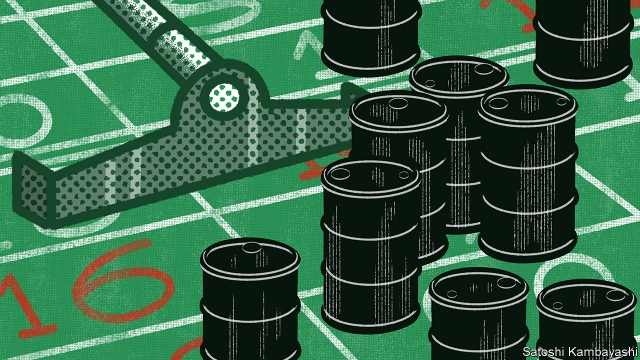
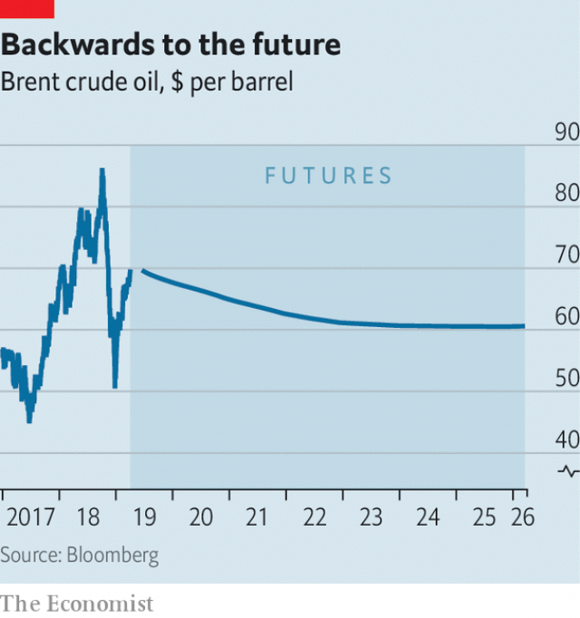

###### Buttonwood

# How betting on oil prices greases the industry’s wheels 

##### The message from futures markets is that high spot prices will not last 

 

> Apr 4th 2019 

OF ALL THE lines of all the characters in all the scenes in “Casablanca”, the ones that resonate most are spoken not by Humphrey Bogart, the leading man, but by Claude Rains, who plays Louis Renault, a cynical police captain. Needing a pretext to shut down Rick’s, the nightclub owned by Bogart’s character, he declares that he is “shocked, shocked to find that gambling is going on in here”. 

Renault’s line captures the fake distaste for gambling that lives on in polite circles. It finds expression even in impolite circles, such as finance. Take the market for oil futures. Only the gauche would describe it as anything other than a system for transferring risk. Oil producers sell futures to insure themselves against a price rout that would threaten solvency. Investors earn a risk premium by buying them. 

There is something to this characterisation. Producers are indeed short futures much of the time. But often, they are long. Perhaps the real reason for a thriving futures market is that people both inside and outside of the oil business enjoy a punt on the price of crude. If so, that is all to the good. The prices that wash out of these wagers are an invaluable guide to decision-making about production, storage and investment. 

The benefits hinge on the relationship between spot prices, futures prices and inventories. The spot price is what you pay if you need a barrel of oil immediately. The futures price is more like a wager on a sporting match. If the spot price of Brent crude in a year’s time proves to be higher than $67, the current 12-month futures price, the buyer wins the bet; if it is lower, the seller wins. If oil prices are hard to predict, futures prices should be lower than spot prices. This theory assumes there is excess demand to hedge against falling prices. Speculators are needed to take the other side of the bet. Low futures prices are the inducement they in turn require. 

In practice, periodic gluts and shortages mean that oil prices are prone to wild swings. The oil market switches between “backwardation” (where futures prices are below spot) and “contango” (where they are above it). The volatility of prices makes it difficult to detect a reward for speculation, or risk premium, in any single commodity market. But studies by Gary Gorton and Geert Rouwenhorst of Yale University find that a buyer of a varied basket of commodity futures would earn a hefty risk premium. 

What links the spot and futures prices is the level of stocks held by the oil industry. Storage is costly, but so is running out of supply. As a rule, the lower stocks are, the higher the premium speculators should demand. Just as ample stocks tend to dampen price volatility, skimpy stocks tend to amplify it, making speculation riskier. Backwardation gives speculators a compensating reward. 

What is today’s oil market telling us? OPEC agreed in December to cut production. Demand is picking up. The spot price has risen from $53 to $70 a barrel since the start of the year. The market may well tighten further in the short term. Saudi Arabia, OPEC’s largest producer, is pumping less than its quota; it seems keen on higher prices. Meanwhile foreign-policy hawks in America want to tighten the screws on Iran’s oil exports. Power cuts in oil-rich but inflation-ravaged Venezuela have further reduced its capacity to pump oil. 

 

Futures prices are below spot prices (see chart). This backwardated curve is a signal to run down stocks while prices are high. And inventories have indeed been falling, according to an analysis by Martijn Rats of Morgan Stanley, suggesting that the market is undersupplied. If stocks fall further, backwardation is likely to become more extreme. And the more futures prices fall relative to spot prices, the more tempting is the risk premium they offer to investors. 

The other message from the oil curve is that high spot prices will not last. In this regard, OPEC faces a dilemma. Higher prices solve short-term problems: Saudi Arabia needs an oil price of around $80 to balance its budget, for instance. But they are a spur to non-OPEC sources of oil and to non-oil sources of energy. The long-run result is an oversupplied market and lower oil prices. 

“Casablanca” is full of such dilemmas. Rick is forced to choose between love and honour, and judges that dishonour would spoil love. For Renault, having Rick arrested for the murder of a German major would be a feather in his cap. Instead he plays the long game and orders his squad to “round up the usual suspects”. As time goes by, an alliance with Rick might prove more profitable. 

-- 

 单词注释:

1.buttonwood['bʌtnwʊd]: 美洲悬铃木 

2.grease[gri:s]:n. 脂肪, 兽脂, 油脂, 贿赂 vt. 涂脂于, 贿赂 

3.APR[]:[计] 替换通路再试器 

4.Casablanca[,kæsә'blæŋkә]:n. 卡萨布蓝卡 

5.resonate['rezәneit]:v. (使)共鸣, (使)共振 

6.humphrey['hʌmfri]:n. 汉弗莱（男子名） 

7.Bogart['bəuɡɑ:t]:n. 博加特（姓氏）；弓的力量（星座名的含义） 

8.claude[klɔ:d]:n. 克劳德（男子名） 

9.louis['lu(:)i, 'lu(:)is]:n. 路易斯（男子名） 

10.renault[rә'nәu]:n. 法国雷诺公司；雷诺（姓氏） 

11.cynical['sinikәl]:a. 愤世嫉俗的, 讽刺的, 冷嘲的 

12.pretext['pri:tekst]:n. 借口, 托词 v. 以...为借口 

13.nightclub['naitklʌb]:n. 夜总会 

14.gamble['gæmbl]:n. 赌博, 冒险 v. 赌博, 孤注一掷 

15.fake[feik]:n. 假货, 欺骗, 诡计 a. 假的 vt. 假造, 仿造 vi. 伪装 

16.distaste[.dis'teist]:n. 讨厌, 嫌恶 

17.impolite[.impә'lait]:a. 无礼的, 粗鲁的 

18.gauche[gәuʃ]:a. 缺乏社经验的, 笨拙的, 粗鲁的, 无礼的, 偏转的 

19.producer[prә'dju:sә]:n. 生产者, 制作者, 制作人 [化] 发生器; (炉煤气)发生炉; 制气炉; 生产者 

20.rout[raut]:n. 溃败, 大败, 乌合之众, 盛大晚会 vt. 使溃败, 使败逃, 打垮, 用鼻拱, 挖起, 搜, 唤起 vi. 用鼻拱地, 搜 

21.solvency['sɒlvәnsi]:n. 偿付能力, 溶解力 [法] 有清偿能力, 偿付能力, 支付能力 

22.investor[in'vestә]:n. 投资者 [经] 投资者 

23.premium['pri:miәm]:n. 额外补贴, 奖金, 奖赏, 保险费 [医] 保险费 

24.characterisation[,kærәktәrai'zeiʃən; -ri'z-]:n. <英>=characterization 

25.punt[pʌnt]:n. 方头平底船, 踢悬空球, 赌博者 v. 踢悬空球, 用篙撑船, 赌博 

26.wager['weidʒә]:n. 赌注, 赌博, 赌物 vt. 下赌注, 向...保证 vi. 打赌 

27.invaluable[in'væljuәbl]:a. 无价的, 价值无法衡量的 

28.hinge[hindʒ]:n. 铰链, 关键, 枢纽 vt. 装铰链 vi. 靠铰链移动, 依...而转移 

29.inventory['invәntәri]:n. 详细目录, 存货清单 vt. 列入详细目录, 清点存货 [计] 存货清单 

30.Brent[brent]:[经] 布兰特油田 

31.buyer['baiә]:n. 买主, 买方 [经] 买主, 买方, 买手 

32.speculator['spekjuleitә]:n. 投机者, 投机商人, 思索者 [经] 投机买卖者, 投机商 

33.inducement[in'dju:smәnt]:n. 诱因, 动机, 吸引力, 刺激物 [法] 诱惑, 引诱, 诱因 

34.periodic[.piәri'ɒdik]:a. 周期的, 定期的, 间歇(性)的, 循环的, 用完整句的, 高碘的 [医] 周期性的 

35.glut[glʌt]:n. 大量, 供过于求 vt. 使充满, 使吃饱, 过多供应 vi. 吃得过多, 狼吞虎咽 

36.prone[prәun]:a. 俯伏的, 面向下的, 有...倾向的 [医] 旋前的, 伏的, 俯的 

37.backwardation[.bækwә'deiʃәn]:n. 延期交割费 [经] (证券)交割延期费 

38.contango[kәn'tæŋgәu]:n. 交易延期, 期货溢价 [法] 交易延期费, 延期日息, 期货溢价 

39.volatility[.vɒlә'tiliti]:n. 挥发性, 挥发度, 轻快, 易变, 短暂 [计] 变更率 

40.speculation[.spekju'leiʃәn]:n. 沉思, 推测, 投机 [经] 投机交易, 买空卖空 

41.commodity[kә'mɒditi]:n. 农产品, 商品, 有用的物品 [经] 商品, 货物, 日用品 

42.gary['^eәri]:n. 盖理 

43.gorton['^ɔ:tn]:戈顿（姓氏） 

44.geert[]:[网络] 吉尔特；吉耶特；菲利普·吉尔特 

45.Yale[jeil]:n. 耶鲁 

46.hefty['hefti]:a. 重的, 肌肉发达的 

47.dampen['dæmpәn]:vt. 弄湿, 使沮丧 vi. 变湿, 丧气 

48.skimpy['skimpi]:a. 不足的, 吝啬的 

49.risky['riski]:a. 危险的 

50.backwardation[.bækwә'deiʃәn]:n. 延期交割费 [经] (证券)交割延期费 

51.tighten['taitn]:vt. 勒紧, 使变紧 vi. 变紧, 绷紧 

52.saudi['sajdi]:a. 沙乌地阿拉伯（人或语）的 

53.les[lei]:abbr. 发射脱离系统（Launch Escape System） 

54.quota['kwәutә]:n. 配额, 限额 [化] 定额 

55.Venezuela[,vene'zweilә]:n. 委内瑞拉 

56.martijn[]:[网络] 马泰恩；战时冬天；荷兰 

57.Morgan['mɒ:gәn]:n. 摩根马 

58.stanley['stænli]:n. 斯坦利（男子名） 

59.undersupplied[]:[网络] 供不应求 

60.Arabia[ә'reibiә]:n. 阿拉伯半岛 

61.oversupply[.әuvәsә'plai]:vt. 过度供给 n. 过多的供应品 

62.rick[rik]:n. 草堆 vt. 把...堆成垛 

63.squad[skwɒd]:n. 班, 小队, 小集团 vt. 编成班 

64.alliance[ә'laiәns]:n. 联盟, 联合 [法] 同盟, 联盟, 联姻 

