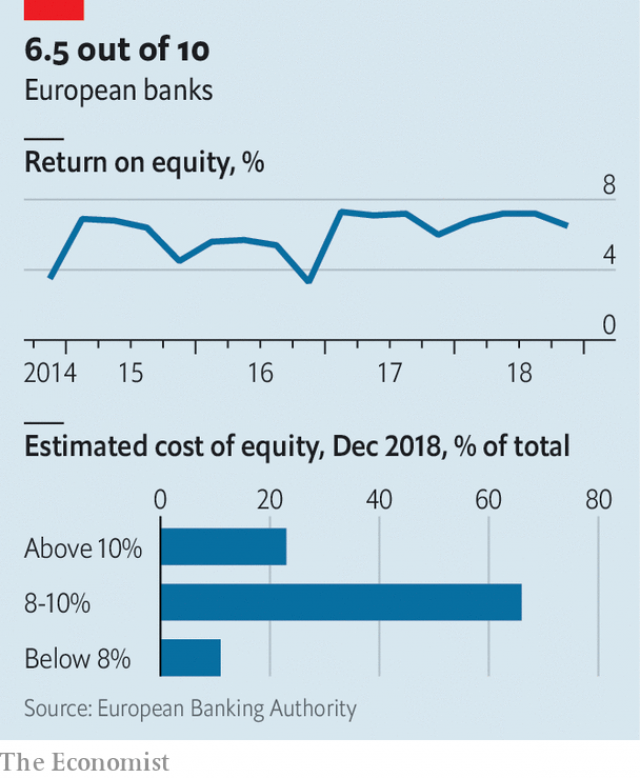

###### Europe’s banks are still in trouble

# How to fix Europe’s lenders 

##### Europe needs its banks to perform better 

 

> Apr 4th 2019 

IT’S NOT all bad. In 2008 Lloyds, a large British bank, took over HBOS, a rival that was being sucked beneath the rising waters of the global financial crisis. HBOS nearly dragged Lloyds under with it; £20.3bn (then about $30bn) of public money was needed to keep the combined group afloat. But these days Lloyds is doing all right. 

Under António Horta-Osório, its chief executive since 2011, Lloyds has ditched almost all its foreign operations, narrowed its product range and (like many other banks) poured money into digitisation. The state sold its last shares in 2017. Last year the bank’s return on tangible equity (ROTE), a measure of profitability, was a decent 11.7%. This year Mr Horta-Osório is aiming for 14-15%, Brexit notwithstanding. 

Some other European banks also have good stories to tell. The Netherlands’ ING is also a refurbished state-aid case. Its online German bank, ING-DiBa, claims to return over 20%. Spain’s Santander, the euro area’s biggest bank by market capitalisation, sailed through its homeland’s financial storm without a single loss-making quarter. On April 3rd it set out plans to lift its ROTE from 11.7% last year to 13-15% by cutting costs and exploiting digitisation. Nordic banks make bonny returns—although both Danske Bank and Swedbank, beset by money-laundering scandals, have sacked their chief executives recently. 

 

But the overall picture is glum. In a quarterly survey published on March 29th, the European Banking Authority (EBA), a supervisor, found that in the last three months of 2018 the weighted average return on equity (ROE) of 190 European Union banks was 6.5%. (ROE is a little lower than ROTE because goodwill and other intangible assets are deducted from the denominator of the latter.) Over the past four years the average ROE in the EBA’s report has fluctuated between 3.3% and 7.3% (see chart). 

That is not enough to keep shareholders happy. They want 10% or so. At a recent conference hosted by Morgan Stanley, 70% of attendees estimated European banks’ cost of equity (COE)—the minimum ROE shareholders consider acceptable—to be between 9% and 11%. Twice a year the EBA also asks banks to estimate their COEs. Last December two-thirds put their benchmarks at 8-10% and another one-sixth said 10-12%. Only 55% said that they were earning more than their COE. 

That 6.5% is also well below the returns enjoyed by investors on the other side of the Atlantic. Among America’s biggest banks, only Citigroup reported an ROE of below 10% last year, and, at 9.4%, not by much. US Bancorp, the seventh-biggest by assets, weighed in with 15.4%. The Europeans underperform on whatever measure you care to choose—for example, ROTE or return on assets (ROA), which strips out the effect of gearing (the share of assets funded by equity). Figures supplied by Stuart Graham of Autonomous Research indicate that the average ROA of nine big American banks was double that of 24 leading European lenders. 

All this is reflected in stockmarkets’ assessment of the relative worth of European banks. Markets value most big American banks at more than the net book value of their equity; but the shares of most leading European lenders trade below that mark. The price-to-book ratio of Deutsche Bank, Germany’s largest bank, which squeaked into profit in 2018 (with an ROE of 0.4%) after three years of losses, languishes at a feeble 25%. Deutsche is in merger talks with its neighbour, Commerzbank, which is rated little better, with a ratio of 31%. Unicredit, Italy’s biggest bank, is rumoured to be considering a bid for Commerzbank if the talks with Deutsche stall. 

Explanations for European banks’ poor performance start with the aftermath of the financial crisis of 2007-08. American banks were swiftly and forcibly recapitalised through the Troubled Asset Relief Programme, whether they needed it or not (“They got TARPed,” in the words of one European banker). Most European countries (though not Britain, the Netherlands and Switzerland) were slow to act. The euro area lacked a single supervisor and a common authority for resolving failed banks. Both were established several years later—and only after the euro area’s sovereign-debt crises had compounded the troubles of many lenders. 

Banks complain that policymakers have since made their lives hard. In the euro area net interest income, which makes up the bulk of banks’ revenues, has been ground down by slow growth and years of ultra-low, even negative, interest rates—banks must pay the European Central Bank (ECB) 0.4% a year to deposit money. In the past three years, reports the EBA, net interest margins have fallen from 1.57% to 1.47%. Mario Draghi, the president of the ECB, said on March 27th that “low bank profitability is not an inevitable consequence of negative rates”, although he admitted that the central bank would consider “mitigating the side-effects”. In March the ECB announced further operations to provide banks with cheap long-term finance. 

Bankers also complain about capital requirements. Not only have these been tightened since the financial crisis, but the new rules, known as Basel 3, were finalised only at the end of 2017. Banks are having to raise billions in debt that would be able to absorb losses, should some catastrophe wipe out their equity. Magdalena Stoklosa of Morgan Stanley says that resolution regulation is obliging banks to finance themselves by fairly expensive means when deposits cost them nothing and margins are wafer-thin. 

European banks also lack the scale of America’s biggest. Differences among national markets and the EU’s failure to complete its “banking union” thwart cross-border mergers that might create continent-spanning giants. Peer more closely at specific countries, and further burdens on profitability become visible. Banks in Cyprus, Greece, Italy and Portugal are still weighed down by bad loans, even if the load is getting lighter. Overcrowding is common; so is competition from publicly owned and co-operative banks, which have other goals besides profit. Germany is the harshest environment on both counts. Even combined, Deutsche and Commerzbank would struggle for elbow room. 

But struggling banks cannot simply blame history, officialdom and market structure for their troubles. They could do a lot more to help themselves. The EBA’s new survey finds, for instance, that at almost three-quarters of European banks, costs consume more than 60% of income. The average cost-income ratio, 64.6%, is higher than it was four years ago. 

Europe’s most successful banks show what can be done. A study by five ECB economists published last November—and commended to banks by Mr Draghi—found that euro-zone banks which have cut costs, spent heavily on information technology, are geographically diverse (like ING, Santander and BBVA, another Spanish bank) and rely less on interest income tend to be more profitable. Banks that carry lower credit risks (ie, that are safer) also do better. 

None of this will transform European banking into a magic money tree. Banking everywhere is less lucrative than it was before the crisis. Banks can take some comfort from evidence in the ECB economists’ study and the EBA’s survey that COEs are coming down, largely as a by-product of persistently low official rates. But bank bosses would be foolish to rely on that—or to suppose that they are not ultimately responsible for their own fates. 

-- 

 单词注释:

1.lender['lendә]:n. 出借人, 贷方 [经] 出借者, 贷方, 贷款人 

2.APR[]:[计] 替换通路再试器 

3.lloyd[lɔid]:n. 劳埃德（男子名） 

4.HBOS[]:abbr. 哈利法克斯苏格兰银行（Halifax Bank of Scotland） 

5.afloat[ә'flәut]:a. 飘浮着的, 在海上的, 浸满水的, 在进行中的 adv. 飘浮着, 在海上, 浸满水, 在进行中 

6.digitisation[]:[计] 数字化 

7.tangible['tændʒәbl]:n. 可触知的东西, 有形资产 a. 可触摸的, 有实体的, 非相像的, 有形的, 明确的 

8.equity['ekwiti]:n. 公平, 公正 [经] 权益, 产权 

9.rote[rәut]:n. 机械性的背诵, 死记硬背 

10.profitability[.prɒfitә'biliti]:n. 收益性, 利益率 [经] 可获利润率 

11.Brexit[]:[网络] 英国退出欧盟 

12.notwithstanding[.nɒtwiθ'stændiŋ]:adv. 虽然, 尽管 prep. 尽管 conj. 虽然 

13.ing[]:abbr. 惯性导航与制导（Inertial Navigation and Guidance）；强中子发生器（Intense Neutron Generator） 

14.refurbish[.ri:'fә:biʃ]:vt. 再磨光, 刷新 

15.online[]:[计] 联机 

16.Santander[,sæntən'dεə]:n. 桑坦德（西班牙北部港市, 桑坦德省的省会） 

17.euro['juәrәu]:n. 欧元（欧盟的统一货币单位） 

18.capitalisation[,kæpitәlai'zeiʃən;-li'z-]:n. <主英>=capitalization 

19.Nordic['nɒ:dik]:n. 北欧人, 日耳曼民族, 北欧两项滑雪 a. 北欧人的, 日耳曼民族的, 北欧两项滑雪的 

20.bonny['bɒni]:a. 漂亮的 

21.danske[]:[网络] 银行丹斯克；丹麦丹克斯银行；丹麦文 

22.beset[bi'set]:vt. 围绕, 使苦恼, 镶嵌 

23.glum[glʌm]:a. 愁闷的, 阴沉的 

24.eba[]:abbr. 初级工商管理（Elementary Business Arrangement）；紧急制动辅助系统（emergency brake assist system） 

25.supervisor[.sju:pә'vaizә]:n. 管理者, 监督者, 指导者, 视导员 [计] 管理程序 

26.roe[rәu]:n. 狍, 鱼子, 鱼卵 [医] 鱼卵, 牝鹿 

27.goodwill[^jd'wil]:n. 友好, 好意, 善意, 亲善, (企业享有的)信誉, 声誉 [经] (企业的)商誉, 信誉 

28.intangible[in'tændʒәbl]:a. 难以明了的, 无形的 [经] 无形的 

29.asset['æset]:n. 资产, 有益的东西 

30.deduct[di'dʌkt]:vt. 扣除, 减去 [经] 扣除, 减去, 折扣 

31.denominator[di'nɒmineitә]:n. 分母, 命名者 [经] 分母, 共同特性, 标准 

32.fluctuate['flʌktʃueit]:vi. 变动, 起伏, 动摇 vt. 使波动, 使动摇 

33.shareholder['ʃєә.hәuldә]:n. 股东 [法] 股东, 股票持有人 

34.Morgan['mɒ:gәn]:n. 摩根马 

35.stanley['stænli]:n. 斯坦利（男子名） 

36.attendee[æten'di:]:[计] 出席人, 参加者, 被照顾者, 被服务者 

37.coe[]:abbr. 卓越中心（Center of Excellence）；报名确认（Confirmation of enrollment）；计算机优化均衡（Computer Optimized Equalization）；公共操作环境（Common Operating Environment） 

38.benchmark[]:[计] 基准程序; 基准 

39.coe[]:abbr. 卓越中心（Center of Excellence）；报名确认（Confirmation of enrollment）；计算机优化均衡（Computer Optimized Equalization）；公共操作环境（Common Operating Environment） 

40.investor[in'vestә]:n. 投资者 [经] 投资者 

41.citigroup[]:n. 花旗集团1998年4月6日; 花旗公司与旅行者集团宣布合并; 合并组成的新公司称为“花旗集团”; 其商标为旅行者集团的红雨伞和花旗银行的兰色字标。 

42.bancorp[]:[网络] 合众银行；美国银行公司；美国银行集团 

43.underperform[,ʌndәpә'fɔ:m]:vi.表现不佳,工作不如预期(或同行) vt.(股票等)运作差于(一般市场价格) 

44.roa[]:abbr. received on account 计算标准; Reserve Officer Association <美国>预备役军官协会; return on assets 资产返还; right occiput anterior 前面的右枕骨 

45.stuart[stjuәt]:n. 英国斯图亚特王室；斯图尔特（男子名, 等于Stewart） 

46.graham['ɡreiәm]:a. 全麦的；粗面粉的；全麦粉制成的 

47.deutsche[]:n. 德意志联邦共和国马克 

48.squeak[skwi:k]:n. 吱吱声, 侥幸 vi. 吱吱叫, 告密, 侥幸成功 vt. 以短促尖声发出 

49.languish['læŋgwiʃ]:vi. 憔悴, 凋萎, 苦思 

50.merger['mә:dʒә]:n. 合并, 归并 [经] 购并 

51.commerzbank[]: 德国商业银行公司总部所在地：德国主要业务：银行 

52.UniCredit[]:[网络] 意大利联合信贷银行；意大利裕信银行 

53.stall[stɒ:l]:n. 厩, 停车处, 牧师职位, 货摊, 托辞, 拖延 vt. 关入厩, 停顿, 推托, 支吾, 使陷于泥中 vi. 被关在厩内, 陷于泥中, 停止, 支吾 

54.aftermath['ɑ:ftәmæθ]:n. 结果, 后果 [法] 后果, 结果 

55.swiftly['swiftli]:adv. 很快地, 即刻 

56.forcibly['fɒ:sәbli]:adv. 强制地, 用力地 

57.recapitalised[]:[网络] 资本重组 

58.asset['æset]:n. 资产, 有益的东西 

59.tarped[tɑːp]:n. [美国口语]tarpaulin的缩略形式 

60.banker['bæŋkә]:n. 银行家, 庄家 [经] 银行业者, 银行家 

61.Netherlands['neðәlәndz]:n. 荷兰 

62.policymaker['pɔlisi.meikә]:n. 政策制定者；决策人 

63.ECB[]:[计] 事件控制块 

64.mario['mæriәj, 'mɑ:-]:n. 马里奥（男子名） 

65.Draghi[]:[网络] 行长德拉吉；总裁德拉吉；欧洲央行德拉吉 

66.mitigate['mitigeit]:vt. 温和, 缓和, 减轻 [医] 缓和, 减轻 

67.tighten['taitn]:vt. 勒紧, 使变紧 vi. 变紧, 绷紧 

68.Basel['bɒzәl]:n. 巴塞尔(瑞士城市) 

69.finalise[]:vt. 把(计划)最后定下来, 定稿 [经] 使...结束 

70.Magdalena[,mæɡdə'leinə; -'li:-]:n. 马格达莱纳（哥伦比亚省份）；马格达莱纳河 

71.stoklosa[]:斯托克洛萨 

72.thwart[θwɒ:t]:a. 横放的 vt. 反对, 阻挠, 横过 prep. 横过 adv. 横过 

73.peer[piә]:n. 同等的人, 匹敌, 贵族 vi. 凝视, 窥视, 费力地看, 隐现 vt. 与...同等, 封为贵族 

74.Cyprus['saiprәs]:n. 塞浦路斯 [经] 赛浦路斯 

75.Portugal['pɒ:tʃugl]:n. 葡萄牙 

76.overcrowd[.әuvә'kraud]:vt. 容纳过多的人, 使过度拥挤 

77.cannot['kænɒt]:aux. 无法, 不能 

78.officialdom[ә'fiʃәldәm]:n. 官场, 官僚圈子, 公务员, 官僚主义 [法] 官场, 公务员界, 官吏 

79.economist[i:'kɒnәmist]:n. 经济学者, 经济家 [经] 经济学家 

80.commend[kә'mend]:vt. 嘉奖, 委托给, 推荐 

81.geographically[]:[计] 自通地 

82.bbva[]:[网络] 西班牙对外银行(Banco Bilbao Vizcaya Argentaria)；毕尔巴鄂比斯开银行；西班牙毕尔巴鄂比斯开银行 

83.les[lei]:abbr. 发射脱离系统（Launch Escape System） 

84.lucrative['lu:krәtiv]:a. 有利益的, 获利的, 合算的 

85.persistently[pə'sɪstəntlɪ]:adv. 坚持地; 固执地; 一个劲儿 

