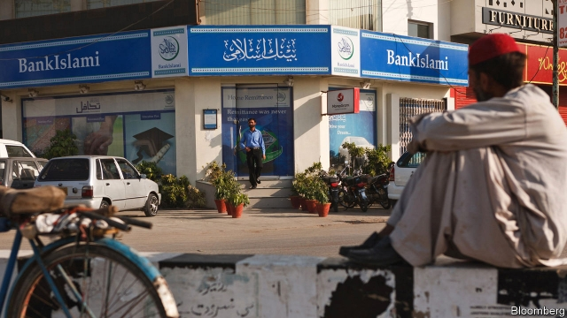

###### After the coup

# Islami Bank Bangladesh has declined since a boardroom coup in 2017 

##### It is now more similar to the country’s other crony-ridden banks 

 

> Apr 4th 2019 

“IT’S LIKE the Midas effect in reverse,” says Badiul Majumdar of SHUJAN, an anti-corruption pressure group. “Everything the government touches turns not to gold, but rather from gold to dust.” He is talking about Islami Bank Bangladesh, which was rocked in 2017 when the government sent military-intelligence operatives to force out senior executives and board members, and replaced them with figures more to its liking. Fears that the boardroom coup would drag down a comparatively well-managed institution in a sector marred by political meddling and cronyism now appear to have been justified. 

Established in 1983 as Bangladesh’s first bank run on Islamic principles, Islami thrived by handling a large share of remittances from emigrant workers and by lending to the booming garment industry. Its troubles stem from its links with Jamaat-e-Islami, Bangladesh’s largest Islamist party, which allied with Pakistan during the war of succession of 1971. One of the first acts of the current prime minister, Sheikh Hasina Wajed, after taking office in 2009 was to set up a court to try war crimes. Leading figures from the Jamaat were sentenced to imprisonment or hanging. 

If anything, it is surprising it took Sheikh Hasina and her Awami League eight years to go after Islami—especially given allegations, including from America’s government, that it was linked to terrorist organisations. (The bank has denied the accusations and an official investigation launched in 2017 has yet to publish anything.) A second purge last year replaced more suspected Jamaat sympathisers with government allies. 

Bangladesh’s state-owned banks have always had government men on their boards and in management, who lend to their allies. “But now this is happening in private banks like Islami Bank, too,” says Fahmida Khatun, the director of the Centre for Policy Dialogue, a think-tank in Dhaka. According to a report by Bangladesh’s central bank, many of the loans Islami has granted have breached financial regulations. The report highlighted loans to six companies belonging to Nassa Group, a giant of the garment industry, which it says were granted without taking the required collateral and ignoring the fact that there were several Nassa subsidiaries that had defaulted in the past. 

Islami’s operating profits for 2018 were 27.7bn taka ($330m), a 14.5% increase from 2017. But net profits, with provisions against bad loans and corporate taxes deducted, are expected to be much lower. Its market capitalisation has dropped to 42bn taka, down from 59bn taka at the end of 2017. Until recently Bangladesh’s most valuable bank, it is now worth just half as much as BRAC Bank, its main rival. 

At the end of last year non-performing loans (NPLs) came to 33.2bn taka. That is just 4.3% of all loans—better than the 11.5% average share across the industry. But this figure is distorted by far higher figures for state banks. Moreover, says Michael Puli, an analyst covering Bangladesh at Standard & Poor’s, a rating agency, not only is Islami’s NPL ratio rising, but many of its stressed loans have been restructured or refinanced and thus no longer count as non-performing. It restructured 48bn taka of loans in 2018, more than any other Bangladeshi bank. Taken together, non-performing, restructured and refinanced loans came to 7.6% of the institution’s loan book at the end of 2017. The share will be higher in 2018, Mr Puli predicts. 

People with political connections not only find it too easy to get loans from banks the government controls, including Islami Bank, says Biru Paksha Paul, a former chief economist at the central bank, but face little penalty for defaulting. “Wilful defaulters” have strained Bangladesh’s banks in the past three years, even as the economy has seen speedy growth. If the banking sector continues to deteriorate, will it be able to keep supporting growth? Responds Ms Khatun, “I doubt it.” 

-- 

 单词注释:

1.coup['ku:]:n. 砰然的一击, 妙计, 出乎意料的行动, 政变 [医] 发作, 中, 击 

2.islami[]:n. (Islami)人名；(阿拉伯)伊斯拉米 

3.Bangladesh[,bɑ:ŋ^lә'deʃ]:n. 孟加拉国 [经] 孟加拉共和国 

4.boardroom['bɒ:drum]:n. 会议室, 证券交换场所 

5.APR[]:[计] 替换通路再试器 

6.mida[]:abbr. methyliminodiacetic acid 甲基亚氨基二乙酸 

7.majumdar[]:[网络] 马宗达；马将达 

8.operative['ɒpәrәtiv]:a. 动作的, 运转的, 有效的, 关键的, 手术的 n. 技工, 侦探 

9.sector['sektә]:n. 扇形, 部门, 部分, 函数尺, 象限仪, 段, 区段 vt. 把...分成扇形 [计] 扇面; 扇区; 段; 区段 

10.mar[mɑ:]:vt. 损毁, 损伤, 糟蹋 n. 三月 

11.meddle['medl]:vi. 干涉, 干预, 擅自摸弄 [法] 干预, 插手, 弄乱 

12.cronyism['krәjniizəm]:n. 任人唯亲 

13.Islamic[iz'læmik]:a. 伊斯兰教的, 穆斯林的 

14.remittance[ri'mitns]:n. 汇款 [经] 汇款, 寄款, 支付(金额) 

15.emigrant['emigrәnt]:n. 移民, 侨民 a. 移民的, 移居的 

16.Islamist[iz'lɑ:mist]:n. 伊斯兰教主义者；回教教徒 

17.ally['ælai. ә'lai]:n. 同盟者, 同盟国, 助手 vt. 使联盟, 使联合, 使有关系 vi. 结盟 

18.Pakistan[.pɑ:ki'stɑ:n]:n. 巴基斯坦 

19.sheikh[ʃeik, ʃi:k]:n. 酋长, 王子, 村长, 族长, 教长, 导师, 有威信的丈夫 

20.hasina[]:[网络] 哈西娜；哈西纳；哈希娜 

21.jamaat[]:[网络] 者麻提 

22.imprisonment[im'priznmәnt]:n. 监禁, 下狱, 坐牢 [法] 监禁, 徒刑, 拘禁 

23.allegation[.æli'geiʃәn]:n. 断言, 主张, 申辩 [法] 声明, 事实陈述, 断言 

24.terrorist['terәrist]:n. 恐怖分子 [法] 恐怖份子, 恐怖主义 

25.organisation[,ɔ: ^әnaizeiʃən; - ni'z-]:n. 组织, 团体, 体制, 编制 

26.accusation[ækju:'zeiʃәn]:n. 控告, 指控, 指责 [法] 控告, 起诉, 告发 

27.purge[pә:dʒ]:n. 净化, 清除, 泻药 v. (使)净化, 清除, (使)通便 [计] 服务器文件删除实用程序 

28.sympathiser['sɪmpəθaɪzə]:n. 同情者; 同意者; 支持者 

29.alway['ɔ:lwei]:adv. 永远；总是（等于always） 

30.khatun[]:[网络] 可敦；卡腾 

31.DHAKA['dækә]:达卡[孟加拉国首都] 

32.breach[bri:tʃ]:n. 裂口, 违背, 破坏, 违反, 突破, 破裂 vt. 攻破, 突破 vi. 跳出水面 

33.nassa[]:abbr. National Aerospace Services Association 全国通信讨论会 

34.collateral[kә'lætәrәl]:a. 并行的, 附随的, 旁系的 n. 旁系亲属, 担保品 

35.subsidiary[sәb'sidiәri]:n. 子公司, 附件, 辅助者 a. 辅助的, 次要的, 津贴的 

36.default[di'fɒ:lt]:n. 违约, 不履行责任, 缺席, 默认值 v. 疏怠职责, 缺席, 拖欠, 默认 [计] 默认; 默认值; 缺省值 

37.taka['tɑ:kә. -kɑ:]:n. 孟加拉国货币单位；一种土耳其小船 

38.corporate['kɒ:pәrit]:a. 社团的, 合伙的, 公司的 [经] 团体的, 法人的, 社团的 

39.deduct[di'dʌkt]:vt. 扣除, 减去 [经] 扣除, 减去, 折扣 

40.capitalisation[,kæpitәlai'zeiʃən;-li'z-]:n. <主英>=capitalization 

41.BRAC[]:abbr. 孟加拉乡村进步委员会（Bangladesh Rural Advancement Committee）；基地关闭与重组委员会（Base Realignment and Closure） 

42.NPLs[]:abbr. 不良贷款（Non-performing Loans） 

43.distort[dis'tɒ:t]:vt. 扭曲, 歪曲 [法] 歪区, 曲解, 纂改 

44.michael['maikl]:n. 迈克尔（男子名） 

45.puli['pu:li]:n. 匈牙利长毛牧羊狗 

46.analyst['ænәlist]:n. 分析者, 精神分析学家 [化] 分析员; 化验员 

47.npl[]:abbr. nipple 乳头; noise pollution level 噪声污染级; new production line 新生产线; no personal liability 无个人责任 

48.restructure[ri:'strʌktʃә]:vt. 更改结构, 重建, 调整 

49.refinance[.ri:fai'næns]:vt. 再为...筹钱, 再供...资金 

50.Bangladeshi[-ʃi]:n. 孟加拉国人 a. 孟加拉国(人)的 

51.paksha[]:[网络] 半个阴历月；白沙 

52.paul[pɔ:l]:n. 保罗（男子名） 

53.economist[i:'kɒnәmist]:n. 经济学者, 经济家 [经] 经济学家 

54.penalty['penәlti]:n. 处罚, 刑罚, 罚款, 罚球, 报应, 不利结果, 妨碍 [经] 罚金(款), 违约金 

55.wilful['wilful]:a. 任性的, 固执的, 故意的, 存心的 [法] 有意的, 故意的, 任性的 

56.defaulter[di'fɒ:ltә]:n. 不履行义务者, 缺席者, 违反军规者 [法] 不出庭者, 违约者, 亏空公款者 

57.speedy['spi:di]:a. 快的, 迅速的 [经] 快的, 迅速的 

58.deteriorate[di'tiәriәreit]:v. (使)恶化 

