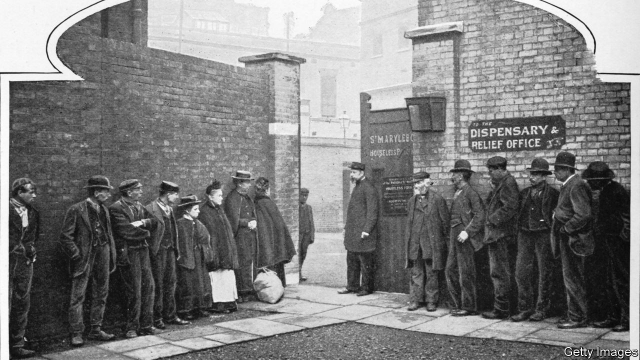

###### Not keeping up with the Joneses

# Rising inequality could explain tepid support for redistribution 

##### The lessons of a new paper about welfare in Victorian England 

 

> Apr 4th 2019 

THE PUBLICATION six years ago of Thomas Piketty’s “Capital in the Twenty-First Century”—an 800-page tome that has since sold over 2.5m copies—helped reveal the huge increase in inequality in the West since the 1970s. So why has support for welfare spending to counteract it remained so stable over that period? In theory, support for redistribution should increase with the gap between rich and poor, as the envy of the have-nots is stoked. But polls in America and Britain suggest virtually no growth in support for redistribution since 1980. 

A new paper* due to be presented on April 7th at the Economic History Society’s annual conference suggests an interesting answer. Rather than the gap between rich and poor being the main influence on attitudes to welfare, the degree of inequality within the upper classes might matter more. 

Jonathan Chapman of NYU Abu Dhabi looks at the relationship between inequality and how the poor law, a locally administered welfare system, operated in Victorian England. He compared the generosity and harshness of the conditions of poor-law relief in different areas with the gap between rich and poor, as measured by income from wages, and inequality within the rich, as measured by families’ number of live-in servants. He found that areas of high wage inequality had less harsh rules for claiming poor relief—as conventional theory would suggest. More surprisingly, however, he also found that areas with a larger gap between the wealthiest and the simply well-off were much less generous and had much harsher rules for welfare handouts than those where the elites were more uniform. 

There is some evidence a similar relationship could exist today. In Britain, for instance, many upper-middle-class people hate inheritance tax (which can finance welfare), as they believe that whereas they must pay it, the ultra-wealthy use clever accountants to avoid their fair share. Mr Piketty, Emmanuel Saez and Gabriel Zucman found that between 1980 and 2014 the bottom 50% of post-tax incomes in America increased by just 21%, compared with 113% for the top 10%**. But the top 1% rose even more—by 194%—while the top 0.001% rose by 617%. Even the merely well-off face rising inequality, but it doesn’t make them more generous. 

*J. Chapman, “Inequality and poor law policy in late-Victorian England”.**T. Piketty, E. Saez and G. Zucman, “Distributional national accounts: methods and estimates for the United States” NBER Working Paper No. 22945 (December 2016).  

-- 

 单词注释:

1.inequality[.ini'kwɒliti]:n. 不平等, 不同, 不平坦, 不平均 n. 不平等, 不等式 [计] 不等式 

2.tepid['tepid]:a. 微温的, 温热的, 不太热烈的 [医] 微温的 

3.redistribution['ri:distri'bju:ʃәn]:n. 重新分配, 再分发 [计] 重新分配 

4.Victorian[vik'tɔ:riәn]:a. 英国维多利亚女王时代的, 笃信宗教的, 讲究体面的 n. 维多利亚女王时代的英国人 

5.APR[]:[计] 替换通路再试器 

6.thoma[]:n. (Thoma)人名；(阿尔巴、阿拉伯)索玛；(英、德、罗、匈、捷、塞、瑞典)托马 

7.tome[tәum]:n. 册, 卷, 大本书 

8.counteract[.kauntә'rækt]:vt. 抵消, 阻碍, 中和 [法] 抵抗, 阻碍, 抵销 

9.stoke[stәuk]:v. 司炉, (使)大吃 

10.jonathan['dʒɔnәθәn]:n. 乔纳森（男子名） 

11.chapman['tʃæpmәn]:n. 流动商贩, 小贩, 叫卖小贩 

12.nyu[]:abbr. 纽约大学（New York University） 

13.abu[]:abbr. 亚洲广播联盟（Asian Broadcast Union） 

14.locally['lәukәli]:adv. 地方性地, 局部性地, 在当地 

15.administer[әd'ministә]:vt. 管理, 料理, 执行 vi. 执行遗产管理人的职责, 给予帮助 

16.generosity[.dʒenә'rɒsiti]:n. 慷慨, 宽大 

17.harshness['hɑ:ʃnis]:n. 粗糙事物, 刺耳, 严肃 

18.les[lei]:abbr. 发射脱离系统（Launch Escape System） 

19.handout['hændaut]:n. 施舍物, 救济品, 分发的印刷品资料, 广告物品 

20.elite[ei'li:t]:n. 精华, 精锐, 中坚分子 

21.inheritance[in'heritәns]:n. 遗传, 遗产 [医] 遗传 

22.Piketty[]:皮凯蒂 

23.emmanuel[i'mænjuәl]:n. 以马内利（耶稣基督的别称）；伊曼纽尔（男子名, 等于Immanuel） 

24.saez[]:[网络] 赛斯 

25.Gabriel['geibriәl]:n. 加百利(<<经经>>中七大天使之一) 

26.inequality[.ini'kwɒliti]:n. 不平等, 不同, 不平坦, 不平均 n. 不平等, 不等式 [计] 不等式 

27.E[i:]:[计] 元件, 部件, 元素, 误差, 执行, 表达式, 指数 

28.G[dʒi:]:[计] 千兆, 吉, 图形, 网格, 接地 [化] 鸟苷 

29.distributional[]:[计] 分布的 

30.nber[]:abbr. National Bureau of Economic Research 全国经济研究局; National Bureau of Engineering Registration 全国工程注册局 

