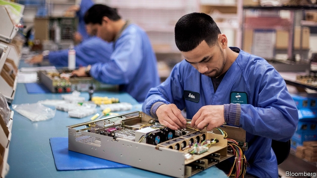
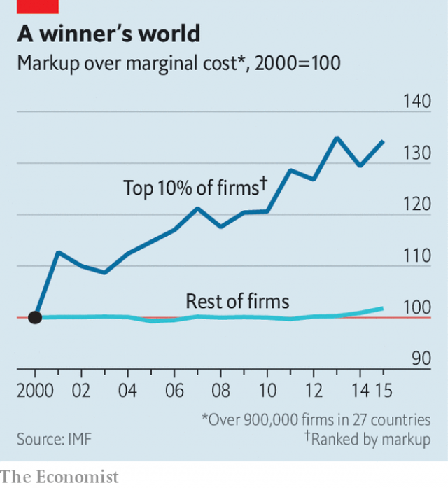

###### An economic theory of everything

# The IMF adds to a chorus of concern about competition 

##### A new study adds to worries about market power 

 

> Apr 4th 2019 

PHYSICISTS’ QUEST for a “theory of everything” is well-known. The equivalent in economics is the hunt for common causes for the rich-world macroeconomic trends of the past decade or so: a shrinking share of the economic pie for workers, disappointing investment and lacklustre productivity growth. These must be reconciled with low interest rates, pockets of technological advance and juicy returns for investors willing to take risks. 

The leading economic theory of everything is that competition has weakened as markets have become more concentrated. Unlike firms in competitive markets, monopolies limit production in order to keep prices and profits high. They can therefore be expected to restrain their investment, too. They might still be innovative—with monopoly profits up for grabs, why not be?—but market power usually makes economies less productive overall. And monopolies have many opportunities to take bites out of labour’s share of the pie. Their high profits typically flow to investors, not workers. Their high prices eat into the purchasing power of wages. Their bargaining clout may even allow them to suppress pay directly. 

On April 3rd the IMF provided the latest evidence for parts of this theory. In a new study the fund’s economists examined the markups over marginal cost—one proxy for market power—charged by over 900,000 firms in 27 countries. They found that markups rose by 8% on average between 2000 and 2015. In findings consistent with earlier analyses by The Economist, the fund concluded that market power has risen notably in America and by a smaller amount in Europe, and largely affected industries other than manufacturing (kept fiercely competitive by trade). 

Case closed? Not so fast. Those who doubt that competition has weakened attribute such findings to the rise of “superstar” firms. They argue that economic activity is becoming concentrated in the best firms because of technology, network effects and globalisation. This “winner-takes-most” pattern could explain rising average markups, if pricey but brilliant products are capturing more market share, or if superstar firms are unusually reliant on spending on intangible assets that is not included as a cost in gross margins. Given the growing importance of intellectual property and brand value to obvious superstars such as Apple and Google, this objection is worth taking seriously. 

 

The IMF study confirms that in most places a small share of firms are responsible for rising markups, which have soared among the best and are flat among the rest (see chart). The 10% of firms with the highest markups are 50% more profitable than their peers, more than 30% more productive and rely more on intangibles. The fund did not find that rising markups slowed innovation, at least using the (admittedly dubious) proxy of patent registrations. 

Yet market power that grows organically is still market power. The fund found evidence of some of the pernicious consequences of less competition. Higher markups are associated with less investment in physical capital—enough to have lopped a percentage point off GDP in the average advanced economy, it estimates. Top firms with higher markups pay a smaller share of the economic value they create to workers. And the fund warns that market power could yet put a brake on innovation, should incumbent firms get too cosy. 

That might happen if regulators are slow to respond to structural shifts in the economy, or too lax in policing mergers that allow incumbents to pick off potential competitors. The fund found that mergers and acquisitions were, on average, followed by significantly higher markups by the firms involved. Economists are sometimes accused of having “physics envy”—that is, of coveting the precision of the hard sciences. But if economics has a law worthy of the name, it is that firms prefer to merge than to compete. 

-- 

 单词注释:

1.IMF[]:国际货币基金组织 [经] 国际货币基金 

2.APR[]:[计] 替换通路再试器 

3.macroeconomic[-mik]:n. 整体经济 

4.lacklustre['læklʌstә]:a. 无光泽的, 无生气的 n. 无光泽, 无生气 

5.productivity[.prәudʌk'tiviti]:n. 生产力 [经] 生产率, 生产能力 

6.reconcile['rekәnsail]:vt. 使和解, 调停, 使和谐, 使一致, 使听从 [经] 对帐, 使一致 

7.technological[.teknә'lɒdʒikl]:a. 技术的 [经] 工艺的, 技术的 

8.investor[in'vestә]:n. 投资者 [经] 投资者 

9.monopoly[mә'nɒpәli]:n. 垄断, 专卖权, 独占事业 [经] 垄断, 专利品, 垄断(权)独占 

10.grab[græb]:n. 抓握, 掠夺, 强占, 东方沿岸帆船 vi. 抓取, 抢去 vt. 攫取, 捕获, 霸占 

11.les[lei]:abbr. 发射脱离系统（Launch Escape System） 

12.typically['tipikәli]:adv. 代表性地；作为特色地 

13.clout[klaut]:n. 敲击, 破布 vt. 打补钉 

14.suppress[sә'pres]:vt. 镇压, 使止住, 禁止, 抑制, 查禁 [法] 镇压, 平定, 禁止出版 

15.economist[i:'kɒnәmist]:n. 经济学者, 经济家 [经] 经济学家 

16.markup['mɑ:kʌp]:n. 涨价, 利润, 标高价 

17.marginal['mɑ:dʒinәl]:a. 边缘的, 最低限度的, 有旁注的 [医] 缘的 

18.proxy['prɒksi]:n. 代理, 代理人, 委托书 [经] 代理人, 代表权, 授权书 

19.economist[i:'kɒnәmist]:n. 经济学者, 经济家 [经] 经济学家 

20.notably['nәjtbәli]:adv. 显著地, 著名地, 尤其, 特别 

21.manufacturing[.mænju'fæktʃәriŋ]:n. 制造业 a. 制造业的 

22.fiercely['fiәsli]:adv. 猛烈地, 厉害地 

23.superstar['sju:pәstɑ:]:n. 超级明星 

24.globalisation[,gləubəlai'zeiʃən]:n. 全球化, =globalization 

25.pricey['praisi]:a. 昂贵的, 价格高的 

26.reliant[ri'laiәnt]:a. 依赖的, 信赖的 

27.intangible[in'tændʒәbl]:a. 难以明了的, 无形的 [经] 无形的 

28.asset['æset]:n. 资产, 有益的东西 

29.google[]:谷歌；搜索引擎技术；谷歌公司 

30.soar[sɒ:]:n. 高扬, 翱翔 vi. 往上飞舞, 高耸, 翱翔 

31.peer[piә]:n. 同等的人, 匹敌, 贵族 vi. 凝视, 窥视, 费力地看, 隐现 vt. 与...同等, 封为贵族 

32.innovation[.inәu'veiʃәn]:n. 改革, 创新 [法] 创新, 改革, 刷新 

33.admittedly[әd'mitidli]:adv. 公认地, 诚然 

34.dubious['dju:biәs]:a. 可疑的, 不确定的 

35.registration[.redʒi'streiʃәn]:n. 登记, 挂号, 注册 [计] 登记; 定位; 对齐; 记录 

36.organically[ɒ:'gænikli]:adv. 有机性地, 器官上地, 有组织地 

37.pernicious[pә'niʃәs]:a. 有害的, 致命的, 恶劣的, 险恶的 [医] 恶性的 

38.lop[lɒp]:vt. 剪, 砍伐, 斩 vi. 下垂, 闲荡 a. 垂下的 n. 砍伐, 剪下的树枝 

39.incumbent[in'kʌmbәnt]:a. 现任的, 依靠的, 负有义务的 n. 领圣俸者, 在职者 

40.regulator['regjuleitә]:n. 调整者, 校准者, 校准器, 调整器, 标准钟 [化] 调节剂; 调节器 

41.lax[læks]:a. 松的, 不严格的, 腹泻的, 松弛的 n. 腹泻, 松元音 

42.merger['mә:dʒә]:n. 合并, 归并 [经] 购并 

43.significantly[]:adv. 值得注目地；意味深长地 

44.physic['fizik]:n. 药品, 泻药, 医学 vt. 给...服药, 治愈, 使通便 

45.merge[mә:dʒ]:vt. 使合并, 使消失, 吞没 vi. 合并, 渐渐消失 [计] 合并 

