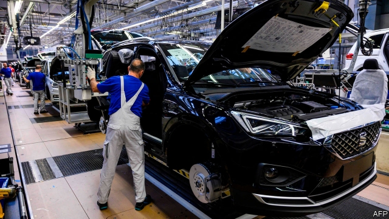
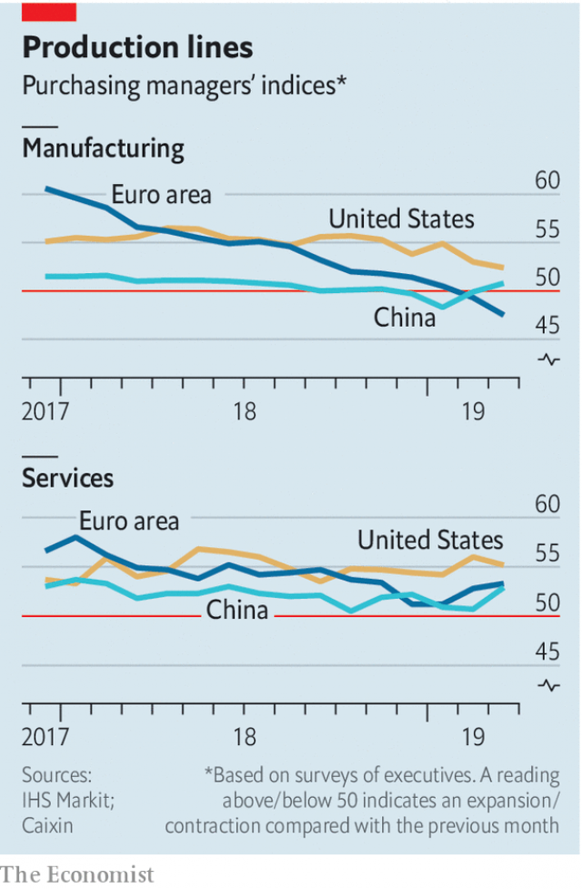

###### Manufacturing blame

# The gloom hanging over the world economy is confined to manufacturing 

##### Service industries have defied the sinking mood 

 

> Apr 4th 2019 

PESSIMISM ABOUT the world economy has grown throughout 2019. Disappointing data, tumbling bond yields, the trade war between China and America and political crisis in Britain have all played a part. The only bright spot has been mostly buoyant stockmarkets. On April 9th the IMF will probably report a downgrade to its forecast for global growth this year, which in January stood at 3.5%. But there has so far been only a deceleration, not a downturn, because economic weakness has been contained mostly to manufacturing, rather than afflicting the service sector (see chart). And a manufacturing rebound might soon lift the global mood. 

Manufacturing’s woes can be blamed primarily on falling global trade growth. That is down partly to the trade war, and partly to Chinese policymakers’ attempts to reduce leverage, which slowed domestic growth late last year, curtailing demand for imports. The pain has been felt most in Europe, which is more exposed than America to emerging markets. It has been particularly acute in Germany. On April 1st a survey of German manufacturers, a preview of which buffeted bond markets in March, turned out even worse than expected. Industrial production has slowed even more sharply in Germany than in Italy, which is in recession, note economists at Goldman Sachs, a bank. Yet Germany’s service sector appears to be growing strongly, as does that of the euro zone as a whole. 

 

Service industries are less volatile than manufacturing, make up a bigger slice of rich-world GDP and, by their nature, trade less. That they remain strong largely reflects relatively buoyant labour markets and consumers (German unemployment is only 3.1%). One exception has been Britain, where survey data released on April 1st and 3rd appear to show growth in manufacturing at its strongest in over a year and services shrinking. Both findings are Brexit-related. The British economy is suffering from falling confidence, while manufacturing appears so strong only because firms are stockpiling in case Britain soon crashes out of the EU without a deal. 

In the 2000s some economists speculated that the growing weight of services in output might help explain the “great moderation”—the fall in economic volatility after the mid-1980s. Although the global financial crisis sent volatility soaring, this summer America’s economic expansion, if it continues, will become the longest ever. It will have survived peaks and troughs in manufacturing that in another era might have been more visible in aggregate data. 

China has turned to stimulus lately; some economists expect its economy to rebound in the second half of this year. In March its manufacturers reported their strongest month since last summer. That, and some strong American data, buoyed markets this week. Even if this proves to be a false dawn, for China to cause a global economic downturn would require its slowdown to become infectious not just across borders, but across sectors too. 

-- 

 单词注释:

1.manufacturing[.mænju'fæktʃәriŋ]:n. 制造业 a. 制造业的 

2.gloom[glu:m]:n. 忧郁, 暗处, 幽暗 vi. 变忧沉, 变黑暗 vt. 使忧郁, 使黑暗 

3.manufacturing[.mænju'fæktʃәriŋ]:n. 制造业 a. 制造业的 

4.defy[di'fai]:vt. 藐视, 挑衅, 使落空 n. 挑战 

5.APR[]:[计] 替换通路再试器 

6.pessimism['pesimizm]:n. 悲观, 悲观情绪, 悲观主义 [医] 悲观主义 

7.datum['deitәm]:n. 论据, 材料, 资料, 已知数 [医] 材料, 资料, 论据 

8.buoyant['bɒiәnt]:a. 有浮力的, 心情愉快的 [经] 降而复升的, 保持高价的, 遂之而升的 

9.stockmarket[s'tɒkmɑ:kɪt]: 证券市场; 证券交易所; 证券行情 

10.IMF[]:国际货币基金组织 [经] 国际货币基金 

11.downgrade['dajn^reid]:vt. 降低, 贬低 n. 下坡 a. 下坡 adv. 下坡 

12.deceleration[.di:selә'reiʃәn]:n. 减速 [医] 减速[度] 

13.downturn['dauntә:n]:n. (尤指经济方面的)衰退, 下降趋势 [电] 低迷时期 

14.afflict[ә'flikt]:vt. 使苦恼, 折磨 

15.sector['sektә]:n. 扇形, 部门, 部分, 函数尺, 象限仪, 段, 区段 vt. 把...分成扇形 [计] 扇面; 扇区; 段; 区段 

16.rebound[ri'baund]:vi. 弹回, 返回, 产生事与愿违的结果 vt. 使弹回, 使返回 n. 反弹, 返回, 篮板球, 振作 rebind的过去式和过去分词 

17.woe[wәu]:n. 悲哀, 悲痛, 苦痛 

18.curtail[kә:'teil]:vt. 缩减, 剥夺, 简略 [法] 剥夺特权 

19.recession[ri'seʃәn]:n. 后退, 凹处, 衰退, 归还 [医] 退缩 

20.economist[i:'kɒnәmist]:n. 经济学者, 经济家 [经] 经济学家 

21.goldman[]:n. 高曼（姓氏） 

22.Sachs[zaks]:n. 萨克斯（汽车零配件生产厂商） 

23.euro['juәrәu]:n. 欧元（欧盟的统一货币单位） 

24.les[lei]:abbr. 发射脱离系统（Launch Escape System） 

25.volatile['vɒlәtail]:a. 挥发性的, 可变的, 不稳定的, 飞行的, 轻快的, 爆炸性的 n. 有翅动物, 挥发物 [计] 易失的 

26.stockpile['stɒkpail]:n. 储蓄, 积蓄, 库存 vt. 储蓄, 贮存 

27.EU[]:[化] 富集铀; 浓缩铀 [医] 铕(63号元素) 

28.speculate['spekjuleit]:vi. 深思, 推测, 投机 [经] 投机 

29.volatility[.vɒlә'tiliti]:n. 挥发性, 挥发度, 轻快, 易变, 短暂 [计] 变更率 

30.soar[sɒ:]:n. 高扬, 翱翔 vi. 往上飞舞, 高耸, 翱翔 

31.trough[trɒ:f]:n. 槽, 水槽, 饲料槽 [化] 料槽 

32.aggregate['ægrigәt]:n. 合计, 总计, 聚集体 a. 合计的, 聚集的 v. 聚集, 集合, 合计达 [计] 聚合体; 聚集 

33.stimulus['stimjulәs]:n. 刺激, 激励, 刺激品 [医] 刺激特, 刺激 

34.buoy[bɒi. 'bu:i]:n. 浮标, 航标, 救生圈 vt. 使浮起, 鼓励 

35.slowdown['slәudaun]:n. 降低速度, 减速 

36.infectious[in'fekʃәs]:a. 有传染性的, 易传染的 [医] 传染性的 

