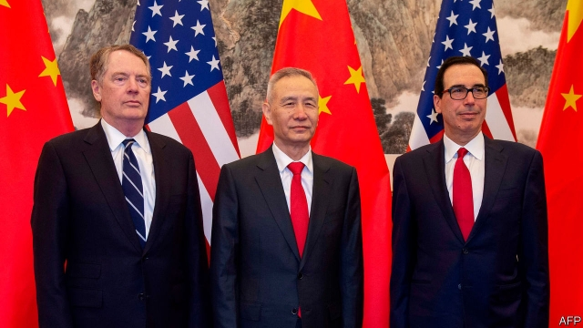
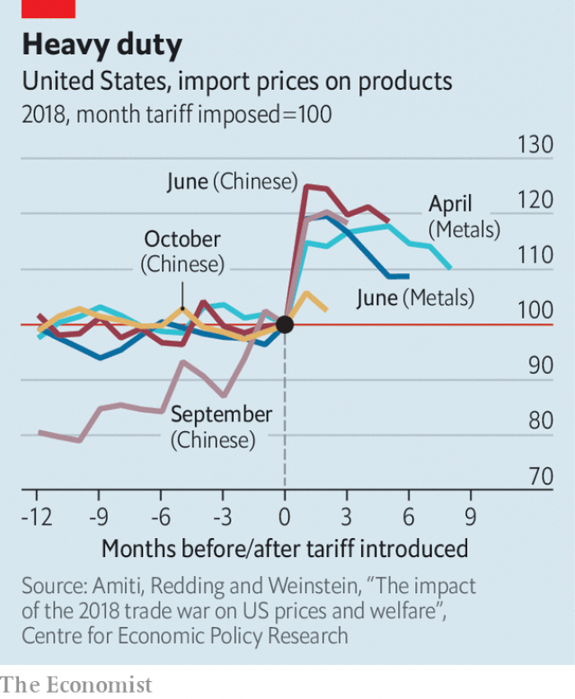

###### US-China trade

# Trade talks will probably end with tariffs still in place 

##### Americans will pay for them 

 

> Apr 4th 2019 

LESS THAN a week after the White House described trade talks in Beijing as “candid and constructive”, American and Chinese negotiators met again on April 3rd in Washington, DC. There is talk of a summit between the two countries’ presidents. But amid the upbeat noises are a few discordant notes. Without a deadline, the discussions could drag on, or even stall. Although the contours of a deal seem clear, the final items are always the trickiest. And even if a deal is struck, it may not be a good one. 

The two sides have already agreed on provisions relating to currency manipulation, and are hashing out how much more American goods the Chinese will commit to buying. Rules on technology transfer and American companies’ access to the Chinese market are still being discussed. Also on the table will be American demands that China relaxes its attitude to trade in data, which it sees as a threat to national security. 

Some in the Trump administration see the negotiations as an opportunity to demand reforms that would also benefit China, such as a more stringent intellectual-property regime or trimmed subsidies. The main objective of the Chinese delegation, led by Liu He, a vice-premier, is simpler: the lifting of the tariffs imposed since last July, which currently cover just over 44% of Chinese exports to America, or goods worth $250bn in 2017. 

According to Myron Brilliant of the US Chamber of Commerce, a lobby group, the talks starting on April 3rd focused on two of the thorniest topics. The first was which, if any, of the tariffs will be dropped upon reaching a deal. The Trump administration sees tariffs as leverage, useful to make sure that the Chinese stick to what is agreed. The second related to enforcement. The Americans want to be able to decide unilaterally if China has broken the terms of any deal and punish it with fresh tariffs, without risking retaliation. But that would be humiliating for the Chinese. 

The Americans argue that such tough enforcement mechanisms are needed, given China’s history of failing to keep its promises. They think that only by offering tariff reductions for good behaviour, and threatening new tariffs for backsliding, can they ensure that the Chinese keep their side of the bargain. But the Americans may have to give some ground, since the Chinese also have grounds for mistrust. One of the reasons Mexican and Canadians agreed to rewrite their trade deal with America last year was the prospect of tariffs on steel and aluminium thereby being lifted. Months later, those tariffs are still in place. 

 

Business lobbyists in Washington seem resigned to tariffs being phased out only gradually as agreed-upon milestones are passed. Recent evidence on the effects of the Trump administration’s tariffs imposed in 2018 suggests that Americans will pay the price. A study by Mary Amiti of the Federal Reserve Bank of New York, Stephen Redding of Princeton University and David Weinstein of Columbia University found that American importers were swallowing the cost of tariffs by paying higher prices (see chart), and that they were responding by importing a narrower range of products. Another study, by Pablo Fajgelbaum and Amit Khandelwal of the National Bureau of Economic Research, Pinelopi Goldberg of the World Bank and Patrick Kennedy of the University of California, Berkeley, found that although some American producers gained from weaker competition from imports, that was outweighed by losses to consumers and other producers, who had to pay more for inputs. 

It seems unlikely that the Trump administration will be swayed by this evidence of collateral damage. Indeed, it may see buyers’ struggles to adjust to tariffs as evidence that they were too dependent on Chinese exports in the first place. Although a deal may see an easing of the tariff regime, from the administration’s perspective it has been too successful to abandon altogether. Americans had better get used to higher prices. 

-- 

 单词注释:

1.tariff['tærif]:n. 关税, 关税表, 价格表, 收费表 vt. 课以关税 [计] 价目表 

2.APR[]:[计] 替换通路再试器 

3.les[lei]:abbr. 发射脱离系统（Launch Escape System） 

4.candid['kændid]:a. 坦白的, 率直的, 公正的 

5.constructive[kәn'strʌktiv]:a. 建设性的, 构造上的 [医] 构成的 

6.negotiator[ni'gәuʃieitә]:n. 磋商者, 交涉者, 议定者 [经] 谈判者, 交易者, 协商者 

7.Washington['wɒʃiŋtn]:n. 华盛顿 

8.DC[]:直流电 [计] 数据单元, 数据中心, 数据代码, 数据通信, 数据控制, 数字控制, 直流 

9.amid[ә'mid]:prep. 在其间, 在其中 [经] 在...中 

10.upbeat['ʌpbi:t]:n. 弱拍, 上升, 兴旺 a. 上升的, 乐观的 

11.discordant[dis'kɒ:dәnt]:a. 不调和的, 不和的 

12.stall[stɒ:l]:n. 厩, 停车处, 牧师职位, 货摊, 托辞, 拖延 vt. 关入厩, 停顿, 推托, 支吾, 使陷于泥中 vi. 被关在厩内, 陷于泥中, 停止, 支吾 

13.contour['kɒntuә]:n. 轮廓 vt. 画轮廓 a. 显示轮廓的 [计] 轮廓 

14.alway['ɔ:lwei]:adv. 永远；总是（等于always） 

15.tricky['triki]:a. 狡猾的, 机敏的 

16.manipulation[mә.nipju'leiʃәn]:n. 操作, 处理 [化] (用手)操作; 使用 

17.hash[hæʃ]:n. 剁碎的食物, 杂乱无章的的一大堆, 杂烩, 复述 vt. 切碎, 搞糟 

18.datum['deitәm]:n. 论据, 材料, 资料, 已知数 [医] 材料, 资料, 论据 

19.negotiation[ni.gәuʃi'eiʃәn]:n. 谈判, 磋商, 交涉 [经] 谈判, 协商 

20.stringent['strindʒәnt]:a. 迫切的, 严厉的, 银根紧的 [医] 约束的, 紧迫的 

21.regime[rei'ʒi:m]:n. 政权, 当权期间, 政体, 社会制度, 体制, 情态 [医] 制度, 生活制度 

22.currently['kʌrәntli]:adv. 现在, 当前, 一般, 普通 [计] 当前 

23.myron['maiәrәn]:[医] 树汁 

24.lobby['lɒbi]:n. 大厅, 休息室, 游说议员者 vi. 游说议员, 游说 vt. 游说 

25.thorny['θɒ:ni]:a. 多刺的, 令人苦恼的 

26.enforcement[in'fɒ:smәnt]:n. 执行, 强制 [法] 实施, 加强, 厉行 

27.unilaterally[]:[计] 单侧地 

28.retaliation[ri.tæli'eiʃәn]:n. 报复 [法] 报仇, 报复, 回敬 

29.humiliate[hju:'milieit]:vt. 使丢脸, 使蒙羞, 屈辱 

30.mechanism['mekәnizm]:n. 机械, 机构, 结构, 机理, 技巧 [化] 机理; 历程; 机构 

31.backslide[.bæk'slaid]:vi. 堕落, 退步 n. 堕落, 退步 

32.mistrust[.mis'trʌst]:n. 不信任, 疑惑 v. 不信任, 疑惑 

33.lobbyist['lɔbiist]:n. 说客 [法] 院外活动集团成员 

34.milestone['mailstәun]:n. 里程碑, 里程石, 里程标 

35.mary['meәri]:n. 玛丽（女子名） 

36.york[jɔ:k]:n. 约克郡；约克王朝 

37.stephen['sti:vn]:n. 斯蒂芬（男子名） 

38.Redding[]:n. 干熏鲱鱼 n. (Redding)人名；(英)雷丁 v. 整理；清理（redd的ing形式） 

39.Princeton['prinstәn]:n. 普林斯顿 

40.david['deivid]:n. 大卫；戴维（男子名） 

41.weinstein[]:温斯坦 

42.Columbia[kә'lʌmbiә]:n. 哥伦比亚 

43.importer[im'pɒ:tә]:n. 输入者, 进口商 [法] 进口商, 输入者 

44.Pablo['pæblәu]:n. 巴勃罗（西班牙籍体育明星）；帕布洛（英国水槽产品品牌）；帕布鲁（西班牙著名画家毕加索的姓） 

45.amit[]:n. 阿米特（男子名） 

46.Pinelopi[]:皮内洛皮 

47.goldberg['^әjldb\\:^]:n. [俚]犹太老板（尤指在黑人聚居区开店或雇用黑人的） 

48.patrick['pætrik]:n. 帕特里克（男子名） 

49.kennedy['kenidi]:n. 肯尼迪（姓氏, 美国第35任总统） 

50.California[.kæli'fɒ:njә]:n. 加利福尼亚 

51.berkeley['bɑ:kli, 'bә:kli]:n. 伯克利（姓氏）；贝克莱（爱尔兰主教及哲学家）；伯克利（美国港市） 

52.producer[prә'dju:sә]:n. 生产者, 制作者, 制作人 [化] 发生器; (炉煤气)发生炉; 制气炉; 生产者 

53.outweigh[.aut'wei]:vt. 比...重, 比...重要, 比...有价值 

54.collateral[kә'lætәrәl]:a. 并行的, 附随的, 旁系的 n. 旁系亲属, 担保品 

