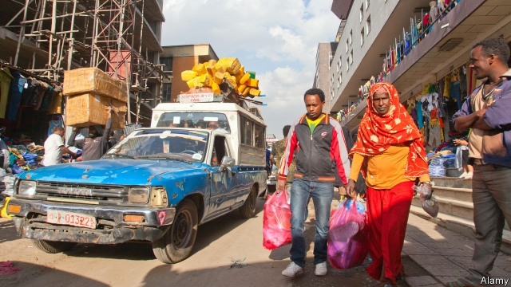

###### What goes round, comes round

# What self-help lending says about Ethiopian banking 

##### The popularity of ekub shows that formal financial institutions need to shape up 

 

> Apr 4th 2019 

IN 1980, IN his early 20s, Mengistu Maregne began selling soft drinks from a stall in Merkato, Ethiopia’s largest market. To finance the fledgling business he joined an ekub, a rotating savings-and-credit association (ROSCA) that pools contributions from members each week and disburses the pot to the winner of a lottery, with each member winning once over the scheme’s term. Being first to draw the lump sum of 4,000 birr ($140), he put the money away and joined another. Within a year he had bought a home; soon after he bought a shoe shop. “Ekub changed my life,” he says. 

Though ROSCAs are found across the developing world they are often assumed to serve the poor. But Ethiopia’s are used across the income scale. They encourage members to save, and enable some to raise business capital or buy pricey items such as cars. Some have hundreds of members, with officers who vet applicants and analyse risks. 

ROSCAs are entrenched in Ethiopian culture. But their ubiquity is also an indication of the shortcomings of Ethiopian finance. Though the formal banking sector has grown fivefold in just over a decade, it is still much smaller than in neighbouring countries. Bank assets per person are less than a third the level in Kenya. Ethiopian banks also underperform African peers in business lending. Just 12.9% of Ethiopian firms had access to a bank loan or formal credit in 2015. For the rest of the continent the share was 20%. Ethiopia lacks credit cards, a stockmarket and foreign banks. 

Ekubs help fill the gap. One recent study found them to be the most common source of external funding for manufacturing firms in Addis Ababa, Ethiopia’s capital. Another found that more than two-thirds of small and medium-sized enterprises used them between 2002 and 2010. “You cannot imagine the Ethiopian economy without ekubs,” says Gebreyesus Yimer of Mekelle University. 

Part of their secret lies in the trust between members, who tend to be from the same neighbourhood, workplace or ethnicity. Since many small businesses have patchy records and no credit rating, Ethiopian banks demand interest rates of up to 20% and physical collateral of up to three times the value of the loan. Most ekubs, by contrast, require only a character testimony. Even so, default is rare. “People tend to observe the rules of the ekub more than the bank,” says Yohannes Ayalew, a former vice-governor of Ethiopia’s central bank. 

As ekubs have grown they have moved away from their origin as self-help groups. An ekub chief may draw a salary and manage a fund made up of several schemes as if it were an investment vehicle. “It’s the best way to start a business,” says Maru Sore, who launched one three years ago. Some allocate payouts by auction instead of lottery, which effectively means demanding interest. Others charge fees. 

One unintended consequence of the sector’s expansion is erosion of the social pressure that keeps defaults low. In this respect Ethiopia could learn from Argentina, where ROSCAs are regulated to protect savers, and banks run some large, formal ones. A bigger issue is that ROSCAs are no substitute for formal financial institutions, since members cannot predict when they will be the winner and get a payout. 

If Ethiopia’s private firms are to flourish, the government needs to address concentration in the banking sector. The state-owned Commercial Bank of Ethiopia controls about two-thirds of assets; a handful of other banks account for most of the rest. “Lack of competition is the major reason for the banks’ lending behaviour,” says Ashenafi Beyene Fanta of the University of Stellenbosch Business School. And so it is that small businessmen like Mr Mengistu have just one real option. “Nobody in Merkato could live without ekub,” he says. 

-- 

 单词注释:

1.Ethiopian[.i:θi'әupiәn]:a. 埃塞俄比亚的 n. 埃塞俄比亚人 

2.popularity[.pɒpju'læriti]:n. 名声, 受大众欢迎, 流行 

3.APR[]:[计] 替换通路再试器 

4.mengistu[]:[网络] 门格斯图；斯都 

5.stall[stɒ:l]:n. 厩, 停车处, 牧师职位, 货摊, 托辞, 拖延 vt. 关入厩, 停顿, 推托, 支吾, 使陷于泥中 vi. 被关在厩内, 陷于泥中, 停止, 支吾 

6.fledgling['fledʒliŋ]:n. 羽毛初长的雏鸟, 刚会飞的幼鸟, 无经验的人 

7.rosca[]:[网络] 互助会；轮转基金；轮转储蓄信贷协会 

8.disburse[dis'bә:s]:vt. 支付, 支出, 分配 [经] 支付, 支出, 偿付 

9.lottery['lɒtәri]:n. 奖券, 彩票, 运气 [经] 抽彩给奖法 

10.birr[bә:]:动力, 活力, 精力, 作呼呼声, 呼呼(声中)移动 

11.pricey['praisi]:a. 昂贵的, 价格高的 

12.vet[vet]:n. 兽医 vi. 当兽医 vt. 诊断, 检审 

13.entrench[in'trentʃ]:vt. 围以壕沟, 防护, 保卫, 使处于牢固地位 vi. 掘壕, 侵犯 

14.ubiquity[ju:'bikwәti]:n. 到处存在, 普遍存在 

15.sector['sektә]:n. 扇形, 部门, 部分, 函数尺, 象限仪, 段, 区段 vt. 把...分成扇形 [计] 扇面; 扇区; 段; 区段 

16.fivefold['faivfәuld]:a. 五重的, 五倍的 adv. 五重地, 五倍地 

17.asset['æset]:n. 资产, 有益的东西 

18.les[lei]:abbr. 发射脱离系统（Launch Escape System） 

19.Kenya['kenjә]:n. 肯尼亚 

20.underperform[,ʌndәpә'fɔ:m]:vi.表现不佳,工作不如预期(或同行) vt.(股票等)运作差于(一般市场价格) 

21.peer[piә]:n. 同等的人, 匹敌, 贵族 vi. 凝视, 窥视, 费力地看, 隐现 vt. 与...同等, 封为贵族 

22.Ethiopia[.i:θi'әupiә]:n. 埃塞俄比亚 

23.stockmarket[s'tɒkmɑ:kɪt]: 证券市场; 证券交易所; 证券行情 

24.manufacturing[.mænju'fæktʃәriŋ]:n. 制造业 a. 制造业的 

25.addis['ædis]:n. 艾缔思（姓氏） 

26.Ababa[]:n. (Ababa)人名；(塞)阿巴巴 

27.cannot['kænɒt]:aux. 无法, 不能 

28.yimer[]:[网络] 定时器控件 

29.ethnicity[eθ'nisәti]:n. 种族划分 

30.patchy['pætʃi]:a. 补缀的, 凑合的, 不调和的, 散落的, 斑驳的, 不完全的 

31.collateral[kә'lætәrәl]:a. 并行的, 附随的, 旁系的 n. 旁系亲属, 担保品 

32.testimony['testimәni]:n. 证言, 证据, 声明 [医] 证据 

33.default[di'fɒ:lt]:n. 违约, 不履行责任, 缺席, 默认值 v. 疏怠职责, 缺席, 拖欠, 默认 [计] 默认; 默认值; 缺省值 

34.yohannes[]:[网络] 约翰内斯；奈斯 

35.maru['mɑ:ru]:n. （日语）丸 

36.payout['pei'aut]:n. 支出, 付出款项 [经] 付出款项, 花费, 支出 

37.auction['ɒ:kʃәn]:n. 拍卖 vt. 拍卖 

38.effectively[i'fektivli]:adv. 有效地, 有力地, 实际上 

39.unintended['ʌnin'tendid]:a. 不是存心的, 无心的, 非故意的 

40.erosion[i'rәuʒәn]:n. 腐蚀, 冲蚀, 侵蚀 [化] 磨耗; 侵蚀 

41.Argentina[.ɑ:dʒәn'ti:nә]:n. 阿根廷 

42.saver['seivә]:n. 节省...的器具, 节约装置, 省俭的人 [化] 回收器; 收集器 

43.beyene[]:n. (Beyene)人名；(埃塞)贝耶内 

44.fanta[]:n. 芬达汽水 

45.stellenbosch['stelәnbɒʃ]:vt. 调离要职, 调任闲职 

