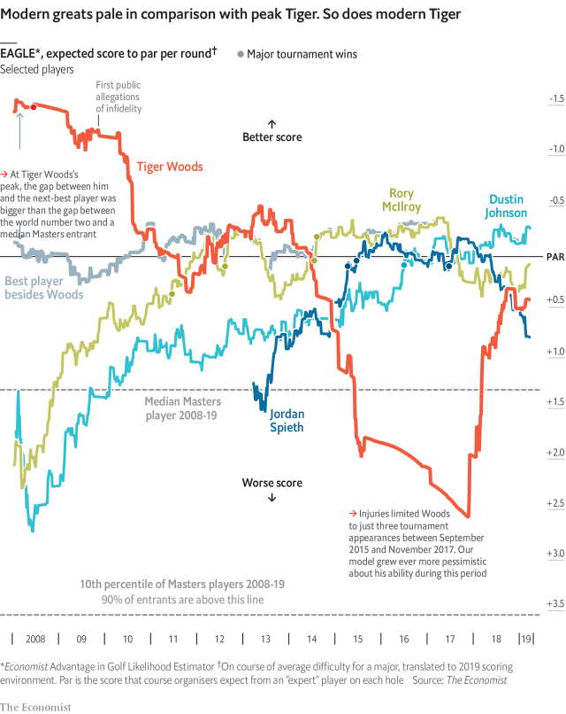

###### The once and future king?

# Our Masters forecast is lukewarm on Tiger Woods 

##### Modern greats pale in comparison with peak Tiger. So does modern Tiger 

 

> Apr 6th 2019 

TIGER WOODS is back—sort of. He had won 14 major titles by the age of 32, and seemed destined to break Jack Nicklaus’s all-time record of 18. Since 2009, however, Mr Woods has not been himself, thanks to injuries and the mental turmoil that began when his marriage fell apart. After playing in just three events during the two years to November 2017, his career seemed over. 

Recently, however, Tiger has burned bright once again. He was among the top finishers in the past two majors, and in September won his first event since 2013. The Masters, the first of the four annual major tournaments, begins on April 11th. Is the 43-year-old really a credible contender? 

The best-known measure of golfers’ ability is the Official World Golf Rankings (OWGR). Players earn OWGR points based on their order of finishing in each event and the previous rankings of other golfers taking part. However, the OWGR make no use of individual scores once play begins. As a result, a golfer who performs brilliantly—but loses to a rival who plays even better—gets fewer points than one who ekes out a win because everyone else had a bad day. 

Is this the best way to evaluate skill? We think not. EAGLE (Economist Advantage in Golf Likelihood Estimator), our prediction model for men’s major golf tournaments, ignores competitors’ results and relies on players’ personal scoring records, adjusted for course conditions and difficulty. Starting with the Masters, we will launch an online visualisation showing EAGLE’s forecasts of every golfer’s chances of victory and odds of each possible score on each hole. It will update every two minutes. 

Our algorithm is impressed by Mr Woods’s comeback. At his worst point, EAGLE predicted him to shoot an average of 2.6 strokes above par per round on a typical major course—worse than 85% of golfers in the Masters. It now puts him at 0.4 shots above par, among the world’s ten best. 

However, Mr Woods’s renaissance still leaves him 0.7 strokes per round behind Dustin Johnson, the best current player. That gap is large enough for EAGLE to give Mr Johnson a 9% chance to win the Masters, compared with just 2% for Mr Woods. 

And even Mr Johnson cannot compare to Mr Woods at his best. If the Mr Woods of 2008, when he last won a major, were transported to 2019, EAGLE finds he would shoot 1.5 strokes below par per round. The gap between “peak Tiger” and Phil Mickelson, then the second-best player, was bigger than the one between Mr Mickelson and a median Masters entrant. Such dominance gave Mr Woods a 25% chance of winning each major he entered in that era. 

Betting markets put Mr Woods’s odds of donning the Masters victor’s green jacket at 5%, more than twice EAGLE’s estimate. He has made many a pauper of punters who bet against him. But it is more likely than not that he has let loose his last roar. 

 

-- 

 单词注释:

1.lukewarm['lu:kwɒ:m]:a. 微温的, 不热的, 不热情的 [医] 微温的 

2.APR[]:[计] 替换通路再试器 

3.destine['destin]:vt. 注定, 预定 

4.jack[dʒæk]:n. 插座, 千斤顶, 男人 vt. 抬起, 提醒, 扛举, 增加, 提高, 放弃 a. 雄的 [计] 插座 

5.turmoil['tә:mɒil]:n. 骚动, 混乱 

6.finisher['finiʃә]:n. 完工者, 精整工, 整理工, 精轧机, 末道清棉机, 决定性的事件 [医] 结束器, 修整器; 结束剂 

7.credible['kredәbl]:a. 可信的, 可靠的 [法] 可信的, 可靠的 

8.ranking['ræŋkiŋ]:n. 等级, 地位 a. 上级的, 头等的, 超群的 

9.golfer['gɒlfә]:n. 打高尔夫球的人 

10.eke[i:k]:vt. 补充, 增加 

11.economist[i:'kɒnәmist]:n. 经济学者, 经济家 [经] 经济学家 

12.estimator['estimeitә]:n. 估计者 [化] 估计器; 估计量 

13.prediction[pri'dikʃәn]:n. 预言, 预报 [化] 预测 

14.online[]:[计] 联机 

15.visualisation[,vizjjәlai'zeiʃәn, -ʒjә-; - li'z-]:n. <主英> = visualization 

16.odds[ɒdz]:n. 可能性, 几率, 机会, 胜算, 不平等 

17.update[ʌp'deit]:vt. 更新, 使现代化 n. 更新 [计] 更新 

18.algorithm['ælgәriðm]:n. 算法 [计] 算法 

19.comeback['kʌmbæk]:n. 复原, 复辟, 复位, 尖刻的对答, 抱怨的原因 [计] 复原的 

20.par[pɑ:]:n. 标准, 票面价值, 平均数量, 同等水平 a. 票面的, 平常的, 标准的, 平价的 [计] 重新传输的肯定回答 

21.renaissance[ri'neisәns]:n. 复活, 复兴, 文艺复兴 a. 文艺复兴的 

22.Dustin['dʌstin]:n. 达斯汀（男子名） 

23.johnson['dʒɔnsn]:n. 约翰逊（姓氏） 

24.cannot['kænɒt]:aux. 无法, 不能 

25.phil[fil]:abbr. 哲学（philosophy） 

26.mickelson[]: [人名] 米克尔森 

27.median['mi:diәn]:a. 中央的, 中间的, 正中的 n. 正中动脉, 中位数, 中线 

28.entrant['entrәnt]:n. 新会员, 新成员, 进入者 

29.dominance['dɔminәns]:n. 优势, 显性, 统治, 控制, 支配 [计] 控制, 扰势 

30.don[dɒn]:n. 西班牙贵族(或绅士), 先生, 阁下 vt. 穿上 

31.pauper['pɒ:pә]:n. 贫民, 靠救济度日者, 穷人, 乞丐 [法] 贫民, 穷人 

32.punter['pʌntә]:n. 用篙撑船的人, 船夫, 赌博者 

