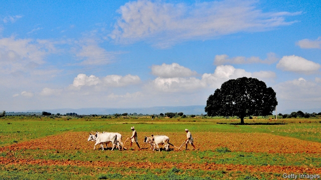
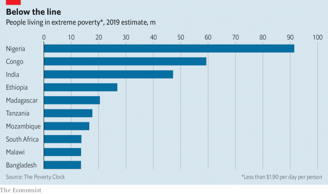

###### Welfare in India

# A better anti-poverty plan for India 

##### Indian politicians are promising more cash for the poor. They should be less selective 

 

> Apr 6th 2019 

GOOD KING WENCESLAS thought of the poor when the weather turned cold. Election season has the same effect on India’s politicians. With national polls looming in April and May, the two main political parties are competing to shower money on the indigent. The governing Bharatiya Janata Party (BJP) has already started paying benefits to farmers who own less than two hectares (five acres) of land. The Congress party promises cash payments for the poorest 50m households. The new focus on the problem is admirable, but these ideas need rethinking. 

India has about 50m people living in extreme poverty, according to the World Poverty Clock, an Austrian research project. Many others are severely pinched. Yet India’s safety-net is both immensely complicated, with over 950 centrally funded schemes and subsidies, and stingy. Old people protested in the capital last year, complaining that the central-government pension of 200 rupees ($3) a month has been frozen since 2007. Much of the money spent on welfare never gets to the poor. Numerous subsidies for fertiliser, power, water and so forth are snaffled by better-off farmers or go into officials’ pockets. A large rural employment scheme does mostly reach poor people, since nobody else is prepared to dig ditches all day under the hot sun. But it is expensive to run and prevents participants from doing any other work. A study carried out in Bihar, a poor state, by the World Bank estimated that you could cut poverty at least as much by taking the money for the scheme and dividing it among the entire population, whether poor or not. 

It is welcome, then, that the parties are vying to come up with better schemes. And it is especially encouraging that both the BJP and Congress are proposing simply to give people money. Distributing cash is cheaper than handing out jobs or food, and allows poor people to buy whatever they need. As bank accounts spread and India’s biometric ID system matures, it should be possible to curb fraud and theft. 

 

Yet the politicians’ plans are ill thought out. Even if the BJP’s bung to farmers manages to get round the problem that many lack clear land titles, it will do nothing for landless labourers, who are often poorer than smallholders. It would have perverse consequences, too, for it would discourage small farmers from getting bigger. Congress’s scheme to pay needy families 6,000 rupees a month is better (see article), but faces the practical and political difficulties involved in targeting the poor. 

Targeting welfare is costly and difficult in a country like India. How is the state supposed to identify the poorest 50m households in a country where income and spending are so hard to track? If it looks for signs such as straw roofs, it will almost certainly miss many poor people, especially in the cities. The political economy of targeted schemes is also tricky. In countries with minimal welfare states, schemes with few beneficiaries also have few supporters, and therefore risk being quietly wound down or diminished by inflation. And any formula used to target the bottom 20% is likely to be so opaque that people will never know whether they should have been included or not, so cannot fight for their entitlements. A workfare scheme in Argentina, trabajar, was so well-targeted—75% of its beneficiaries were among the bottom 30%—that it lost political support and was replaced by a benefit with broader appeal. As Amartya Sen, an Indian economist, put it, benefits that go only to the poor often end up being poor benefits. 

Two years ago a government report suggested a bold new approach. Instead of a universal basic income—an idea doing the rounds in rich countries—create a nearly universal scheme from which you exclude the richest quarter of the population. They are easier (and therefore cheaper) to spot than the poorest. The report estimated that poverty could be virtually eradicated at a cost of 5% of GDP—just about the same as the combined cost of the existing schemes and subsidies. Transfers to the very poor would be lower under Congress’s plan, but since a broader scheme’s chances of survival are higher, indigent Indians would probably benefit more in the long run. 

Binning the hotch-potch of existing schemes and implementing a radical new system would be politically difficult. Yet the broader plan may have a better chance than a targeted scheme, since many of the beneficiaries of the old schemes would get some cash under the new one. And it must be worth a try. The eradication of one of the world’s very worst problems is a prize worth fighting for. 

-- 

 单词注释:

1.les[lei]:abbr. 发射脱离系统（Launch Escape System） 

2.selective[si'lektiv]:a. 选择的, 选择性的 [经] 选择的, 选择性的 

3.APR[]:[计] 替换通路再试器 

4.Wenceslas['wensislɔ:s,-lәs]:即Wenceslaus 

5.loom[lu:m]:n. 织布机, 若隐若现的景象 vi. 朦胧地出现, 隐约可见, 可怕地出现 

6.indigent['indidʒәnt]:a. 贫乏的, 穷困的 

7.Bharatiya[]:[网络] 巴拉蒂亚 

8.Janata['dʒʌnətɑ:]:n. （印度）人民团体；人民党（印度联合政党） 

9.bjp[]: [医][=Bence Jones protein]本周（氏）蛋白，凝溶蛋白 

10.hectare['hektɑ:]:n. 公顷 [经] 公顷 

11.rethink[ri:'θiŋk]:v. 再想, 重想 

12.Austrian['ɒstriәn]:n. 奥地利人 a. 奥地利的, 奥地利人的 

13.immensely[i'mensli]:adv. 无限地, 广大地, 庞大地 

14.centrally['sentrәli]:adv. 在中心, 在中央 

15.stingy['stindʒi]:a. 小气的, 吝啬的, 缺乏的, 有刺的 

16.rupee[ru:'pi:]:n. 卢比(印、巴等国货币单位) 

17.fertiliser['fә:tilaizә]:[化] 肥料 

18.snaffle['snæfl]:n. 马嚼子 vt. 装以马嚼子, 轻勒, 偷窃 

19.participant[pɑ:'tisipәnt]:n. 参加者, 参与者 a. 有份的, 参加的, 参与的 

20.Bihar[bi'hɑ:]:n. 比哈尔邦(印度地名) 

21.vie[vai]:vi. 争, 竞争, 争胜 vt. 提出...来竞争, 以...作较量 

22.biometric[ˌbaɪəʊˈmetrɪk]: 计量生物学 

23.id[id]:n. 遗传素质, 本能冲动 [计] 识别, 标识符, 项目说明 

24.curb[kә:b]:n. 抑制, 勒马绳, 边石 vt. 抑制, 束缚, 勒住 

25.fraud[frɒ:d]:n. 欺骗, 欺诈, 诡计, 骗子 [经] 欺诈, 舞弊, 骗子 

26.bung[bʌŋ]:n. 塞子, 圆木塞, 桶孔, (非正式)家畜的盲肠/肛门 vt. (非正式)丢, 使膨胀, 掷, 投, 推, 塞住 

27.landless['lændlis]:a. 无土地的, 无土地所有权的 

28.smallholder['smɒ:l.hәuldә]:n. 小农, 小佃农 

29.perverse[pә'vә:s]:a. 乖张的, 故意作对的, 有悖常情的, 执迷不悟的, 歪曲的, 错误的, 不正当的 [法] 邪恶的, 罪恶的:堕落的, 不合法的 

30.needy['ni:di]:a. 贫穷的, 贫困的, 生活艰苦的 

31.tricky['triki]:a. 狡猾的, 机敏的 

32.minimal['miniml]:a. 最小的, 极微的, 最小限度的 [医] 最小的, 最低的 

33.beneficiary[.beni'fiʃәri]:n. 受惠者, 受益人 a. 受封的 

34.supporter[sә'pɒ:tә]:n. 支持者, 后盾, 迫随者, 护身织物 [法] 支持者, 赡养者, 抚养者 

35.quietly['kwaiәtli]:adv. 安静地, 沉着地, 秘密地 

36.diminish[di'miniʃ]:v. (使)减少, (使)变小 

37.inflation[in'fleiʃәn]:n. 胀大, 夸张, 通货膨胀 [化] 充气吹胀; 膨胀 

38.opaque[әu'peik]:n. 不透明物 a. 不透明的, 不传热的, 不传导的, 阴暗的 [计] 白底 

39.cannot['kænɒt]:aux. 无法, 不能 

40.entitlement[]:n. 权利 [法] 权利 

41.workfare['w\\:kfeә(r)]:n. 工作福利 [法] 工作福利 

42.Argentina[.ɑ:dʒәn'ti:nә]:n. 阿根廷 

43.trabajar[]:[网络] 劳动 

44.amartya[]:[网络] 阿玛蒂亚；阿马蒂亚 

45.SEN[sen]:n. 传感器（传感元件, 探测设备） 

46.economist[i:'kɒnәmist]:n. 经济学者, 经济家 [经] 经济学家 

47.eradicate[i'rædikeit]:vt. 根除, 扑灭, 根绝, 消灭 

48.bin[bin]:n. (贮存谷物等的)容器, 箱子 [计] 二进制, 商业信息网 

49.politically[]:adv. 政治上 

50.eradication[i,rædi'keiʃәn]:n. 连根拔除, 歼灭, 消灭, 根除, 使断根 [医] 根除, 扑灭, 消灭 

