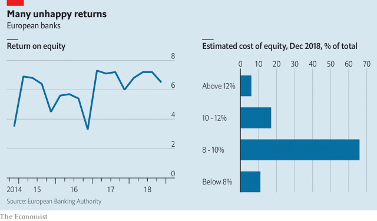

###### European banks

# Fixing Europe’s zombie banks 

##### How to deal with poor performance, defeatism and complacency 

 

> Apr 6th 2019 

IS THERE ANY more miserable spectacle in global business than that of Europe’s lenders? A decade after the crisis they are stumbling around in a fog of bad performance, defeatism and complacency. European bank shares have sunk by 22% in the past 12 months. Deutsche Bank and Commerzbank are conducting merger talks with all the skill and clarity of purpose of Britain’s Brexit negotiators. Two Nordic lenders, Danske Bank and Swedbank, are embroiled in a giant money-laundering scandal. The industry makes a puny return on equity of 6.5% and investors think it is worth less than its liquidation value. Amazingly, many European banks and regulators are resigned to this state of affairs. In fact it is a danger to investors and to Europe’s faltering economy. 

The banks make two excuses, both of which are largely rubbish. One is that it is not their fault. Unlike America, where banks have a return on equity of 12%, Europe does not have strongly positive government-bond yields, or a pool of investment-banking profits like that on Wall Street, or a vast, integrated home market. All this is true, but European banks have been lamentably slow at cutting their costs, something which is well within their control. As a rough rule of thumb, efficient banks report cost-to-income ratios below 50%. Yet almost three-quarters of European lenders have ratios above 60%. Redundant property, inefficient technology and bloated executive perks are the order of the day. 

The banks’ second excuse is that their lousy profitability does not really matter. Their capital buffers have been boosted, they argue, so why should regulators and taxpayers care about the bottom line? And shareholders, the banks hint, have learned to live with the idea that European lenders are unable to make a return of 10%, the hurdle rate investors demand from American banks and most other sectors (see article). 

This is bunkum, too. Profits do matter. They make banks safer: they can be used to absorb bad-debt costs or rebuild capital buffers when recession strikes. Depressed valuations show that far from tolerating European banks, most investors eschew them. As a result many lenders, including Deutsche, have too few blue-chip long-term institutional shareholders who are prepared to hold serially incompetent managers to account. And when the next downturn comes and banks need to raise capital, which investor would be foolish enough to give even more money to firms that do not regard allocating resources profitably as one of their responsibilities? 

 

Rather than accept this miserable situation, European banks need to do two things. First, embrace an efficiency and digitisation drive. Costs are falling at an annual rate of about 4%, according to analysts at UBS. This is not enough. As consumers switch to banking on their phones there are big opportunities to cut legacy IT spending and back-office and branch expenses. Lloyds, in Britain, has cut its cost-income ratio to 49% and expects to get to close to 40% by 2020. The digital German arm of ING, a Dutch bank, boasts a return on equity of over 20% in a country that is supposedly a bankers’ graveyard. If other banks do not do this they will soon find that they have lost market share to new digital finance and payments competitors—both fintech firms and the Silicon Valley giants such as Amazon—that can operate with a fraction of their costs and which treat customers better. 

Second, banks need to push for consolidation. The evidence from America and Asia suggests that scale is becoming a bigger advantage in banking than ever before, allowing the huge investments in technology platforms and data-analysis to take place. Europe has too many lenders—48 firms are considered important enough to be subject to regular “stress tests”. The banks complain that the reason for this is that Europe has not harmonised its rules and regulations. But this is only half the story. Most big banks are loth to cede their independence, and their bosses love the status that comes with running a big lender. And banks’ failure to get their own houses in order means that investors doubt that managers can handle integrating two big firms. 

European banks face two paths. The one they are on promises financial and economic instability when the next recession strikes, and long-term decline. The other path is to get fit for the digital age and subject themselves to the financial disciplines that American banks, and almost all other industries, accept as a fact of life. It should not be a hard decision. 

  

-- 

 单词注释:

1.zombie['zɔmbi]:n. 蛇神, 起死回生的魔力, 僵尸, 回魂尸, (美)鸡尾酒, 木鸡, 讨厌的家伙 [计] 僵尸 

2.defeatism[di'fi:tizm]:n. 失败主义 

3.complacency[kәm'pleisәnsi]:n. 满足, 自鸣得意, 自满 

4.APR[]:[计] 替换通路再试器 

5.deutsche[]:n. 德意志联邦共和国马克 

6.commerzbank[]: 德国商业银行公司总部所在地：德国主要业务：银行 

7.merger['mә:dʒә]:n. 合并, 归并 [经] 购并 

8.clarity['klærәti]:n. 清楚, 明晰 [化] 透明度; 透明性; 清晰性 

9.Brexit[]:[网络] 英国退出欧盟 

10.negotiator[ni'gәuʃieitә]:n. 磋商者, 交涉者, 议定者 [经] 谈判者, 交易者, 协商者 

11.Nordic['nɒ:dik]:n. 北欧人, 日耳曼民族, 北欧两项滑雪 a. 北欧人的, 日耳曼民族的, 北欧两项滑雪的 

12.lender['lendә]:n. 出借人, 贷方 [经] 出借者, 贷方, 贷款人 

13.danske[]:[网络] 银行丹斯克；丹麦丹克斯银行；丹麦文 

14.embroil[im'brɒil]:vt. 使卷入, 牵连 

15.puny['pju:ni]:a. 微小的, 弱小的, 微不足道的 

16.equity['ekwiti]:n. 公平, 公正 [经] 权益, 产权 

17.investor[in'vestә]:n. 投资者 [经] 投资者 

18.les[lei]:abbr. 发射脱离系统（Launch Escape System） 

19.liquidation[.likwi'deiʃәn]:n. 偿还, 偿付, 清算 [化] 液化; 溶离法; 溶化分离法 

20.amazingly[]:adv. 令人惊讶地；惊奇地 

21.regulator['regjuleitә]:n. 调整者, 校准者, 校准器, 调整器, 标准钟 [化] 调节剂; 调节器 

22.falter['fɒ:ltә]:vt. 支吾地说 vi. 支吾, 蹒跚地走 n. 颤抖, 支吾, 踌躇 

23.lamentably['læməntəblɪ]:adv. 哀伤地, 拙劣地 

24.redundant[ri'dʌndәnt]:a. 多余的, 过多的, 冗长的 [医] 过多的, 多余的 

25.bloat[blәut]:vt. 使膨胀, 腌制, 使自大 vi. 膨胀, 肿起 n. 肿胀病人 

26.perk[pә:k]:vi. 昂首, 振作, 举止高傲, 神气活现, 滤煮 vt. 竖起, 打扮, 使振作, 滤煮 n. 小费 

27.lousy['lauzi]:a. 污秽的, 恶心的, 生虱的 

28.profitability[.prɒfitә'biliti]:n. 收益性, 利益率 [经] 可获利润率 

29.buffer['bʌfә]:n. 缓冲器, 缓冲区 vt. 缓冲 [计] 缓冲区, 缓冲器 

30.taxpayer['tækspeiә]:n. 纳税人 [法] 纳税人, 纳税义务人 

31.shareholder['ʃєә.hәuldә]:n. 股东 [法] 股东, 股票持有人 

32.hurdle['hә:dl]:n. 障碍, 跳栏, 临时活动篱笆 vt. 用篱笆围, 越过, 克服 

33.sector['sektә]:n. 扇形, 部门, 部分, 函数尺, 象限仪, 段, 区段 vt. 把...分成扇形 [计] 扇面; 扇区; 段; 区段 

34.bunkum['bʌŋkәm]:n. 博取欢心的演说, 废话 

35.recession[ri'seʃәn]:n. 后退, 凹处, 衰退, 归还 [医] 退缩 

36.valuation[.vælju'eiʃәn]:n. 评价, 估价, 价值判断 [经] 估价, 计价, 评价 

37.eschew[is'tʃu:]:vt. 避开, 远避 

38.institutional[.insti'tju:ʃәnәl]:a. 制度的, 公共机构的, 学会的 [法] 组织机构的, 制度的, 公共机构的 

39.serially[]:[计] 可连续地 

40.incompetent[in'kɒmpitәnt]:a. 无能力的, 无资格的, 机能不全的, 不胜任的 n. 无能力者 

41.downturn['dauntә:n]:n. (尤指经济方面的)衰退, 下降趋势 [电] 低迷时期 

42.profitably['prɒfitәbli]:adv. 有利地, 有益地 

43.digitisation[]:[计] 数字化 

44.analyst['ænәlist]:n. 分析者, 精神分析学家 [化] 分析员; 化验员 

45.UB[]:[计] 上限 

46.legacy['legәsi]:n. 祖先传下来之物, 遗赠物 [经] 遗产, 遗赠物 

47.lloyd[lɔid]:n. 劳埃德（男子名） 

48.ing[]:abbr. 惯性导航与制导（Inertial Navigation and Guidance）；强中子发生器（Intense Neutron Generator） 

49.Dutch[dʌtʃ]:n. 荷兰人, 荷兰语 a. 荷兰的 

50.supposedly[sә'pәuzidli]:adv. 想象上, 看上去像, 被认为是, 恐怕, 按照推测 

51.graveyard['greivjɑ:d]:n. 墓地 

52.fintech[]:[网络] 金融科技；表面处理技术展；金融资讯科技服务 

53.silicon['silikәn]:n. 硅 [化] 硅Si 

54.consolidation[kәn.sɒli'deiʃәn]:n. 巩固, 团结, 合并, 加强 [医] 实变 

55.harmonise['hɑ:mәnaiz]:vi.vt. 以和声歌唱/演奏, (使)协调, (使)一致, (使)相称, (使)调和 

56.loth[lәuθ]:a. 不愿意的, 厌恶的 

57.cede[si:d]:vt. 割让 [法] 割让, 让与, 放弃 

58.statu[]:[网络] 状态查看；雕像；特级雪花白 

59.instability[.instә'biliti]:n. 不安定, 不稳定 [医] 不稳定性 

