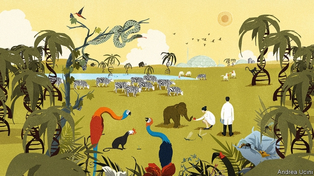

###### Redesigning life

# The promise and perils of synthetic biology 

##### To understand them well, look to the past 

 

> Apr 4th 2019 

FOR THE past four billion years or so the only way for life on Earth to produce a sequence of DNA—a gene—was by copying a sequence it already had to hand. Sometimes the gene would be damaged or scrambled, the copying imperfect or undertaken repeatedly. From that raw material arose the glories of natural selection. But beneath it all, gene begat gene. 

That is no longer true. Now genes can be written from scratch and edited repeatedly, like text in a word processor. The ability to engineer living things which this provides represents a fundamental change in the way humans interact with the planet’s life. It permits the manufacture of all manner of things which used to be hard, even impossible, to make: pharmaceuticals, fuels, fabrics, foods and fragrances can all be built molecule by molecule. What cells do and what they can become is engineerable, too. Immune cells can be told to follow doctors’ orders; stem cells better coaxed to turn into new tissues; fertilised eggs programmed to grow into creatures quite unlike their parents. 

The earliest stages of such “synthetic biology” are already changing many industrial processes, transforming medicine and beginning to reach into the consumer world (see Technology Quarterly). Progress may be slow, but with the help of new tools and a big dollop of machine learning, biological manufacturing could eventually yield truly cornucopian technologies. Buildings may be grown from synthetic wood or coral. Mammoths produced from engineered elephant cells may yet stride across Siberia. 

The scale of the potential changes seems hard to imagine. But look back through history, and humanity’s relations with the living world have seen three great transformations: the exploitation of fossil fuels, the globalisation of the world’s ecosystems after the European conquest of the Americas, and the domestication of crops and animals at the dawn of agriculture. All brought prosperity and progress, but with damaging side-effects. Synthetic biology promises similar transformation. To harness the promise and minimise the peril, it pays to learn the lessons of the past. 

Start with the most recent of these previous shifts. Fossil fuels have enabled humans to drive remarkable economic expansion in the present using biological productivity from ages past, stored away in coal and oil. But much wilderness has been lost, and carbon atoms which last saw the atmosphere hundreds of millions of years ago have strengthened the planet’s greenhouse effect to a degree that may prove catastrophic. Here, synthetic biology can do good. It is already being used to replace some products made from petrochemicals; in time it could replace some fuels, too. This week Burger King introduced into some of its restaurants a beefless Whopper that gets its meatiness from an engineered plant protein; such innovations could greatly ease a shift to less environmentally taxing diets. They could also be used to do more with less. Plants and their soil microbes could produce their own fertilisers and pesticides, ruminants less greenhouse gas—though to ensure that synthetic biology yields such laudable environmental goals will take public policy as well as the cues of the market. 

The second example of biological change sweeping the world is the Columbian exchange, in which the 16th century’s newly global network of trade shuffled together the creatures of the New World and the Old. Horses, cattle and cotton were introduced to the Americas; maize, potatoes, chilli and tobacco to Europe, Africa and Asia. The ecosystems in which humans live became globalised as never before, providing more productive agriculture all round, richer diets for many. But there were also disastrous consequences. Measles, smallpox and other pathogens ran through the New World like a forest fire, claiming tens of millions of lives. The Europeans weaponised this catastrophe, conquering lands depleted and disordered by disease. 

Synthetic biology could create such weapons by design: pathogens designed to weaken, to incapacitate or to kill, and perhaps also to limit themselves to particular types of target. There is real cause for concern here—but not for immediate alarm. For such weaponisation would, like the rest of cutting-edge synthetic biology, take highly skilled teams with significant resources. And armies already have lots of ways to flatten cities and kill people in large numbers. When it comes to mass destruction, a disease is a poor substitute for a nuke. What’s more, today’s synthetic-biology community lives up to ideals of openness and public service better than many older fields. Maintained and nurtured, that culture should serve as a powerful immune system against rogue elements. 

The earliest biological transformation—domestication—produced what was hitherto the biggest change in how humans lived their lives. Haphazardly, then purposefully, humans bred cereals to be more bountiful, livestock to be more docile, dogs more obedient and cats more companionable (the last a partial success, at best). This allowed new densities of settlement and new forms of social organisation: the market, the city, the state. Humans domesticated themselves as well as their crops and animals, creating space for the drudgery of subsistence agriculture and oppressive political hierarchies. 

Synthetic biology will have a similar cascading effect, transforming humans’ relationships with each other and, potentially, their own biological nature. The ability to reprogram the embryo is, rightly, the site of most of today’s ethical concerns. In future, they may extend further; what should one make of people with the upper-body strength of gorillas, or minds impervious to sorrow? How humans may choose to change themselves biologically is hard to say; that some choices will be controversial is not. 

Which leads to the main way in which this transformation differs from the three that came before. Their significance was discovered only in retrospect. This time, there will be foresight. It will not be perfect: there will certainly be unanticipated effects. But synthetic biology will be driven by the pursuit of goals, both anticipated and desired. It will challenge the human capacity for wisdom and foresight. It might defeat it. But carefully nurtured, it might also help expand it. 

-- 

 单词注释:

1.redesign[,ri:di'zain]:[化] 重新设计 

2.peril['peril]:n. 危险, 冒...之险, 险境, 险因 vt. 置...于险境, 冒险, 危及 

3.APR[]:[计] 替换通路再试器 

4.scramble['skræmbl]:n. 攀缘, 爬行, 抢夺, 混乱, 紧急起飞 vi. 攀缘, 杂乱蔓延, 争夺, 拼凑, 匆忙 vt. 攀登, 扰乱, 使混杂 

5.imperfect[im'pә:fikt]:a. 不完美的, 不完整的, 减弱的, 未完成过去时的 n. 未完成体 

6.begat[bi'^æt]:v. <废> beget的过去式 

7.edit['edit]:vt. 编辑, 编校, 修订, 剪辑 [计] 编辑; DOS外部命令:该命令是一个用于编辑文本文件的全屏幕编辑程序 

8.processor[prә'sesә]:n. 信息处理机, 加工者, 处理者 [计] 处理器 

9.interact[.intәr'ækt]:vi. 互相影响, 交互作用 n. 幕间剧, 幕间休息 

10.pharmaceutical[,fɑ:mә'sju:tikәl]:a. 药学的, 制药的, 药用的, 药物的, 药剂师的, 药师的 n. 药品, 成药, 药剂 

11.fragrance['freigrәns]:n. 芬芳, 香味 

12.engineerable[]:[网络] 可操作性 

13.immune[i'mju:n]:a. 免疫的, 免除的, 不受影响的 n. 免疫者 

14.coax[kәuks]:vt. 哄, 诱骗, 耐心地摆弄 vi. 哄骗 [计] 同轴电缆 

15.fertilise['f\\:tilaiz]:vt. 使肥沃, 施肥于, 使多产, 使丰富, 使受精 

16.dollop['dɒlәp]:n. 块, 团 

17.biological[.baiәu'lɒdʒikәl]:a. 生物学的 [医] 生物学的 

18.manufacturing[.mænju'fæktʃәriŋ]:n. 制造业 a. 制造业的 

19.cornucopian[kɒːnjuˊkoupiәn]:a. 丰富的,丰饶的 

20.mammoth['mæmәθ]:n. 猛犸, 庞然大物 a. 猛犸似的, 巨大的 

21.stride[straid]:n. 大步, 步幅, 步态, 进步 v. 迈大步走, 跨过, 跨 

22.siberia[sai'biәriә]:n. 西伯利亚 

23.exploitation[.eksplɒi'teiʃәn]:n. 开发, 开采, 剥削 [经] 开发, 剥削, 宜传 

24.fossil['fɒsәl]:n. 化石, 古物 a. 化石的, 陈腐的, 守旧的 

25.globalisation[,gləubəlai'zeiʃən]:n. 全球化, =globalization 

26.ecosystem['i:kәu.sistәm]:n. 生态系统 [医] 生态系 

27.domestication[dәumesti'keiʃәn]:n. 驯养, 教化 

28.minimise[]:vt. 使减到最少/最小, 使降到最低限度, 使缩到最小, 极度轻视 

29.fossil['fɒsәl]:n. 化石, 古物 a. 化石的, 陈腐的, 守旧的 

30.productivity[.prәudʌk'tiviti]:n. 生产力 [经] 生产率, 生产能力 

31.wilderness['wildәnis]:n. 荒野, 荒地, 大量 

32.catastrophic[.kætә'strɒfik]:a. 悲惨的, 灾难的 

33.petrochemical[.petrәu'kemikәl]:a. 石化的, 石化制品的, 岩石化学的 n. 石化产品 

34.burger['bә:ɡә]:n. 汉堡包（等于hamburger） 

35.beefless[]:n. 不供应牛肉 

36.whopper['hwɒpә]:n. 特大之物, 弥天大谎 

37.meatiness[]: [医]肉多, 瘦肉多, 多肉性 

38.innovation[.inәu'veiʃәn]:n. 改革, 创新 [法] 创新, 改革, 刷新 

39.les[lei]:abbr. 发射脱离系统（Launch Escape System） 

40.environmentally[]:adv. 有关环境方面 

41.microbe['maikrәub]:n. 微生物, 细菌 [医] 微生物 

42.fertiliser['fә:tilaizә]:[化] 肥料 

43.pesticide['pestisaid]:n. 杀虫剂 [化] 农药 

44.ruminant['ru:minәnt]:a. 反刍类的, 沉思的, 默想的 n. 反刍动物 

45.laudable['lɒ:dәbl]:a. 值得赞赏的, 值得佩服的 [医] 健康的 

46.environmental[in.vaiәrәn'mentәl]:a. 周围的, 环境的 [经] 环境的, 环保的 

47.Columbian[kә'lʌmbiәn]:a. 哥伦比亚的, 哥伦布的, 美国的 

48.shuffle['ʃʌfl]:n. 拖着脚走, 曳步, 混乱, 蒙混, 洗纸牌 v. 拖曳, 马虎地做, 笨手笨脚地穿(脱)衣, 推诿, 洗牌 [计] 混洗 

49.maize[meiz]:n. 玉蜀黍, 黄色 a. 玉蜀黍色的, 黄色的 

50.chilli['tʃili]:n. 红辣椒 

51.globalise[]:使全球化（英式英语） 

52.disastrous[di'zɑ:strәs]:a. 损失惨重的, 悲伤的 

53.measles['mi:zlz]:n. 麻疹, 风疹, 家畜囊尾蚴病, 米珠 [医] 麻疹, 囊尾蚴病(家畜) 

54.smallpox['smɒ:lpɒks]:n. 天花 [医] 天花, 痘疮 

55.pathogen['pæθәdʒ(ә)n]:n. 病原体 [医] 病原体 

56.tens[]:十位 

57.weaponised['wepənaiz]:vt. 把…改装成武器；使…武器化 

58.deplete[di'pli:t]:vt. 耗尽, 使衰竭 [医] 排除, 减少 

59.incapacitate[.inkә'pæsiteit]:vt. 使无能力, 使无行为能力 [法] 使无资格, 使无能力, 剥夺资格 

60.weaponisation[]:[网络] 武器化 

61.flatten['flætn]:vi. 使...不活跃, 变平 vt. 弄平, 打倒, 使失去光泽 

62.nuke[nju:k]:n. 核武器, 核电厂, 原子核 vt. 以核武器攻击, 把...打垮 a. 核武器的 

63.openness['әupәnnis]:n. 公开；宽阔；率真 

64.nurture['nә:tʃә]:n. 养育, 营养物, 培育 vt. 养育, 供给营养物, 教养 

65.immune[i'mju:n]:a. 免疫的, 免除的, 不受影响的 n. 免疫者 

66.rogue[rәug]:n. 恶棍, 流氓, 小淘气 vt. 欺骗 vi. 游手好闲 

67.hitherto[.hiðә'tu:]:adv. 迄今, 至今 

68.haphazardly[.hæp'hæzәdli]:adv. 偶然地, 随意地；杂乱地 

69.purposefully[]:adv. 自觉地；有目的地 

70.cereal['siәriәl]:n. 谷类食品, 谷类植物 a. 谷类的 

71.bountiful['bauntiful]:a. 慷慨的, 宽大的 

72.docile['dәusail]:a. 容易教的, 温顺的 

73.obedient[ә'bi:djәnt]:a. 服从的, 顺从的, 孝顺的 [法] 服从的, 顺从的, 忠顺的 

74.companionable[kәm'pænjәnәbl]:a. 友善的, 好交际的 

75.domesticate[dәu'mestikeit]:vt. 养驯, 引进(外来词等), 教化 

76.drudgery['drʌdʒәri]:n. 苦差事, 苦工 

77.subsistence[sәb'sistәns]:n. 生存, 生活 [医] 生存 

78.oppressive[ә'presiv]:a. 压制性的, 压迫的, 沉重的 

79.hierarchy['haiәrɑ:ki]:n. 等级制度, 僧侣统治, 等级体系 [计] 分级结构; 分层结构; 新闻组, 新闻组分层 

80.cascade[kæ'skeid]:n. 小瀑布, 瀑布状物 vi. 成瀑布落下 [计] 层叠, 级联 

81.potentially[pә'tenʃәli]:adv. 可能地, 潜在地 

82.reprogram['ri:prәu^ræm]:[计] 可改编程序, 重编程序 

83.embryo['embriәu]:n. 胚胎, 胎儿, 胚芽 [医] 胚, 胚胎 

84.rightly['raitli]:adv. 合适地, 正当地, 正确地 

85.ethical['eθikәl]:a. 伦理的, 民族的, 民族特有的 [医] 伦理的, 道德的 

86.gorilla[gә'rilә]:n. 大猩猩, 残暴的男人, 歹徒 

87.impervious[im'pә:viәs]:a. 透不过的, 不易损坏的, 无动于衷的, 不受影响的 [医] 不能透过的 

88.biologically[]:adv. 生物学, 生态学 

89.retrospect['retrәspekt]:n. 回顾, 追忆, 回溯 v. 回顾, 追忆 

90.foresight['fɒ:sait]:n. 远见, 深谋远虑 [法] 先见, 预见, 预见的能力 

91.unanticipated[]:[计] 非先行的 

92.carefully['kєәfuli]:adv. 小心地, 谨慎地 

