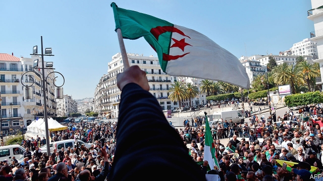

###### The real battle begins

# The resignation of President Abdelaziz Bouteflika is a good start 

##### Now overhaul the system that kept him in power 

 

> Apr 4th 2019 

AFTER WEEKS of angry protests, the streets of Algeria erupted again on April 2nd—this time in celebration. President Abdelaziz Bouteflika, who had clung to power for 20 years, had at last stepped down. Joyful Algerians, many of whom have known only one leader, draped themselves in the national flag and spoke of a new era for the country. “Game over”, read one of the banners hoisted by the crowd. 

In fact the battle for Algeria is just beginning (see article). Mr Bouteflika, who suffered a debilitating stroke in 2013, was merely a figurehead for a shadowy group of businessmen, politicians and generals who really run the country. His fall, therefore, is merely a symbolic victory. The old invalid is gone, but if Algeria is to move to “the better future” that Mr Bouteflika—or, more likely, his coterie—wrote about in his resignation letter, then much bigger changes are needed. 

The country is entering a period fraught with risk. Mr Bouteflika’s resignation was preceded by other empty concessions—a new prime minister, vague promises of a political transition—aimed at calming the masses. But these have emboldened the protesters, whose ambitions are growing. They will not be satisfied with the constitutional way forward, which would see Abdelkader Bensalah, the Speaker of the Senate and a Bouteflika loyalist, assume the presidency until an election is held. Many, quite rightly, want a new start. 

As the protesters move closer to the real centres of power, the ruling cabal looks increasingly nervous. The army chief, General Ahmed Gaid Salah, has tried—and failed—to control each step of the process. Officials have warned of bloodshed, evoking Algeria’s civil war in their efforts to avoid real reform. That conflict began after the last free and fair parliamentary election, in 1991. The first round of voting was won by Islamists, so the generals cancelled the rest. Some 200,000 people were killed in the fighting that followed, which lasted for most of the 1990s. The civil war in neighbouring Libya also provides a dark warning of what can happen when a dictator is overthrown. 

There is certainly a danger of violence, but the protesters have remained determinedly peaceful. Islamists are not nearly as powerful as they once were and, anyway, have kept mostly quiet. Algeria’s tribal divisions are less pronounced than Libya’s. Tellingly, only those in power speak of the possibility of a new round of violence, perhaps out of habit. For decades they have justified their ruthlessness by pointing to the bloody past. Yet it is the ruling elite that has fallen to in-fighting. Several of Mr Bouteflika’s allies have been detained, some while allegedly trying to get their ill-gotten gains out of the country. Some see a purge orchestrated by General Salah. 

That is no way forward. The ruling cabal should follow Mr Bouteflika’s lead in giving up power—and so too should General Salah, who seems loth to relinquish the army’s role as the arbiter of politics. He has chided those who sought to extend the president’s rule in order to preserve “their narrow personal interests”. Yet he himself backed Mr Bouteflika until it was clear that the protests would not stop. The demonstrators want a clean break from the out-of-touch old guard, including the general. Algeria needs soldiers who are comfortable with civilian rule, and who value freedom as much as stability. 

A caretaker government is needed to oversee the process of creating a more open system, starting with a national conference. But for that to happen, the opposition must get its act together. An umbrella organisation of liberals, Islamists and trade unionists, to name just a few of the groups taking part in the protests, was created last month on a vague platform of reforms, but it already seems to be falling apart. If an election were to be held in 90 days, as the constitution requires, it is not clear who would represent the opposition or if it could even mount an effective campaign. That has led to growing fears that Algeria could go the way of Egypt, where protesters toppled an old dictator in 2011, but the fracturing of the opposition eventually allowed the army to retake control. Tunisians, by contrast, worked together to shore up their nascent democracy. 

In getting rid of Mr Bouteflika without bloodshed, the Algerian protesters have achieved much, but their victory is far from complete. They need to learn from their neighbours, and unite until a new regime is embedded. Peaceful transition to democracy is a rare flower in the Arab world’s political desert; but it could just flourish in Algeria’s parched soil. 

-- 

 单词注释:

1.abdelaziz[]:n. (Abdelaziz)人名；(阿拉伯)阿卜杜勒-阿齐兹 

2.bouteflika[]:[网络] 布特弗利卡；阿尔及利亚总统布特弗利卡；布特佛里卡 

3.overhaul[.әuvә'hɒ:l]:vt. 分解检查, 翻修, 精细检查, 彻底革新 n. 分解检查, 精细检查, 大检修 

4.APR[]:[计] 替换通路再试器 

5.Algeria[æl'dʒiәriә]:n. 阿尔及利亚 

6.cling[kliŋ]:vi. 粘紧, 附着, 紧贴, 坚持 

7.Algerian[æl'dʒiәriәn]:a. 阿尔及利亚的 n. 阿尔及利亚人 

8.drape[dreip]:n. 布帘, 褶皱 vt. 用布帘覆盖, 披上 vi. 成褶皱状 

9.hoist[hɒist]:n. 升高, 起重机, 推动 v. 升起, 升高, 举起 

10.debilitate[di'biliteit]:vt. 使衰弱 

11.figurehead['figәhed]:n. 装饰船头的人像, 傀儡领袖 

12.shadowy['ʃædәui]:a. 有影的, 暗黑的, 朦胧的, 虚幻的 

13.symbolic[sim'bɒlik]:a. 象征的, 符号的 [电] 符号化 

14.invalid[in'vælid]:n. 病人, 残废者 a. 有病的, 无效的 

15.fraught[frɒ:t]:a. 含有...的, 伴着...的, 充满...的 

16.precede[.pri:'si:d]:vt. 在...之前, 优于, 较...优先 vi. 在前面 

17.embolden[im'bәuldn]:vt. 使大胆, 使有胆量 

18.protester[]:n. 抗议者, 持异议者, 拒付者 [经] 反对者 

19.constitutional[.kɒnsti'tju:ʃәnl]:a. 宪法的, 立宪的, 体质的 [医] 全身的; 体质的 

20.Abdelkader[]:n. (Abdelkader)人名；(阿拉伯)阿朴杜勒-卡德尔；(1808-83)阿卜杜卡迪尔〈阿尔及〉军事家。 

21.loyalist['lɒiәlist]:n. 忠诚的人, 反对独立者, 反佛朗哥派的人 

22.presidency['prezidәnsi]:n. 总统职权, 总裁职位 

23.rightly['raitli]:adv. 合适地, 正当地, 正确地 

24.cabal[kә'bæl]:n. 秘密结社, (尤指政治上的)阴谋 vi. 策划阴谋 

25.ahmed[]:n. 艾哈迈德（男子名） 

26.gaid[]:[网络] 通信技术促进发展全球联盟；通信技术与发展联盟；发展联盟 

27.Salah[sә'lɑ:]:n. = salat [变体] 

28.bloodshed['blʌdʃed]:n. 流血 

29.evoke[i'vәuk]:vt. 唤起, 引起, 召(魂) [法] 提审, 移送 

30.parliamentary[.pɑ:lә'mentәri]:a. 国会的, 议会的, 议会制度的 

31.Islamist[iz'lɑ:mist]:n. 伊斯兰教主义者；回教教徒 

32.Libya['libiә]:n. 利比亚 

33.dictator['dikteitә]:n. 命令者, 独裁者 

34.overthrow[.әuvә'θrәu]:n. 推翻, 瓦解, 倾覆 vt. 打倒, 推翻, 倾覆 

35.determinedly[dɪ'tɜ:mɪndlɪ]:adv. 坚定地; 坚决地; 决然地; 断然地 

36.tribal[traibl]:a. 部落的, 宗族的 

37.les[lei]:abbr. 发射脱离系统（Launch Escape System） 

38.tellingly['teliŋli]:adv. 有效地；显著地 

39.ruthlessness[]:n. 无情；冷酷；残忍 

40.bloody['blʌdi]:a. 血腥的, 嗜杀的, 有血的 

41.elite[ei'li:t]:n. 精华, 精锐, 中坚分子 

42.ally['ælai. ә'lai]:n. 同盟者, 同盟国, 助手 vt. 使联盟, 使联合, 使有关系 vi. 结盟 

43.detain[di'tein]:vt. 扣留, 扣押, 耽搁 [法] 拘留, 扣押, 留住 

44.allegedly[ә'ledʒidli]:adv. 依其申述 

45.purge[pә:dʒ]:n. 净化, 清除, 泻药 v. (使)净化, 清除, (使)通便 [计] 服务器文件删除实用程序 

46.orchestrate['ɒ:kistreit]:v. 编管弦乐曲 

47.loth[lәuθ]:a. 不愿意的, 厌恶的 

48.relinquish[ri'liŋkwiʃ]:vt. 放弃, 撤回, 停止, 松开, 让与 [法] 让与, 把...交给, 放弃 

49.arbiter['ɑ:bitә]:n. 仲裁人, 裁决者, 公断人 [计] 判优程序 

50.politic['pɒlitik]:a. 精明的, 明智的, 策略的 

51.chide[tʃaid]:v. 斥责, 责骂 

52.demonstrator['demәnstreitә]:n. 论证者, 证明者, 指示者, 示威者 [医] 示教者 

53.caretaker['kєәteikә]:n. 照顾者, 看管者, 看守人 [法] 看守员, 管理员, 看管人 

54.oversee[.әuvә'si:]:vt. 向下看, 了望, 监督, 偷看到 [法] 监察, 监督, 俯瞰 

55.opposition[.ɒpә'ziʃәn]:n. 反对, 敌对, 相反, 在野党 [医] 对生, 对向, 反抗, 反对症 

56.organisation[,ɔ: ^әnaizeiʃən; - ni'z-]:n. 组织, 团体, 体制, 编制 

57.unionist['ju:njәnist]:n. 工会会员, 工联主义者 [法] 工会会员, 工会主义者 

58.Egypt['i:dʒipt]:n. 埃及 

59.topple['tɒpl]:vt. 推翻, 颠覆 vi. 倒塌, 摇摇欲坠 

60.fracture['fræktʃә]:n. 破碎, 骨折 v. (使)破碎, (使)破裂 

61.retake[ri:'teik]:vt. 再取, 取回, 重摄 n. 重拍, 取回 

62.Tunisian[tju:'niziәn]:a. 突尼斯的, 突尼斯人的 n. 突尼斯人 

63.nascent['næsnt]:a. 发生中的, 开始存在的, 初期的 [医] 初发的, 初生的 

64.Algerian[æl'dʒiәriәn]:a. 阿尔及利亚的 n. 阿尔及利亚人 

65.regime[rei'ʒi:m]:n. 政权, 当权期间, 政体, 社会制度, 体制, 情态 [医] 制度, 生活制度 

66.embed[im'bed]:vt. 使插入, 使嵌入, 使深留脑中 [计] 嵌入 

67.transition[træn'ziʃәn]:n. 转变, 转换, 变迁, 过渡时期, 临时转调 [化] 跃迁 

68.parch[pɑ:tʃ]:vt. 烤, 烘, 使干透 vi. 烤干, 焦干 

