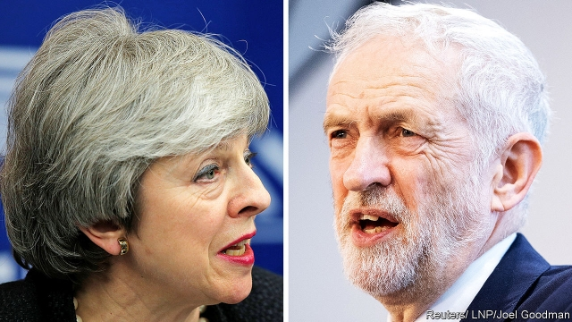

###### The Brexit negotiations

# Theresa May takes a step in the right direction on Brexit 

##### The prime minister is right to seek a cross-party consensus. The EU should allow her enough extra time 

 

> Apr 4th 2019 

IT HAS BEEN clear for months that the entrenched hostility of hardline Tory Brexiteers and the Northern Irish Democratic Unionist Party (DUP) meant that Theresa May’s Brexit deal would not pass in Parliament. This week the prime minister accepted reality by offering instead to negotiate with Jeremy Corbyn, the leader of the opposition Labour Party, on alternatives that could win a majority. Cross-party talks between two leaders notoriously reluctant to compromise may well fail, but if that happens Mrs May has offered to be bound by whatever solution MPs themselves support in further rounds of Commons voting. 

There are two reasons to welcome this changed approach. The first is that, since Mrs May will surely have to erase some of the “red lines” she laid out over two years ago, the outcome looks almost certain to be a softer Brexit. This is likely to start with acceptance of a permanent customs union, which is both the clearest Labour objective and one that failed to win a Commons majority by only three votes this week. It may also imply closer alignment with the EU’s single-market rules. 

The second reason is that Mrs May has come out firmly against leaving with no deal (see article). Hardline Brexiteers persist in pooh-poohing concerns about the potential costs of a no-deal Brexit as just another round of Project Fear. But as a briefing paper written for ministers by the cabinet secretary shows, the risks to the economy and to security are both genuine and serious. That the prime minister is now committed against pursuing this destructive option as a deliberate policy is a welcome shift. 

That does not mean a no-deal Brexit cannot happen, as it remains the default choice on April 12th if no other action is taken. But Mrs May has confirmed that she will ask the EU for a further extension of this deadline at the summit to be held on April 10th. And, to ensure her spine stays stiffened, MPs are seeking to instruct her in a new law to call for more time. 

Many EU leaders, whose unanimous approval is needed for any extension, may be reluctant to agree to it. Why give the vacillating Brits more time to squabble when they may still never come to an agreement? Why not just push Britain out now? The answer is that a no-deal Brexit would damage not just Britain but also many EU countries, most notably Ireland. If Mrs May can assure her fellow leaders that she is pursuing a new softer form of Brexit, they should give her whatever time it takes—even until the end of the year if need be. 

A complication is that, if Britain is still a member in late May, EU leaders have made clear they will insist on it taking part in elections to the European Parliament. Mrs May is against this idea, as are some in other countries who are fretful about an upsurge of populist MEPs. But the new European Parliament is likely to have many more populists in it whether or not Britons vote. If the alternative is a no-deal Brexit, Britain should agree to elect MEPs, even if they sit for only a relatively short time. 

None of this will be easy. It will demand patience and far-sightedness from EU leaders who are understandably fed up. It will demand sustained pragmatism and political deftness from a prime minister who has hitherto shown little evidence of either. And even if a softer Brexit eventually emerges, it will have loud, angry detractors on both sides. Tory hardliners will declare it to be a betrayal of the 2016 referendum. Hard-core remainers will decry it as an act of self-harm, a much worse outcome than staying in the EU. There is no easy way to manage the venom and fury on both sides—and the divisions in the country as a whole. But the most promising is to agree as part of a cross-party deal to put the outcome to a confirmatory referendum, an idea that lost by only 12 votes in the Commons this week. Mrs May’s belated willingness to seek consensus is welcome. Her next step should be to promise that any deal will be put to the public for a final say. 

-- 

 单词注释:

1.Brexit[]:[网络] 英国退出欧盟 

2.negotiation[ni.gәuʃi'eiʃәn]:n. 谈判, 磋商, 交涉 [经] 谈判, 协商 

3.theresa[ti'ri:zә]:n. 特丽萨（女子名） 

4.EU[]:[化] 富集铀; 浓缩铀 [医] 铕(63号元素) 

5.APR[]:[计] 替换通路再试器 

6.entrench[in'trentʃ]:vt. 围以壕沟, 防护, 保卫, 使处于牢固地位 vi. 掘壕, 侵犯 

7.hostility[hɒs'tiliti]:n. 敌意, 敌对, 反对 

8.hardline[]:n. 强硬路线 [电] 硬线 

9.Tory['tɒ:ri]:n. 托利党党员, 保守党员, 亲英分子 a. 保守分子的 

10.Brexiteers[]:支持英国退欧的人（Brexiteer的复数） 

11.unionist['ju:njәnist]:n. 工会会员, 工联主义者 [法] 工会会员, 工会主义者 

12.dup[dʌp]:vt. 打开；重复 

13.jeremy['dʒerimi]:n. 杰里米（男子名） 

14.Corbyn[]:科尔宾（人名） 

15.opposition[.ɒpә'ziʃәn]:n. 反对, 敌对, 相反, 在野党 [医] 对生, 对向, 反抗, 反对症 

16.notoriously[]:adv. 臭名昭著的, 声名狼藉的 

17.Mr['mistә(r)]:先生 [计] 存储器回收程序, 多重请求 

18.MP[]:国会议员, 下院议员 [计] 宏处理程序, 维护程序, 线性规划, 微程序, 多处理器 

19.erase[i'reis]:vt. 抹去, 擦掉 [计] 清洗; 擦除; 抹除; DOS内部命令:从磁盘上删除一个或多个文件 

20.alignment[ә'lainmәnt]:n. 队列, 结盟, 校正 [计] 校准; 对齐; 对准 

21.hardline[]:n. 强硬路线 [电] 硬线 

22.cannot['kænɒt]:aux. 无法, 不能 

23.default[di'fɒ:lt]:n. 违约, 不履行责任, 缺席, 默认值 v. 疏怠职责, 缺席, 拖欠, 默认 [计] 默认; 默认值; 缺省值 

24.spine[spain]:n. 背骨, 脊柱, 尖刺 [医] 脊柱; 棘, 刺; 马蹄嵴 

25.unanimous[ju:'nænimәs]:a. 意见一致的, 无异议的 

26.vacillate['væsileit]:vi. 游移不定, 踌躇, 犹豫, 摇摆 

27.brit[brit]:n. 小海生动物, 小鲱鱼 

28.squabble['skwɒbl]:vi. 争吵, 口角 n. 争吵, 口角 

29.notably['nәjtbәli]:adv. 显著地, 著名地, 尤其, 特别 

30.complication[.kɒmpli'keiʃәn]:n. 复杂化, 复杂情况 [医] 并发症, 并发病 

31.fretful['fretful]:a. 烦燥的, 焦噪的, 起波纹的 

32.upsurge['ʌpsә:dʒ]:vi. 高涨, 涌起 n. 增长, 高潮 

33.Populist['pɔpjulist]:n. 民粹派的成员 

34.MEP[]:[化] 最低能量途径 

35.Briton['britәn]:n. 大不列颠人, 英国人 

36.understandably[]:adv. 可懂, 可了解, 可理解 

37.pragmatism['prægmәtizm]:n. 实用主义 [法] 实用主义, 干涉主义, 独断 

38.deftness['deftnis]:n. 熟练；灵巧；敏捷 

39.hitherto[.hiðә'tu:]:adv. 迄今, 至今 

40.detractor[di'træktә(r)]:n. 毁损者, 贬低者 

41.hardliner[ˌhɑ:d'laɪnə(r)]:n. 强硬路线者 

42.betrayal[bi'treiәl]:n. 背叛, 辜负 [法] 背叛, 通敌, 背信 

43.referendum[.refә'rendәm]:n. （就重大政治或社会问题进行的）全民公决，全民投票 

44.remainers[]:[网络] 剩余物 

45.decry[di'krai]:vt. 反对, 责难, 诽谤, 诋毁 

46.venom['venәm]:n. 毒液, 恶意 vt. 放毒, 使有毒 

47.fury['fjuri]:n. 愤怒, 狂暴, 狂怒的人 [医] 狂乱, 狂暴, 狂怒 

48.confirmatory[kәn'f\\:mәtәri]:起确定作用的, 坚信礼的, 证实的 [计] 证实 

49.belated[bi'leitid]:a. 迟来的 [法] 过了期的, 落后了的 

