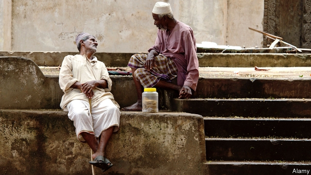

###### The word on the kona

# A new dictionary captures how Africans really talk about politics 

##### The most creative wordplay is reserved for the sharpest practices 

 

> Apr 4th 2019 

THERE ARE two ways to talk about politics. One describes the dry mechanics of government. The language of bills and ballots, cabinets and coalitions, is similar the world over. The other is inventive, diverse and bleakly humorous—the idiom of the street, or what in Tanzania they call the kona (corner). 

A new dictionary of African politics, published by Oxford University Press, tries to capture this richness. It describes people, institutions and events, and defines theoretical terms. More significant, the editors used social media to crowdsource the terminology of the kona, getting hundreds of responses. 

In Benin, for example, switching parties is called “transhumance”, a term that normally describes the migration of cattle-herders. In Ghana “skirt-and-blouse voting” means picking a president from one party and a member of parliament from another. The opposite is “three-piece-suit voting”, when Kenyans back the same side throughout. 

Some terms describe tactics to challenge bigwigs: for instance, toyi toyi, a dance used in South Africa to protest against apartheid. A quieter method is the ville morte, where people in French-speaking Africa shut down the city by staying at home. During elections in 2016 some Zambians escaped a walloping by wearing the green of the ruling party, even while secretly backing the opposition, which wears red. Opposition leaders called it a “watermelon campaign”. 

Corruption inspires a menu of euphemisms. Swahili-speakers might call a bribe mchuzi (sauce). In French-speaking Africa graft is bouffer (to gobble down); in parts of west Africa the verb is “chop”, from the pidgin for eat. This metaphor reached its apogee in 2014, during a governor’s race in Nigeria. One candidate promised “stomach infrastructure”, such as rice and chickens. He won. 

Why so much talk of corruption? Partly because it is a real problem; partly because Africans, like outsiders, stereotype the continent, says Sa’eed Husaini, a Nigerian, one of the dictionary’s editors. But then America, with its gerrymandering and pork-barrel spending, has a rich political vocabulary. Maybe it is just that the sharpest practices all over the world inspire the most creative wordplay. 

-- 

 单词注释:

1.kona['kәunә]:(=kona storm)[气]科纳风暴(夏威夷的一种风暴, 有南风或西南风以及大雨) 

2.politic['pɒlitik]:a. 精明的, 明智的, 策略的 

3.wordplay[ˈwɜ:dpleɪ]:n. 文字游戏, 俏皮话, 双关语 

4.Sharpe['ʃa:p]:n. 夏普指数；夏普指标；夏普（人名） 

5.APR[]:[计] 替换通路再试器 

6.ballot['bælәt]:n. 投票, 投票用纸, 抽签 vi. 投票, 抽签 vt. 投票选出, 拉选票 

7.coalition[.kәuә'liʃәn]:n. 结合体, 结合, 联合 [经] 联合, 联盟 

8.inventive[in'ventiv]:a. 善于创造的, 发明的 

9.bleakly[]:adv. 风吹雨打地；荒凉地；阴郁地 

10.Tanzania[.tænzә'ni:ә]:n. 坦桑尼亚 

11.Oxford['ɒksfәd]:n. 牛津, 牛津大学 

12.richness['ritʃnis]:n. 富裕, 丰富, 肥沃 

13.crowdsource[]:[网络] 众包；群众外包；群众外包的方式 

14.terminology[.tә:mi'nɒlәdʒi]:n. 术语, 术语学 [医] 名词学, 命名法 

15.Benin[be'nin]:贝宁湾(几内亚湾一部分,靠西非的尼日利亚、贝宁和多哥等国) 

16.transhumance[træns'hju:mәns]:n. 随季节性的变化把牲畜在山地和草地之间迁移 

17.migration[mai'greiʃәn]:n. 移民, 移往, 移动 [计] 迁移 

18.Ghana['gɑ:nә]:n. 加纳 

19.kenyan['kenjәn]:n. 肯尼亚人 

20.tactic['tæktik]:n. 一项战术, 一条策略 a. 战术的, 顺序的, 排列的 

21.toyi[]:[网络] 深圳市东仪电子有限公司；东仪；天基手机 

22.apartheid[ә'pɑ:theit]:n. 种族隔离 

23.ville[]:n. （法）城镇 

24.morte[]:[网络] 莫提；博阿莫特；飘浮的骷髅头 

25.Zambian['zæmbiәn]:n. 赞比亚人 a. 赞比亚(人)的 

26.secretly['si:kritli]:adv. 秘密地, 背地里 

27.opposition[.ɒpә'ziʃәn]:n. 反对, 敌对, 相反, 在野党 [医] 对生, 对向, 反抗, 反对症 

28.opposition[.ɒpә'ziʃәn]:n. 反对, 敌对, 相反, 在野党 [医] 对生, 对向, 反抗, 反对症 

29.corruption[kә'rʌpʃәn]:n. 腐败, 堕落, 贪污 [计] 论误 

30.euphemism['ju:fәmizm]:n. 委婉说法, 委婉语 

31.bribe[braib]:n. 贿赂 vt. 贿赂, 收买 vi. 行贿 

32.graft[grɑ:ft]:n. 嫁接, 贪污 v. 嫁接, 移植, 贪污 

33.gobble['gɒbl]:n. 火鸡叫声 vt. 狼吞虎咽 vi. 贪食, 咯咯叫 

34.pidgin['pidʒin]:n. 混杂语言, 混杂行话, 事务 

35.metaphor['metәfә]:n. 隐喻 

36.apogee['æpәudʒi:]:n. 远地点, 最高点, 极点 [化] 远地点; 远核点 

37.Nigeria[nai'dʒiriә]:n. 尼日利亚 

38.infrastructure['infrәstrʌktʃә]:n. 基础结构, 基础设施 [经] 基础设施 

39.outsider[' aut'saidә]:n. 外人, 局外人, 非会员, 外行, 门外汉, 比赛中获胜可能性不大的选手 [经] 外船公司 

40.stereotype['stiәriәtaip]:n. 铅版, 陈规, 老套 vt. 使用铅版, 把...印制成盲文, 套用老套, 使一成不变 

41.husaini[]:n. (Husaini)人名；(尼日利)侯赛尼 

42.Nigerian[nai'dʒiriәn]:n. 尼日利亚人 

43.gerrymander['dʒerimændә]:vt. 为政党利益改划选区 vi. 不公正地划分选区 n. 改变选举区 

