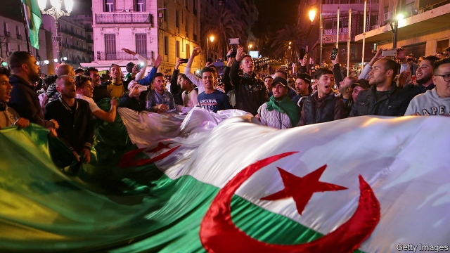
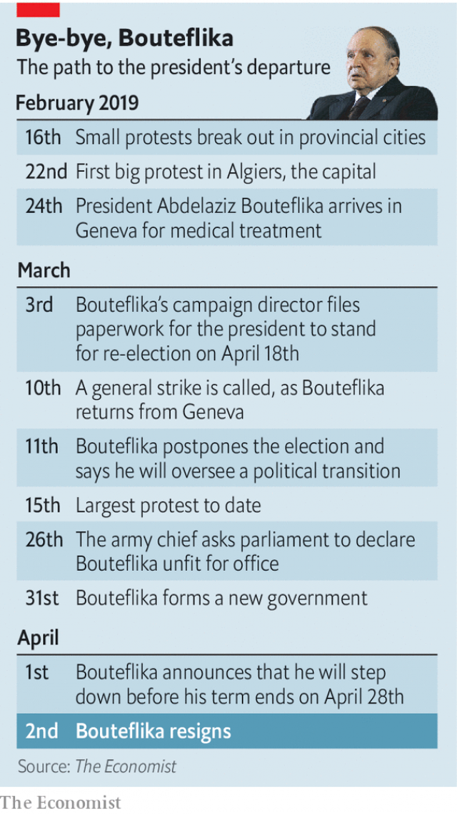

###### The mummy resigns

# Abdelaziz Bouteflika steps down after 20 years in charge of Algeria 

##### His regime, meanwhile, has fallen to in-fighting 

 

> Apr 4th 2019 

EVEN HIS critics found Abdelaziz Bouteflika’s last moments as president difficult to watch. After two decades in power, the Algerian leader stepped down on April 2nd. Slumped in a wheelchair, dressed in a baggy djellaba robe instead of his usual three-piece suit, he looked like a doddering old man roused from bed in the middle of the night. He struggled even to hand his letter of resignation to the head of the constitutional committee (a stroke in 2013 left him an invalid). Mr Bouteflika styled himself a partisan and a politician who fought for Algeria’s independence and led the country out of civil war. There was no glimpse of that man in his final public appearance as president, only a frail shell. 

Algerians flooded into the streets to celebrate a moment that was unthinkable two months earlier. Mr Bouteflika was tipped to win a fifth term as president, the only viable candidate in a stage-managed election. But in near-daily protests since February 16th, hundreds of thousands of Algerians demanded his resignation. Years of corruption and mismanagement had left the oil- and gas-rich country with a big deficit and an unemployment rate of around 12%. Mr Bouteflika’s subjects were unwilling to endure five more years under a president barely able to speak. 

Le pouvoir (the power), as the officers and oligarchs who really call the shots are known, stalled for time. In March Mr Bouteflika, or whoever drafted the letter for him, promised not to stand for re-election and to oversee a transitional period. Then he offered to quit before the end of his term on April 28th. None of this appeased the street. Nor did it pass muster with the army chief, Ahmed Gaid Salah, who asked the government to declare Mr Bouteflika unfit and remove him. In the end it was General Salah’s threats that drove the president out of power: though described as a resignation, it looks more like a sacking. 

Abdelkader Bensalah, the head of parliament’s upper house, becomes interim president and must organise elections within 90 days. Mr Bensalah, a Bouteflika loyalist, is familiar with the duties, for he often stepped in when the ailing president was too ill to welcome foreign dignitaries and suchlike. He backed the president’s plan to seek a fifth term and did not endorse the protests. His elevation may give succour to Mr Bouteflika’s allies—except that many of them seem to be in custody. 

It is hard to separate fact from rumour right now: Algeria’s politics are opaque and it lets in few foreign journalists. But there are credible reports that Said Bouteflika, the president’s powerful brother, is under house arrest. Ali Haddad, a construction magnate who grew rich off state contracts, was detained last month while trying to cross the Tunisian border, supposedly with a large sum of cash in his car. He served for years as the head of Algeria’s main business federation and was a Bouteflika ally. 

The regime is justifiably worried about capital flight. Within three months of the revolutions in Egypt and Libya in 2011, residents had withdrawn $8.6bn, says the Bank for International Settlements, a Basel-based financial institution. Many of Mr Bouteflika’s allies made a fortune through corrupt contracts and want to protect their gains. Ahmed Ouyahia, four times prime minister, was barred from leaving the country (allegedly while trying to drive his Mercedes onto a ferry bound for Spain). He denies reports that he sold his home in Hydra, a wealthy district of Algiers. The villa is rumoured to be worth some $4m, a princely sum on a civil servant’s salary. 

But the list of detainees looks rather like a purge orchestrated by General Salah. A former president, Liamine Zéroual—himself pushed out by the army in 1999—recently wove a tale of intrigue in a letter to an Algerian newspaper. He claimed that Mohamed Mediène, a retired spy chief who was the longtime éminence grise of Algerian politics, asked him to oversee a transitional period. Said Bouteflika reportedly blessed the scheme. If this story is true, or even if General Salah believed it to be, the army chief may have seen himself frozen out of Algeria’s future and therefore made a pre-emptive strike. 

After eight years of turmoil in the Arab world, it is tempting to search for parallels. Egyptians see a repeat of what happened to them in 2011. The army shunted Hosni Mubarak out of power, the opposition fractured, and the regime later returned with a vengeance. These are imperfect analogies. After the revolution Egypt’s politics became a negotiation between the army and the Muslim Brotherhood. There is certainly an Islamist current in Algerian politics, but there is no equivalent to the Brotherhood, a monolithic group with deep popular support and a vast network of cadres. 

 

What is clear, though, is that the demonstrators will not be satisfied with Mr Bouteflika’s departure. After he quit, the private Ennahar channel aired footage of a middle-aged man wading into a crowd of protesters to shout praise for General Salah. “The army of liberation…freed the people,” he said, likening it to when Algeria won independence from France. His audience was unmoved: “Down with the gang!” one man replied. From the start, the protesters have demanded the removal of not just the president, but the entire ruling clique. Activists are planning another rally for April 5th. 

But Algeria’s opposition is disorganised and leaderless; and, with an election now looming, it has precious little time to organise and field candidates. Last month activists announced an umbrella group called the National Co-ordination for Change and called for free elections, social justice and civilian control of the army. Some members of the group immediately disavowed the platform. Liberal-minded members are uncomfortable sharing a stage with Islamists. Thankfully for them, le pouvoir looks increasingly disorganised as well. The clans who wielded power during Mr Bouteflika’s long rule are now locked in a battle to survive. 

Intrigue and uncertainty do not detract from the enormity of what Algerians have achieved. In less than two months their peaceful, popular protests dislodged a president who ruled almost unopposed for two decades. And they note, darkly, that the Arab spring gave them guidance on how not to proceed. Whether they can chart a happier course remains to be seen. 

-- 

 单词注释:

1.mummy['mʌmi]:n. 木乃伊, 瘦而干瘪之人, 妈咪 [医] 干尸, 木乃伊; 普鲁士红 

2.abdelaziz[]:n. (Abdelaziz)人名；(阿拉伯)阿卜杜勒-阿齐兹 

3.bouteflika[]:[网络] 布特弗利卡；阿尔及利亚总统布特弗利卡；布特佛里卡 

4.Algeria[æl'dʒiәriә]:n. 阿尔及利亚 

5.regime[rei'ʒi:m]:n. 政权, 当权期间, 政体, 社会制度, 体制, 情态 [医] 制度, 生活制度 

6.APR[]:[计] 替换通路再试器 

7.Algerian[æl'dʒiәriәn]:a. 阿尔及利亚的 n. 阿尔及利亚人 

8.slump[slʌmp]:n. 暴跌, 垂头弯腰的姿态 vi. 猛然掉落, 陷入, 衰落(经济等) 

9.wheelchair['hwi:l.tʃєә]:n. 轮椅 

10.dodder['dɒdә]:vi. 摇摆, 蹒跚 n. 菟丝子 

11.constitutional[.kɒnsti'tju:ʃәnl]:a. 宪法的, 立宪的, 体质的 [医] 全身的; 体质的 

12.invalid[in'vælid]:n. 病人, 残废者 a. 有病的, 无效的 

13.partisan['pɑ:tizn]:n. 党羽, 虔诚信徒, 同党, 游击队员 a. 党派的, 偏袒的, 效忠的, 献身的, 盲目推崇的 

14.frail[freil]:a. 脆弱的, 虚弱的, 意志薄弱的 n. 少女, 少妇, 灯心草篓 

15.Algerian[æl'dʒiәriәn]:a. 阿尔及利亚的 n. 阿尔及利亚人 

16.unthinkable[.ʌn'θiŋkәbl]:a. 不能考虑的, 不能想像的, 想像不到的, 不合理的 

17.viable['vaiәbl]:a. 能养活的, 能生长发育的 [医] 有活力的, 有生机的 

18.corruption[kә'rʌpʃәn]:n. 腐败, 堕落, 贪污 [计] 论误 

19.mismanagement[]:n. 管理不善；处置失当 

20.deficit['defisit]:n. 赤字, 不足额 [医] 短缺 

21.LE[]:[计] 小于或等于 

22.oligarch['ɒligɑ:k]:n. 寡头政治执政者 

23.stall[stɒ:l]:n. 厩, 停车处, 牧师职位, 货摊, 托辞, 拖延 vt. 关入厩, 停顿, 推托, 支吾, 使陷于泥中 vi. 被关在厩内, 陷于泥中, 停止, 支吾 

24.oversee[.әuvә'si:]:vt. 向下看, 了望, 监督, 偷看到 [法] 监察, 监督, 俯瞰 

25.transitional[træn'siʒәnl]:a. 变迁的, 过渡期的 [医] 转变的, 过渡的; 过渡型单核白细胞 

26.appease[ә'pi:z]:vt. 抚慰, 缓解, 平息, 姑息 [法] 使和缓, 使满足, 姑息 

27.muster['mʌstә]:n. 召集, 集合, 检阅, 清单, 花名册, 样品 vt. 召集, 集合, 应召 vi. 集合, 集中 

28.ahmed[]:n. 艾哈迈德（男子名） 

29.gaid[]:[网络] 通信技术促进发展全球联盟；通信技术与发展联盟；发展联盟 

30.Salah[sә'lɑ:]:n. = salat [变体] 

31.Abdelkader[]:n. (Abdelkader)人名；(阿拉伯)阿朴杜勒-卡德尔；(1808-83)阿卜杜卡迪尔〈阿尔及〉军事家。 

32.interim['intәrim]:a. 暂时的, 临时的, 间歇的 n. 过渡时期 

33.loyalist['lɒiәlist]:n. 忠诚的人, 反对独立者, 反佛朗哥派的人 

34.ailing['eiliŋ]:a. 生病的 [医] 患病的, 病痛的 

35.dignitary['dignitәri]:n. 高贵的人, 高官, 高僧, 要人 

36.suchlike['sʌtʃlaik]:pron. 这一类的人 a. 那样的, 类似的, 同样的, 这样的, 那种的 

37.endorse[in'dɒ:s]:vt. 支持, 赞同, 背书于, 签署 [经] 赞成, 背书 

38.elevation[.eli'veiʃәn]:n. 海拔, 提高, 仰角 [计] 仰角 

39.succour['sʌkә]:n. 解救, 援助者 vt. 解救, 援助 

40.custody['kʌstәdi]:n. 监护, 拘留, 监禁 [经] 保管, 照顾, 保护 

41.politic['pɒlitik]:a. 精明的, 明智的, 策略的 

42.opaque[әu'peik]:n. 不透明物 a. 不透明的, 不传热的, 不传导的, 阴暗的 [计] 白底 

43.credible['kredәbl]:a. 可信的, 可靠的 [法] 可信的, 可靠的 

44.ALI[]:[计] 异步线路接口 

45.haddad[]:n. (Haddad)人名；(法、西)阿达；(塞、瑞典、阿拉伯、英)哈达德 

46.magnate['mægneit]:n. 大官, 巨头 [法] 大官, 权贵, 大资本家 

47.detain[di'tein]:vt. 扣留, 扣押, 耽搁 [法] 拘留, 扣押, 留住 

48.Tunisian[tju:'niziәn]:a. 突尼斯的, 突尼斯人的 n. 突尼斯人 

49.supposedly[sә'pәuzidli]:adv. 想象上, 看上去像, 被认为是, 恐怕, 按照推测 

50.federation[fedә'reiʃәn]:n. 联邦, 联合, 联盟 [法] 联邦, 联盟, 联邦政府 

51.ally['ælai. ә'lai]:n. 同盟者, 同盟国, 助手 vt. 使联盟, 使联合, 使有关系 vi. 结盟 

52.justifiably[dʒʌstɪ'faɪəblɪ]:adv. 无可非议地 

53.Egypt['i:dʒipt]:n. 埃及 

54.Libya['libiә]:n. 利比亚 

55.allegedly[ә'ledʒidli]:adv. 依其申述 

56.mercedes['mә:sidi:z]:n. 梅塞德斯（人名）；梅赛德斯（公司名） 

57.Spain[spein]:n. 西班牙 

58.hydra['haidrә]:n. 水螅, 九头蛇, 难以根除之祸害 

59.Algiers[æl'dʒiәrz]:n. 阿尔及尔 

60.villa['vilә]:n. 别墅 

61.princely['prinsli]:a. 王子的, 威严的, 王候般的, 豪华的, 奢侈的 

62.detainee[.di:tei'ni:]:n. 被拘留者, 被扣押者 [法] 被扣扣者, 被拘留者 

63.purge[pә:dʒ]:n. 净化, 清除, 泻药 v. (使)净化, 清除, (使)通便 [计] 服务器文件删除实用程序 

64.orchestrate['ɒ:kistreit]:v. 编管弦乐曲 

65.liamine[]:[网络] 利亚米纳 

66.intrigue[in'tri:g]:n. 阴谋, 复杂的事 vi. 密谋, 私通 vt. 激起...的兴趣, 用诡计取得 

67.Mohamed[]:n. (Mohamed)人名；(阿拉伯)穆罕默德； 

68.reportedly[ri'pɒ:tidli]:adv. 根据传说, 根据传闻, 据报道 

69.turmoil['tә:mɒil]:n. 骚动, 混乱 

70.shunt[ʃʌnt]:vt. 使转轨, 使分流, 回避讨论, 推延 vi. 转向一边, 转轨, 往返 n. 转轨, 分流 

71.Hosni[]:n. (Hosni)人名；(阿拉伯)胡斯尼 

72.Mubarak[]:n. 穆巴拉克（姓氏） 

73.opposition[.ɒpә'ziʃәn]:n. 反对, 敌对, 相反, 在野党 [医] 对生, 对向, 反抗, 反对症 

74.fracture['fræktʃә]:n. 破碎, 骨折 v. (使)破碎, (使)破裂 

75.vengeance['vendʒәns]:n. 复仇, 报仇 [法] 报仇, 复仇 

76.imperfect[im'pә:fikt]:a. 不完美的, 不完整的, 减弱的, 未完成过去时的 n. 未完成体 

77.analogy[ә'nælәdʒi]:n. 相似, 类似 [计] 模拟 

78.negotiation[ni.gәuʃi'eiʃәn]:n. 谈判, 磋商, 交涉 [经] 谈判, 协商 

79.Muslim['mjzlim; (?@) 'mʌzlem]:n. 伊斯兰教, 伊斯兰教教徒 

80.Islamist[iz'lɑ:mist]:n. 伊斯兰教主义者；回教教徒 

81.monolithic[.mɒnәu'liθik]:a. 独石的, 完全统一的, 整体的 [化] 整体(铸,烧结)的; 龟甲网衬里; 单片; 单块 

82.cadre['kædri.'kɑ:dә]:n. 框架, 干部 [经] 干部 

83.demonstrator['demәnstreitә]:n. 论证者, 证明者, 指示者, 示威者 [医] 示教者 

84.footage['futidʒ]:n. 英尺长度, 英板尺, (影片的)连续镜头 

85.wade[weid]:vi. 跋涉 vt. 涉水 n. 跋涉, 浅滩 

86.protester[]:n. 抗议者, 持异议者, 拒付者 [经] 反对者 

87.liken['laikәn]:vt. 比喻, 比拟 

88.clique[kli:k]:n. 派系, 集团 vi. 结党 [计] 集团型 

89.activist['æktivist]:n. 激进主义分子 

90.rally['ræli]:n. 重振旗鼓, 集合, 群众集会, 跌停回升 v. 重整旗鼓, 集合, 恢复精神, 团结, 挖苦, 嘲笑 

91.disorganise[]:vt. 瓦解, 打乱 

92.leaderless[]:a. 无领袖的, 无领导的 

93.loom[lu:m]:n. 织布机, 若隐若现的景象 vi. 朦胧地出现, 隐约可见, 可怕地出现 

94.disavow[.disә'vau]:vt. 否认, 否定, 拒绝对...承担责任 [法] 不承认, 抵赖, 拒绝对...承担责任 

95.Islamist[iz'lɑ:mist]:n. 伊斯兰教主义者；回教教徒 

96.thankfully['θæŋkfulli]:adv. 感激地；感谢地 

97.clan[klæn]:n. 氏族, 宗族, 集团 [医] 支 

98.wield[wi:ld]:vt. 挥舞, 运用 

99.intrigue[in'tri:g]:n. 阴谋, 复杂的事 vi. 密谋, 私通 vt. 激起...的兴趣, 用诡计取得 

100.uncertainty[.ʌn'sә:tnti]:n. 不确定, 不可靠, 不确定的事物 [化] 不确定度 

101.detract[di'trækt]:vi. 减去, 贬低 vt. 转移, 分散 

102.enormity[i'nɒ:miti]:n. 暴行, 极恶, 巨大 [法] 重罪, 大罪, 暴行 

103.les[lei]:abbr. 发射脱离系统（Launch Escape System） 

104.dislodge[dis'lɒdʒ]:vt. 逐出, 使移动, 驱逐 vi. 离开原位 

105.unopposed['ʌnә'pәuzd]:[法] 无反对的, 无对手的 

106.darkly['dɑ:kli]:adv. 暗, 黑, 呈黑 

