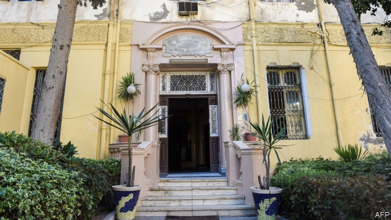

###### Old ties, new interest

# Decades after the Jews went into exile, some Arabs want them back 

##### Arab dictators seeking Western approval are not the only ones 

 

> Apr 4th 2019 

IT IS SIMPLY called “the villa”. Its white walls have no markings and an official permit is pending. For its founders, though, the low-key opening of the Arab world’s first new synagogue in generations signals the dawn of a Jewish revival. Standing near the beach-front in Dubai, the synagogue offers Hebrew classes and kosher catering and has just acquired a rabbi. “The promise of our community is the rekindling of a Judeo-Islamic tradition,” says Ross Kriel, president of the new Jewish Council of the Emirates. 

That may sound unduly hopeful in the Arab world, which uprooted its 800,000 Jews in the decades after the creation of Israel. But, surprisingly, Arab leaders from Morocco to Iraq are repeating the message. In February Egypt’s president, Abdel-Fattah al-Sisi, said he would build new synagogues if the country’s Jews returned. His government is restoring the Eliyahu Hanavi synagogue in Alexandria (pictured), once the Middle East’s largest. It is also cleaning up the vast Jewish cemetery, flooded with sewage, in southern Cairo. And for the second time under Mr Sisi, Egyptian television has scheduled a soap-opera about Jews to run during the Muslim fasting month of Ramadan. It tells of a soldier’s steamy affair with a Jewish woman. 

Others in the Gulf are following Dubai’s lead. “I feel more comfortable wearing a kippa in Bahrain than Berlin,” says Marc Schneier, an American rabbi working to “develop Jewish life” in five Gulf states. The Muslim World League, Saudi Arabia’s missionary arm and long a bullhorn of bigotry, marked Holocaust Day with a letter in Arabic condemning Holocaust denial. Muhammad al-Issa, its head, plans to lead a multi-faith delegation to Auschwitz. “Circumstances have changed,” he says. 

After decades of hate speech, cynics deride this volte face as a publicity stunt by Arab dictators seeking Western approval. But the Arab spring in 2011 swept away a host of taboos. People challenged long-standing state ideologies as never before. From Iraq to Libya, a swathe of politicians, film-makers and academics, from secular types to the Muslim Brotherhood, have been re-examining the past, including the post-1948 eviction of Jews. 

Released from the fear of the censors, the internet has enabled Muslims and Jews to leapfrog borders and passport controls. Virtual communities have grown online. “I talk to friends in Baghdad all night,” says an Iraqi Jew in London who left Baghdad in the 1960s. Last year a popular Arabic Facebook site ran a poll on whether to restore Iraqi citizenship and the right of return to Jews exiled 70 years ago. Over three-quarters of the 62,000 participants voted yes. 

Television, books and student campuses reflect this cultural shift. Arab documentaries search for Jewish diasporas that once lived in Arab lands. A new generation of Arab novelists elevates Jews from bit-players to centre-stage. “I wrote it to show that Jews are part of our culture,” says Amin Zaoui, the Algerian author of “The Last Jew of Tamentit”. The Arabic translation of Lucette Lagnado’s “The Man in the White Sharkskin Suit”, the memoir of an Egyptian Jew, has had multiple reprints. 

Hebrew departments in Arab universities, once the preserve of would-be spooks, have mushroomed. Today 13 Egyptian universities teach Hebrew, up from four in 2004. Some 3,000 Egyptian students will finish their Hebrew studies this year, double the number five years ago. Even Syria’s state news agency has a Hebrew website. 

For all this reappraisal, the Arab world today is a far cry from the early 1950s, when Egypt’s first president, Muhammad Naguib, went to synagogue on Yom Kippur and Muslims prayed next to Christians and Jews at the graveside of Moses Maimonides, a medieval rabbi, in Cairo. From Tlemcen in western Algeria to Qamishli in Syria’s north-eastern corner, ornate ancient synagogues rot away. “They’ll take everything when we die,” says one of the last Jews in Damascus. Under the guise of preserving Jewish heritage, some outfits backed by Arab governments plan to seize disused property. The old invective dies hard. “They don’t need a second homeland,” said a Salafist, after an Algerian minister suggested reopening the synagogues. 

Still, spikes in tension over Israel no longer spark anti-Jewish pogroms. Some Palestinian politicians still whip up anti-Jewish feeling, but many speak Hebrew and have greater awareness and understanding than before. A surprising number of researchers uncovering the Middle East’s Jewish past are Palestinian. Some even speak of a common fate with dispossessed Arab Jews. “We’re entering an age of post-colonialism,” says a Christian cleric from Cairo. “We’re again learning how to see richness in others, not threats.” 

-- 

 单词注释:

1.Jew[dʒu:]:n. 犹太人, 守财奴, 犹太教信徒 vt. 欺骗, 杀价 

2.exile['eksail]:n. 放逐, 流放, 被放逐者 vt. 放逐, 流放, 使背井离乡 

3.dictator['dikteitә]:n. 命令者, 独裁者 

4.APR[]:[计] 替换通路再试器 

5.villa['vilә]:n. 别墅 

6.marking['mɑ:kiŋ]:n. 印记, 印, 分 [计] 标志 

7.pending['pendiŋ]:a. 未决定的, 待决的, 行将发生的, 向外伸出的 prep. 在等待...之际, 直到...时为止, 在...期间, 在...过程中 

8.founder['faundә]:n. 创立者, 建立者 vt. 使沉没, 使摔倒, 弄跛, 浸水, 破坏 vi. 沉没, 摔到, 变跛, 倒塌, 失败 

9.synagogue['sinәgɒg]:n. 犹太人集会, 犹太教会堂, 犹太教 

10.revival[ri'vaivl]:n. 复兴, 复活, 恢复精神, 苏醒 [医] 复苏, 回生, 精神重振 

11.dubai['dju:bai]:n. 迪拜（阿拉伯联合酋长国的酋长国之一）；迪拜港（阿拉伯联合酋长国港市） 

12.Hebrew['hi:bru:]:n. 希伯来人, 希伯来语, 犹太人 a. 希伯来人的, 希伯来语的 

13.kosher['kәuʃә]:a. 合犹太人戒律的, 清净的, 合适的 

14.rabbi['ræbai]:n. 拉比(犹太教圣职人员), 大师(对犹太学者的尊称) [法] 犹太教的法学博士, 老师, 犹太教教士 

15.rekindle[.ri:'kindl]:vt. 再点火, 重新激起 vi. 重新燃烧 

16.ros[]:abbr. 只读存储器（Read-Only-Storage）；活性氧（Reactive oxygen species） 

17.kriel[]: [地名] [南非共和国] 克里尔 

18.emirate[e'miәrit]:n. 埃米尔的地位, 酋长国 

19.unduly[.ʌn'dju:li]:adv. 不适当地, 过度地 [法] 过分的, 过度的, 不正当的 

20.uproot[ʌp'ru:t]:vt. 连根拔起, 根除 

21.creation[kri:'eiʃәn]:n. 创造, 创作物, 发明 [化] 产生 

22.Israel['izreil]:n. 以色列, 以色列后裔, 犹太人 

23.Morocco[mә'rɒkәu]:n. 摩洛哥, 摩洛哥皮革 [机] 摩洛哥革 

24.Iraq[i'rɑ:k]:n. 伊拉克 

25.eliyahu[]:n. (Eliyahu)人名；(以)埃利亚胡 

26.alexandria[,æli^'zɑ:ndriә]:n. 亚历山大港（位于埃及）；亚历山大市（美国弗吉尼亚一城市）；亚历山大大帝 

27.cemetery['semitәri]:n. 墓地, 公墓 [法] 公墓, 墓地 

28.sewage['sju:idʒ]:n. 脏水, 污水 [医] 污水, 污物 

29.Cairo['kaiәrәu]:n. 开罗 

30.sisi[]:n. (Sisi)人名；(意)西西 abbr. 短增量敏感指数（short increment sensitivity index） 

31.Muslim['mjzlim; (?@) 'mʌzlem]:n. 伊斯兰教, 伊斯兰教教徒 

32.Ramadan[,ræmә'dɑ:n]:n. 斋戒月 

33.steamy['sti:mi]:a. 蒸汽的, 充满蒸汽的 

34.kippa[]: = yarmulke 

35.Bahrain[]:n. 巴林岛 

36.Berlin[bә:'lin]:n. 柏林, (软质)柏林毛线 

37.marc[mɑ:k]:n. 榨渣 [计] 机器可读目录; 机读目录 

38.schneier[]:[网络] 施奈尔 

39.saudi['sajdi]:a. 沙乌地阿拉伯（人或语）的 

40.missionary['miʃәnәri]:n. 传教士, 负有任务者, 工作人员 a. 传教的, 传教士的 

41.bullhorn['bjlhɔ:n]:n. 手提式电子扩音器 

42.bigotry['bigәtri]:n. 盲从, 偏见, 偏执的行为(或态度) 

43.holocaust['hɔlәkɔ:st]:n. 大屠杀, 大火灾, 毁灭, 大规模烧杀 

44.denial[di'naiәl]:n. 否认 [法] 否定, 否认, 拒绝接受 

45.muhammad[]:n. 穆罕默德 

46.Auschwitz['auʃ,vits]:n. 奥许维次（波兰城市名） n. (Auschwitz)人名；(德)奥施维茨 

47.cynic['sinik]:n. 犬儒学派的人, 玩世不恭的人, 愤世嫉俗者, 好挖苦人的人 a. 犬儒学派的 

48.deride[di'raid]:vt. 嘲弄, 嘲笑 

49.volte[vɔlt, vәjlt, vɔ:lt]:n. 回, 次 

50.publicity[pʌb'lisiti]:n. 名声, 宣传, 公开场合 [经] 宣传, 广告 

51.stunt[stʌnt]:n. 特技, 绝技, 花招, 噱头, 手腕, 发育不良 vt. 阻碍成长 vi. 表演特技 

52.taboo[tә'bu:]:n. 禁忌, 禁止接近, 禁止使用 a. 禁忌的, 忌讳的 vt. 禁忌, 忌讳, 禁止 

53.ideology[.aidi'ɒlәdʒi]:n. 思想体系, 意识形态, 观念学, 空论 [医] 观念学, 观念形态 

54.Libya['libiә]:n. 利比亚 

55.swathe[sweiθ]:vt. 绑, 裹, 包围 n. 带子, 绷带 

56.secular['sekjulә]:n. 修道院外的教士 a. 世俗的, 现世的, 长期的 

57.eviction[i'vikʃәn]:n. 逐出, 赶出 [法] 收回财产, 收回租地, 没收 

58.censor['sensә]:n. 检查员 vt. 检查, 审查, 删改 

59.Muslim['mjzlim; (?@) 'mʌzlem]:n. 伊斯兰教, 伊斯兰教教徒 

60.leapfrog['li:pfrɒg]:n. 跳背游戏, 竞相提高 vi. 跳背, 交替前进 vt. 跃过 

61.online[]:[计] 联机 

62.Baghdad['bægdæd]:n. 巴格达 

63.Iraqi[i'rɑ:ki]:n. 伊拉克人, 伊拉克阿拉伯语 a. 伊拉克的, 伊拉克人的 

64.Jew[dʒu:]:n. 犹太人, 守财奴, 犹太教信徒 vt. 欺骗, 杀价 

65.facebook[]:n. 脸谱网 

66.citizenship['sitizәnʃip]:n. 国籍, 市民权, 市民的身份 [法] 公民权, 公民资格, 公民身分 

67.participant[pɑ:'tisipәnt]:n. 参加者, 参与者 a. 有份的, 参加的, 参与的 

68.cultural['kʌltʃәrәl]:a. 文化的, 教养的, 修养的 [医] 培养的 

69.documentary[.dɒkju'mentәri]:n. 记录片 a. 文件的 

70.Diaspora[dai'æspәrә]:n. 犹太人的离散, 离散的犹太人 

71.elevate['eliveit]:vt. 举起, 提拔, 鼓舞 

72.amin[]:n. 阿敏（七十年代乌乾达的独裁者） 

73.Algerian[æl'dʒiәriәn]:a. 阿尔及利亚的 n. 阿尔及利亚人 

74.Tamentit[]:[地名] 塔曼提特 ( 阿尔及 ) 

75.lucette[]:n. (Lucette)人名；(法)吕塞特；(英)卢塞特 

76.sharkskin['ʃɑ:kskin]:n. 鲨鱼皮, 鲨皮革 [医] 鲨皮样皮肤 

77.memoir['memwɑ:]:n. 传记, 实录, 追思录, 回忆录, 自传 [化] 研究报告 

78.reprint['ri:print]:n. 再版, 翻版, 重印 vt. 再版, 翻版 

79.spook[spu:k]:n. 幽灵, 鬼 vt. 惊吓, 鬼怪般地出没 vi. 惊吓而逃窜, 受惊 

80.reappraisal[.ri:ә'preizl]:n. 重新估计, 重新评价 [经] 重新估价 

81.naguib[]:[网络] 纳吉布；纳布吉 

82.yom[jәum, jɔm]:n. <犹太>日子 

83.kippur[]: [电影]赎罪日 

84.graveside['^reivsaid]:n. 坟墓边 

85.Moses['mәuziz]:n. 摩西, 领导者, 立法者 

86.Maimonides[mai'mɔnidi:z]:n. 迈蒙尼德（出生于西班牙的犹太哲学家、科学家及神学家） 

87.medieval[.medi'i:vl]:a. 中古的, 中世纪的 

88.Tlemcen[tlem'sen]:n. 特莱姆森（阿尔及利亚西北部城市） 

89.Algeria[æl'dʒiәriә]:n. 阿尔及利亚 

90.ornate[ɒ:'neit]:a. 装饰的, 华丽的 

91.Damascus[dә'mæskәs]:n. 大马士革 

92.guise[gaiz]:n. 相似, 外观, 伪装 v. 穿戴, 伪装 

93.heritage['heritidʒ]:n. 遗产, 祖先遗留物, 继承物 [医] 遗传性 

94.outfit['autfit]:n. 用具, 配备, 机构 vt. 配备, 供应 vi. 得到装备 

95.disused[]:a. 不用, 废弃 

96.invective[in'vektiv]:n. 恶言漫骂, 臭骂 a. 漫骂的, 非难的, 恶言的 

97.salafist[]:n. 萨拉菲斯特（地名） 

98.reopen[.ri:'әupәn]:v. 重开, 再开始, 再开 

99.spike[spaik]:n. 长钉, 鞋钉, 钉状物, 尖峰状物, 穗 vt. 以大钉钉牢, 用尖物刺穿, 阻止, 弃置不用 [计] 尖峰信号 

100.pogrom['pɒgrәm]:n. 集体迫害, 大屠杀 vt. 集体迫害, 大屠杀 

101.Palestinian[,pælis'tiniәn]:[经] 巴勒斯坦的 

102.awareness[ә'weәnis]:n. 意识, 认识 [计] 识别, 议定, 明白 

103.dispossess[.dispә'zes]:vt. 剥夺, 使失去, 逐出 [法] 抢夺, 霸占, 剥夺 

104.cleric['klerik]:a. 牧师的, 教士的 

105.richness['ritʃnis]:n. 富裕, 丰富, 肥沃 

