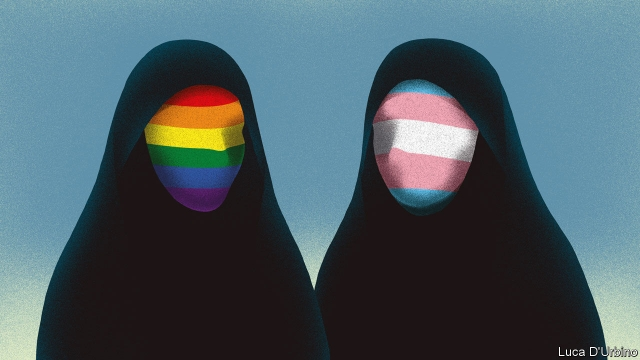

###### Pressure from above

# Why Iran is a hub for sex-reassignment surgery 

##### It is not because the regime is liberal 

 

> Apr 4th 2019 

“I REALISED QUITE early on that I was gay,” says Soly, a 25-year-old chef from Tehran. As a young boy, he would strut about the house in his mother’s high heels and developed crushes on male cartoon characters. But after he was expelled from school for wearing eye-liner, his parents took him to a psychologist who offered a different explanation. “He told me I was transgender and had to change my sex.” 

Attitudes towards sexuality can be rigid in Iran. A conservative former president, Mahmoud Ahmadinejad, once declared that the country didn’t have any gay people. So it seems an unlikely hub for sex-reassignment surgery. But the procedure has been permitted since the mid-1980s, when Ayatollah Ruhollah Khomeini met a trans woman called Maryam Khatoon Molkara, who had been thrown into a psychiatric institution and forcibly injected with male hormones. Moved by her story, he issued a fatwa allowing the procedure, which a cleric later compared to changing wheat into bread. Today the government even helps with the cost. 

But the regime’s encouragement of sex-change surgery is related to its intolerance of homosexuality, which is a capital offence. Gay Iranians face pressure to change their sex regardless of whether they want to, say activists and psychologists in Iran. Therapists tell patients with same-sex desires that they may be transgender, not gay. “I thought I was trans until I was 18, because the only information online and in newspapers was about transsexuals,” says a psychologist in Tehran who is a lesbian. “It is a system where homosexuals are not educated and the law does not protect them.” 

Before going under the knife, patients must receive counselling to ensure that they have gender dysphoria and are prepared for the procedure. But often this process is rushed and standards are not properly observed. Shahryar Cohanzad, a urologist who performs the operation, received 75 referrals in 2017, but only operated on 12 people, having concluded that 63 were gay or confused due to a lack of information. Questions have also been raised about the quality of the procedure in Iran: the United Nations has detailed grisly stories of botched operations. 

Even though the clerics allow it, those who transition say there is still a stigma associated with being transgender in Iran. Some tell of being disowned by their families and having to work as prostitutes, for lack of other choices. “For almost four years after my transition no theatre director hired me,” says Saman Arastoo, a well-known transgender actor and director. Soly’s father, by contrast, threatened to kill him after he refused to transition, so he fled to Canada, where he enjoys his new freedom. Sometimes he even walks to work in high heels. 

-- 

 单词注释:

1.Iran[i'rɑ:n]:n. 伊朗 

2.hub[hʌb]:n. 毂, 木片, 中心 [计] 插座; 插孔; 集线器, 集中器, 连接器, 中继站 

3.regime[rei'ʒi:m]:n. 政权, 当权期间, 政体, 社会制度, 体制, 情态 [医] 制度, 生活制度 

4.APR[]:[计] 替换通路再试器 

5.soly['səʊlɪ]: [医][=solubility]可溶性, 溶解度, 溶解性 

6.tehran[teә'ræn,-'rɑ:n]:n. 德黑兰 

7.strut[strʌt]:n. 高视阔步, 支柱, 压杆 vi. 趾高气扬地走, 肿胀 vt. 用支柱支撑, 炫耀 

8.psychologist[sai'kɒlәdʒist]:n. 心理学家 [医] 心理学家 

9.transgender[trænzˈdʒendə(r)]:n. 变性人 

10.sexuality[.sekʃu'æliti]:n. 性征, 性行为, 性欲 [医] 性别, 性欲 

11.Mahmoud[]:穆罕默德（伊斯兰男名） 

12.ahmadinejad[]:n. 爱哈卖迪内甲德 

13.ayatollah[,aɪə'tɒlə]:n. 阿亚图拉（对伊朗等国伊斯兰教什叶派领袖的尊称） 

14.ruhollah[]:[网络] 鲁霍拉 

15.Khomeini[]:霍梅尼（人名） 

16.Tran[]:n. (Tran)人名；(柬)德兰 

17.maryam[]:n. (Maryam)人名；(阿塞、哈萨、吉尔、塔吉、土库、乌兹、伊朗)马里亚姆, 玛丽亚姆(女名) 

18.psychiatric[saiki'ætrik; (?@) si-]:a. 精神病学的, 医精神病的 [医] 精神病学的 

19.forcibly['fɒ:sәbli]:adv. 强制地, 用力地 

20.inject[in'dʒekt]:vt. 注射, 注入, 使入轨 [医] 注射 

21.hormone['hɒ:mәun]:n. 荷尔蒙 [化] 激素(旧称荷尔蒙) 

22.fatwa['fætwɑ:]:n. (伊斯兰教)法学家的裁决 

23.cleric['klerik]:a. 牧师的, 教士的 

24.intolerance[in'tɒlәrәns]:n. 不宽容, 偏狭, 不容许相反的言论 [医] 不耐[性] 

25.homosexuality[-'æliti]:n. 同性恋 [医] 同性性欲, 同性恋爱 

26.Iranian[i'reiniәn]:a. 伊朗的, 伊朗语系的 n. 伊朗人, 伊朗语 

27.activist['æktivist]:n. 激进主义分子 

28.therapist['θerәpist]:n. 治疗学家 [医] 治疗学家 

29.online[]:[计] 联机 

30.transsexual[træn'sekjuәl]:n. 换性者 

31.lesbian['lezbiәn]:a. 女同性恋的 n. 女同性恋者 

32.homosexual[.hɒmәu'sekjuәl]:a. 同性恋的 n. 同性恋者 

33.counsel['kaunsәl]:n. 商议, 忠告, 法律顾问 v. 商议, 劝告 

34.gender['dʒendә]:n. 性 vt. 产生 

35.dysphoria[dis'fɔ:riә]:n. 烦躁不安 [医] 烦燥不安, 焦虑 

36.Shahryar[]:[网络] 亚尔；夏理亚国王；沙赫瑞亚尔 

37.urologist[juә'rɒlәdʒist]:n. 泌尿科医师 [医] 泌尿科学家, 泌尿科医师 

38.referral[ri'fә:rәl]:n. 参照, 介绍, 被介绍人, 转诊病人 

39.grisly['grizli]:a. 可怕的, 厉害的, 令人畏惧的 

40.botch[bɒtʃ]:v. 拙笨地修补, 糟蹋 n. 拙笨的修补, 难看的补缀 

41.transition[træn'ziʃәn]:n. 转变, 转换, 变迁, 过渡时期, 临时转调 [化] 跃迁 

42.stigma['stigmә]:n. 耻辱, 污名, 烙印 [医] 柱头; 小孔, 眼点; 气孔; 小斑; 特征 

43.disown[dis'әun]:vt. 否认 [计] 不认, 驱逐 

44.prostitute['prɒstitju:t]:n. 妓女, 男娼 vt. 使沦为妓女 a. 卖淫的, 堕落的 

45.saman[]:n. 萨满 

