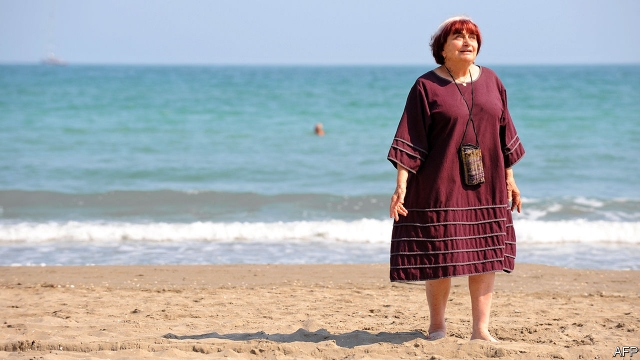

###### I am a camera

# Obituary: Agnès Varda died on March 29th 

##### The film-maker who never lost her sense of wonder was 90 

 

> Apr 4th 2019 

BECAUSE SHE liked recycling, in 2003 Agnès Varda built herself a shack. It was made of 35mm prints of “The Creatures”, her biggest flop, one of the very few in which she had cast a star, Catherine Deneuve. But when she sat inside this new construction the sunlight entered in the most beautiful ways, glowing through the images, so that she inhabited cinema. 

And she did inhabit it, not as a great feted director but as someone joyfully on the margins, a stout elf doing her own little thing in shapeless, often purple, clothes and with pudding-bowl two-tone hair; someone who couldn’t help making films, because the urge to look and listen never let go. In a car she would naturally hold her hand to the windscreen to frame the views and the passing cars. Behind a camera she would dart about as an eye would behave, resting for a while on a man reading a newspaper, then getting distracted by a bicycle, a picture on a wall, a child shouting. She had started as a photographer and went on taking stills all her life, but her eye was restless. The smaller cameras became, from 35mm to 16mm to hand-held digital, weaving up and down with her, the happier she was. She called her craft cinécriture, cine-writing, and hoped to be as radical in it as Joyce or Faulkner were in literature. 

For this some people called her the grandmother (or godmother) of French nouvelle vague, the embrace of realism and social consciousness, and thought her film “La Pointe Courte” of 1955, which she shot in her home town of Sète using mostly local fishermen, marked the start of it. But she began as a crazy innocent who had seen perhaps five films. She didn’t consort with François Truffaut or the others just as she didn’t mix with Hollywood later, despite an Oscar for lifetime achievement. Instead, since her films mostly made no money and she didn’t care, she sold DVDs of them to passers-by from an improvised place beside her ramshackle pink atelier in rue Daguerre in Paris. Just like the neighbour-shopkeepers in her first documentary, “Daguerréotypes”—the perfumier gently filling bottles of violet-water, the butcher wrapping meat, the baker stretching dough—she offered her produce where it was made. 

Documentaries pleased her as a schooling in modesty, just placing the camera to observe, not hovering like an eagle or overlaying ideas of her own. Another, “The Gleaners”, recorded the lives of the poor or frugal who picked up wasted food from thrown-out pallets or the ground, her hand-held camera bending with them to see what they found, rejoicing especially in a potato shaped like a heart. People often told her they had nothing to say, but she drew words out of them, gleaning herself. In “Faces, Places” in 2017 she travelled round rural France with JR, a maker of giant photographs, delighting to persuade shy overlooked folk to have their portraits posted briefly but grandly on walls and water-towers. 

Dignifying people, by recording part of the million tiny impulses and observations that made up their lives, was also something she did in her fiction films. In these she sometimes followed one actress, surrounded by non-actors, through a not-so-normal day: walking with Cléo, a singer with two hours to wait for a possible cancer diagnosis, through the streets of Paris in “Cléo from 5 to 7”, placing her fear of death against the beauty of ordinary life; or trudging in “The Vagabond” over tracks and frozen fields with a young woman, Mona, who had decided to abandon her job for the freedom of the open road, though it also meant derision and hunger and sordid trysts in her tent. Each time the camera was discreet and, when it was kinder to do so, gazed elsewhere. 

Social messages ran all through these films, but only one about America’s Black Panthers, and a collation of 4,000 black-and-white stills of the revolution she took in Cuba in 1963, proclaimed her left-wing convictions. Feminism was another matter. She was born a feminist, changing her name to sober Agnès from silly, giggly Arlette, signing a manifesto to legalise abortion in France and making films in which the patriarchy smothered even supper-table conversation. “Le Bonheur”, the tale of a handsome carpenter casually two-timing his wife, showed how women could be interchangeable to men; “Lions Love” told the story of a woman director pestered by studio executives; “One Sings, the Other Doesn’t” explored the growth of a friendship between two girls, one needing an abortion, one helping to pay. She filmed Jane Birkin’s ogled body and the imprisoned caryatids of Paris. Her husband, Jacques Demy, maker of “The Umbrellas of Cherbourg”, was an exception, a treasure, for whom she made a trilogy of films after his death. They began with the small Jacques creating a camera out of cardboard to frame a scene and focus on things, just like her. 

Her own girlhood was spent on a moored boat at Sète, catching sticklebacks from the quay and playing on the sands of the Grande Plage. If, as she believed, people were full of landscapes, then she was full of beaches, and waves played in her all the time. In “The Beaches of Agnès”, made in 2008, she wandered on various shores with acrobats and friends. In three stills she summed it up: quiet, foam, sand. On her 90th birthday, she swam in the sea. 

By this time she had turned many film prints into miniature glowing shacks, and one into a little boat. Like the sea, they showed how ephemeral everything was that her eye saw and the camera recorded. All those memories and realisations that made up her life would fade away unless she kept voyaging through new landscapes, meeting new people, looking and listening and constantly rebuilding the world out of sheer curiosity. 

  

-- 

 单词注释:

1.varda[]:[网络] 瓦尔达；瓦尔妲；玫瑰 

2.APR[]:[计] 替换通路再试器 

3.recycling[]:[电] 再循环 

4.shack[ʃæk]:n. 陋屋, 棚屋 vi. 居住, 暂住 

5.flop[flɒp]:n. 砰然落下, 拍击声, 失败 vi. 笨重地摔, 猛落 vt. 笨拙地抛下 adv. 噗通 

6.catherine['kæθәrin]:n. 轮圈外缘装有倒钩的车轮, 侧翻筋斗, 轮转烟火, 车轮窗 

7.deneuve[]: [人名] 德纳夫 

8.fete[feit]:n. 庆祝, 祭祀, 节日 vt. 宴请, 招待 

9.joyfully[]:adv. 高兴地, 喜悦地 

10.ELF[elf]:n. 小精灵, 矮人, 淘气鬼 [电] 超低频的简写 

11.shapeless['ʃeiplis]:a. 无形状的, 不定形的, 破相的, 不象样的, 不匀称的 

12.windscreen['windskri:n]:n. 汽车的挡风玻璃 

13.dart[dɑ:t]:n. 飞镖, 投射 vt. 投射 vi. 疾走, 突进 

14.distract[dis'trækt]:vt. 转移, 分心, 使发狂 

15.joyce[dʒɔis]:n. 乔伊斯（女名） 

16.faulkner['fɔ:knә]:n. 福克纳（美国小说家, 曾获1949年诺贝尔文学奖） 

17.godmother['gɒdmʌðә]:n. 教母, 女监护人 

18.nouvelle[nu:'vel]:n. 中篇小说 

19.realism['riәlizm]:n. 写实主义, 现实, 实在论 [法] 现实主义 

20.La[lɔ:, lɑ:]:[医] 镧(57号元素) 

21.pointe[pwænt]:[法](芭蕾舞)足尖站立的姿式 

22.courte[]:短的；短促的, 简短的；不够的；简易的, 简便的 短短地, 简短地 tout ～ 仅此而已, 干脆地；de ～ 临时地 

23.Sète[]:[地名] 塞特 ( 法 ) 

24.consort['kɒnsɒ:t]:n. 配偶, 夫妻 vi. 陪伴, 结交, 符合 vt. 使结合 

25.Truffaut[]:[网络] 特吕弗；杜鲁福；楚浮 

26.Hollywood['hɔliwud]:n. 好莱坞, 美国电影界, 美国电影工业, 美国式电影 

27.Oscar['ɔskә]:n. 奥斯卡金像奖, 钱, 现金 

28.improvise['imprәvaiz]:vt. 即席创作, 临时做 

29.ramshackle['ræmʃækl]:a. 象要倒的, 摇晃的, 放荡的 

30.atelier['ætәliei]:n. 工作室, 画室 

31.rue[ru:]:n. 懊悔, 后悔, 芸香 v. 后悔, 悲伤, 懊悔 

32.Daguerre[dә'^er]:达盖尔(①姓氏 ②Louis Jacques Mande, 1789-1851, 法国画家, 达盖儿银版摄影法的发明者) 

33.documentary[.dɒkju'mentәri]:n. 记录片 a. 文件的 

34.perfumier[]:adj. perfume的变形 

35.baker['beikә]:n. 面包师 [医] 烤箱(骨科用) 

36.modesty['mɒdisti]:n. 谦逊, 质朴, 羞怯 

37.hover['hʌvә]:vi. 盘旋, 翱翔, 徘徊 vt. 孵 n. 翱翔 

38.overlay[.әuvә'lei]:n. 覆盖, 覆盖图, 使负担过重 overlie的过去式 [计] 覆盖, 覆盖图 

39.gleaner[]:n. 拾落穗的人, 搜集者 

40.frugal['fru:gәl]:a. 节俭的, 朴素的 

41.pallet['pælit]:n. 草铺, 简陋小床, 调色板, 棘爪 [经] 夹板 

42.glean[gli:n]:v. 拾落穗, 收集 

43.jr[]:abbr. 初级, 小 Junior 

44.maker['meikә]:n. 制造者, 上帝 [经] 制造者, 出票人 

45.briefly['brifli]:adv. 简短地, 扼要地, 简明地, 简单地 

46.grandly['grændli]:adv. 宏伟地, 盛大地 

47.dignify['dignifai]:vt. 增威严, 使高贵, 故作显贵 

48.impulse['impʌls]:n. 冲动, 驱使, 刺激, 推动, 冲力, 建议, 脉冲 vt. 推动 

49.diagnosis[.daiәg'nәusis]:n. 诊断 [计] 诊断 

50.trudge[trʌdʒ]:n. 沉重的步伐, 长途跋涉 vi. 步履艰难地走, 蹒跚地走 vt. 跋涉 

51.vagabond['vægәbɒnd]:n. 流浪者, 浪子, 流氓 vi. 到处流浪 a. 流浪的, 漂泊的, 浪荡的, 流浪者的 

52.mona['mәjnә,'mɔ:nɑ:]:n. [动]白腹长尾猴；莫娜（女子名） 

53.derision[di'riʒәn]:n. 嘲笑 

54.sordid['sɒ:did]:a. 肮脏的, 贪婪的, 卑鄙的, 恶劣的, 暗淡的 [医] 污色的 

55.tryst[trist]:n. 约会, 幽会 v. 约会 

56.discreet[dis'kri:t]:a. 小心的, 慎重的 

57.panther['pænθә]:n. 豹, 黑豹, 美洲豹 

58.collation[kɔ'leiʃәn]:n. 核对, 小吃, 斋日的点心, 茶点, 零食, (牧师职位的)委任 [计] 整理 

59.Cuba['kju:bә]:n. 古巴 

60.conviction[kәn'vikʃәn]:n. 定罪, 信服, 坚信 [法] 定罪, 证明有罪, 判罪 

61.feminism['feminizm]:n. 女权主义, 男女平等主义 [医] 男子女性 

62.feminist['feminist]:n. 男女平等主义者 

63.giggly['^i^li]:a. 傻笑的, 吃吃笑的 

64.arlette[]:n. (Arlette)人名；(法、葡)阿莱特 

65.manifesto[.mæni'festәu]:n. 宣言, 声明 

66.legalise['li:^әlaiz]:vt. 使合法化, 使成为法定, 法律上认可 

67.patriarchy['peitriɑ:ki]:n. 家长统治, 父权制, 男性政体 [法] 家长制, 父权制, 父系社会 

68.smother['smʌðә]:vt. 使喘不过气, 使窒息, 闷熄, 忍住, 抑制, 覆盖 vi. 窒息, 被抑制 n. 浓烟, 窒息状态, 杂乱无章 

69.LE[]:[计] 小于或等于 

70.bonheur[]:[网络] 幸福时光；左拉；博纳尔 

71.casually['kæʒjuәli]:adv. 偶然地, 临时地, 随便地 

72.interchangeable[.intә'tʃeindʒәbl]:a. 可互换的 [化] 可互换的 

73.pester['pestә]:vt. 不断打扰, 纠缠 

74.jane[dʒein]:n. 简（女子名） 

75.ogle['әugl]:n. 眉目传情 vt. 挑逗地注视 vi. 做媚眼 

76.caryatid[.kæri'ætid]:n. 女像柱 

77.jacque[]:n. (Jacque)人名；(法、西)雅克 

78.demy[di'mai]:n. 一种印刷用纸, 拿津贴的学生 

79.Cherbourg['ʃeәbjә^]:n. 瑟堡 

80.trilogy['trilәdʒi]:n. 三部剧, 三部曲 [医] 三联, 三联症 

81.cardboard['kɑ:dbɒ:d]:n. 薄纸板 [化] 咭纸; 特等纸板; 卡纸板; 卡片纸板 

82.girlhood['gә:lhud]:n. 少女时代, 少女们 

83.moor[muә]:n.荒野；旷野 Moor: 摩尔人. v.系住；停泊 

84.stickleback['stiklbæk]:n. 刺鱼 

85.quay[ki:]:n. 码头, 驳岸 [经] 贴岸码头 

86.grande[^rɑ:nd]:a. 重大的, 显要的 

87.plage[plɑ:ʒ]:n. 海滨, 谱斑 

88.landscape['lændskeip]:n. 风景, 山水, 风景画 vi. 从事景观美化 vt. 美化...景观 [计] 横向 

89.acrobat['ækrәbæt]:n. 表演特技者, 杂技演员 

90.foam[fәum]:n. 泡沫, 水沫, 泡沫材料 vi. 起泡沫, 吐白沫 vt. 使起泡沫 

91.miniature['miniәtʃә]:n. 缩图, 小画像 a. 小规模的, 纤小的 

92.ephemeral[i'femәrәl]:a. 朝生暮死的, 短命的, 短暂的 [医] 暂时的 

93.realisation[.riәlai'zeiʃәn. ri:-. -li'z-]:n. 实现, 完成（等于realization） 

94.constantly['kɒnstәntli]:adv. 不变地, 不断地, 时常地 

95.sheer[ʃiә]:a. 绝对的, 全然的, 纯粹的, 透明的, 峻峭的 vi. 偏转, 偏航 vt. 使急转向, 使偏航 adv. 完全, 全然, 峻峭 n. 偏航 

