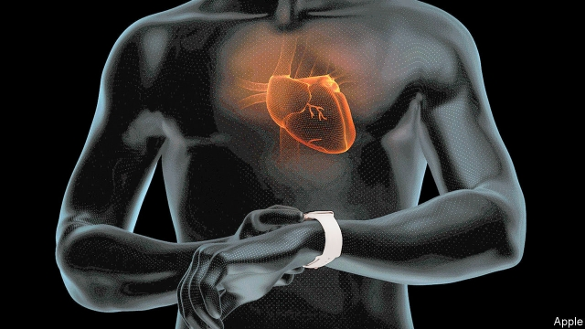

###### E-hearts

# Can wearing your heart (monitor) on your sleeve save your life? 

##### Doctors grapple with Apple Watch’s latest addition 

 

> Apr 4th 2019 

ON THE MORNING of March 28th, the owners of newish Apple Watches in 19 countries woke up to find their timepiece was now a medical device. Two new features arrived. One monitors the wearer for an irregular pulse. The other allows a brief but detailed electronic portrait, or ECG, to be captured and inspected for signs of a common heart arrhythmia called “atrial fibrillation”, or AFib. 

Americans have had these options since December, but their global expansion puts the technology squarely within the purview of public-health systems, which typically think carefully about how to screen for health conditions. The watch is also spurring debate about how doctors should handle the AFib that it and other consumer devices, such as AliveCor, detect. 

AFib is the most common cardiac arrhythmia and occurs when the heart’s upper chambers do not beat in a co-ordinated fashion. Blood can pool in parts of the chambers and form clots. Patients with AFib are five times more likely to have a stroke. They can be treated successfully with blood-thinners, but these carry risks, primarily excessive bleeding. AFib is thought to occur in 2% of the population. However, as the risk of suffering from it increases greatly with age, it will be rare in Apple Watch owners, who are younger, richer and healthier. 

Jonathan Mant, a professor of primary-care research at the University of Cambridge, runs a study of the over-65s that is hoping to discover if AFib screening can prevent stroke and other problems, such as heart attacks or even dementia. Dr Mant says AFib, picked up clinically, is important and worth treating, but that may not be true of the cases found by the watch. “We really have no idea what that would mean,” he says. 

Some public-health scientists have warned that AFib screening leads to many false positives and negatives, and these problems could be made worse by consumer technologies. Carl Heneghan, a professor of evidence-based medicine at the University of Oxford, says these new technologies bypass the usual governance systems that ensure new screening programmes do not create harm. He also worries that false positives will generate a huge amount of pointless work. 

The recent “Apple Heart Study”, covering 420,000 patients, looked at the predictive value of the device’s monitoring for irregular pulses. It found that the watch only agrees with a gold-standard method 84% of the time. The feature is intended to prompt wearers to use the ECG app, which is designed to deliver a diagnosis. A study conducted by a research organisation contracted by Apple found the app’s algorithm was able to correctly identify 98.3% of true positives and 99.6% of true negatives. 

Yet neither trial included randomised controls, which would offer the kind of information doctors want. This is now planned among the over-65s. There is also an urgent need to understand how common intermittent AFib is, and its consequences. This is something the watch might help with, by providing reams of data that are otherwise difficult to come by. 

Matt Kearney, the National Clinical Director for Cardiovascular Disease Prevention for Britain’s National Health Service, admits there are challenges with the watch and the rise of consumer-health technologies more generally. But he says the device will uncover cases of AFib that need treatment, and in younger people who have no other symptoms it will be an “opportunity for people to be advised about their risks”. 

Health professionals will need to embrace new technologies, if only because they are inevitable, Dr Kearney adds. And health systems will need to adapt to the torrent of data. As for the broader impact of the Apple Watch, Dr Mant concludes it is “paradigm-shifting. I just don’t know if it is going to be in a good way or a bad way.” 

-- 

 单词注释:

1.grapple[græpl]:v. 抓住, 掌握 n. 抓住, 系紧, 掌握, 与...扭打 

2.APR[]:[计] 替换通路再试器 

3.newish['nju:iʃ]:a. 尚新的 

4.timepiece['taimpi:s]:n. 时钟, 钟 

5.wearer['wєәrә]:n. 穿用者 

6.ECG[]:心电图 [医] 心[动]电[流]图 

7.arrhythmia[ә'riðmiә]:n. 心律不齐 [医] 心律失常, 心律不齐, 无节律 

8.atrial[]:a. 门廊, 心房 [医] 房的, 前房的 

9.fibrillation[,faibri'leiʃәn]:n. 纤维性颤动 [医] 纤维性颤动, 原纤维形成 

10.afib[]:[网络] 心房颤动；心房颤动狂烈；心律紊乱心房颤动狂烈 

11.squarely['skwєәli]:adv. 干脆地, 正好, 直角地 

12.purview['pә:vju:]:n. 范围, 权限, 视界 [法] 权限, 职权范围, 范围 

13.typically['tipikәli]:adv. 代表性地；作为特色地 

14.carefully['kєәfuli]:adv. 小心地, 谨慎地 

15.cardiac['kɑ:diæk]:n. 心脏病患者, 强心剂, 健胃药 a. 心脏的, (胃的)贲门的 

16.clot[klɒt]:n. 凝块, 一团 v. (使)凝结, (使)聚集 

17.bleeding['bli:diŋ]:n. 出血, 流血 [化] 渗色 

18.jonathan['dʒɔnәθәn]:n. 乔纳森（男子名） 

19.mant[]: [人名] 曼特 

20.Cambridge['keimbridʒ]:n. 剑桥 

21.dementia[di'menʃiә]:n. 痴呆 [医] 痴呆 

22.clinically[]:adv. 临床, 临诊, 冷静, 不偏不倚, 分析 

23.Carl[kɑ:l]:n. 卡尔（男名） 

24.heneghan[]: [人名] [爱尔兰姓氏] 赫尼根盖尔语姓氏的英语形式，来源于人名，含义是不详 

25.Oxford['ɒksfәd]:n. 牛津, 牛津大学 

26.bypass['baipɑ:s]:n. 旁路 vt. 省略, 绕过, 忽视, 回避 

27.governance['gʌvәnәns]:n. 统治, 统辖, 管理 [法] 统治, 管理, 支配 

28.pointless['pɒintlis]:a. 不尖的, 钝的, 不得要领的 

29.predictive[pri'diktiv]:a. 预言性的, 成为前兆的 

30.APP[]:[计] 应用, 应用程序; 相联并行处理器 

31.diagnosis[.daiәg'nәusis]:n. 诊断 [计] 诊断 

32.organisation[,ɔ: ^әnaizeiʃən; - ni'z-]:n. 组织, 团体, 体制, 编制 

33.algorithm['ælgәriðm]:n. 算法 [计] 算法 

34.correctly[kә'rektli]:adv. 对, 正确, 恰当, 符合一般性准则, 符合行为准则, 端正, 符合 

35.randomise['rændəmaiz]:vt. [主英国英语]＝randomize 

36.intermittent[.intә'mitәnt]:a. 间歇的, 断断续续的 [化] 间歇的; 间断的 

37.ream[ri:m]:n. 令, 大量 vt. 扩(孔), 榨取, 挖 

38.datum['deitәm]:n. 论据, 材料, 资料, 已知数 [医] 材料, 资料, 论据 

39.matt[mæt]:a. 表面暗淡的, 无光泽的, 表面粗糙的, 不光滑的 [医] 无光泽 

40.Kearney[]:n. (Kearney)人名；(英)卡尼 

41.clinical['klinikәl]:a. 临床的, 门诊部的 [医] 临床的, 临证的 

42.cardiovascular[kɑ:diәu'væskjulә]:a. 心血管的 [医] 心血管的 

43.prevention[pri'venʃәn]:n. 阻止, 妨碍, 预防 [医] 预防 

