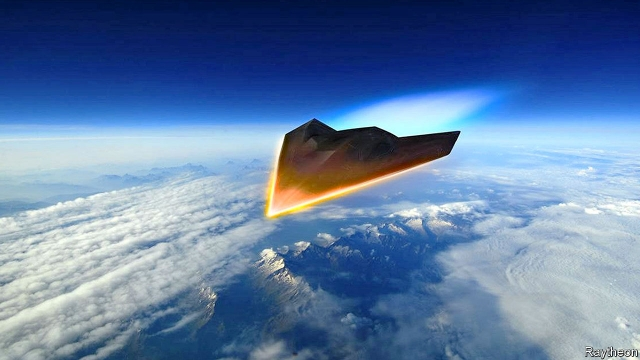
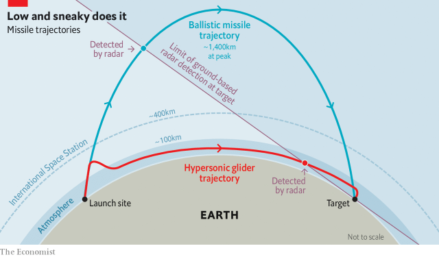

###### Hypersonic missiles

# Gliding missiles that fly faster than Mach 5 are coming 

##### They combine the speed of intercontinental ballistic missiles with the accuracy of cruise missiles 

 

> Apr 6th 2019 

TOM LEHRER’S satirical ditty on the Nazi-turned-American rocketeer was faithful to the essence of early missile development, whose principal challenge was hoisting the weapons into the sky. Gravity did most of the rest. The first warheads capable of steering on descent did not arrive until the 1980s. Even they were limited in how much they could move around, making it pretty easy to predict their target area. 

A new generation of hypersonic missiles is changing all that. Some might be capable of gliding across continents at great speed, their target unpredictable until seconds before impact. Russia claims to have a hypersonic glider on the cusp of deployment; others are redoubling their efforts. Many are likely to start entering service in the 2020s. All this opens up new military possibilities—and problems. 

Missiles that travel at speeds greater than Mach 5 (five times the speed of sound, or about 1.5km per second), have existed for some time. Intercontinental ballistic missiles (ICBMs) re-enter the atmosphere at up to 8km per second. What is different about the hypersonic weapons in the pipeline is that they are designed to sustain such speeds over long distances, manoeuvre as they do so and, in some cases, hit targets with pinpoint accuracy. 

“Manoeuvrable missiles travelling at many times the speed of sound barely leave time for considered human responses,” warned Heiko Maas, Germany’s foreign minister, in March. Such weapons may also elude today’s arms-control agreements, which were written for an earlier generation of weapons. 

There are two basic designs: cruise missiles and gliders. Hypersonic cruise missiles are essentially faster versions of existing ones but powered by very different jet engines. Gliders are pricier and harder to build, but can travel faster and farther, and so are receiving more attention. Like ICBMs and von Braun’s V-2s, they are lofted into space and fall to earth unpowered. But unlike the old-fashioned projectiles, they do not follow a predictable, parabolic arc through the sky. Instead, a hypersonic glide vehicle (HGV) detaches from the rocket while it is still ascending and either skips along the upper atmosphere or, having re-entered, glides through it for hundreds or thousands of kilometres. 

Such gliders have several advantages. Ballistic missiles are less agile and tend not to be very accurate. A Minuteman III ICBM, the backbone of America’s nuclear arsenal, has a “circular error probable” of roughly 120m, meaning only half the missiles fired are expected to land within 120m of the impact point. That is fine for nuclear bombs but useless for hitting a ship or runway. Today’s cruise missiles, on the other hand, are very accurate—one could be sent through a window—but much slower. HGVs combine the speed of ballistic missiles with the manoeuvrability and accuracy of cruise missiles. “You can fly, you can shape your trajectory, you can turn,” says Will Roper, the US Air Force acquisitions chief. 

The key is their trajectory. An unpowered ICBM warhead spends most of its time in the vacuum of space where it cannot duck or dive, but HGVs spend 80% of their time below 100km, allowing them to manoeuvre for most of their flight. They can also dodge ground-based radar for longer by hiding behind the curvature of the Earth. Whereas American ICBMs must fly over Russia to hit China—which could lead to dangerous misunderstandings—gliders could take more circuitous routes, avoiding missile defences and leaving adversaries uncertain of the target. 

Hypersonic gliders are almost a century in the making. The first rocket-boosted glider flew in Germany in 1928. During the second world war, German engineers tried to extend the range of von Braun’s V-2 by having it glide. After the war, America and the Soviet Union pilfered German rocketry, leading to a series of technological leaps. Alpha Draco, an American HGV, was tested to hypersonic speeds in the 1950s and hypersonic gliding was refined by the space race: the space shuttle was a hypersonic glider, in its way. 

Why, then, have hypersonic missiles taken so long to arrive? Extended hypersonic flight presents fiendish scientific and engineering challenges. The lift-to-drag ratio of the space shuttle at hypersonic speeds is around one, notes James Acton of the Carnegie Endowment, a think-tank; an advanced glider would require over twice that. Higher lift-to-drag ratios require sharp leading edges, which, combined with extreme velocities, can generate surface temperatures up to 2,000ºC. That can erode a glider’s protective coating, fry its electronics and bend it out of shape. America’s test of one prototype in 2011 failed when the skin blistered and peeled off. The resulting shockwaves overwhelmed control systems in less than two seconds. 

The only thing that seems to work, says an expert at an arms company that is developing gliders, is to cover the vehicle in cork. But that is vaporised in minutes or less, so does not work for long-range missiles. Dissipating heat as quickly as it is built up is “daunting” and “perhaps impossible” above Mach 10, he says. 

Great speeds also break up molecules in the atmosphere, creating a field of charged particles (or “plasma”) around the glider, which disrupts GPS and other signals required for guiding the missile to its target. Researchers “still don’t completely understand the physics of hypersonic flight”, wrote Ivett Leyva of America’s Air Force Office of Scientific Research in a 2017 paper. 

The big powers have all made some progress in surmounting these challenges. Thomas Bussing, who heads missile development for Raytheon, an arms company, says there has been a “step change” over the past decade, thanks to advances in computational fluid dynamics, new materials and electronic and guidance systems. America, which set aside $2.6bn for hypersonic weapons in the Pentagon’s 2020 budget, is probably farthest ahead. It tested a wedge-shaped glider in 2010 and 2011, a more successful cone-shaped design in 2011, 2014 and 2017 (the Alternate Re-entry System) and is working on tactical systems that use smaller, cheaper rockets and could be launched from ships and aircraft. 

Russia has been working on hypersonics for decades, haltingly. Its flagship Avangard glider was flaunted publicly by President Vladimir Putin in March 2018 and tested to great fanfare in December, after which it was declared ready for service this year—somewhat implausibly, say experts. Pavel Podvig of the United Nations Institute for Disarmament Research points out that very few of the glider’s tests were successful and that the programme was nearly shut down four years ago. 

China has tested its own DF-ZF HGV at least nine times since 2014. Almost nothing is publicly known about its nimbleness or accuracy. Australia, India, France and Japan are all chasing the pack. “We have lost our technical advantage in hypersonics,” warned General Paul Selva, America’s highest-ranking air-force officer in January. China has built two to three times as many hypersonics-related facilities as America, including the world’s fastest wind tunnel for testing, and pumped out the most public research on the technology (716 publications in 2017, compared with 207 from America and 76 from Russia). 

Even so, Mr Acton suggests that the Chinese programme is probably less advanced than America’s. For one thing, America is testing its gliders over significantly longer ranges than China is. It is also solving a different, harder, problem. America wants the ability to deliver conventional warheads over continental distances. It is because ICBMs are not accurate enough for this that it wants HGVs. Russia and China are keener on nuclear-tipped ones, partly because they fear their existing nukes might one day be stopped by improvements in America’s missile-defence shield. Their own gliders need not be so precise. 

Douglas Barrie, an expert at the International Institute for Strategic Studies, a think-tank, forecasts that hypersonic gliders are likely to start entering service in the early 2020s. The result might be twitchier decision-makers and a more frenzied battlefield. 

 

Area defences, which guard broad swathes of territory like continental America, rely on shooting down missiles midcourse and on a straightforward trajectory. Gliders do not go as high and are less predictable, hence Mr Putin’s boast that the Avangard is “invulnerable to interception” (some reckon that interceptors placed in space might have a shot as super-hot gliders should stand out to infra-red sensors). 

Point defences, which guard individual sites against shorter-range missiles, might have more luck. Gliders must slow down as they approach their targets. Systems like America’s THAAD have a proven ability to shoot down ballistic missiles, which close in more quickly. 

“The world has changed dramatically,” says Mr Bussing. “These systems are very, very difficult to counter and fundamentally give the holder a tremendous advantage over the states that don’t have them. The sense of urgency to develop ways to counter them is an imperative.” 

One American military official suggests that humans will have to hand ever more control to defences that are already semi-autonomous: “There will be no time at all for a man in the loop.” The uncertain payload of gliders is another problem. If targets could not tell the difference between conventional and nuclear gliders, or feared that conventional ones, through accuracy and kinetic energy alone, could threaten important targets, they might choose to launch their own nuclear forces to avoid losing them. 

There are also wider implications for arms control. The impending collapse of the Intermediate-Range Nuclear Forces (INF) Treaty, which barred America and Russia from possessing land-based missiles of 500km-5,500km ranges, clears the way for both countries to develop and deploy new ground-launched hypersonic missiles. A separate treaty, New START, caps the number of longer-range weapons, but is up for renewal in 2021 and looking shaky. When it was negotiated in 2010, America and Russia implicitly agreed that gliders would not be covered. Former officials say that was a mistake. 

Germany convened an arms-control conference in Berlin on March 15th to kick-start a discussion on taming the risks posed by futuristic weapons, including hypersonic missiles, through diplomacy. Mr Maas called for an “international missiles dialogue” to discuss the challenge. 

The UN’s disarmament office has proposed that rivals could swap information on test flights and take other confidence-building measures. Corentin Brustlein of IFRI, a French think-tank, suggests capping glider numbers. Yet America and Russia are enmeshed in worsening disputes over today’s weapons, let alone tomorrow’s, and China shows little interest in tying its hands. Gliders are likely to enjoy a fair geopolitical wind. 

-- 

 单词注释:

1.hypersonic[.haipә'sɒnik]:a. 极超音速的, 以高超声速行进的 [化] 特超声速的; 高超声速的 

2.Mach[mɑ:k]:n. 马赫数, 马赫 [计] 机器检查 

3.intercontinental[,intә,kɔnti'nentl]:a. 大陆间的, 洲际的 

4.ballistic[bә'listik]:a. 弹道的 [医] 射击的, 冲击的 

5.cruise[kru:z]:n. 巡航, 巡弋, 漫游 v. 巡航, 巡弋, 漫游 

6.APR[]:[计] 替换通路再试器 

7.tom[tɒm]:n. 雄性动物, 雄猫 

8.satirical[sә'tirik(ә)l]:a. 讽刺的, 讥讽的, 好挖苦的, 写讽刺作品的 

9.ditty['diti]:n. 小调, 小曲 

10.rocketeer[,rɔki'tiә]:n. 火箭专家, 火箭设计者 

11.essence['esns]:n. 实质, 本质, 香精 [化] 香精 

12.hoist[hɒist]:n. 升高, 起重机, 推动 v. 升起, 升高, 举起 

13.warhead['wɒ:hed]:n. 弹头 

14.descent[di'sent]:n. 降落, 家系, 侵袭, 血统 [医] 下降, 世代, 血统 

15.hypersonic[.haipә'sɒnik]:a. 极超音速的, 以高超声速行进的 [化] 特超声速的; 高超声速的 

16.unpredictable[.ʌnpri'diktәbl]:a. 不可预知的 

17.glider['glaidә]:n. 滑翔员, 滑翔机 

18.cusp[kʌsp]:n. 尖头, 尖端 [医] 尖 

19.deployment[]:[计] 展开 

20.redouble[ri'dʌbl]:vi.vt. (使)加倍, (使)增强, 倍增, 加强, (使)大量增加 vt. 重复, 再做, 再说 vi. 重折, 重迭 [计] 重复, 再作, 加强 

21.intercontinental[,intә,kɔnti'nentl]:a. 大陆间的, 洲际的 

22.icbm[,ai,si:bi:'em]:abbr. InterContinental Ballistic Missile 洲际弹道导弹 

23.manoeuvre[mә'nu:vә]:n. 调遣, 演习, 策略 vi. 调动, 演习, 用策略 vt. 调动, 操纵 

24.pinpoint['pinpɒint]:n. 极小之物, 针尖, 立锥之地, 精确位置 vt. 精确地找到, 准确地轰炸, 刺穿, 准确描述, 使突出, 强调 a. 针尖的, 极微的, 精确的, 详尽的, 精确定位的 

25.manoeuvrable[mә'nu:vrәbl]:a. 机动的, 易操纵的, 操纵灵敏的, 可调动的 

26.heiko[]:[网络] 海科；海柯；海寇 

27.maa[]:abbr. 美国数学学会（Mathematical Association of America）；任务区分析区（Mission Area Analysis）；甲基胂酸（methanearsonic acid）；（美）飞机制造商协会（Manufacturers of Aircraft Association） 

28.elude[i'lu:d]:vt. 逃避, 规避, 把...难倒 

29.essentially[i'senʃәli]:adv. 本质上, 本来 

30.pricy['praisi]:a. 昂贵的, 价格高的 

31.Von[vɔn;fɔn;fәn]:[计] 冯·诺伊曼 

32.loft[lɒft]:n. 阁楼, 鸽房, 楼上 vt. 储存于阁楼上 vi. 将球高击 

33.unpowered[ʌn'pauәd]:a. 无动力的 

34.projectile[prә'dʒektil]:n. 发射体, 抛射物 a. 发射的, 投射的 

35.predictable[pri'diktәbl]:a. 可预言的 

36.parabolic[,pærә'bɔlik]:a. 寓言的, 比喻的, 抛物线的, 抛物线状的 [机] 抛物线的 

37.arc[ɑ:k]:n. 弧, 弧形, 弓形, 弧光 [化] 弧 

38.hgv[]:abbr. heavy goods vehicle 重型货车 

39.detach[di'tætʃ]:vt. 使分离, 分遣 [机] 摘下, 分离, 卸下 

40.ascend[ә'send]:vi. 上升, 追溯, 登高 vt. 攀登 

41.ballistic[bә'listik]:a. 弹道的 [医] 射击的, 冲击的 

42.les[lei]:abbr. 发射脱离系统（Launch Escape System） 

43.agile['ædʒail]:a. 敏捷的, 灵活的, 机敏的 

44.minuteman['minitmæn]:n. (美国独立战争时的)民兵 

45.iii[]:num. 罗马数字3 

46.icbm[,ai,si:bi:'em]:abbr. InterContinental Ballistic Missile 洲际弹道导弹 

47.backbone['bækbәun]:n. 脊椎, 志气, 骨干, 支柱 [计] 主干网, 主干网点 

48.arsenal['ɑ:snәl]:n. 兵工厂, 军械库 [机] 兵工厂 

49.runway['rʌnwei]:n. 跑道, 河床, 过道 [化] 单轨架空道; 吊车道 

50.hgv[]:abbr. heavy goods vehicle 重型货车 

51.manoeuvrability[mә,nu:vrә'biliti]:n. 机动性, 操纵的灵敏性 

52.trajectory[trә'dʒektri]:n. 轨道, 弹道, 轨线 [化] 轨道 

53.roper['rәjpә(r)]:n. 制绳者, <美>用索套捕牲口的牧人,诱人进入赌场者 

54.cannot['kænɒt]:aux. 无法, 不能 

55.dodge[dɒdʒ]:v. 避开, 躲避 n. 诡计, 躲藏 

56.curvature['kә:vәtʃә]:n. 弯曲, 曲率 [医] 弯, 曲 

57.circuitous[sә'kju:itәs]:a. 迂回的, 间接的, 绕行的 

58.adversary['ædvәsәri]:n. 敌手, 对手 a. 敌手的, 敌对的 

59.pilfer['pilfә]:v. 盗取, 小偷小摸, 剽窃 

60.rocketry['rɒkәtri]:n. 火箭研究 

61.sery[]:n. (Sery)人名；(俄)谢雷；(科特)塞里 

62.technological[.teknә'lɒdʒikl]:a. 技术的 [经] 工艺的, 技术的 

63.alpha['ælfә]:n. 希腊字母表的第一个字母, 最初, 开端 [医] α(希腊文的第一个字母), 甲种 

64.Draco['dreikәu]:n. 天龙星座 

65.fiendish['fi:ndiʃ]:a. 恶魔似的 

66.jame[]: 灰岩井 

67.acton['æktәn]:n. 铠衣 

68.carnegie[kɑ:'ne^i]:n. 卡内基（姓氏） 

69.endowment[in'daumәnt]:n. 捐助, 天赋, 才能 [经] 捐赠, 捐款, 养老金 

70.erode[i'rәud]:vt. 腐蚀, 侵蚀 vi. 受腐蚀 

71.prototype['prәutәtaip]:n. 原型 [计] 样机; 原型 

72.blister['blistә]:n. 水疱 [化] 砂眼 

73.shockwave[]:n. 震荡波；爆震波；冲击波 

74.overwhelm[.әuvә'hwelm]:vt. 淹没, 受打击, 制服, 压倒, 使不知所措 [法] 打翻, 倾覆, 覆盖 

75.cork[kɒ:k]:n. 软木塞, 软木树, 软木 [化] 木栓 

76.vaporise['veipәraiz]:vi.vt. (使)蒸发, (使)汽化 

77.dissipate['disipeit]:vt. 散失, 驱散, 浪费 vi. 消散, 放荡 

78.quickly['kwikli]:adv. 很快地 

79.daunt[dɒ:nt]:vt. 威吓, 难倒, 使气馁 

80.plasma['plæzmә]:n. 血浆, 淋巴液, 原生质, 等离子体 [化] 等离体; 等离子体 

81.disrupt[dis'rʌpt]:a. 分裂的, 中断的 vt. 使分裂, 使瓦解 

82.GP[]:普通医师, 普通医生开业医生 [计] 通用程序设计, 图形处理器 

83.physic['fizik]:n. 药品, 泻药, 医学 vt. 给...服药, 治愈, 使通便 

84.leyva[]:[网络] 莱瓦 

85.surmount[sә:'maunt]:vt. 战胜, 超越, 克服 

86.thoma[]:n. (Thoma)人名；(阿尔巴、阿拉伯)索玛；(英、德、罗、匈、捷、塞、瑞典)托马 

87.buss[bʌs]:n. 接吻, 双桅捕鲭渔船 v. 接吻 

88.Raytheon['reiθiɔn]:n. （美）雷声（公司名） 

89.computational[.kɒmpju'teiʃәnәl]:a. 计算的 

90.farthest['fɑ:ðist]:a. 最远的, 最久的 adv. 最远, far的最高级 

91.alternate['ɒ:ltәnәt]:a. 交替的, 轮流的, 间隔的 v. 轮流, (使)交替 

92.tactical['tæktikl]:a. 战术的, 用兵上的, 策略的 

93.hypersonics[,haipә'sɔniks]:特超声(速空气动力)学 

94.haltingly['hɔ:ltiŋli]:adv. 迟疑不决地；犹豫地 

95.flagship['flægʃip]:n. 旗舰 

96.avangard[]:[网络] 埃文格瑞；阿华加德；前卫家俱公司 

97.flaunt[flaunt]:n. 炫耀, 飘扬 v. 炫耀, 飘扬 

98.Vladimir[vlɑ'dimɪr]:n. 弗拉基米尔（古罗斯弗拉基米尔-苏兹达里公国的古都） 

99.putin['putin]:n. 普京（人名） 

100.fanfare['fænfєә]:n. 喇叭边(或号角)嘹亮吹奏声, 吹牛 

101.implausibly[im'plɔ:zəbli]:adv. 难以置信地 

102.Pavel[]:n. 帕维尔（人名） 

103.disarmament[dis'ɑ:mәmәnt]:n. 裁军 [法] 裁军, 解除军备 

104.nimbleness['nimblinis]:n. 敏捷；聪明 

105.paul[pɔ:l]:n. 保罗（男子名） 

106.selva['selvә]:n. (尤指南美洲亚马孙河沿岸的)热带雨林 

107.significantly[]:adv. 值得注目地；意味深长地 

108.continental[.kɒnti'nentl]:a. 大陆的, 洲的 n. 欧洲大陆人 

109.nuke[nju:k]:n. 核武器, 核电厂, 原子核 vt. 以核武器攻击, 把...打垮 a. 核武器的 

110.douglas['dʌ^lәs]:n. 道格拉斯（男子名）；道格拉斯（英国马恩岛首府） 

111.Barrie['bæri]:巴里(姓氏, 男子名) 

112.twitchy[ˈtwɪtʃi]:a. 抽搐的, 抽动的, 痉挛性的； 焦躁不安的 

113.frenzy['frenzi]:n. 疯狂, 狂暴, 狂怒 [医] 暴怒, 狂乱 

114.battlefield['bætlfi:ld]:n. 战场, 沙场 

115.swathe[sweiθ]:vt. 绑, 裹, 包围 n. 带子, 绷带 

116.midcourse['midkɔ:s]:a. (宇宙飞船、飞机或船的)航程中段的,中途的  n. 航程中段,中途 

117.invulnerable[in'vʌlnәrәbl]:a. 不会受伤害的, 刀枪不入的, 无懈可击的, 无可反驳的 

118.interception[,intә(:)'sepʃәn]:n. 拦截, 截断, 截住, 截取, 截击, 窃听, 侦听, 雷达侦察 [计] 截取, 窃听 

119.reckon['rekәn]:vt. 计算, 总计, 估计, 认为, 猜想 vi. 数, 计算, 估计, 依赖, 料想 

120.interceptor[.intә'septә]:n. 阻止的人, 妨碍者, 拦截战斗机 [法] 窃听器, 截取者, 障碍物 

121.sensor['sensә]:n. 传感器 [计] 检测器 

122.thaad[]:abbr. Theater High-Altitude Area Defense 战区高海拔区防卫 

123.dramatically[drә'mætikli]:adv. 戏剧地, 引人注目地, 突然地 

124.fundamentally[fʌndә'mentәli]:adv. 基础, 首要, 主要, 十分重要, 基本, 根本, 原始, 基频, 基音, 基谐波 

125.holder['hәuldә]:n. 持有人, 所有人, 支持物 [化] 夹持器; 夹具; 贮罐 

126.urgency['ә:dʒәnsi]:n. 紧急, 催促 [法] 紧急, 迫切, 紧急之事 

127.imperative[im'perәtiv]:n. 命令, 必要的事, 规则, 祈使语气 a. 命令式的, 急需的, 势在必行的, 强制的 

128.payload['peilәud]:n. 商务载重, 工资负担, 净载重量, 有效负荷, 弹头 [化] 负荷量 

129.kinetic[kai'netik]:a. 运动的, 运动引起的, 动力学的, 活动的 [医] 运动的, 动的, 动力的 

130.impend[im'pend]:vi. 迫近, 威胁, 悬挂 

131.inf[]:abbr. 中程核力量（Intermediate-range Nuclear Forces） 

132.deploy[di'plɒi]:v. 展开, 配置 

133.renewal[ri'nju:әl]:n. 更新, 革新, 复兴, 恢复, 修补, 补充, 继续, 重订, 重申, 续借 [经] 更新, 换新, 重申 

134.shaky['ʃeiki]:a. 震动的, 摇晃的, 动摇的 

135.implicitly[]:adv. 含蓄, 不言明, 暗示, 暗指, 内含, 固有, 无疑, 绝对, 无保留 [计] 隐含地 

136.convene[kәn'vi:n]:vt. 集合, 召集, 召唤 vi. 聚集, 集合 

137.Berlin[bә:'lin]:n. 柏林, (软质)柏林毛线 

138.futuristic[.fju:tʃә'ristik]:a. 未来派的 

139.diplomacy[di'plәumәsi]:n. 外交, 外交手腕, 交际手段 [法] 外交, 外交手腕, 权谋 

140.disarmament[dis'ɑ:mәmәnt]:n. 裁军 [法] 裁军, 解除军备 

141.enmesh[in'meʃ]:vt. 使绊住, 使陷入 

142.worsen['wә:sn]:vt. 使更坏, 使恶化 vi. 变得更坏, 恶化 

143.geopolitical[,dʒi(:)әupә'litikәl]:[计] 地理的 

