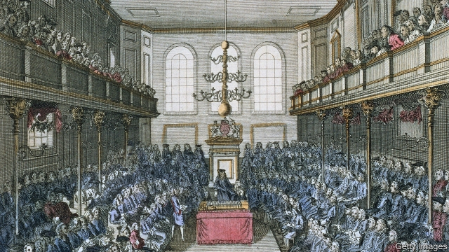

###### Parliamentary acoustics

# How not to be heard in the House of Commons 

##### Acoustics in the 18th-century chamber were operatic; modern ones are a slight improvement 

 

> Apr 4th 2019 

BEING HEARD in Britain’s House of Commons is not always essential to get things done. One of the most influential and famous speeches was made there 230 years ago next month, when William Wilberforce denounced slavery and kick-started the abolitionist movement. Yet a new study suggests many MPs in the audience wouldn’t have been able to hear him properly. 

Catriona Cooper, a digital archaeologist at the University of York, used a computer model to recreate the acoustics of the 18th-century Commons, which was housed in the former St Stephen’s Chapel. Then, using reports of how many people were in the building at the time and where they would have sat or stood, she worked out how Wilberforce’s speech on May 12th 1789 would have sounded to those present. 

Many in the chamber would have been distracted by booming echoes, the model suggests. And those MPs in the best seats, including the front benches, would have heard worst of all. To them, Wilberforce’s fine rhetoric would have been a mush of rebounded sound. In fact, the best places to listen to this and other Georgian debates in the Commons were largely out of sight, in the doorway or behind the Speaker’s chair. 

Dr Cooper’s model, whose results are published in Parliamentary History, suggests that in 1798 the chamber had an average reverberation time—a measure of how slowly sound dissipates—of 1.6 seconds. A lower number means less echo, and the optimal reverb time for spoken words is less than a second. St Stephen’s Chapel sounded more like an opera house (which typically aims for a reverb time of 1.3 to 1.8 seconds). 

It burned down in 1834, but the acoustics of the modern House of Commons remain notoriously poor, and that’s not all down to the braying and heckles. High ceilings and stripped-down furnishings encourage echoes. Blame Winston Churchill for some of that. After the Commons was destroyed by German bombs in 1941, he ignored suggestions for a design that was more fit-for-purpose and insisted it be rebuilt faithful to its previous “intimate and conversational” style. The next chance to improve things will be in 2025, when the Palace of Westminster is scheduled for a long-overdue update. Whether that will improve British political affairs is open for debate. 

-- 

 单词注释:

1.parliamentary[.pɑ:lә'mentәri]:a. 国会的, 议会的, 议会制度的 

2.acoustic[ә'ku:stik]:a. 听觉的, 声学的, 音响的 [医] 听的; 声学的 

3.operatic[.ɒpә'rætik]:a. 歌剧的, 歌剧风格的 

4.APR[]:[计] 替换通路再试器 

5.alway['ɔ:lwei]:adv. 永远；总是（等于always） 

6.william['wiljәm]:n. 威廉（男子名）；[常作W-][美俚]钞票, 纸币 

7.Wilberforce['wilbәfɔ:s]:威尔伯福斯(姓氏) 

8.denounce[di'nauns]:vt. 告发, 抨击, 谴责 [法] 谴责, 斥责, 告发 

9.abolitionist[.æbәu'liʃәnist]:n. 废除主义者, 废奴主义者 

10.MP[]:国会议员, 下院议员 [计] 宏处理程序, 维护程序, 线性规划, 微程序, 多处理器 

11.Catriona[]:n. (Catriona)人名；(英)卡特里奥纳, 卡特里奥娜 (女名) 

12.cooper['ku:pә]:n. 制桶工人 v. 制桶 

13.archaeologist[.ɑ:ki'ɒlәdʒist]:n. 考古学家 

14.york[jɔ:k]:n. 约克郡；约克王朝 

15.recreate['rekrieit]:v. (使)得到休养, (使)得到娱乐, 再创造 

16.ST[]:[计] 段表, 状态, 系统测试, 直端连接器 [化] 磺胺噻唑 

17.chapel['tʃæpәl]:n. 小教堂, 礼拜式 

18.distract[dis'trækt]:vt. 转移, 分心, 使发狂 

19.rhetoric['retәrik]:n. 修辞, 修辞学, 雄辩(术) 

20.mush[mʌʃ]:n. 浓粥, 感伤的话, 软块 vi. 带狗撬在雪上前进 interj. 走, 前进 

21.rebound[ri'baund]:vi. 弹回, 返回, 产生事与愿违的结果 vt. 使弹回, 使返回 n. 反弹, 返回, 篮板球, 振作 rebind的过去式和过去分词 

22.Georgian['dʒɒ:dʒjәn]:n. 乔治亚州人, 乔治亚人 a. 乔治王时代的, 乔治王时代艺术风格的, 乔治亚的 

23.doorway['dɒ:wei]:n. 门口, 途径 

24.reverberation[ri.vә:bә'reiʃәn]:n. 反响, 混响, 反射 [电] 交混回响 

25.les[lei]:abbr. 发射脱离系统（Launch Escape System） 

26.optimal['ɒptimәl]:a. 最佳的, 最理想的 [化] 最优的 

27.reverb[ri'vә:b. 'ri:vә:b]:vi. 混响；余响 

28.typically['tipikәli]:adv. 代表性地；作为特色地 

29.notoriously[]:adv. 臭名昭著的, 声名狼藉的 

30.bray[brei]:n. 驴叫声, 喇叭声 v. 叫, 嘶叫 

31.heckle['hekl]:vt. 诘问, 以麻梳梳理, 激烈质问 n. 针排 

32.furnishing['fә:niʃiŋ]:n. 家具, 服饰品, 陈设品, 设备 

33.winston['winstәn]:n. 温斯顿（姓氏, 男子名） 

34.Churchill['tʃә:tʃil]:n. 邱吉尔 

35.conversational[.kɒnvә'seiʃәnl]:a. 会话的, 对话的, 健谈的 [计] 会话式的; 对话式的 

36.Westminster['westminstә]:n. 威斯敏斯特 

37.update[ʌp'deit]:vt. 更新, 使现代化 n. 更新 [计] 更新 

