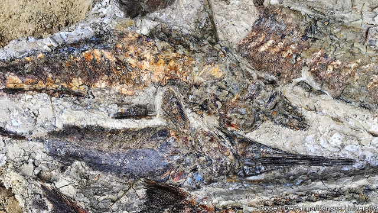

###### Dinosaur extinction

# Stony evidence of the hellfire that drove dinosaurs to extinction 

##### The hours just after a massive asteroid smashed into Earth have been captured in stunning detail 

 

> Apr 4th 2019 

WHEN, IN 1980, Luis Alvarez, a physicist, and his son Walter, a geologist, made public their theory that the dinosaurs were killed by a massive asteroid strike, it came as a curveball to palaeontologists, who believed dinosaurs had gradually died out through other means. The father-and-son team from the University of California, Berkeley, argued that evidence of the catastrophe was hiding in plain sight, the world over, as a thin layer of sediment enriched in iridium, a metal commonly found in asteroids but rare on Earth. They pointed out that no dinosaurs, with the exception of birds, were ever found beyond this critical layer and suggested a devastating impact was responsible. 

The only piece of the puzzle that has been missing is evidence of what actually happened when the asteroid struck. Now, almost 40 years later, an American fossil bed is revealing details of the raging hellstorm that followed just minutes after the asteroid impact, and eventually drove the dinosaurs to extinction. 

Under most circumstances, fossils form when animals die in places like river deltas where fine sediment slowly covers up their bones and ultimately encases them in rock. Not so at the aptly named Hell Creek formation of Tanis in North Dakota. Here, Robert DePalma, a PhD student at the University of Kansas, and a team of colleagues that includes Walter Alvarez are reporting the discovery of a 1.3-metre-thick sedimentary layer that was catastrophically dumped in a single day. 

The layer is loaded with the bodies of marine and freshwater fish. This alone struck Mr DePalma as odd since Hell Creek is not known for the preservation of brackish ecosystems where such animals could mingle. But what proved truly unnerving was the fact that all of the bodies were intact, faced the same direction and were scattered among felled tree trunks. That hinted at a sudden surge of water: the streamlined shape of fish means they automatically orient themselves with their heads pointing into a current of fast-moving water. That the bodies were all intact suggests that they were rapidly buried. Moreover, only the most powerful of currents can knock trees down, so the assemblage must have formed during a single devastating event. 

Wedged between a 66m-year-old layer of Cretaceous sediment, and another dating from the subsequent Tertiary period, when mammals came to dominate Earth, the Hell Creek fossils are in the perfect position to record the moments that immediately followed the asteroid impact. 

Supporting this, spheres of what was once molten glass and fragments of quartz generated under exceptionally high pressures and blasted into the air are scattered throughout the site. Some of it was lodged inside the gills of fossilised fish. Presumably, they sucked it in with their last desperate gasps. The bottom layer of the site contains burrows that appear to have been dug by mammals and are filled with coarse sand brought in over land at great speed, the signs of which are seen in the ripples left in the sand. Dusting the top of the formation is an ominous layer of iridium. 

Other fossil finds, yet to be confirmed, include fish impaled on the spines of one another, wasp nests, flooded ant hills, ancient primates and the leaves of plants probably related to the modern banana tree. The team are studying these but their findings have yet to be peer-reviewed and so are not included in the discovery’s scientific announcement, which was published by Proceedings of the National Academy of Sciences last week. 

What is clear already from the confirmed evidence is the sequence of events that unfolded in the minutes and hours after the asteroid hit. It struck the Mexican coast, sending enormous volumes of gas and molten material into the atmosphere, and igniting a firestorm that would have engulfed much of the planet. Its impact crater, located beneath the Yucatan peninsula and the southern Gulf of Mexico, has been a focus of scientific interest for many years. Undoubtedly, this would have created an enormous tsunami, but Mr DePalma suspects that the Tanis fossils, located thousands of kilometres to the north, were killed by a different phenomenon, triggered by the impact: a seiche wave. 

Also known as standing waves, seiche waves form in large bodies of water that are either steadily blown by strong winds or shaken by tremors. Mr DePalma and his colleagues propose that the asteroid impact shook Earth so forcefully that seiche waves as tall as 100 metres rose up in every large body of water across the planet, including the shallow sea near Tanis. 

Further fossil evidence will be needed to prove the theory, but if Mr DePalma is correct then the inferno initiated by the impact was made worse by devastating walls of water everywhere. No wonder the dinosaurs threw in the towel. 

-- 

 单词注释:

1.extinction[ik'stiŋkʃәn]:n. 消失, 消灭, 废止 [化] 消光; 熄灭 

2.hellfire['helfaiә]:n. 地狱之火, 严酷的苦难 

3.asteroid['æstәrɒid]:n. 小行星, 海盘车 a. 星状的 

4.stunning['stʌniŋ]:a. 打昏迷的, 弄得人昏头昏脑的, 令人震惊的 

5.APR[]:[计] 替换通路再试器 

6.luis[]:n. 路易斯（人名） 

7.Alvarez[]:n. (Alvarez)人名；(英、西、葡、瑞典)阿尔瓦雷斯 阿尔瓦雷斯 

8.Walter['wɔ:ltә(r)]:n. 沃尔特（男子名） 

9.geologist[dʒi'ɔlәdʒist]:n. 地质学家, 地质学者 

10.curveball[]:曲线球 

11.palaeontologist[]: 古生物学家；化石学家 

12.California[.kæli'fɒ:njә]:n. 加利福尼亚 

13.berkeley['bɑ:kli, 'bә:kli]:n. 伯克利（姓氏）；贝克莱（爱尔兰主教及哲学家）；伯克利（美国港市） 

14.sediment['sedimәnt]:n. 沉淀物, 沉积 [化] 沉降物; 沉积物 

15.enrich[in'ritʃ]:vt. 使富足, 使肥沃 

16.iridium[ai'ridiәm]:n. 铱 [化] 铱Ir 

17.devastate['devәsteit]:vt. 毁坏 [法] 使荒废, 毁灭, 掠夺 

18.fossil['fɒsәl]:n. 化石, 古物 a. 化石的, 陈腐的, 守旧的 

19.delta['deltә]:n. 三角洲, 希腊字母的第四个字 [医] δ(希腊文的第四个字母), 丁种, 三角, 三角形区 

20.encase[in'keis]:vt. 把...装入箱内, 包住 

21.aptly['æptli]:adv. 适当地, 适宜地 

22.creek[kri:k]:n. 小溪, 小河, 小湾 

23.Tanis[/'tænis/]:n. 坦尼斯（埃及古城） 

24.dakota[dә'kәutә]:n. 达科他（美国过去一地区名, 现分为南、北达科他州） 

25.Robert['rɔbәt]:[法] 警察 

26.depalma[]: [人名] 德帕尔马 

27.phd[]:abbr. 哲学博士学位（Doctor of Philosophy） 

28.kansa[]:n. （日语）监察；堪萨人（旧时居住在美国堪萨斯州一带的印第安人） 

29.sedimentary[.sedi'mentәri]:a. 沉渣的, 沉淀物的, 由沉淀物所生成的 [医] 沉淀的, 沉积的, 沉降的 

30.catastrophically[]:灾难性地 

31.freshwater['freʃwɔ:tә(r)]:a. 江河湖泊的, 淡水的 

32.preservation[.prezә'veiʃәn]:n. 保存, 保藏, 保护 [医] 保藏, 保存, 防腐 

33.brackish['brækiʃ]:a. 有盐味的, 令人不快的 [机] 微有碱味的 

34.ecosystem['i:kәu.sistәm]:n. 生态系统 [医] 生态系 

35.mingle['miŋgl]:v. (使)混合 

36.unnerve[.ʌn'nә:v]:vt. 使失去勇气, 使胆怯, 使不能自制 [医] 除神经 

37.intact[in'tækt]:a. 尚未被人碰过的, 原封不动的, 完整的 [医] 完整的, 无伤的 

38.fell[fel]:vt. 击倒 n. 一季所伐的木材, 折缝 a. 凶猛的, 可怕的 fall的过去式 

39.surge[sә:dʒ]:n. 巨涌, 汹涌, 澎湃 vi. 汹涌, 澎湃, 颠簸, 猛冲, 突然放松 vt. 使汹涌奔腾, 急放 [计] 电压尖峰 

40.streamline['stri:mlain]:n. 流线, 流线型 vt. 使成流线型, 使合理化 

41.assemblage[ә'semblidʒ]:n. 集合, 装配, 一群人 [法] 配合, 集合, 集合物 

42.wedge[wedʒ]:n. 楔子, 楔形物, 起因, 导致分裂的东西 vt. 楔住, 挤进, 楔入 vi. 楔入, 挤进 

43.cretaceous[kri'teiʃәs]:a. 白垩系的, 白垩纪的 n. 白垩纪, 白垩系 

44.tertiary['tә:ʃiәri]:a. 第三的, 第三位的, 第三产业的 n. 第三修道会会员, 第三纪 第三的; 三代的(指无机盐) 

45.mammal[mæmәl]:n. 哺乳动物 [化] 哺乳动物 

46.quartz[kwɒ:ts]:n. 石英 [化] 石英 

47.exceptionally[]:adv. 特殊地；异常地；例外地 

48.gill[gil]:n. 鳃, 菌褶, 沟壑, 少女 vt. 用刺网捕, 去除内脏 vi. 被刺网捕住 

49.fossilise['fɔsilaiz]:vt.vi. 使成化石, 变成化石, 使(思想)陈旧, 使僵化 

50.burrow['bʌrәu]:n. 洞穴, 藏身处 vi. 掘洞穴, 躲藏 vt. 掘, 打洞 

51.ripple['ripl]:n. 涟波, 涟漪, 波纹, 粗钢梳 vt. 使起涟漪 vi. 起微波, 起潺潺声 

52.ominous['ɒminәs]:a. 恶兆的, 不吉利的, 预兆的 

53.impale[im'peil]:vt. 刺穿, 使绝望, 钉住 

54.spine[spain]:n. 背骨, 脊柱, 尖刺 [医] 脊柱; 棘, 刺; 马蹄嵴 

55.wasp[wɒsp]:n. 黄蜂, 胡蜂, 易怒的人, 刻毒的人 [医] 胡蜂, 黄蜂 

56.primate['praimit]:n. 大主教, 灵长目动物 [医] 灵长类 

57.proceeding[prәu'si:diŋ]:n. 进行, 程序, 行动, 诉讼程序, 事项 [化] 会议论文集 

58.ignite[ig'nait]:vt. 点燃, 使灼热, 使兴奋 

59.firestorm['faiәstɔ:m]:n. 风暴性大火 

60.engulf[in'gʌlf]:vt. 卷入, 吸进, 吞没, 使全神贯注 

61.crater['kreitә]:n. 火山口, 环行山, 弹坑 [化] 焊口; 火山石; 弧坑; 焰口 

62.Yucatan[ju:kә'tɑ:n, -'tæn]:尤卡坦半岛 

63.tsunami[tsu'nɑ:mi]:n. 海啸 

64.trigger['trigә]:n. 触发器, 扳机 vt. 触发, 发射, 引起 vi. 松开扳柄 [计] 切换开关 

65.seiche[seiʃ]:<法>n.湖面波动,湖震 

66.tremor['tremә]:n. 震动, 颤动 [医] 震颤 

67.forcefully[]:adv. 激烈地；强有力地；有说服力地 

68.inferno[in'fә:nәu]:n. 地狱, 地狱似的地方 

69.initiate[i'niʃieit]:n. 入会, 开始 a. 新加入的 vt. 开始, 传授基本知识给 

