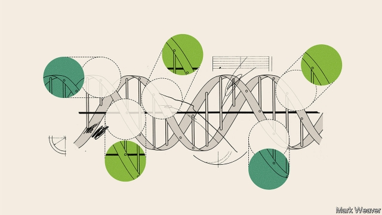
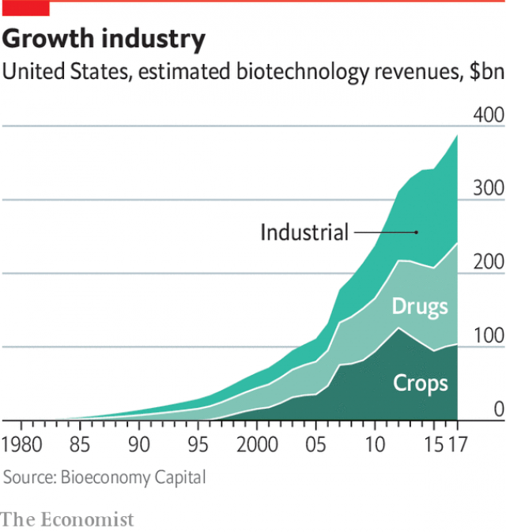

###### Automation

# Remaking life means automating biology 

##### Synthesised DNA enables doing biology on an industrial scale 

 

> Apr 4th 2019 

ZACH SERBER worked at Amyris, a synthetic-biology pioneer, when the company was trying to crack the biofuel market. Seeing brilliant metabolic engineering fail to make a business led him and his co-founders at Zymergen, a company based in Emeryville, California, to take their new company in a different direction. They would not try to manufacture or sell things. They would offer their synthetic biology as a way of making businesses already using biotechnology more profitable. This is, at the moment, the model used by a number of leading synthetic-biology companies. At its heart is the automation of experiment. 

Biotechnology is already a bigger business than many people realise. Rob Carlson of Bioeconomy Capital, an investment company, calculates that money made from creatures which have been genetically engineered accounted for about 2% of American GDP in 2017. The contribution was split between three industries. Pharmaceuticals and crops, contributing $137bn and $104bn respectively, are the ones that the public knows about. The third sector, industrial biotechnology, is much less visible but even more lucrative, worth $147bn or more (see chart). Chemicals used for many purposes—raw materials for plastics, food additives, some fragrances and biofuels—are already being churned out at scale by altered micro-organisms in fermentation tanks. 

As well as being the biggest biotechnology market, this is also the one best suited to companies seeking to offer innovation as a service. Testing drugs and genetically modified crops is a long and costly business. Replacing one strain of industrial yeast with a better one can be done in a week. Industrial customers tend to know what they want and synthetic biology promises a lot of value. Tim Fell, the boss of Synthace, a synthetic-biology software company in London, says that in one project the company engineered a 200-fold increase in the rate at which bacteria produced something useful (he cannot say what) in just four weeks. 

 

About 75% of Zymergen’s business, according to Dr Serber, is helping companies re-engineer, for industrial purposes, microbes they are already using, in order to increase production, reduce costs or both. The company is built around machine-learning programs that suggest changes to the genome which could produce an organism and setting—temperature, nutrient balance, and so on—that improves on the status quo. In this fiercely empirical process Zymergen makes DNA tweaks of all sorts, most of them to sequences that regulate gene expression. These tweaks, says Dr Serber, have helped customers for its “molecular technology” make better margins on hundreds of thousands of tonnes of product. 

Arzeda, based in the Interbay district of Seattle, has a similar business model and is based on similar technologies. But where Zymergen concentrates on empirically derived ways to improve productivity, the expertise of Arzeda’s machine-learning systems and scientists is in applying a theoretical understanding of how the shape into which proteins fold determines their function, thus making them better at what they do, or able to do something new. It brands itself “the protein design company”. 

Ginkgo, the iGEM-born startup in Boston, is another variation on the business-to-business theme. Its focus is not on the specifics of genome-based machine-learning or protein design, though it does both, so much as on developing a broader expertise in the remaking of microbes. It calls itself “the organism company”. 

The three companies may differ in details of their approaches, but the big picture unites them. All of them see their current business-to-business approach as a stepping stone, a way of honing their techniques, teaching their machine-learning programs and bringing in cash as they develop products of their own. Arzeda talks of making tulipin, which among other things can greatly improve the qualities of perspex. That improvement is not so great as to justify harvesting it from its native tulips, but Arveda’s proteins mean you do not need to. Ginkgo is spinning out joint ventures with clients to work in specific areas. In 2018 it created a business with Bayer, a chemical company, to develop microbes which would make fertiliser inside a plant’s root system. It has another spin-out working on cannabis, and has just announced a third one developing plant proteins for use in vegetarian foods, including meat substitutes. Zymergen is looking at materials for electronics. 

They are also united in their zeal for high-throughput experiments. Their use of massive amounts of synthesised DNA is producing a new way of doing biology on an industrial scale 

During the five years that Jason Kelly, Ginkgo’s chief executive, spent in Dr Endy’s lab at MIT in the 2000s he reckons he may have ordered 50,000 bases of commercially synthesised DNA—a pretty profligate amount at the time. Today Ginkgo orders synthetic DNA sequences at 50,000 times that rate, using them to change the genomes of thousands of organisms a day. In 2017 it bought a DNA-synthesis company, Gen9, bringing all its production capacity in-house. That has not sated its appetite. It has a contract with Twist Bioscience, the world’s biggest DNA-synthesis company, for a billion base pairs over the coming years. 

Arzeda is smaller, but Alexandre Zanghellini, its boss, says it still manages to order around 10,000 new DNA sequences a week, each of which is then put into a particular microbe so that its computers’ assumptions about how changes in the sequence change the function of proteins can be tested. Often these DNA sequences are not even looked at by humans before they arrive by courier. 

Drinking from such a firehose of DNA increasingly requires experiments designed and managed by computers. Ginkgo spent years programming computers to supervise experiments and robots to carry them out and then finding and removing the innumerable bugs with which those programs were afflicted. For ten years, according to Dr Kelly, doing lab work using the partially automated foundries thus created was considerably slower for the company’s designers than doing it themselves would have been. But having to use the automated systems meant having to improve them. A couple of years ago, Dr Kelly says, Ginkgo reached a point where its foundries were as productive, in terms of person hours for work done, as an expert researcher. Now he pegs them as ten times more productive, and says the margin is growing. 

Automation increases not just the amount of research that can be done, but also its complexity. Much biological experimentation takes place in trays of 96 “microwells”, or miniature test tubes. Humans tend to design experiments using these wells quite simply; do A to one subset, B to another, and so on. A computer can design experimental strategies that are much more complex, picking a wider range of hypotheses to test, and then testing many more hypotheses per tray. For properly programmed robot flunkies, the most recondite experimental schemes are a doddle. According to Markus Gershater, the chief scientific officer at Synthace, the gains software and automation offer experimental design can be just as important as gains in speed and throughput. 

The role of machine learning in these labs means they have an enormous appetite for data. Most biology labs do without mass spectrometers, analytic tools which rapidly sort through samples molecule by molecule and characterise every one of them. They are expensive and produce more data than most people need. Synthetic-biology companies love them. 

More data offer computers a clearer idea of what is going on; they also show what is going wrong. Most biologists at the bench have a sense that the living material they work with is not really to be trusted. Biology, they say, unlike physics, is unreliable. The “noise” in experiments can often swamp the signal you are looking for. Getting an experiment to work pretty regularly is good enough. In part this may be true. But it is hard not to think that much of the unreliability is with the biologists, not the biology. How else to explain why studies repeatedly find that many results reported in research papers cannot be replicated in other labs? 

The problem is not just human error. It is also human nescience. There are things going on in a lab that experimenters do not notice, but the creatures they experiment on do. The more data a system gathers, the more can be discovered, if necessary, about what actually happened, and that will surely help replicability. 

Industrialisation helps in other ways, too. One piece of kit popular in labs that can afford it is the Echo 655, built by Labcyte. Like a pipetting system it moves drops of fluid from one set of wells to another. But by creating those drops with tightly focused ultrasound rather than suction it does so in much smaller amounts, much more accurately and with no contaminating contact. Smaller wells—up to 1,536 on a tray—mean more throughput and less spent on the chemical reagents the experiments use up. At the far end of this trend towards the tiny and precise is a system made by a startup called Berkeley Lights which has wells which contain but a single cell, manipulated entirely with laser beams. 

So powerful is this new automation that it has drawn Synthace away from its original intention of making organisms to providing software as a service instead. The company has developed a computing environment called Antha, where researchers can say what they want done in relatively high-level terms, confident that machines will optimise the experiment’s design for the client’s instruments and tell the instruments what to do. 

A startup called Transcriptic wants to go even further, operating “labs in the cloud” where an experimenter at a terminal anywhere in the world can get a set of experiments done in an automated facility they never even see. Mr Kelly thinks that, at least for the sort of work Ginkgo does, the time is not yet right for such radical approaches—having the people designing the organisms and the foundries that make them under one roof matters a lot. But it is clear that the trend to automation is not yet played out. 

From the ratcheting of the ribosome on up, there is something mechanical about life. In foundries like Ginkgo’s it is hard to avoid the sense of that mechanistic model moving out from the cells embodying it and into the sparsely inhabited systems studying, manipulating and redesigning them. There is an uncanny feedback loop between the machineries of cell and laboratory which is eating away at the gap in between them. 

-- 

 单词注释:

1.remake[ri'meik]:vt. 再作, 再制, 重作 n. 再制, 改作, 重制物 

2.automate['ɔ:tәmeit]:vt.vi. (使)自动化 [计] 自动化 

3.synthesise['sinθisaiz]:vt.vi. 综合, 合成, 接合 vt. 用合成法合成, 综合地处理 

4.DNA[]:脱氧核糖核酸 [计] 无效数据, 数字网络体系结构, 分布式网络体系结构 

5.APR[]:[计] 替换通路再试器 

6.Zach[zæk]:n. 扎克(Zachary,Zachariah的昵称, 亦作Zack,Zak)(m.) 

7.serber[]:[网络] 塞贝 

8.Amyris[]:[医] 阿米香树属 

9.biofuel[baiәu'fju:әl]:[机] 生物燃料 

10.metabolic[.metә'bɒlik]:a. 变化的, 变形的, 新陈代谢的 [医] [新陈]代谢的 

11.emeryville[]:[地名] 埃默里维尔 ( 美 ) 

12.California[.kæli'fɒ:njә]:n. 加利福尼亚 

13.biotechnology[.baiәutek'nɔlәdʒi]:n. 生物工艺学；生物技术 

14.biotechnology[.baiәutek'nɔlәdʒi]:n. 生物工艺学；生物技术 

15.Carlson[]:n. 卡尔森（公司名）；卡尔松（姓氏） 

16.genetically[]:adv. 创始, 遗传学, 生殖, 基因, 遗传, 发生 

17.pharmaceutical[,fɑ:mә'sju:tikәl]:a. 药学的, 制药的, 药用的, 药物的, 药剂师的, 药师的 n. 药品, 成药, 药剂 

18.sector['sektә]:n. 扇形, 部门, 部分, 函数尺, 象限仪, 段, 区段 vt. 把...分成扇形 [计] 扇面; 扇区; 段; 区段 

19.les[lei]:abbr. 发射脱离系统（Launch Escape System） 

20.lucrative['lu:krәtiv]:a. 有利益的, 获利的, 合算的 

21.additive['æditiv]:a. 添加的, 附加的, 加法的, 累积的 n. 添加物 

22.fragrance['freigrәns]:n. 芬芳, 香味 

23.churn[tʃә:n]:n. 搅乳器 v. 搅拌, 搅动 

24.fermentation[,fә:men'teiʃәn]:n. 发酵 [化] 发酵 

25.innovation[.inәu'veiʃәn]:n. 改革, 创新 [法] 创新, 改革, 刷新 

26.yeast[ji:st]:n. 酵母 [化] 酵母 

27.tim[tim]:n. 蒂姆（男子名） 

28.cannot['kænɒt]:aux. 无法, 不能 

29.serber[]:[网络] 塞贝 

30.microbe['maikrәub]:n. 微生物, 细菌 [医] 微生物 

31.genome['dʒi:nәum]:[化] 基因组 [医] 染色体组 

32.nutrient['nju:triәnt]:a. 营养的, 滋养的 n. 营养物, 滋养物 

33.statu[]:[网络] 状态查看；雕像；特级雪花白 

34.quo[]:vt. [古]说 

35.fiercely['fiәsli]:adv. 猛烈地, 厉害地 

36.empirical[em'pirikәl]:a. 完全跟据经验的, 经验主义的 [医] 经验主义的 

37.tweak[twi:k]:n. 拧, 扭, 焦急 vt. 扭, 开足马力 

38.molecular[mә'lekjulә]:a. 分子的, 由分子组成的 [医] 分子的 

39.tonne[tʌn]:n. 吨, 公吨 [经] 吨 

40.Seattle[si'ætl]:n. 西雅图 

41.empirically[]:adv. 以经验为主地 

42.productivity[.prәudʌk'tiviti]:n. 生产力 [经] 生产率, 生产能力 

43.expertise[.ekspә:'ti:z]:n. 专家意见, 专门技术 [法] 专门知识, 专家意见 

44.Ginkgo['^iŋk^әu]:[化] 银杏属 

45.startup[]:[计] 启动 

46.Boston['bɒstәn]:n. 波士顿 

47.HON[hʌn]:[化] δ-羟基-γ-氧代正缬氨酸 [医] 羟氧基正缬氨酸 

48.perspex['pә:speks]:n. 透明塑胶 [化] (商)聚甲基丙烯酸甲酯; 有机玻璃 

49.tulip['tju:lip]:n. 郁金香 

50.client['klaiәnt]:n. 客户, 顾客, 委托人 [计] 客户, 客户机, 客户机程序 

51.baye[]: [地名] [毛里塔尼亚] 巴伊 

52.fertiliser['fә:tilaizә]:[化] 肥料 

53.cannabis['kænәbis]:n. 大麻 [化] 大麻 

54.vegetarian[.vedʒi'tєәriәn]:n. 素食者, 食草动物 a. 素食的 

55.jason[]:n. 詹森（男子名） 

56.Kelly['keli]:n. 凯利（男子名）；[古]战士 

57.mit[mit]:n. 手, 连指手套, 棒球手套, 拳击手套, 马萨诸塞理工学院, 麻省理工学院 vt. 与...握手, 用手铐铐住, 逮捕 [计] 麻省理工学院, 模块化智能终端 

58.reckon['rekәn]:vt. 计算, 总计, 估计, 认为, 猜想 vi. 数, 计算, 估计, 依赖, 料想 

59.commercially[]:adv. 商业上；通商上 

60.profligate['prɒfligit]:a. 放荡的, 不检点的, 浪费的 n. 放荡者, 享乐者 

61.sate[seit]:vt. 充分满足, 过分满意, 使厌腻 

62.bioscience['baiәusaiәns]:n. 生物科学 

63.Alexandre[]:n. 亚历山大（马其顿国王） 

64.courier['kuriә]:n. 送快信的人, 伴游服务员 [法] 信使, 送急件者 

65.firehose[]:n. 消防带 

66.supervise['sju:pәvaiz]:v. 监督, 管理, 指导 

67.innumerable[i'nju:mәrәbl]:a. 无数的, 数不清的 

68.bug[bʌg]:n. 错误, 虫, 病菌, 缺陷, 窃听器, 癖好, 防盗报警器, 双座小汽车, 要人 vt. 装防盗报警器, 装窃听器, 激怒 vi. 捉虫, 暴突 [计] 缺点, 错误 

69.afflict[ә'flikt]:vt. 使苦恼, 折磨 

70.foundry['faundri]:n. 铸造, 铸造厂, 铸造类 [机] 铸造厂, 铸造 

71.considerably[kәn'sidәrәbli]:adv. 非常地, 很, 颇 

72.designer[di'zainә]:n. 设计者, 谋划者, 制图者 [计] 设计员 

73.peg[peg]:n. 钉, 桩, 栓, 藉口, 销子, 借口 vt. 钉木钉, 固定, 限制, 使受约束 vi. 坚持不懈地奋力于, 疾行 

74.complexity[kәm'pleksiti]:n. 复杂, 复杂性, 复杂的事物 

75.biological[.baiәu'lɒdʒikәl]:a. 生物学的 [医] 生物学的 

76.experimentation[eks,perimen'teiʃәn]:n. 实验, 试验, 实验法 [化] 实验; 实验过程 

77.microwell[]:[网络] 微孔板；微孔；微孔式 

78.miniature['miniәtʃә]:n. 缩图, 小画像 a. 小规模的, 纤小的 

79.subset['sʌbset]:n. 子集 [计] 子集; 子设备 

80.B[bi:]:[计] 基地址, 数据库, 基极, 二进制, 块, 字组, 布尔, 总线, 占线, 字节 [医] 硼(5号元素) 

81.hypothesis[hai'pɒθәsis]:n. 假设 [化] 假设 

82.flunky['flʌŋki]:n. 奉承者, 男仆, 厨师 

83.recondite['rekәndait]:a. 深奥的, 难解的, 隐藏的 

84.doddle[]:n. 儿戏, 易如反掌的事 

85.MARKUS[]:n. 马库斯（姓氏） 

86.throughput['θru:put]:n. 生产量, 通过量 [化] 通过量; 产量 

87.datum['deitәm]:n. 论据, 材料, 资料, 已知数 [医] 材料, 资料, 论据 

88.spectrometer[spek'trɒmitә]:n. 分光计, 谱仪 [化] 分光计; 分光仪 

89.analytic[.ænә'litik]:a. 分析的, 善于分析的, 解析的 [医] 分析的 

90.characterise['kærәktәraiz]:vt. 表示...的特性, 成为/是...的特性, 刻划/描述...的性格 vi. 在文艺作品中塑造人物, 描绘性格 

91.biologist[bai'ɒlәdʒist]:n. 生物学家 [医] 生物学家 

92.physic['fizik]:n. 药品, 泻药, 医学 vt. 给...服药, 治愈, 使通便 

93.unreliable[.ʌnri'laiәbl]:a. 不可靠的 [法] 不可靠的, 靠不住的 

94.unreliability[]:n. 不可靠, 不可信赖；不安全 

95.replicate['replikeit]:vt. 折叠, 折转, 复制 n. 复现试验, 复制品, 高八度音 a. 复现的, 复制的, 折转的, 弯回的 

96.nescience['neʃiәns]:n. 无学, 无知, 不可知论 

97.experimenter[]:n. 实验者, 试验者 

98.replicability[,replikә'bilәti]:n. 可复制性,复现性 

99.industrialisation[ɪndʌstrɪəlaɪzeɪ'ʃən]:n. 工业化 

100.kit[kit]:n. 装备, 工具箱, 成套工具 [计] 成套部件; 成套零件 

101.pipet[pi'pet]:n. 吸量管, 吸移管 [化] 吸移管 

102.tightly['taitli]:adv. 紧紧地, 坚固地 

103.ultrasound['ʌltrә,saund]:n. 超声 [计] 超声 

104.suction['sʌkʃәn]:n. 吸, 吸入, 吸上, 吸引, 吸力 [化] 吸气; 吸入 

105.accurately['ækjurәtli]:adv. 正确地, 精确地 

106.contaminate[kәn'tæmineit]:vt. 弄污, 弄脏, 污染, 毒害 [化] 污染 

107.reagent[ri:'eidʒәnt]:n. 试剂, 反应物 [化] 试剂 

108.berkeley['bɑ:kli, 'bә:kli]:n. 伯克利（姓氏）；贝克莱（爱尔兰主教及哲学家）；伯克利（美国港市） 

109.manipulate[mә'nipjuleit]:vt. 操纵, 利用, 操作, 巧妙地处理, 假造 

110.entirely[in'taiәli]:adv. 完全, 全然, 一概 

111.lase[leiz]:vi. 发出激光, 以激光照射 

112.computing[kәm'pju:tiŋ]:[计] 计算 

113.optimise['ɒptɪmaɪz]:vt. 使最优化, 使尽可能有效 

114.ribosome['raibәsәum]:n. 核糖体 [化] 核蛋白体; 核糖核蛋白体; 核糖体 

115.mechanistic[.mekә'nistik]:a. 机械学的, 机械论的, 机械论者的 [医] 机械论的 

116.embody[im'bɒdi]:vt. 具体表达, 使具体化 [经] 合并, 具体化, 具体表现 

117.sparsely[spɑ:slɪ]:adv. 稀疏地; 稀少地; 不足地; 贫乏地 

118.redesign[,ri:di'zain]:[化] 重新设计 

119.uncanny[.ʌn'kæni]:a. 怪诞的, 可怕的, 离奇的, 神秘的 

120.machinery[mә'ʃi:nәri]:n. 机器, 机械装置, 机构 [化] 机械 

