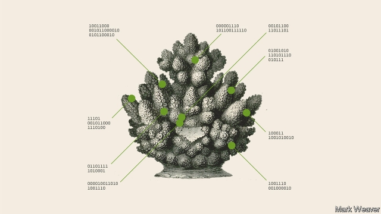
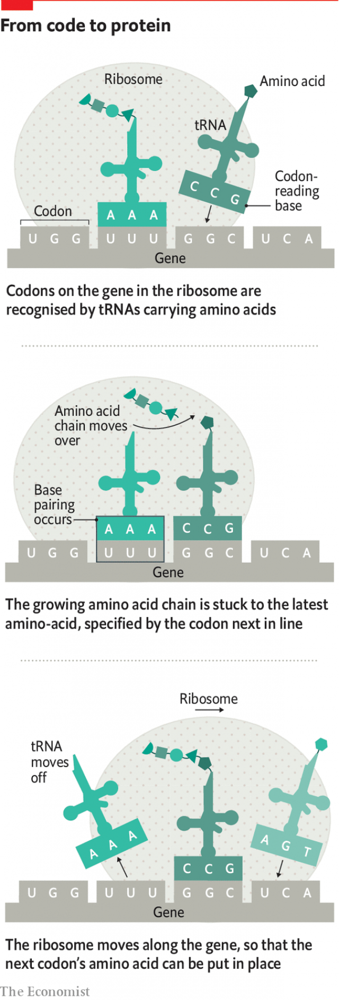

###### How it works

# Synthetic biology differs from everything that has come before 

##### And it starts with designing proteins from scratch 

 

> Apr 4th 2019 

TO UNDERSTAND BIOLOGY, synthetic or otherwise, you have to understand how proteins are made. Proteins, which carry out almost all the basic functions of life, from respiration to reproduction, are all made of 20 smaller molecules strung together into a chain. The shapes those chains fold up into in order to fulfil different functions are complex and incredibly hard to predict. But they are almost all entirely determined by the order of these smaller molecules, which are called amino acids. 

The gene for a given protein is simply the list, in order, of the amino acids needed to make it. This information is written down in the genome as a sequence of DNA bases—A, C, T and G, the letters on the ticker-tape—in the same way data in a computer are stored as a string of 1s and 0s. The program that turns these DNA sequences into sequences of amino acids is the genetic code. It assigns a fixed amino-acid meaning to each of the 64 different three-letter words (such as ACT or CTG), known as “codons”, that can be made using DNA’s four bases. 

Imagine a codebook with codons in one column and the names of the amino acids in another. To decode a gene, look up its codons one by one and write down their amino-acid meanings. It is a simple, rule-based undertaking—an algorithm. The cell carries out the same algorithm. But instead of a code book which matches codons to amino acids, it uses codon-recognising, amino-acid-carrying molecules called tRNAs and a mechanism called a ribosome which provides a place for those tRNAs to interact with a copy of the gene. The act of reading the gene, codon by codon, is the act of creating the protein, amino acid by amino acid (see diagram). 

 

When it executes an algorithm this way, biology looks like computer science. But it is important to appreciate that biology does not deal with information the way humans do. In human programs, the logic and the machinery that acts on it are kept separate. Computer users can change a program in blithe ignorance of the physical principles and peculiarities built into the hardware that it runs on. But evolution cares nothing for such distinctions. All its processing is just a matter of molecules interacting—the way that tRNAs stick to codons as if to velcro, the way the shape of the ribosome forces amino-acids together, and so on. From the simple gene-to-protein translation of the ribosome to the extraordinary synchronised symphony which turns a fertilised egg into a whole human, biological information and its implementation are all but inseparable. Life runs not on software and hardware, but in allware. That makes it highly resistant to human reprogramming. 

It can, though, be hacked. From the 51 amino acids of human insulin, which in 1978 became the first product made by the first biotech company, Genentech, to artificial antibodies containing more than a thousand of the things, biotechnology consists almost entirely of getting cells to produce proteins they would not normally make by cutting a gene out of one organism and dumping it, often unceremoniously, into another. 

Most of these proteins have been natural ones. Nature is well stocked with proteins that do useful things—regulate blood sugar, kill pests or break down grime on laundry. Putting the genes for such proteins into the genomes of bacteria that will then secrete insulin, or of crops that need pest resistance, or fermentation tanks churning out supplements for detergent, was an obvious moneymaker. But the preference for the natural was, until recently, also driven by necessity. Designing a protein from scratch was impossibly hard. So was getting suites of proteins from different sources to work together. 

That is no longer true. Protein design and DNA synthesis now make it possible to produce proteins that, separately or together, do things nature does not. They remain imperfect. But because DNA sequences are cheap it is possible to try out lots of variations to see which actually work. 

Thus, for example, there are companies working on new metabolic pathways which combine enzymes freshly discovered through the sequencing of ever more genomes, enzymes long understood and enzymes significantly re-engineered. It is an exacting craft, or art; it requires not just finding the right enzymes but also bringing about the carefully balanced levels of gene expression needed if a dozen or more of them are to work together, not to mention tweaking the underlying metabolism to prevent things produced by the new pathway from disrupting those already there. But if the work is done well, it seems now to be the case that more or less any small molecule found in nature can be made by yeast or bacteria in a fermentation tank. 

Two particularly interesting possibilities are the cannabinoids made by marijuana and the variations on opium and morphine made by poppies. Cannabinoids come in a remarkably wide number of forms, some psychoactive, some not, some therapeutic, some not, many legal for some purposes in some jurisdictions, many illegal for all purposes elsewhere. A set of cannabinoid-synthesising pathways described by Dr Keasling and colleagues this February offers therapeutic and recreational possibilities along these lines which will be explored by a new company called Demetrix. A hugely ambitious 20-protein pathway capable of producing morphine and its relatives, developed by a former student of Dr Keasling’s, Christina Smolke, offers perhaps more profound possibilities. Dr Smolke has founded a company, Antheia, which aims to use her new know-how to make opiates that are cheaper and so more accessible to the tens of millions around the world unable to get pain relief, and also to make opiates that are less addictive. 

A more radical possibility, at least in terms of chemistry, than remaking and improving natural compounds is to create enzymes to catalyse chemical reactions nature never carries out. Take the task of sticking a carbon atom to a silicon atom. Human chemists are pretty good at this, and the organo-silicon compounds they thus create are used in electronics, pharmaceuticals, building materials, breast implants and more. Nature, though, does not use carbon-silicon bonds, and so no natural enzymes make them. 

In 2016 Frances Arnold, of Caltech, corrected nature’s deficit, using evolution to create an enzyme which stuck silicon to carbon and opened up a whole new realm of chemistry to biology. She now guides her directed-evolution technique, which won her a Nobel prize in 2018, with machine learning, the better to alleviate the watchmaker’s blindness. She believes that synthetic biology can in principle create enzymes for most of the reactions today’s chemists bring about with rare catalysts, high temperatures and pressures, or environmentally unfriendly solvents. 

As well as making new proteins, it is also possible to make new RNAs. This is how CRISPR gene-editing works. A molecule of RNA is created that velcroes itself to a specific sequence in the genome; a companion protein then slices through the bit of DNA thus highlighted. Once the DNA is broken, a new gene, or gene fragment, can be inserted into the gap. If you put a gene describing the CRISPR RNA and its protein into a cell in such a way that it gets expressed only under certain conditions, you have a cell whose genome can be reprogammed by remote control. 

If you write an organism’s genome from scratch you can make it easier to mess around with in a number of ways. A coalition of ten laboratories around the world is currently rewriting the entire genome of Saccharomyces cerevisiae, brewer’s yeast, in order to make it an even better test bed for genetic research than it already is. To this end they are carefully stitching together the most appropriate versions of over 6,000 genes as well as most of the sometimes vital gubbins found between them—over 12m bases of DNA in all. One of the things the project is writing into the genome is a system that will make it cut itself up and reshuffle its genes when told to. This technology should provide a powerful new tool for the study of evolution, says Tom Ellis of Imperial College, London. 

A deeper way in which what is known as “Sc2.0” differs from Saccharomyces cerevisiae proper is that it operates with a slightly different genetic code. Three of DNA’s 64 codons describe not an amino acid but an action: specifically, “stop”. These three codons—TAG, TAA and TGA—tell the ribosome and its tRNAs: “This is the end of the gene. Add no more amino acids, we’re done with this one.” In the re-engineered yeast, though, only two of these three stop codons are used. Wherever the natural, baseline yeast genome marks the end of a protein-coding sequence with a TAG codon, the scientists writing Sc2.0 use one of the other stop codons, TAA or TGA. This means that in Sc2.0 TAG means nothing—and so can be made to mean something new. 

Nature uses 20 amino acids in its proteins. But there are hundreds of others that could be used, some of which would confer interesting new properties. In Sc2.0 it will be possible to make the TAG codon “mean” one of these other amino acids by designing a new tRNA molecule that recognises the codon and new enzymes to stick an amino acid to that molecule. Cells thus equipped will be able to use an amino acid no natural cell has ever used before. 

Nor does the process have to stop there. The genetic code uses 61 codons to code for just 20 amino acids; in some cases there are six codon “synonyms” for a given amino acid. Writing an organism’s DNA in a form missing particular synonyms is a compositional task similar to choosing to avoid using a common linguistic symbol, such as “e”, in a short bit of writing; the upshot may look slightly ungainly, but you can do it. Rewrite the code with fewer synonyms, and you have more codons to devote to non-canonical amino acids. One therapeutic option this might open up is drugs that bacterial defences cannot cope with. Bacteria have evolved to counter everyday proteins; put in amino acids they have never seen before and some of those defences no longer work. 

Bespoke genetic codes have attractions beyond a larger vocabulary. It is the universality of today’s genetic code that allows viruses to force the cells which they attack to do their bidding, making their viral proteins from their viral genes. A genome that uses a different genetic code would be impregnable to such attack; the virus’s genes would no longer describe the proteins it needs. Recoding could thus make cells immune to any viral attack; indeed, there is already work on achieving this in bacteria. 

If it works, this sort of recoding could be very helpful to existing biotechnology. Fermentation tanks that never get wiped out by infections and antibody-producing cell lines that could not harbour viruses would be a great boon. It is possible to imagine changes in the way codons code for amino acids so radical that parts of synthetic biology become a separate creation, parallel biospheres based on the original but no longer in contact with it, populated by creatures which neither infect nor are infected, that are linked to the rest of life only through the intentionality of design. 

A hint of such strangeness could be seen in a paper published in Science, a journal, this January by Stephen Benner of the Foundation for Applied Molecular Evolution in Florida and his colleagues. They have created double helices in which the existing bases, A, T, C and G, are supplemented by Z, P, S and B. This hachimoji (“eight letters”) DNA offers much denser data storage than evolution has had at its disposal for the past 4bn years. With eight letters to play with, for example, you could recode the genome to use doublets, rather than triplets, as codons, if you redesigned the ribosome, the tRNAs and a bunch of other stuff, too. 

Would anyone want to? The potential of the existing code is enormous, the range of proteins it can, in principle, describe is barely yet explored; there might seem to be no need for such showing off. At the same time, engineers do like to tinker. 

-- 

 单词注释:

1.APR[]:[计] 替换通路再试器 

2.respiration[.respә'reiʃәn]:n. 呼吸, 一口气, 呼吸作用 [化] 呼吸 

3.reproduction[.ri:prә'dʌkʃәn]:n. 再现, 复制, 生殖, 繁殖, 复制品 [医] 生殖, 复现(心理) 

4.incredibly[in'kredәbli]:adv. 不能相信地 

5.entirely[in'taiәli]:adv. 完全, 全然, 一概 

6.amino['æminәu]:a. 氨基的 [医] 氨基 

7.genome['dʒi:nәum]:[化] 基因组 [医] 染色体组 

8.DNA[]:脱氧核糖核酸 [计] 无效数据, 数字网络体系结构, 分布式网络体系结构 

9.C[si:]:[计] 调用, 访问, 呼叫；电容, 进位, 通道, 字符, 清除, 常数, 控制, 周期；C 程序设计语言 [化] 碳的化学符号; 胞苷 

10.'nt[]:abbr. 【化】同“niton” [网络] 新台币；神经降压素(Neurotensin)；中和试验(neutralization test) 

11.G[dʒi:]:[计] 千兆, 吉, 图形, 网格, 接地 [化] 鸟苷 

12.datum['deitәm]:n. 论据, 材料, 资料, 已知数 [医] 材料, 资料, 论据 

13.ctg[]: [医][=cardiotachometer]心动计数器, 心率计 

14.codon['kәudәn]:n. 密码子 [化] 密码子 

15.codebook['kəʊdbʊk]:n. 电报密码本 

16.decode[di:'kәud]:vt. 解码, 译解 [计] 译码 

17.algorithm['ælgәriðm]:n. 算法 [计] 算法 

18.tRNA[]:[化] 转移核糖核酸; 转移RNA 

19.mechanism['mekәnizm]:n. 机械, 机构, 结构, 机理, 技巧 [化] 机理; 历程; 机构 

20.ribosome['raibәsәum]:n. 核糖体 [化] 核蛋白体; 核糖核蛋白体; 核糖体 

21.interact[.intәr'ækt]:vi. 互相影响, 交互作用 n. 幕间剧, 幕间休息 

22.machinery[mә'ʃi:nәri]:n. 机器, 机械装置, 机构 [化] 机械 

23.blithe[blaið]:a. 愉快的, 高兴的 

24.ignorance['ignәrәns]:n. 无知, 愚味 [法] 无知, 不知情, 愚昧 

25.peculiarity[pi.kju:li'æriti]:n. 特质, 特性, 怪癖 

26.velcro[]:n. 维可牢（一种尼龙搭扣的商标名称） 

27.synchronise['siŋkrәnaiz, 'sin-]:vi. (使)同时发生, (使)整步, (使)同步, (使)同速进行 vt. 使在时间上一致, 校准, 把钟表拨至相同的时间, 把...并列对照 

28.fertilise['f\\:tilaiz]:vt. 使肥沃, 施肥于, 使多产, 使丰富, 使受精 

29.biological[.baiәu'lɒdʒikәl]:a. 生物学的 [医] 生物学的 

30.implementation[.implimen'teiʃәn]:n. 安装启用, 实行, 履行 [计] 实施; 实现 

31.inseparable[in'sepәrәbl]:a. 不能分的 [化] 不可分的 

32.reprogram['ri:prәu^ræm]:[计] 可改编程序, 重编程序 

33.hack[hæk]:n. 劈, 砍, 砍痕, 出租车, 干咳, 晒架, 鹤嘴锄 vt. 劈, 砍, 出租, 用旧 vi. 劈, 砍, 干咳, 驾驶出租车 a. 出租的 

34.insulin['insjulin]:n. 胰岛素 [化] 胰岛素 

35.biotech['baɪəʊtek]:n. 生物技术 

36.genentech[]:[网络] 基因泰克；基因技术公司；基因泰克公司 

37.antibody['æntibɒdi]:n. 抗体 [化] 抗体 

38.biotechnology[.baiәutek'nɔlәdʒi]:n. 生物工艺学；生物技术 

39.unceremoniously[ˌʌnˌserəˈməʊniəsli]:adv. 无礼地, 粗鲁地, 唐突地 

40.grime[graim]:n. 尘垢, 煤尘, 污点 vt. 使污秽, 使...弄脏 

41.secrete[si'kri:t]:vt. 隐秘, 隐藏, 隐匿, 分泌 [医] 分泌 

42.fermentation[,fә:men'teiʃәn]:n. 发酵 [化] 发酵 

43.churn[tʃә:n]:n. 搅乳器 v. 搅拌, 搅动 

44.detergent[di'tә:dʒәnt]:n. 清洁剂 [化] 洗涤剂 

45.moneymaker[ˈmʌnimeɪkə(r)]:n. 很会赚钱的人 

46.impossibly[im'pɒsәbli]:adv. 不可能地, 难以置信地 

47.synthesis['sinθisis]:n. 综合, 组织, 综合体 [化] 合成 

48.imperfect[im'pә:fikt]:a. 不完美的, 不完整的, 减弱的, 未完成过去时的 n. 未完成体 

49.metabolic[.metә'bɒlik]:a. 变化的, 变形的, 新陈代谢的 [医] [新陈]代谢的 

50.pathway['pɑ:θwei]:n. 路径, 途径 [医] 路径, 道 

51.enzyme['enzaim]:n. 酶 [化] 酶 

52.freshly['freʃli]:adv. 新, 新近, 精神饱满 

53.significantly[]:adv. 值得注目地；意味深长地 

54.carefully['kєәfuli]:adv. 小心地, 谨慎地 

55.tweak[twi:k]:n. 拧, 扭, 焦急 vt. 扭, 开足马力 

56.underlie[.ʌndә'lai]:vt. 位于...之下, 成为...的基础 

57.metabolism[mi'tæbәlizm]:n. 新陈代谢, 变态 [化] 新陈代谢; 代谢 

58.disrupt[dis'rʌpt]:a. 分裂的, 中断的 vt. 使分裂, 使瓦解 

59.les[lei]:abbr. 发射脱离系统（Launch Escape System） 

60.yeast[ji:st]:n. 酵母 [化] 酵母 

61.cannabinoids[kænəbɪ'nɔɪdz]: [医]大麻素类 

62.marijuana[.mæriju'ɑ:nә]:n. 大麻 [医] 大麻 

63.opium['әupjәm]:n. 鸦片 [化] 阿片; 鸦片 

64.morphine['mɒ:fi:n]:n. 吗啡 [化] 吗啡 

65.poppy['pɒpi]:n. 罂粟 [医] 罂粟 

66.cannabinoids[kænəbɪ'nɔɪdz]: [医]大麻素类 

67.remarkably[ri'mɑ:kәbli]:adv. 显著地, 引人注目地, 非常地 

68.psychoactive[,saikәu'æktiv]:a. 对神经起显著作用的, 对神经起特殊作用的 

69.therapeutic[.θerә'pju:tik]:a. 治疗的, 有益于健康的 [医] 治疗的; 治疗学的 

70.jurisdiction[.dʒuәris'dikʃәn]:n. 司法权, 审判权, 管辖权 [经] 法律管辖权, 审判权 

71.keasling[]:[网络] 凯瑟林；基斯林 

72.recreational[.rekri'eiʃәnәl]:a. 消遣的, 娱乐的 

73.hugely['hju:dʒli]:adv. 巨大地, 非常地 

74.ambitious[æm'biʃәs]:a. 有野心的, 抱负不凡的, 雄心勃勃的 

75.christina[kris'ti:nә]:n. 克里斯蒂娜（女子名） 

76.profound[prә'faund]:a. 极深的, 深厚的, 深刻的, 渊博的 

77.Antheia[]:[网络] 安忒亚 

78.opiate['әupiit]:n. 鸦片制剂, 镇静剂 a. 含鸦片的, 催眠的 vt. 使麻醉, 使缓和 

79.tens[]:十位 

80.addictive[ә'diktiv]:a. 上瘾的 

81.remake[ri'meik]:vt. 再作, 再制, 重作 n. 再制, 改作, 重制物 

82.catalyse[ˈkætəlaɪz]:v. 催化, 促成 

83.silicon['silikәn]:n. 硅 [化] 硅Si 

84.pharmaceutical[,fɑ:mә'sju:tikәl]:a. 药学的, 制药的, 药用的, 药物的, 药剂师的, 药师的 n. 药品, 成药, 药剂 

85.implant[im'plɑ:nt]:vt. 深植, 灌输, 嵌入 n. 植入物, 植入管 

86.arnold['ɑ:nәld]:n. 阿诺德（男子名） 

87.caltech['kæltek]:n. 加利福尼亚理工学院 

88.deficit['defisit]:n. 赤字, 不足额 [医] 短缺 

89.Nobel['nәubel]:n. 诺贝尔 

90.alleviate[ә'li:vieit]:vt. 减轻, 使缓和 

91.blindness['blaindnis]:n. 盲目, 失明, 愚昧 [医] 盲, 视觉缺失 

92.catalyst['kætәlist]:n. 触媒, 接触剂, 催化剂, 刺激因素, 促进因素 [计] 催化剂 

93.environmentally[]:adv. 有关环境方面 

94.unfriendly[.ʌn'frendli]:adv. 不友善地 

95.solvent['sɒlvәnt]:n. 溶剂 a. 有偿付能力的, 有溶解力的 

96.RNA[]:[医] 核糖核酸 

97.CRISPR[]:[网络] Clustered regularly interspaced short palindromic repeats; 短回文重复序列 

98.RNA[]:[医] 核糖核酸 

99.coalition[.kәuә'liʃәn]:n. 结合体, 结合, 联合 [经] 联合, 联盟 

100.currently['kʌrәntli]:adv. 现在, 当前, 一般, 普通 [计] 当前 

101.rewrit[]:[网络] 重写 

102.cerevisiae[]:[医] 啤酒, 麦酒 

103.gubbin[]: [人名] 格宾 

104.reshuffle[ri:'ʃʌfl]:vt. 重新洗牌, 改组, 撤换 n. 重新洗牌, 改组, 撤换 

105.tom[tɒm]:n. 雄性动物, 雄猫 

106.elli[]:n. (Elli)人名；(荷、意、芬、罗、土)埃莉(女名), 埃利；(俄)叶利 

107.imperial[im'piәriәl]:a. 帝王的, 宗主国的, 至尊的, 壮丽的 n. 特等品 

108.specifically[spi'sifikli]:adv. 特定地, 明确地, 按特性 

109.taa[]:abbr. turbine-alternator assembly 涡轮交流发电机装配 

110.baseline['beislain]:n. 基线, 基准 [计] 基线, 基准 

111.TGA[]:[化] 热重量法 

112.confer[kәn'fә:]:vt. 授予, 带来 vi. 协商 

113.tRNA[]:[化] 转移核糖核酸; 转移RNA 

114.synonym['sinәnim]:n. 同义词 

115.compositional[]:[计] 组合的 

116.linguistic[liŋ'^wistik]:a. 语言的, 语言学的 [计] 语言的, 语言学的 

117.E[i:]:[计] 元件, 部件, 元素, 误差, 执行, 表达式, 指数 

118.upshot['ʌpʃɒt]:n. 结果, 结局, (论证的)要点 

119.ungainly[.ʌn'geinli]:a. 难看的, 不优雅的, 粗陋的 

120.bacterial[bæk'tiәriәl]:a. 细菌的 [医] 细菌的, [无芽胞]杆菌的 

121.cannot['kænɒt]:aux. 无法, 不能 

122.bespeak[bi'spi:k]:vt. 预约, 订, 表示 n. 预约 

123.universality[.ju:ni'sæliti]:n. 普遍性, 一般性, 广泛性 [化] 普适性 

124.viral['vairәl]:a. 病毒的, 病毒引起的 [医] 病毒的 

125.impregnable[im'pregnәbl]:a. 无法攻取的, 坚强不屈的, 驳不倒的 

126.recode['ri:'kәud]:vi. 重新编码 

127.immune[i'mju:n]:a. 免疫的, 免除的, 不受影响的 n. 免疫者 

128.fermentation[,fә:men'teiʃәn]:n. 发酵 [化] 发酵 

129.infection[in'fekʃәn]:n. 传染, 影响, 传染病 [医] 传染, 感染 

130.boon[bu:n]:n. 恩惠 

131.creation[kri:'eiʃәn]:n. 创造, 创作物, 发明 [化] 产生 

132.biosphere['baiәsfiә]:n. 生物圈 [医] 生物圈, 生物层 

133.populate['pɔpjuleit]:vt. 使人口聚居在...中, 殖民于, 移民于, 居住于, 定居于 

134.intentionality[ɪnˌtenʃə'nælɪtɪ]: 意向性 

135.strangeness['streindʒnis]:n. 奇妙, 不可思议, 陌生 [化] 奇异性 

136.stephen['sti:vn]:n. 斯蒂芬（男子名） 

137.benner[]:本纳（人名） 

138.molecular[mә'lekjulә]:a. 分子的, 由分子组成的 [医] 分子的 

139.Florida['flɒridә]:n. 佛罗里达州 

140.helice[]:厚蟹 

141.Z[zed; (?@) zi:]:[计] 阻抗, 零, 零标志 [医] 原子序数 

142.p[pi:]:便士 [计] 页, 对, 并行, 奇偶性, 指示器, 多项式, 程序, 方法, 皮 

143.S[es]:[计] 标量, 服务员, 符号, 堆栈, 状态, 存储器, 开关, 同步, 系统 [医] 硫[黄](16号元素); 半; 骶骨的; 标记, 用法签; 光滑; 左的; 上转 

144.B[bi:]:[计] 基地址, 数据库, 基极, 二进制, 块, 字组, 布尔, 总线, 占线, 字节 [医] 硼(5号元素) 

145.dens[denz]:[医] 牙, 齿 

146.doublet['dʌblit]:n. 成对物, 偶极天线, 对称振子, 偶极子, 对偶物 [计] 二位字节 

147.triplet['triplit]:n. 三个一组, 三件一套, 三胞胎中的一个 [计] 三位字节 

148.redesign[,ri:di'zain]:[化] 重新设计 

149.tinker['tiŋkә]:n. 补锅匠, 会做各种修补活计的人 vi. 做焊锅匠, 笨拙的修补 vt. 修补 

