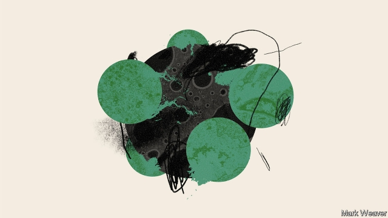
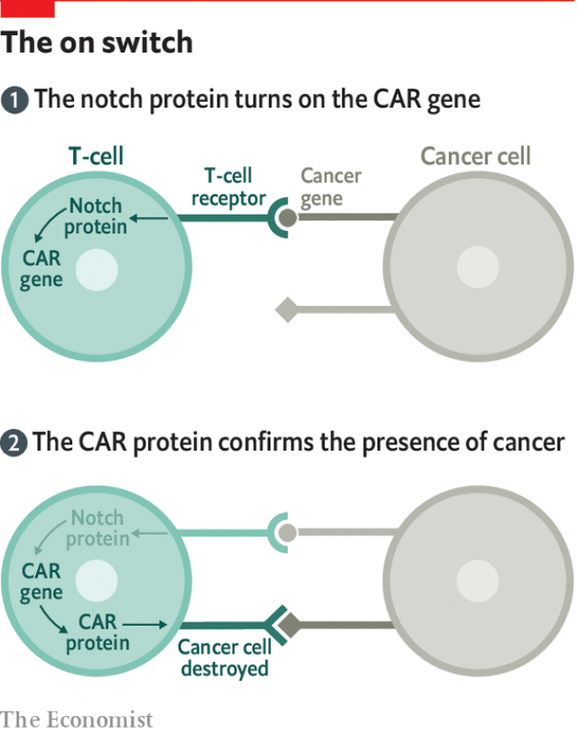

###### Applications

# The applications of synthetic biology are endless 

##### And plenty of them are already being used 

 

> Apr 4th 2019 

LIFE ON EARTH uses perhaps 5m different proteins. It is by no means clear what each of them does. In even the simplest bacterium there are proteins with jobs that scientists cannot identify—but which the bacterium clearly considers vital, since without the genes for those proteins it dies. 

But if many specifics are still hazy, the cumulative capability of all the things that natural proteins can do is well known: it is the living world. All the chemical and physical cleverness that life is capable of, from dandelion seeds to coral reefs, jellyfish to brains, is there because proteins did stuff. 

Proteins create the materials of wood and leaf, flesh and bone. A couple of blocks away from Zymergen a startup called Bolt Threads supplies the rag trade, and its own clothing subsidiary, with threads made of proteins from spider silk, and leather from fungal mycelia. As well as being able to explore new physical properties for such materials and, in principle, make them more cheaply, it is also able to offer them to people who object to having silk worms boiled and cattle skinned for their finery. Stella McCartney, a designer, is working with the firm to turn its materials into vegan-friendly fashions. 

Many companies are developing products that seek to mimic the taste or texture of meat. Impossible Foods, based across San Francisco Bay in Redwood City, relies on engineered microbes for bulk supplies of the leghemoglobin protein, normally found in the roots of some plants, that makes its completely plant-based “impossible burgers” bloody without the blood. Others, including Ginkgo, are working on similar products. Meat without livestock could, in principle, be a very climate-friendly technology. But for consumers who prize the environment and yet distrust genetic engineering, the technology may raise concerns. 

Some investors worry, too. Vijay Pande, who runs a biological-engineering fund at Andreesen Horowitz, a venture-capital firm, sees in some plant-based foods echoes of the rush into biofuels that blighted synthetic biology’s early days. He hears of company founders who are basically trying to make mince, he says, which is a cheap product with which to compete. To earn money they will have to make a lot of hamburgers. That said, at least one company is working on synthetic foie gras, which might reduce the suffering of geese and sell at a luxurious price. 

With food and fabric already covered, and many of the existing 5m proteins still unexplored, it may be hard to imagine why anyone should want more proteins. But there is much more to investigate. Consider the class of all proteins containing 66 amino acids. Because there are 20 different amino-acid possibilities for each of the links in the chain, there are in principle 2066 such proteins. That is roughly the same as the number of subatomic particles in the visible universe. And a 66-amino-acid protein is a tiddler. 

It is into the cosmically vast sea of proteins nature has never made that David Baker of the University of Washington has set his course. In the 2000s Dr Baker was a world leader in the field of predicting what the structure of a natural protein would be on the basis of the order of its amino acids. This is a fiendishly difficult problem; the way the chains fold up is subject to incredibly subtle chemical forces that have very large effects. But the Baker lab got pretty good at it—good enough to spin out Arzeda, the proteindesign company. Five years ago Dr Baker decided it was time to use what he had learned not to understand old proteins, but to design absolutely new ones in shapes of his choosing which nature has never explored. 

One use for such shapes might be to encourage particular types of crystal lattice to grow. Some bacteria which live on plants have evolved proteins which produce a lattice similar enough to that in ice crystals to “seed” the growth of ice, making frost more likely. (Ski resorts now use such proteins to help make snow.) Proteins designed to seed the growth of other crystals could help in the formation of things more interesting than frost, like the atomic lattices of semiconductors used for computers. Another use might be to build molecular motors. Alexis Courbet in Dr Baker’s lab has created a protein wheel which can spin on an axle. There are already markets for such tiny pieces of machinery; $20bn a year is spent on the micro-electro-mechanical devices used in things such as mobile-phone motion sensors, car components and switches for optical circuits. Protein-based mechanisms could allow far higher levels of complexity, though probably not soon. 

Perhaps the most striking recent design in Dr Baker’s lab, though, is a set of proteins created by Zibo Chen. Like DNA molecules in their double helices, these proteins can stick to each other by means of molecular velcro (which is actually, as it is in DNA and RNA, a process called hydrogen bonding). But, also like DNA molecules, they will stick together only if the velcro on the two molecules is complementary. In DNA complementarity is about the sequence of bases. In proteins it is there in the shapes Dr Chen has given his proteins. He has made a family of 64 proteins each of which stick only to one other, making 32 pairs. 

Such designs could be used to make a protein’s function conditional—for example by designing a protein which cannot do its job unless an extra module is velcroed to it. Conditionality like this might provide a way to reprogram cells that does not need to engage with the mechanisms nature uses and so can be designed with the clear certainty of human software and hardware design. Reprogrammed cells are already influencing cancer therapy. 

The most striking recent development in cancer treatment re-engineers the immune system’s T-cells—cells which prowl through the body looking for proteins they don’t like on the surfaces of other cells. What is called CAR-T therapy starts with the gene for a chimeric antigen receptor (CAR), a protein which sits on the surface of a cell. It is possible to tailor this gene to decide what the protein it describes will recognise; for therapy the chosen target will be a protein specific to the patient’s cancer cells. Doctors take T-cells from the body, equip them with the gene for the cancer-recognising receptor, and then put them back in. When the CAR protein recognises a cancer cell from its telltale protein, it orders the T-cell to kill it. 

One of the problems that has dogged the development of CAR-T therapies is that the CARs’ recognition of cancers is not perfect, which means the T-cells can attack innocent bystander cells, causing severe, sometimes lethal, side-effects in some patients. This is where a system developed by Wendell Lim and his colleagues at the University of California, San Francisco, comes in. They improved the reliability of CAR-T cells using a synthetic version of a protein called Notch, which, like the CARs, generates a signal inside the cell when it recognises a protein outside it. 

 

Dr Lim and his team built a simple two-gene circuit (see diagram). One gene causes the cells to produce a Notch protein that recognises a specific molecule on the surface of cancer cells. The other produces a CAR which recognises a second such telltale. But the CAR gene will produce its protein only if it is switched on—and the signal that switches it on comes via the Notch protein. This means that the cell goes on its programmed rampage only if both the telltale signs are seen; the first activates the Notch which produces the CAR that recognises the second. Electrical engineers will recognise this as an AND gate: you need both of two inputs to be present if you want the output. 

Getting this seemingly straightforward system to work reliably in cells was hard. But once it was done, the value was obvious. In late 2017 the company Dr Lim had founded two years earlier to work on the problem, Cell Design Labs, was bought by Gilead, a therapeutics company, in a deal worth $567m—more than 16 times what had been invested in Cell Design Labs up to that point. 

Dr Lim is now investigating the possibility of slightly more complex circuits, for example one that requires three simultaneous stimuli (in circuit speak, two AND gates) or one stimulus and either one of two others, but not both (an AND and an OR). Even very simple circuits might make cells into much more discriminating therapists. Cancer is not the only application. Diseases of the immune system might be treatable by cells taken out of the body, reprogrammed and put back in. “Regenerative therapies” which use stem cells—cells that can give rise to a number of different types of cell—to repair damaged tissue and organs might also benefit from programming which would tell the cells when and where to do their stuff. 

Michael Elowitz of Caltech, one of the inventors of the “repressilator” that was one of the first ever artificial genetic circuits, imagines a more radical system that needs no T-cells. Imagine putting the short-lived copies of the genes for a small genetic circuit into every cell in the body. One protein described would be lethal to the cell. A second protein might velcro itself to this first protein, perhaps using some of Dr Chen’s highly specific hydrogen bonding, in a way that usually stops the first protein from doing anything awful. But under some particular circumstances—if, for example, the cell were making a protein typical of cancer—the velcro would not stick, and the lethal protein would become active, killing the cell. 

A circuit that simple would be ludicrously dangerous; it would be like having a gun pointed at every cell in the body. But safeguards could be added, making the lethality conditional on more than one factor—just as the Notch system provides an extra level of control for CAR-T therapy for cancer. Dr Elowitz thinks it likely there is a whole new field of medicine to be built from such systems, one that cures not through small drugs that get everywhere, or more sophisticated proteins, such as antibodies, that target specific cells, but through cells that become medicines, or surgeons, themselves. 

New molecules developed by synthetic biology can in principle be turned to all the purposes—food, fabric, medicine, recreation, even, if applied to wood or coral, shelter—for which humans use the non-synthetic kind. But as Dr Courbet’s little nanomotors suggest, they might do even more. One of the most impressive possibilities is to use them to deal with the global glut of information. 

The world currently produces many exabytes (billions of gigabytes) of data a day, and it could produce a great deal more. One estimate suggests that driverless cars may produce 4,000 gigabytes each every day. Those are data that could be learned from, or used forensically after mishaps. 

But storage is an issue. Storing a day’s worth of the world’s data using the most high-density storage medium in current use would require enough very expensive magnetic tape to cover dozens of basketball courts. Alternatively, you could store all those trillions of ones and zeros in just 20 grams of DNA. You could put everything that happened in a century into a single warehouse and expect it to last fundamentally uncorrupted for thousands of years. No other memory system comes close. And that is before you start to factor in adding hachimoji bases to increase the density. 

Last year Dr Carlson of BioEconomy worked with Microsoft on a project that showed how data could be coded into DNA and retrieved from it using a scheme like that employed by memory chips. Other researchers have suggested that some simple forms of data processing could even be carried out on data while they are stored in DNA form. 

The problem, Dr Carlson points out, is that DNA synthesis currently costs a million times too much for this to be an affordable way of storing data. But being a million times too expensive is not necessarily the hurdle it used to be. Machines that sequence DNA got much more than a million times cheaper between 1995 and 2015; sequencing is now so cheap that in 2020, two decades after the first announcement of a human genome being sequenced, people at the J. Craig Venter Institute in San Diego talk of sequencing a million of them. And big computer companies have a record of getting technologies to improve exponentially for as long as that improvement is physically possible: that is how they managed to live by Moore’s law for so long. It is not a coincidence that, after Ginkgo and their billion-base contract, the second-biggest customer at Twist, a leading DNA-synthesis firm, is Microsoft. 

-- 

 单词注释:

1.APR[]:[计] 替换通路再试器 

2.cannot['kænɒt]:aux. 无法, 不能 

3.hazy['heizi]:a. 朦胧的, 模糊的, 烟雾弥漫的 

4.cumulative['kju:mjulәtiv]:a. 累积的 [医] 蓄积的, 累积的 

5.capability[.keipә'biliti]:n. 能力, 性能, 约束力 [化] 能力 

6.cleverness[]:n. 机灵；聪明 

7.dandelion['dændilaiәn]:n. 药蒲公英 [化] 蒲公英 

8.reef[ri:f]:n. 暗礁, 礁, 缩帆 v. 缩(帆) 

9.jellyfish['dʒelifiʃ]:n. 水母, 海蜇, 意志薄弱的人 [医] 海蛰, 水母 

10.startup[]:[计] 启动 

11.subsidiary[sәb'sidiәri]:n. 子公司, 附件, 辅助者 a. 辅助的, 次要的, 津贴的 

12.fungal['fʌŋ^әl]:a. 真菌, 突然发生而迅速生长的东西, 真菌类植物, 海绵肿, 真菌类病害 [医] 真菌的, 霉菌的 

13.mycelia[mai'si:liә]:mycelium 的复数 

14.cheaply['tʃipli]:adv. 便宜地 

15.finery['fainәri]:n. (华丽的)装饰, (华丽的)服饰, 鲜艳服装, 幽雅, 精炼炉 [化] 木炭吹炼炉; 木炭精炼炉 

16.stella[]:[医] 星状绷法; 星 

17.McCartney[]:n. 麦卡特尼（男子名） 

18.designer[di'zainә]:n. 设计者, 谋划者, 制图者 [计] 设计员 

19.mimic['mimik]:a. 模仿的, 摹拟的 n. 效颦者, 模仿者, 小丑, 仿制品 vt. 模仿, 摹拟 

20.texture['tekstʃә]:n. (织物的)密度, (材料等的)结构, 纹理 [化] 纹理 

21.san[sɑ:n]:abbr. 存储区域网（Storage Area Networking） 

22.francisco[fræn'siskәu]:n. 弗朗西斯科（男子名, 等于Francis） 

23.redwood['redwud]:n. (美国)红杉, 红树 

24.microbe['maikrәub]:n. 微生物, 细菌 [医] 微生物 

25.leghemoglobin[,le^hi:mә'^lәubin]:n. <美>[生化]豆血红蛋白 

26.burger['bә:ɡә]:n. 汉堡包（等于hamburger） 

27.bloody['blʌdi]:a. 血腥的, 嗜杀的, 有血的 

28.Ginkgo['^iŋk^әu]:[化] 银杏属 

29.distrust[dis'trʌst]:n. 不信任 vt. 不信任 

30.investor[in'vestә]:n. 投资者 [经] 投资者 

31.vijay[]:n. 维贾伊（男子名） 

32.pande[]: [人名] 潘德; [地名] [刚果民主共和国、坦桑尼亚] 潘代 

33.andreesen[]:[网络] 安德烈 

34.Horowitz[]:霍罗威茨 

35.biofuel[baiәu'fju:әl]:[机] 生物燃料 

36.blight[blait]:n. 枯萎病 vt. 使染上枯萎病, 破坏 vi. 枯萎 

37.founder['faundә]:n. 创立者, 建立者 vt. 使沉没, 使摔倒, 弄跛, 浸水, 破坏 vi. 沉没, 摔到, 变跛, 倒塌, 失败 

38.mince[mins]:n. 切碎物 vt. 切碎, 矫揉做作地说 vi. 碎步走, 装腔作势 

39.foie[]:n. 鹅肝酱；大嘴狼 

40.gra[]:abbr. （美）政府科学研究机构联合会（Governmental Research Association） 

41.luxurious[lʌg'zjuәriәs]:a. 豪华的, 奢侈的, 放纵的 

42.unexplored['ʌniks'plɔ:d]:a. 未勘查过的 

43.amino['æminәu]:a. 氨基的 [医] 氨基 

44.subatomic['sʌbә'tɔmik]:a. 逊原子的, 原子内的, 比原子更小的 [化] 亚原子的 

45.tiddler['tidlә]:n. [英口]小鱼；小孩儿 

46.cosmically['kɒzmikәli]:adv. 按照宇宙法则, 大规模 

47.david['deivid]:n. 大卫；戴维（男子名） 

48.baker['beikә]:n. 面包师 [医] 烤箱(骨科用) 

49.Washington['wɒʃiŋtn]:n. 华盛顿 

50.fiendishly['fi:ndiʃli]:adv. 恶魔似, 极坏, 残忍, 凶恶, (非正式)非常聪明, 不简单, 不平凡 

51.incredibly[in'kredәbli]:adv. 不能相信地 

52.subtle['sʌtl]:a. 敏锐的, 精细的, 狡猾的, 稀薄的, 灵巧的, 微妙的 [医] 锐敏的; 精细的 

53.lattice['lætis]:n. 格子, 组合格子, 格子状东西 vt. 制做格子, 使成格子状 [计] 格 

54.molecular[mә'lekjulә]:a. 分子的, 由分子组成的 [医] 分子的 

55.alexi[]:亚历克西（男子名） 

56.courbet[]:n. (Courbet)人名；(法)库尔贝 

57.axle['æksl]:n. 轴, 车轴 [电] 轴 

58.machinery[mә'ʃi:nәri]:n. 机器, 机械装置, 机构 [化] 机械 

59.sensor['sensә]:n. 传感器 [计] 检测器 

60.mechanism['mekәnizm]:n. 机械, 机构, 结构, 机理, 技巧 [化] 机理; 历程; 机构 

61.complexity[kәm'pleksiti]:n. 复杂, 复杂性, 复杂的事物 

62.Zibo[]:[网络] 淄博；中国；耿 

63.chen[]:n. 陈 

64.DNA[]:脱氧核糖核酸 [计] 无效数据, 数字网络体系结构, 分布式网络体系结构 

65.helice[]:厚蟹 

66.velcro[]:n. 维可牢（一种尼龙搭扣的商标名称） 

67.RNA[]:[医] 核糖核酸 

68.complementary[.kɒmpli'mentәri]:a. 补充的, 补足的 [经] 补足的, 补充的 

69.complementarity[.kɒmplimen'tæriti]:n. 互补性, 互为补充 [经] 互补性 

70.module['mɒdju:l]:n. 组件, 模数 [计] 模块 

71.velcroed[]:[网络] 天鹅绒 

72.conditionality[kәn.diʃә'næliti]:n. 受限制性, 制约性 

73.reprogram['ri:prәu^ræm]:[计] 可改编程序, 重编程序 

74.therapy['θerәpi]:n. 治疗 [医] 疗法, 治疗 

75.immune[i'mju:n]:a. 免疫的, 免除的, 不受影响的 n. 免疫者 

76.prowl[praul]:n. 潜行, 徘徊, 悄悄踱步 vi. 潜行以觅食, 徘徊 vt. 徘徊 

77.chimeric[kai'merik]:a. 妄想的, 荒诞不经的 

78.antigen['æntidʒәn]:n. 抗原 [化] 抗原 

79.receptor[ri'septә]:n. 受体, 感觉器官 [化] 接受器; 受体 

80.telltale['telteil]:n. 搬弄是非者, 迹象, 指示器 a. 搬弄是非的, 泄露秘密的, 报警的 

81.bystander['baistændә(r)]:n. 旁观者, 目击者 [法] 候补陪审员, 旁观者 

82.lethal['li:θәl]:a. 致命的 n. 致死因子 

83.wendell['wendl]:n. 温德尔（男子名） 

84.lim[]:abbr. 潜象存储器（Latent Image Memory）；秘鲁利马机场的代号 

85.California[.kæli'fɒ:njә]:n. 加利福尼亚 

86.notch[nɒtʃ]:n. 刻痕, 等级, 峡谷 vt. 刻凹痕, 用刻痕计算, 赢得 

87.rampage['ræmpeidʒ]:n. 乱闹, 乱冲, 暴跳 vi. 乱闹, 狂暴 

88.activate['æktiveit]:vt. 使活动, 使激活, 正式建成 vi. 有活力 

89.seemingly['si:miŋli]:adv. 看来似乎, 表面上看来 

90.reliably[ri'laiәbli]:adv. 可靠地, 可信赖地 

91.gilead[]: [地名] [美国] 吉利厄德 

92.therapeutics[.θerә'pju:tiks]:n. 治疗学 [医] 治疗学; 疗法, 治疗 

93.simultaneous[.simәl'teinjәs]:a. 同时的, 同时发生的 [计] 同时的 

94.stimulus['stimjulәs]:n. 刺激, 激励, 刺激品 [医] 刺激特, 刺激 

95.discriminate[dis'krimineit]:v. 区别, 差别待遇 

96.therapist['θerәpist]:n. 治疗学家 [医] 治疗学家 

97.treatable[]:a. 好对付的, 能处理的, 能治疗的 

98.regenerative[ri'dʒenәreitiv]:a. 再生的, 更生的, 更新的 [医] 再生的 

99.michael['maikl]:n. 迈克尔（男子名） 

100.caltech['kæltek]:n. 加利福尼亚理工学院 

101.repressilator[]:[网络] 镇压器 

102.ludicrously['lu:dɪkrəslɪ]:adv. 滑稽地, 荒唐地 

103.safeguard['seifgɑ:d]:n. 保卫, 保护措施, 防护设施 vt. 保卫, 保护 

104.lethality[li'θæliti]:n. 致死性 [医] 致死率 

105.conditional[kәn'diʃәnl]:a. 有条件的, 有前提的 [电] 有条件的 

106.sophisticate[sә'fistikeit]:n. 久经世故的人, 精于...之道的人 vt. 篡改, 曲解, 使变得世故, 掺合, 弄复杂 vi. 诡辩 

107.antibody['æntibɒdi]:n. 抗体 [化] 抗体 

108.nanomotors[]:[网络] 纳米电机 

109.glut[glʌt]:n. 大量, 供过于求 vt. 使充满, 使吃饱, 过多供应 vi. 吃得过多, 狼吞虎咽 

110.currently['kʌrәntli]:adv. 现在, 当前, 一般, 普通 [计] 当前 

111.exabyte[]:[计] E字节 

112.gigabyte[]:n. 吉字节 [计] 千兆字节 

113.datum['deitәm]:n. 论据, 材料, 资料, 已知数 [医] 材料, 资料, 论据 

114.driverless[d'raɪvərles]: 无人驾驶的 

115.forensically[fɔ'rensik]:adv. forensic（法庭的, 法庭用的；法医的；公开辩论的, 论争的）的变形 

116.mishap['mishæp]:n. 不幸之事, 灾祸, 恶运 

117.alternatively[ɒ:l'tә:nәtivli]:adv. 非此即彼 

118.trillion['triljәn]:n. 大量 [经] 兆 

119.fundamentally[fʌndә'mentәli]:adv. 基础, 首要, 主要, 十分重要, 基本, 根本, 原始, 基频, 基音, 基谐波 

120.uncorrupted[.ʌnkә'rʌptid]:a. 未腐败的, 未堕落的, 廉洁的 

121.Carlson[]:n. 卡尔森（公司名）；卡尔松（姓氏） 

122.Microsoft[]:n. (美国)微软公司 [电] 微软公司 

123.chip[tʃip]:n. 屑片, 薄片, 碎片 vt. 削, 切, 削成碎片, 使摔倒, 凿 vi. 削下屑片 [计] 孔屑; 组件; 晶片; 芯片 

124.synthesis['sinθisis]:n. 综合, 组织, 综合体 [化] 合成 

125.affordable[]:[计] 普及型 

126.hurdle['hә:dl]:n. 障碍, 跳栏, 临时活动篱笆 vt. 用篱笆围, 越过, 克服 

127.genome['dʒi:nәum]:[化] 基因组 [医] 染色体组 

128.j[dʒei]:n. 字母j 

129.craig[krei^]:n. 克雷格（男子名） 

130.venter['ventә]:n. 腹部, 腹, 子宫, 生母 [医] 腹; 子宫; 窝, 凹 

131.diego[]:n. 迭戈（男子名） 

132.exponentially[ˌekspə'nenʃəlɪ]:adv. 以指数方式 

133.physically['fizikli]:adv. 按自然规律, 完全地, 实际上, 真正地, 身体上地 

