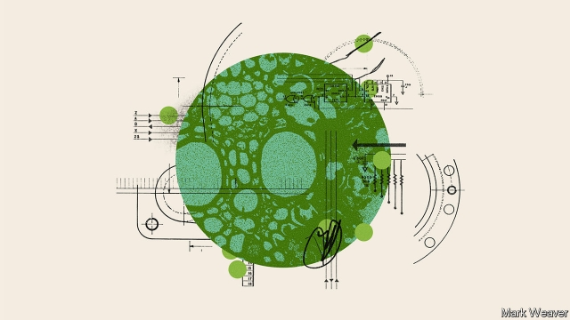
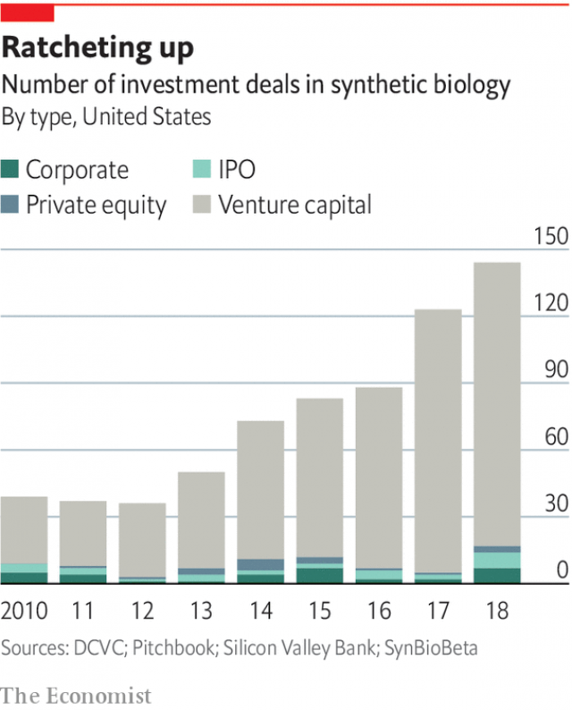

###### Synthetic biology

# The engineering of living organisms could soon start changing everything 

##### Synthetic biology has only just begun, says Oliver Morton 

 

> Apr 4th 2019 

BIOLOGY IS A way of structuring matter at a molecular scale by slotting each atom into its needful place. It is a way of controlling flows of energy on every scale from that of the smallest living cell to that of the whole living planet. It is a way of growing order and surprise in a universe that in all other respects tends towards entropic stagnation. And it is a thicket of limits on how long lives can last and how much life can accomplish. 

It is also a way of packing 3,500 excited young people into the Hynes Convention Centre in Boston, Massachusetts. More than 300 teams from 42 countries took part in the annual International Genetically Engineered Machine (iGEM) competition there last October. By encouraging such teams to co-operate and compete in its Grand Jamboree, the iGEM foundation is hoping to create a framework for a synthetic-biology industry which combines molecular biology and engineering to achieve specific goals. Over the summer the young people went from an idea about something biological that might meet a human need, to designing new genes and seeing how well their ideas worked. 

The projects presented to judges and peers at iGEM covered a remarkable range. There was an attempt to give bacteria a human sense of smell; there were fungi that could be used to build bases on Mars. The Great Bay team of Chinese high-school students won an award for synthesising the active ingredient of catnip in yeast and bacteria; they think it may help programmes which round up stray cats. Post graduates at the University of Marburg won an award for new genetic tools that will make a very fast-growing bacterium, Vibrio natriegens, easier for other engineers to use. 

Not all iGEM projects pan out; one of the things teams learn is that, though engineering organisms is now possible, it is still difficult. Life can be very recalcitrant. Even so, there are already 32 startups around the world that began life as iGEM teams. Ginkgo Bioworks, a firm which grew out of teams from MIT that competed in 2004 and 2006, builds new organisms for clients in agriculture and the chemicals industry at an astonishing rate in its labs on the other side of Boston. It has attracted $429m of investment. 

However, the Grand Jamboree is not primarily a route to riches. It is a celebration, and an exploration, of technology that will, in time, change the living world far beyond the test tube. Human engineering of the inanimate has produced a range of wonders from cities of towering glass to the fused sand that sits at the heart of computers. It is entirely plausible that engineering the animate could produce wonders as great and as various—and as unimaginable today as skyscrapers and silicon chips were 200 years ago. 

Humans have been turning biology to their own purposes for more than 10,000 years. They have reshaped crops and livestock through selective breeding and changed the structure of ecosystems by moving species around—most notably in the “Columbian exchange” that mixed together the fauna and flora of the New World and the Old. Having learned, in the 1950s, that genes were written on long molecules of DNA like stock prices on tickertape, by the 1970s scientists were able to start to move traits from organisms in which they evolved to organisms in which they could be useful by cutting and pasting pieces of that tickertape. That ability became the basis of the biotechnology industry. 

The key enabling technology for synthetic biology is the ability to write new chemical messages on to fresh bits of tickertape, rather than just move nature’s old messages from genome to genome. Machines capable of synthesising DNA letter by letter started to appear in the late 1980s. A decade later there were companies offering to write out almost any sequence of DNA letters you asked for and courier them straight to you. No longer limited by the genes they found in nature, biologists were able to get cells to work in whole new ways—to reprogram them. 

That new ability underlay the three turn-of-the-century academic trends which came together to form synthetic biology. One of these was centred on engineers at MIT who had, from the 1960s to 1980s, pioneered the computer and internet revolutions. The plummeting price of DNA-sequencing technology—machines that have only to read, as opposed to write, the tickertape of life, and thus work a lot faster—made it obvious to them that biology, like computing, was based on digital code and capable of making progress at exponential speeds. From this they concluded that cells could, in principle, be engineered in the same way that circuits and software are. 

Programming in nature is extremely convoluted, having evolved with no intention or guidance. And there is no helpful manual. But if you could synthesise genes that provided new, simpler ways of doing things, you would be liberated from having to understand the old ones. Life could be transformed into something more amenable to an engineering approach, with well-defined standardised parts. Tom Knight, one of the pioneers at MIT, and his colleagues saw in this sort of biological engineering something similarly world-changing to their work on the early internet and pre-PC computer workstations. And they found a generation of eager students whose first great “wow” moment in the cinema had been the re-engineered dinosaurs of “Jurassic Park”. 

The second ingredient that went into synthetic biology came from academics who were thinking along similar lines in the opposite direction; instead of trying to work round natural mechanisms they wanted to work towards recreating them. They were particularly interested in the systems by which cells turn genes on and off. Only when a gene is on, or “expressed”, will a cell make the protein described by that gene’s tickertape sequence. When it is turned off, or “repressed”, the protein’s production stops. Because proteins are the molecules that carry out almost all the tasks that go on in a cell, which genes are expressed when is fundamental to how cells work—and to how a brain cell, say, differs from a muscle cell, or a cancer cell from a healthy one. 

In 2000 two teams published designs for novel genetic “circuits” with which they could control the expression of one gene with a protein made by another. In one of the gene circuits the carefully fashioned genetic switches flicked each other on and off over time. Genetic circuitry like this “repressilator” was child’s play compared with the co-ordinated gene expression that evolution has programmed into leaves and eyes. But as one of the creators of the repressilator suggested, perhaps with Richard Dawkins’s metaphor of evolution as a blind watchmaker in mind, “at this stage one can learn more by putting together a simple if inaccurate pendulum clock than one can by disassembling the finest Swiss timepiece.” 

The third ingredient was more practical: metabolic engineering. Life uses proteins called enzymes, which catalyse chemical reactions, to build all the other molecules it needs, with a different enzyme for each step of the construction. Sometimes the end product of such a metabolic pathway is something humans have a use for, such as a hormone, an antibiotic or a pesticide. 

Being able to write DNA from scratch allowed metabolic engineers to bring together genes from a number of different organisms to build new pathways, thus offering the prospect of making molecules beyond the reach of chemistry for less than the cost of harvesting them from plants. The most striking project, led by Jay Keasling, a professor at the University of California, Berkeley, was a pathway which created a precursor to artemisinin, a molecule made by a plant called Chinese sweet wormwood that had been discovered to be a very good malaria drug. It was impossible to make the molecule by other means. 

As DNA synthesis became more widely available in the early 2000s, the various ways it could engineer new capabilities into organisms came together. By 2002 engineering undergraduates at MIT were using genes bought online to transform bacteria. In 2003 Dr Keasling and colleagues founded a company, Amyris, with an eye to making artemisinin and other useful stuff. The first international conference on synthetic biology took place at MIT the following year, a few months before the first iGEM Jamboree. 

The media got wind of the excitement. It was not just that synthetic biology seemed like the sort of thing from which weapons could be made. Scientists playing God is always good copy, even if the creations were, as yet, mostly microbes. Rarely has science offered such a heady scent of Goddishness—with forbidden-fruit undertones of Frankenstein and Faust—and raised so many ethical dilemmas. Drew Endy, a charismatic young leader in the MIT group, talked of “reimplementing life in a manner of our choosing” and shaking off the constraints of evolution. George Church of Harvard talked of synthesising not just genes but whole genomes, including, perhaps, those of creatures now extinct. The mammoth might return. 

Amid all this revolutionary talk, young companies in the field made a fateful decision to plunge into biofuels. It seemed a noble undertaking: biofuels could usher in the new technology of life while making good the damage done by the old technology of industrial machines. And governments were keen to subsidise them. But scaling up the pathways that produced hydrocarbons by the gram in the lab to the scale of millions of litres proved even more difficult than expected. The capital expense was huge. Worse, the oil price fell steeply. The projects failed. 

That made investors very cautious about synthetic biology. But the field attracted a bit of support from some governments, such as those of Britain and Singapore. In America the Pentagon’s far-out-ideas department, DARPA, which had taken an early interest, created a new office of biology in 2013. Two years later it launched a programme that paid for leading laboratories in the field to put together pathways which could produce 1,000 molecules never created biologically before. 

In January 2019 the 1,000th of those molecules was made. It seems an auspicious omen. In the past few years synthetic biology has shown signs of starting to live up to its promise. In part this is because of sustained academic effort and its cumulative gains; in part it is a matter of startup companies in the field finding their feet. But other factors are at play, too. 

One was new gene-editing technologies—ways of doctoring existing tickertape a letter at a time. In 2000 there was none; now there is a whole range, and those based on a molecule called CRISPR have proved particularly powerful and easy to use (it was a big part of the Marburg team’s victorious iGEM project). This has breathed new life into the idea of making precise changes to genomes, which is what synthetic biology is all about. It has opened new fields for biological research and new investors’ wallets (see chart). 

 

No one saw CRISPR coming. The falling cost of DNA synthesis, on the other hand, was widely foreseen. But it has still been a dramatic enabler. The price of a gene synthesised to order is about a thousandth of what it was in 2000; if you buy in bulk or have the technology in-house it can cost a lot less. 

And then there is machine learning. Synthetic biology gets even greater benefits than most other industries from the recent growth in the capabilities of pattern-recognition programs. It is not just that laboratories produce reams of data with which to train such programs. In a paper in 2005 Dr Endy noted that “the designs of natural biological systems are not optimised by evolution for the purposes of human understanding.” That is a problem for humans interpreting data and asking questions. For machines, though, understanding is as unnecessary as it is impossible. They just find patterns and uncover rules. This is not science as scientists understand it. But, if rigorously tested, such rules can still be a basis for engineering. There were perfectly good rules for building bridges long before there was a theory of gravity. 

While synthetic biology has grown more capable, the promise of two older approaches to the improvement of life has diminished. One, the pharmaceutical industry, seems bound by Eroom’s law (Moore’s law backwards); the number of new drugs developed per billion dollars of R&D spending falls remorselessly. It was ten in 1970. It is well under one today, and still dropping. 

This has excited interest in fundamentally new approaches to medicine. One is reprogramming cells to do helpful therapeutic things. Immune-system cells are the most obvious candidates. The cells of the microbiome—the interlinked bacterial ecosystems that thrive on skin and in guts—are another possibility. 

The second ailing improver of life is the petrochemical industry. Synthetic biology’s push into biofuels was not fundamentally misguided; fossil hydrocarbons do have to be replaced. The mistake was rushing into a bulk market with low margins: petrol. Some companies are now using synthetic biology to replace more upmarket molecules from the same crude oil which end up in fragrances and food additives with far more added value. Others are looking at making plastics environmentally friendly. As their technologies prove themselves at increasing scales, and as their technical prowess allows them to expand their repertoire to cheaper bulk products, these efforts could eat the petrochemical industry from within like some world-saving parasitic wasp. 

Synthetic-biology executives say their worry is not money, but focus and time. Every firm has more revolutionary-looking projects than it can pursue. And no one knows how long it will take the projects to pay off. As the gnomic aphorism at the end of Mr Endy’s emails has it: “Our victory inevitable. Our timing uncertain”. 

-- 

 单词注释:

1.oliver['ɒlivә]:n. 脚踏铁锤 

2.morton['mɔ:tən]:n. 莫顿（男子名） 

3.APR[]:[计] 替换通路再试器 

4.molecular[mә'lekjulә]:a. 分子的, 由分子组成的 [医] 分子的 

5.slot[slɒt]:n. 水沟, 细长孔, 硬币投币口, 缝, 狭槽, 狭通道, 位置, 一档(广播节目等) vt. 开槽于, 把...纳入机构 [计] 槽; 存储槽 

6.needful['ni:dful]:a. 必要的, 需要的 

7.entropic[en'trəʊpɪk]:a. 熵的 

8.stagnation[stæg'neiʃәn]:n. 淤塞, 停滞 [医] 停滞, 滞留, 郁积 

9.thicket['θikit]:n. 丛林, 草丛 

10.Hynes[]:n. (Hynes)人名；(英)海因斯 

11.Boston['bɒstәn]:n. 波士顿 

12.Massachusetts[.mæsә'tʃu:sits]:n. 麻萨诸塞州 

13.genetically[]:adv. 创始, 遗传学, 生殖, 基因, 遗传, 发生 

14.iGEM[]:[网络] 国际遗传工程机器设计竞赛；机器设计大赛；国际基因工程机器设计竞赛 

15.jamboree['dʒæmbә'ri:]:n. 大喝大闹, 大集会, (童子军)欢乐的聚会 

16.biological[.baiәu'lɒdʒikәl]:a. 生物学的 [医] 生物学的 

17.peer[piә]:n. 同等的人, 匹敌, 贵族 vi. 凝视, 窥视, 费力地看, 隐现 vt. 与...同等, 封为贵族 

18.fungus['fʌŋgәs]:n. 真菌, 真菌类植物 [医] 真菌, 霉菌, , 蕈, 海绵肿 

19.mar[mɑ:]:vt. 损毁, 损伤, 糟蹋 n. 三月 

20.synthesise['sinθisaiz]:vt.vi. 综合, 合成, 接合 vt. 用合成法合成, 综合地处理 

21.catnip['kætnip]:n. 假荆芥, 樟脑草 [医] 樟脑草(潞州荆芥) 

22.yeast[ji:st]:n. 酵母 [化] 酵母 

23.stray[strei]:n. 走失的家畜, 浪子 a. 迷途的, 偶然的 vi. 迷路, 彷徨, 流浪 

24.Marburg['mɑ:b\\:^, 'mɑ:rbjrk]:disease[医]马尔堡病,青猴病 

25.Vibrio['vibriәu]:[医] 弧菌属 

26.recalcitrant[ri'kælsitrәnt]:a. 反抗的, 反对的, 顽抗的 n. 反抗者, 顽抗者 

27.startup[]:[计] 启动 

28.Ginkgo['^iŋk^әu]:[化] 银杏属 

29.mit[mit]:n. 手, 连指手套, 棒球手套, 拳击手套, 马萨诸塞理工学院, 麻省理工学院 vt. 与...握手, 用手铐铐住, 逮捕 [计] 麻省理工学院, 模块化智能终端 

30.client['klaiәnt]:n. 客户, 顾客, 委托人 [计] 客户, 客户机, 客户机程序 

31.riche[]:n. 暴发户 

32.exploration[.eksplә'reiʃәn]:n. 探险, 踏勘, 探测 [医] 探察 

33.inanimate[in'ænimәt]:a. 失去知觉的, 没生命的, 无精打采的 [医] 无生命的, 无生机的 

34.fuse[fju:z]:n. 保险丝, 导火线 v. 熔化, 融合 

35.entirely[in'taiәli]:adv. 完全, 全然, 一概 

36.plausible['plɒ:zibl]:a. 貌似真实的, 貌似合理的, 说得煞有其事的 [法] 花言巧语的, 似乎有理的 

37.animate['ænimeit]:vt. 使有生气, 赋予生命 a. 有生命的, 有生气的 

38.unimaginable[.ʌni'mædʒinәbl]:a. 不能想象的, 不可思议的 

39.silicon['silikәn]:n. 硅 [化] 硅Si 

40.chip[tʃip]:n. 屑片, 薄片, 碎片 vt. 削, 切, 削成碎片, 使摔倒, 凿 vi. 削下屑片 [计] 孔屑; 组件; 晶片; 芯片 

41.reshape[ri:'ʃeip]:vt. 改造, 使成新的形状, 打开新局面 vt. 整形 vi. 整形 [计] 整形 

42.selective[si'lektiv]:a. 选择的, 选择性的 [经] 选择的, 选择性的 

43.ecosystem['i:kәu.sistәm]:n. 生态系统 [医] 生态系 

44.specie['spi:ʃi]:n. 硬币 [经] 硬币 

45.notably['nәjtbәli]:adv. 显著地, 著名地, 尤其, 特别 

46.Columbian[kә'lʌmbiәn]:a. 哥伦比亚的, 哥伦布的, 美国的 

47.fauna['fɒ:nә]:n. 动物群 [医] 动物区系 

48.flora['flɒ:rә]:n. 植物群 [医] 植物区系, 植物丛, 植物群, 菌丛 

49.DNA[]:脱氧核糖核酸 [计] 无效数据, 数字网络体系结构, 分布式网络体系结构 

50.tickertape['tɪkəteɪp]:n. （电报、电传机等用的）纸带, （供欢迎名人时抛用的）彩色纸带 

51.trait[treit]:n. 特征, 特性, 一笔, 少许 

52.pasting['peistiŋ]:n. 裱糊, 涂；粘合 

53.biotechnology[.baiәutek'nɔlәdʒi]:n. 生物工艺学；生物技术 

54.genome['dʒi:nәum]:[化] 基因组 [医] 染色体组 

55.courier['kuriә]:n. 送快信的人, 伴游服务员 [法] 信使, 送急件者 

56.biologist[bai'ɒlәdʒist]:n. 生物学家 [医] 生物学家 

57.reprogram['ri:prәu^ræm]:[计] 可改编程序, 重编程序 

58.underlie[.ʌndә'lai]:vt. 位于...之下, 成为...的基础 

59.plummete[]:[网络] 直线下降 

60.computing[kәm'pju:tiŋ]:[计] 计算 

61.exponential[.ekspәu'nenʃәl]:a. 指数的 n. 指数 [计] 指数 

62.convolute['kɒnvәlu:t]:v. 回旋, 卷绕, 盘旋 a. 旋绕的 

63.amenable[ә'mi:nәbl]:a. 服从的, 会接纳的, 有义务的 [法] 服从的, 有责任的, 有服从义务的 

64.standardise[]:vt. 使与标准比较, 用标准校验, 使符合标准, 使统一, 使标准化 

65.tom[tɒm]:n. 雄性动物, 雄猫 

66.knight[nait]:n. 骑士, 爵士 vt. 授以爵位 

67.workstation['wә:k.steiʃәn]:n. 工作站 [计] 工作站 

68.wow[wau]:interj. (非正式)哇 n. 巨大的成功, 轰动一时的成功, 十分有趣的事物 [计] WIn32上的Windows 

69.Jurassic[dʒu'ræsik]:a. 侏罗纪的, 侏罗系的 n. 侏罗纪 

70.mechanism['mekәnizm]:n. 机械, 机构, 结构, 机理, 技巧 [化] 机理; 历程; 机构 

71.recreat[]:[网络] 同上；有无法重建 

72.repress[ri'pres]:vt. 镇压, 抑制, 压制 vi. 压制 

73.carefully['kєәfuli]:adv. 小心地, 谨慎地 

74.flick[flik]:n. 快速的轻打, 轻打声, 弹开 v. 轻弹, 轻轻拂去, 忽然摇动 

75.circuitry['sә:kitri]:n. 电路学, 电路系统 [电] 一环路 

76.repressilator[]:[网络] 镇压器 

77.Creator[kri:'eitә(r)]:n. 上帝, 创造者, 创作者 

78.richard['ritʃәd]:n. 理查德（男子名） 

79.metaphor['metәfә]:n. 隐喻 

80.watchmaker['wɒtʃ.meikә]:n. 钟表匠 

81.inaccurate[in'ækjurit]:a. 错误的, 不准确的 [化] 不精确 

82.pendulum['pendʒәlәm]:n. 钟摆, 摇锤, 摇摆不定的事态(或局面) [化] 摆 

83.disassemble[.disә'sembl]:vt. 解开, 拆开 

84.timepiece['taimpi:s]:n. 时钟, 钟 

85.metabolic[.metә'bɒlik]:a. 变化的, 变形的, 新陈代谢的 [医] [新陈]代谢的 

86.enzyme['enzaim]:n. 酶 [化] 酶 

87.catalyse[ˈkætəlaɪz]:v. 催化, 促成 

88.pathway['pɑ:θwei]:n. 路径, 途径 [医] 路径, 道 

89.hormone['hɒ:mәun]:n. 荷尔蒙 [化] 激素(旧称荷尔蒙) 

90.antibiotic[.æntibai'ɒtik]:n. 抗生素 a. 抗生的 

91.pesticide['pestisaid]:n. 杀虫剂 [化] 农药 

92.les[lei]:abbr. 发射脱离系统（Launch Escape System） 

93.jay[dʒei]:n. 鸟, 喋喋不休的人, 傻瓜 

94.keasling[]:[网络] 凯瑟林；基斯林 

95.California[.kæli'fɒ:njә]:n. 加利福尼亚 

96.berkeley['bɑ:kli, 'bә:kli]:n. 伯克利（姓氏）；贝克莱（爱尔兰主教及哲学家）；伯克利（美国港市） 

97.precursor[.pri:'kә:sә]:n. 先驱者, 前导, 前兆 [化] 前体; 前身; 产物母体 

98.artemisinin[]:n. 青蒿素（抗疟药）；青蒿提取物 

99.wormwood['wә:mwud]:n. 苦艾, 苦恼 [医] 苦艾 

100.malaria[mә'lєәriә]:n. 疟疾, 瘴气 [医] 疟[疾] 

101.synthesis['sinθisis]:n. 综合, 组织, 综合体 [化] 合成 

102.capability[.keipә'biliti]:n. 能力, 性能, 约束力 [化] 能力 

103.online[]:[计] 联机 

104.Amyris[]:[医] 阿米香树属 

105.alway['ɔ:lwei]:adv. 永远；总是（等于always） 

106.creation[kri:'eiʃәn]:n. 创造, 创作物, 发明 [化] 产生 

107.microbe['maikrәub]:n. 微生物, 细菌 [医] 微生物 

108.heady['hedi]:a. 顽固的, 任性的, 性急的, 猛烈的 

109.undertone['ʌndәtәun]:n. 低音, 浅色, 小声 

110.frankenstein['fræŋkәnstain]:n. 自己所创造而无法控制的事物, 人形的怪物, 作法自毙者 

111.ethical['eθikәl]:a. 伦理的, 民族的, 民族特有的 [医] 伦理的, 道德的 

112.endy['endi]:裂断丝绞 

113.charismatic[,kæriz'mætik]:a. 魅力, 能吸引大众的非凡能力, 神授的能力, 领袖人物感人的超凡魅力 

114.reimplementing[]:[网络] 重新实现 

115.constraint[kәn'streint]:n. 强制, 约束 [计] 约束 

116.george[dʒɔ:dʒ]:n. 乔治（男子名）；自动操纵装置；英国最高勋爵勋章上的圣乔治诛龙图 

117.Harvard['hɑ:vәd]:n. 哈佛大学 

118.mammoth['mæmәθ]:n. 猛犸, 庞然大物 a. 猛犸似的, 巨大的 

119.amid[ә'mid]:prep. 在其间, 在其中 [经] 在...中 

120.fateful['feitful]:a. 宿命的, 重大的, 决定性的 

121.biofuel[baiәu'fju:әl]:[机] 生物燃料 

122.usher['ʌʃә]:n. 引座员, 招待员 vt. 引导, 招待 vi. 作招待员 

123.subsidise[]:vt. 给...补助金, 津贴, 资助 

124.hydrocarbon[.haidrәu'kɑ:bәn]:n. 碳氢化合物 [化] 烃; 碳氢化合物 

125.steeply['sti:pli]:adv. 险峻地 

126.investor[in'vestә]:n. 投资者 [经] 投资者 

127.Singapore[.siŋgә'pɒ:]:n. 新加坡 

128.DARPA[]:[计] 美国国防部高级研究计划局 

129.biologically[]:adv. 生物学, 生态学 

130.auspicious[ɒ:'spiʃәs]:a. 吉兆的, 幸运的 

131.omen['әumәn]:n. 预兆, 前兆, 征兆 vt. 预示, 有...的前兆, 显出...的预兆 

132.cumulative['kju:mjulәtiv]:a. 累积的 [医] 蓄积的, 累积的 

133.doctore[]:[网络] 多科特；多克托 

134.CRISPR[]:[网络] Clustered regularly interspaced short palindromic repeats; 短回文重复序列 

135.enabler[]:n. 使能器, 使能者；促成者, 赋能者 

136.thousandth['θauzndθ]:a. 第一千的, 千分之一的 

137.ream[ri:m]:n. 令, 大量 vt. 扩(孔), 榨取, 挖 

138.datum['deitәm]:n. 论据, 材料, 资料, 已知数 [医] 材料, 资料, 论据 

139.optimise['ɒptɪmaɪz]:vt. 使最优化, 使尽可能有效 

140.rigorously[]:adv. 严厉地；残酷地 

141.diminish[di'miniʃ]:v. (使)减少, (使)变小 

142.pharmaceutical[,fɑ:mә'sju:tikәl]:a. 药学的, 制药的, 药用的, 药物的, 药剂师的, 药师的 n. 药品, 成药, 药剂 

143.backwards['bækwәdz]:adv. 向后 

144.remorselessly[rɪ'mɔ:sləslɪ]:adv. 冷酷地, 无悔意地 

145.fundamentally[fʌndә'mentәli]:adv. 基础, 首要, 主要, 十分重要, 基本, 根本, 原始, 基频, 基音, 基谐波 

146.therapeutic[.θerә'pju:tik]:a. 治疗的, 有益于健康的 [医] 治疗的; 治疗学的 

147.interlink[.intә'liŋk]:vt. 把...互相连结 n. 连环 

148.bacterial[bæk'tiәriәl]:a. 细菌的 [医] 细菌的, [无芽胞]杆菌的 

149.ailing['eiliŋ]:a. 生病的 [医] 患病的, 病痛的 

150.improver[im'pru:vә]:n. 改良者, 改善者 [化] 改进剂; 助发剂; 助白剂 

151.petrochemical[.petrәu'kemikәl]:a. 石化的, 石化制品的, 岩石化学的 n. 石化产品 

152.misguide[mis'gaid]:vt. 误导 

153.fossil['fɒsәl]:n. 化石, 古物 a. 化石的, 陈腐的, 守旧的 

154.upmarket[ˌʌpˈmɑ:kɪt]:a. 高级的, 高档的, 高端的 

155.fragrance['freigrәns]:n. 芬芳, 香味 

156.additive['æditiv]:a. 添加的, 附加的, 加法的, 累积的 n. 添加物 

157.environmentally[]:adv. 有关环境方面 

158.prowess['prauis]:n. 英勇, 勇敢, 超凡技术 

159.repertoire['repәtwɑ:]:n. 全部剧目, 全部技能, 全部节目, 全部作品 

160.parasitic[,pærә'sitik]:a. 寄生的, 由寄生虫引起的 [计] 寄生的 

161.wasp[wɒsp]:n. 黄蜂, 胡蜂, 易怒的人, 刻毒的人 [医] 胡蜂, 黄蜂 

162.gnomic['nәumik]:a. 格言的, 含格言的 

163.aphorism['æfәrizm]:n. 格言, 警语 

164.timing['taimiŋ]:n. 时间选择, 时间测定, 定时, 调速 [计] 定时器时钟 

