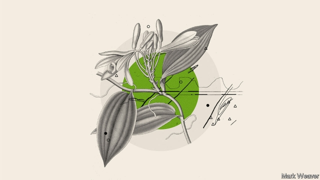

###### The future

# What is life for? 

##### The engineering of DNA raises some big questions about life on Earth 

 

> Apr 4th 2019 

THOSE GIVEN to grand statements about the future often proclaim this to be the century of biology in the same way that the 20th century was that of physics and the 19th was the century of chemistry. Synthetic biology’s potential provides a basis for such boosterism; life reprogrammed to produce useful new products, take new forms and act in helpful ways. 

Honouring that promise will not be easy. Understanding biology’s capacity to process information, and thus control itself, is a much more challenging puzzle than mastering the parcelled world of software and hardware. Taking years to create a working AND gate is therapeutically very promising. But it is a very small step on the way to controlling life as a coder controls a computer. 

Still, the fact that synthetic biology recapitulates some early aspects of the computer revolution should not lead people to ignore crucial differences. One is that those who created the modern world of computers did not have powerful computers to help them in their task. Today’s synthetic biologists do. Their work builds on, and grows out of, the computer revolution, and this may speed it up a lot. Frances Arnold of Caltech compares life’s programming to a symphony composed by evolution, and today’s biology by design as being roughly at the level of learning to hold the composer’s pencil. That is why she likes to harness evolution to remake things, rather than design from scratch. But it is evolution that is guided with machine learning and directed by human creativity to write songs that humans want. 

People have imagined such things before. In the early 20th century scientists and writers inspired by the new power of genetics described “biotopias” eerily reminiscent of the dreams of synthetic biology. In H.G. Wells’s “Men Like Gods” (1923) plants “had been trained and bred to make new and unprecedented secretions, waxes, gums, essential oils and the like, of the most desirable quality”, which could serve as a slightly flowery mission statement for half the companies in this TQ. In Charlotte Perkins Gilman’s “Herland” (1915), a race of parthenogenetic women live in a cornucopian Eden they have fashioned through science to meet their every need. 

As Jim Endersby, a historian, points out, some aspects of these biotopias shock modern sensibilities. For one thing, their inhabitants engineer themselves, as well as their environments, in a way that eugenicists like Wells saw as entirely unproblematic. It was the treatment of people as means not ends in this way that Aldous Huxley rebelled against in his own contribution to the genre, “Brave New World”(1932). Synthetic biology will certainly get caught up in the post-eugenic discussions of such matters that CRISPR has brought to the fore today. 

Other now-alien attitudes in those early biotopias also throw light on today’s arguments. Wells and Gilman saw no problem with deliberately exterminating species; it was a reasonable, even natural, imposition of beneficial order. Today such possibilities are being discussed for real, but with a lot less equanimity. “Gene drives”—genetic systems which, seemingly paradoxically, use sexual transmission to spread sterility—offer a way that CRISPRtechnologies might be used to try to wipe out disease vectors, such as the species of mosquito that spread malaria. 

Some look at a death toll of hundreds of thousands of people a year and see in this an elegant solution; there are plenty of non-malarial species of mosquito around to pick up any ecological slack. Others ask by what right they might bring an extinction about, what risks they would expose other less dispensable insects to and what sort of informed consent they might possibly get. Steered by this discussion, research on gene drives—funded by, among others, the Bill and Melinda Gates Foundation—is increasingly, and wisely, focused on ways to break chains of transmission by crashing mosquito populations locally and temporarily, rather than globally, for ever. Insect populations so depleted that there are no longer enough to feed the summer swallows—a feature of Wells’s biotopia—is the sort of problem synthetic biologists talk of putting right by cutting back on the need for pesticides, not something they would seek to engineer. 

It is not just that today’s biotopians are averse to extinctions. Some talk of reversing them—of using the tools of their trade to bring back the passenger pigeon, the great auk, the woolly mammoth, the American chestnut and others. Genomes preserved in museums or permafrost can be sequenced, and the genomes found in related species reprogrammed to produce something similar. In a small gesture in this direction, Ginkgo has made a scent that smells of a type of hibiscus that is now extinct. 

This idea, too, meets with scepticism, even repugnance. Some feel that the results would be a Potemkin creation—new creatures that preserve a mere semblance of what has been lost, rather than restoring its essence. Some environmentalists also see it as a grotesque caricature of a problem that their movement has long suffered from: concentrating on a few high-profile species while ignoring the wholesale destruction of others that are less glamorous. But a recent report commissioned by the International Union for the Conservation of Nature found that conservation does need new tools, and synthetic biology offers opportunities in that respect—while also bringing with it risks, both direct and indirect, that need to be assessed on a case-by-case basis and in a precautionary way. Some conservationists are keen to see how well gene drives can wipe out invasive species on islands. 

That tools so radical might be used to conserve or preserve, not disrupt, might seem a bit of a contradiction—even perverse. But it is worth considering that the changes wrought by synthetic biology could refashion humankind’s relationship with the natural world at a technical and conceptual level and at the same time bring little dislocation to everyday life. As Kelly and Zach Weinersmith put it in their book “Soonish”, synthetic biology may be “like Frankenstein, except the monster spends the whole book dutifully making medicine and industrial inputs”. 

At a “Build-a-Cell” workshop in San Diego this February the assembled researchers noted how hard it was to communicate to the public the remarkable scope of their ambitions: creating genomes and the cells to house them from almost first principles. If you appreciate the conceptual bravura of an organism with no ancestors, or that even discussing such a thing would have seemed insane just 25 years ago, this is staggering. If you do not, such synthetic life seems just to be, well, more life. And life is both already a miracle and the most everyday one. Cell is a cell is a cell. 

It may be that the public is on to something. The application of genetic technology to human health and enhancement will be hotly debated. So will worries about how such technologies can be kept out of dangerous hands. But the fundamental change in the relation of the human and the natural may not seem so dramatic. 

Consider the Colombian exchange. Shuffling together the ecosystems of the New World and the Old was a huge event in terms of both biology and human history. It wiped out populations and overhauled ways of life. But today an Indian cooking with chilli, or a German smoking a pipe of tobacco, or a Mexican admiring a mustang running free give little thought to the alien biology they are using and appreciating. Synthetic biology’s innovations may be similarly woven into the background of the world, but without the concomitant suffering. 

Even the most gentle transformation in the relationship between people and nature, though, may bring harm to some. Interacting with nature is often something the poorest depend on most. If synthetic biology replaces prized natural products with cheaper artificial ones, it will break ties to nature that are both meaningful and economically important, particularly in the developing world. 

Take vanilla pods. The key flavour molecule in vanilla is already synthesised by chemists. Vanilla pods, though, contain a range of related molecules which provides something richer and consumers value them for that reason. Now synthetic biology might match or surpass nature’s subtlety. So Dr Endy, now at Stanford, expected remonstration when he met a Mexican vanilla farmer at a synthetic-biology discussion. Instead, he found a man enthused. Vanilla was not just his livelihood but also a cause for ceremony, a provider of solace, a source of stories. And synthetic biology used properly, he thought, would not replace it as such, but could instead enhance it. It could bring new subtleties to valued scents, welcome strangeness to a well-loved story. The connection between people and plant might be deepened, not displaced. 

It is easy to assume that reprogrammed life is a lesser life, innately commercial and desacrilised—that as the machineries of cell and laboratory become ever more tightly bound, they will squeeze out something that is human, or natural, or both, which ought to sit in the space between them. But it is also possible that a new appreciation can grow out of that space, a sense of what life is and could be, extended and enriched by new understanding. Think of it as a tune not yet composed, or the catnip scent of a lost flower reimagined and smelled, as if blooming for the first time. 

-- 

 单词注释:

1.DNA[]:脱氧核糖核酸 [计] 无效数据, 数字网络体系结构, 分布式网络体系结构 

2.APR[]:[计] 替换通路再试器 

3.physic['fizik]:n. 药品, 泻药, 医学 vt. 给...服药, 治愈, 使通便 

4.boosterism['bu:stərɪzəm]: 热心支持的表现 

5.reprogram['ri:prәu^ræm]:[计] 可改编程序, 重编程序 

6.therapeutically[,θerə'pju:tikli]: [医]adv.在治疗上 

7.coder['kәudә]:n. 编码器 [计] 编码员 

8.recapitulate[.ri:kә'pitjuleit]:v. 重述要点, 概括, 摘要 

9.biologist[bai'ɒlәdʒist]:n. 生物学家 [医] 生物学家 

10.arnold['ɑ:nәld]:n. 阿诺德（男子名） 

11.caltech['kæltek]:n. 加利福尼亚理工学院 

12.remake[ri'meik]:vt. 再作, 再制, 重作 n. 再制, 改作, 重制物 

13.creativity[.kri:ei'tiviti]:n. 创造力, 创造性 

14.eerily[]:a. 怪诞的；奇异的；可怕的 

15.reminiscent[.remi'nisnt]:a. 回忆的, 怀旧的 n. 往事叙述者, 回忆录作者 

16.hg[]:abbr. 标准德语（High German）；手摇发电机（Hand Generator） 

17.unprecedented[.ʌn'presidentid]:a. 空前的 [经] 空前的, 无前例的 

18.secretion[si'kri:ʃәn]:n. 分泌, 分泌物, 分泌液, 隐蔽 [医] 分泌; 分泌物 

19.flowery['flauәri]:a. 多花的, 绚丽的, 华丽的 

20.tq[]:abbr. 洽谈通（网上沟通软件）；关断时间；全人智商（Triune Intelligence） 

21.charlotte['ʃɑ:lәt]:n. 水果奶油布丁 

22.Perkins[]:n. 珀金斯（姓氏） 

23.herland[]:[网络] 她乡；她的国；女儿国 

24.parthenogenetic[,pɑ:θinәjdʒi'netik]:a. 单性生殖的, 孤雌生殖的 [医] 单性生殖的 

25.cornucopian[kɒːnjuˊkoupiәn]:a. 丰富的,丰饶的 

26.Eden['i:dn]:n. 伊甸园, 乐园 

27.jim[dʒim]:n. 吉姆（人名） 

28.historian[hi'stɒ:riәn]:n. 历史学家, 记事者 

29.sensibility[.sensi'biliti]:n. 感性, 感觉, 情感 [医] 感觉性, 感受性; 感觉, 感觉能力 

30.eugenicist[ju:'dʒenisist]:n. 优生学家 

31.entirely[in'taiәli]:adv. 完全, 全然, 一概 

32.unproblematic[ˌʌnˌprɒbləˈmætɪk]:a. 不成问题的, 没有疑问的 

33.Aldous['ɔ:ldәs, 'ældәs]:奥尔德斯(男子名) 

34.Huxley['hʌksli]:n. 赫胥黎, 生物学家 

35.genre['ʒɒŋrә]:n. 类型, 流派 

36.CRISPR[]:[网络] Clustered regularly interspaced short palindromic repeats; 短回文重复序列 

37.fore[fɒ:]:a. 在前的, 以前的 adv. 在前面, 在船头 prep. 在...前 

38.Gilman[]:n. (Gilman)人名；(英、俄)吉尔曼；(西)希尔曼 

39.exterminate[ik'stә:mineit]:vt. 扑灭, 消灭, 根绝 

40.specie['spi:ʃi]:n. 硬币 [经] 硬币 

41.imposition[.impә'ziʃәn]:n. 征收, 课税, 强加, 欺骗 [经] 征税, 税, 税款 

42.les[lei]:abbr. 发射脱离系统（Launch Escape System） 

43.equanimity[.i:kwә'nimiti]:n. 平静, 镇定, 沉着 

44.seemingly['si:miŋli]:adv. 看来似乎, 表面上看来 

45.paradoxically[]:adv. 反论, 荒谬, 自相矛盾, 似非而可能是 

46.vector['vektә]:n. 矢量, 传病媒介 vt. (用无线电)导引, 给...导航 [计] 矢量; 向量 

47.malaria[mә'lєәriә]:n. 疟疾, 瘴气 [医] 疟[疾] 

48.toll[tәul]:n. 通行费, 代价, 钟声 vt. 征收, 敲钟, 鸣钟, 勾引, 引诱 vi. 征税, 鸣钟 

49.ecological[.i:kә'lɒdʒikәl]:a. 生态学的, 主张生态保护的 [法] 生态的, 生态学的 

50.slack[slæk]:n. 松弛, 松懈, 淡季, 闲散, 家常裤 a. 松弛的, 不流畅的, 疏忽的, 无力的, 呆滞的, 软弱的, 漏水的 adv. 马虎地, 缓慢地 vt. 放松, 使缓慢 vi. 松懈, 减弱, 松弛 

51.extinction[ik'stiŋkʃәn]:n. 消失, 消灭, 废止 [化] 消光; 熄灭 

52.dispensable[dis'pensәbl]:a. 不是必要的, 可有可无的 

53.melinda[mә'lindә]:n. 梅林达（女子名） 

54.wisely['waizli]:adv. 聪明地, 精明地 

55.locally['lәukәli]:adv. 地方性地, 局部性地, 在当地 

56.temporarily['tempәrәrәli]:adv. 暂时, 一时, 临时 

57.globally[]:[计] 全局地 

58.deplete[di'pli:t]:vt. 耗尽, 使衰竭 [医] 排除, 减少 

59.pesticide['pestisaid]:n. 杀虫剂 [化] 农药 

60.averse[ә'vә:s]:a. 不愿意的, 反对的 

61.auk[ɒ:k]:n. 海雀 

62.woolly['wuli]:a. 羊毛制的, 模糊的, 似羊毛的, 蓬乱的 

63.mammoth['mæmәθ]:n. 猛犸, 庞然大物 a. 猛犸似的, 巨大的 

64.chestnut['tʃesnʌt]:n. 栗子, 栗树, 栗色 a. 栗色的 

65.genome['dʒi:nәum]:[化] 基因组 [医] 染色体组 

66.permafrost['pә:mәfrɔ(:)st]:n. [地]永久冻结带 

67.Ginkgo['^iŋk^әu]:[化] 银杏属 

68.hibiscus[hai'biskәs]:n. 木槿 

69.scepticism['skeptisizm]:n. 怀疑论, 怀疑主义 [医] 多疑癖 

70.repugnance[ri'pʌgnәns]:n. 反感, 厌恶, 不一致, 矛盾, 抵触 [法] 不一致, 矛盾, 不一致之处 

71.potemkin[]: 波特金（1739-1791,俄国陆军元帅） 

72.semblance['semblәns]:n. 外表, 伪装, 假象, 少量 

73.essence['esns]:n. 实质, 本质, 香精 [化] 香精 

74.environmentalist[in,vaiәrәn'mentlist]:n. 环保人士 

75.grotesque[grәu'tesk]:n. 奇异风格, 怪异图案 a. 奇怪的, 可笑的 

76.caricature['kærikәtʃә]:n. 讽刺画, 漫画, 漫画手法 vt. 画成漫画讽刺 

77.wholesale['hәulseil]:n. 批发 a. 批发的, 大规模的 adv. 大规模, 照批发方式 vi. 经营批发业, 批发 vt. 批发 

78.glamorous['glæmәrәs]:a. 富有魅力的, 迷人的 

79.precautionary[pri'kɒ:ʃәnәri]:a. 预先警戒的, 预防的, 留心的 

80.conservationist[,kәnsә'veiʃәnist]:n. 自然资源保护论者 

81.invasive[in'veisiv]:a. 侵入的, 侵略性的, 攻击性的 

82.disrupt[dis'rʌpt]:a. 分裂的, 中断的 vt. 使分裂, 使瓦解 

83.perverse[pә'vә:s]:a. 乖张的, 故意作对的, 有悖常情的, 执迷不悟的, 歪曲的, 错误的, 不正当的 [法] 邪恶的, 罪恶的:堕落的, 不合法的 

84.refashion[.ri:'fæʃәn]:vt. 再做, 重制 [经] 再做, 重制 

85.conceptual[kәn'septʃuәl]:a. 概念的 [医] 概念的 

86.dislocation[dislou'keiʃәn]:n. 脱臼, 转位, 混乱 [化] 位错; 转位 

87.Kelly['keli]:n. 凯利（男子名）；[古]战士 

88.Zach[zæk]:n. 扎克(Zachary,Zachariah的昵称, 亦作Zack,Zak)(m.) 

89.soonish[]:[网络] 这是我自己总结的；微尘 

90.frankenstein['fræŋkәnstain]:n. 自己所创造而无法控制的事物, 人形的怪物, 作法自毙者 

91.monster['mɒnstә]:n. 怪物, 恶人, 巨物 [医] 畸胎 

92.dutifully[]:adv. 忠实地；忠贞地 

93.san[sɑ:n]:abbr. 存储区域网（Storage Area Networking） 

94.diego[]:n. 迭戈（男子名） 

95.bravura[brә'vjuәrә]:n. 大胆的尝试；令人赞赏的演唱或演奏技巧 

96.insane[in'sein]:a. 患精神病的, 极愚蠢的 [医] 神经错乱的 

97.stagger['stægә]:n. 蹒跚, 踌躇 vi. 蹒跚, 犹豫 vt. 使摇摆, 使踌躇, 交错, 错开 a. 交错的, 错开的 

98.enhancement[in'hɑ:nsmәnt]:n. 提高, 美化, 增进, 增强, 增加 [计] 增强, 加强, 提高, 充实 

99.hotly['hɒtli]:adv. 暑热地, 激烈地, 热心地 

100.Colombian[kә'læmbiәn]:n. 哥伦比亚人 a. 哥伦比亚的 

101.shuffle['ʃʌfl]:n. 拖着脚走, 曳步, 混乱, 蒙混, 洗纸牌 v. 拖曳, 马虎地做, 笨手笨脚地穿(脱)衣, 推诿, 洗牌 [计] 混洗 

102.ecosystem['i:kәu.sistәm]:n. 生态系统 [医] 生态系 

103.overhaul[.әuvә'hɒ:l]:vt. 分解检查, 翻修, 精细检查, 彻底革新 n. 分解检查, 精细检查, 大检修 

104.chilli['tʃili]:n. 红辣椒 

105.mustang['mʌstæŋ]:n. 野马, (海军行伍出身的)军官 

106.alien['eiljәn]:n. 外国人, 外侨 a. 外国的, 相异的 

107.innovation[.inәu'veiʃәn]:n. 改革, 创新 [法] 创新, 改革, 刷新 

108.concomitant[kәn'kɒmitәnt]:a. 相伴的, 伴随的, 共存的 n. 伴随物 

109.interact[.intәr'ækt]:vi. 互相影响, 交互作用 n. 幕间剧, 幕间休息 

110.meaningful['mi:niŋful]:a. 意味深长的 

111.economically[i:kә'nɔmikәli]:adv. 节约地, 不浪费地, 节省地, 节俭地, 在经济上, 在经济学上 

112.pod[pɒd]:n. 豆荚, (豆荚状的)保护性外壳, 扁豆形矿体 vt. 从豆荚中剥出 vi. 结豆荚 

113.synthesise['sinθisaiz]:vt.vi. 综合, 合成, 接合 vt. 用合成法合成, 综合地处理 

114.surpass[sә'pɑ:s]:vt. 超越, 凌驾, 胜过 

115.subtlety['sʌtlti]:n. 微妙, 精明 

116.endy['endi]:裂断丝绞 

117.stanford['stænfәd]:n. 斯坦福（姓氏, 男子名）；斯坦福大学（美国一所大学） 

118.remonstration[.ri:mɒn'streiʃәn]:n. 抗议, 忠告, 规劝 

119.enthuse[in'θju:z]:vt. 使充满热情, 使感兴趣, 使热心 vi. 热心 

120.livelihood['laivlihud]:n. 生计, 营生, 生活 

121.provider[prә'vaidә]:n. 供应者, 供养人, 伙食承办人 [计] 提供器 

122.solace['sɒlis]:n. 安慰, 安慰之物 vt. 安慰, 抚慰, 给与安慰, 使轻松 

123.strangeness['streindʒnis]:n. 奇妙, 不可思议, 陌生 [化] 奇异性 

124.displace[dis'pleis]:vt. 移置, 替换, 转移 

125.lesser['lesә]:a. 较少的, 较小的, 次要的 

126.innately[]:adv. 天赋地；与生俱来的 

127.machinery[mә'ʃi:nәri]:n. 机器, 机械装置, 机构 [化] 机械 

128.tightly['taitli]:adv. 紧紧地, 坚固地 

129.enrich[in'ritʃ]:vt. 使富足, 使肥沃 

130.catnip['kætnip]:n. 假荆芥, 樟脑草 [医] 樟脑草(潞州荆芥) 

131.reimagine[]:[网络] 再定义 

