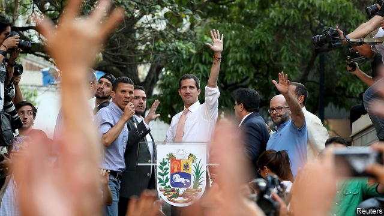

###### A resilient dictator

# America tries to unseat Nicolás Maduro 

##### Its plan does not seem to be working 

 

> Apr 4th 2019 

“NOBODY PREDICTED the date of the Russian revolution,” notes Elliott Abrams, Donald Trump’s special representative for Venezuela. “We have no ability to predict when regimes collapse. But we’re heightening the contradictions.” 

When Donald Trump’s administration recognised Juan Guaidó (pictured), the speaker of Venezuela’s national assembly, as the country’s interim president and imposed sanctions against the oil industry in January, some believed that the armed forces would quickly abandon Nicolás Maduro. But although living conditions are deteriorating, the regime shows no sign of imploding. Indeed, it is cautiously taking the offensive. It has arrested Roberto Marrero, Mr Guaidó’s chief-of-staff, has stripped Mr Guaidó of his political rights and may be poised to arrest him too. 

The Americans are pursuing their aim, which they describe as “constitutional regime change”, through a four-pronged strategy. The first prong is diplomatic: 54 countries now recognise Mr Guaidó as president. The second, and most important, is stronger sanctions. Those against PDVSA, the state oil monopoly, have halted its exports to the United States, which was almost its only cash buyer. This has forced PDVSA to sell oil at smaller profit to new, more distant clients, for example India. It has also made it harder for PDVSA to import diluents (needed to process its heavy oil) and diesel. That difficulty has contributed to two long power cuts across much of Venezuela in the past month. 

On March 22nd the Treasury added Venezuela’s state development bank to the list of bodies with which American financial institutions should have no dealings. This will “shut down their whole network of dollar transactions”, says a senior administration official. Individuals in the regime and family members, some of whom are studying at American universities, have had their bank accounts blocked and their visas revoked. 

The third prong is humanitarian aid. An attempt to take aid across a border bridge from Colombia was easily blocked by the regime. The Red Cross says it will start delivering aid this month on “a scale similar to Syria” to some 650,000 people. That represents a tacit climbdown by Mr Maduro, who has always denied the existence of a humanitarian emergency. Lastly, the American administration is trying to develop the capacity of Mr Guaidó’s team to rebuild Venezuela. 

Although the armed forces have stuck by Mr Maduro, the government does not trust them. Army units have their weapons locked up at night and their fuel rationed, says the American official. A former Venezuelan intelligence officer has revealed videos of dissident officers being tortured. The government is using paramilitary forces to suppress demonstrations and arrest opposition activists, and relies on 2,000-5,000 Cuban intelligence and security personnel to prevent any military rebellion. “They are inserted into the military chain of command with the authority to give orders,” says William Brownfield, a former American ambassador in Caracas. 

In response, the Trump administration is increasing the pressure on Cuba. It has partially activated Title III of the Helms-Burton Act, which has been suspended by presidents since its passage in 1996. This would allow Americans to sue some foreign companies that use assets expropriated after the Cuban revolution of 1959. But Cuba’s communist regime has survived 60 years of American economic pressure. “The message to the Cubans is ‘You’re next’,” says a former official. “They have no reason to help” in Venezuela. 

The administration insists that the regime is weaker and the opposition stronger than at the start of the year. “Maduro can’t govern, I think that’s setting in,” says the official. “So eventually it will be difficult for them to stay in power.” Maybe. Perhaps the collapse of public services will prompt a popular uprising. But after the massive demonstrations that followed Mr Guaidó’s proclamation as interim president, there are signs that the opposition is losing heart and momentum. Daily life, amid cuts in power and thus water supplies, is grim. In a report published this week, Human Rights Watch and Johns Hopkins University found increased maternal and infant deaths, the unchecked spread of diseases such as measles, diphtheria and tuberculosis and high levels of child malnutrition. Officials know that sanctions will add to hardship, and thus to emigration. 

But what else can the Americans do? Mr Trump has repeatedly refused to rule out military action, but a conventional invasion of a country more than twice the size of Iraq, with many armed civilians, would be a massive and risky undertaking. Mr Brownfield suggests that some Venezuelan emigrants could become anti-regime guerrillas, but Colombia’s government would be nervous of that. 

The alternative is to put much more stress on negotiation, while encouraging Latin America and Europe to increase the pressure by freezing the assets of regime leaders. In 2015-16 Mr Maduro used talks to buy time and divide the opposition. But they look inevitable. The Americans say the only topic for discussion with Mr Maduro and a handful of his cronies would be the conditions of their departure. But in the run-up to a free election all factions, including the ruling chavista movement, should be included, says one official. Those with long memories recall that all democratic transitions in Latin America, except in Grenada and Panama, required talks. The two exceptions were where the United States invaded. 

-- 

 单词注释:

1.resilient[ri'ziliәnt]:a. 弹回的, 有弹力的 [医] 回弹的, 回能的 

2.dictator['dikteitә]:n. 命令者, 独裁者 

3.unseat['ʌn'si:t]:vt. 剥夺...的席位, 使失去资格, 使退位, 罢免, 使去职, 使退职 

4.maduro[mә'duәrәu]:a. 色深味浓的烟草做的, (雪茄)色深味浓的 

5.APR[]:[计] 替换通路再试器 

6.Elliott[]:n. 艾略特（姓氏） 

7.abram['eibrәm]:n. 艾布拉姆（男子名, 等于Abraham） 

8.Venezuela[,vene'zweilә]:n. 委内瑞拉 

9.regime[rei'ʒi:m]:n. 政权, 当权期间, 政体, 社会制度, 体制, 情态 [医] 制度, 生活制度 

10.heighten['haitn]:vt. 增高, 提高, 加强 vi. 升高, 变大 

11.juan[hwɑ:n]:n. 胡安（男子名） 

12.interim['intәrim]:a. 暂时的, 临时的, 间歇的 n. 过渡时期 

13.sanction['sæŋkʃәn]:n. 核准, 制裁, 处罚, 约束力 vt. 制定制裁规则, 认可, 核准, 同意 

14.quickly['kwikli]:adv. 很快地 

15.deteriorate[di'tiәriәreit]:v. (使)恶化 

16.implode[im'plәud]:vi. 内爆, 向内破裂, 爆裂 [电] 内裂 

17.cautiously['kɒ:ʃәsli]:adv. 慎重地 

18.offensive[ә'fensiv]:a. 令人不快的, 侮辱的, 攻击性的 [法] 攻击的, 进攻的, 冒犯的 

19.Roberto[]:n. 罗伯托（人名） 

20.marrero[]: [人名] 马雷罗; [地名] [美国] 马雷罗 

21.poise[pɒiz]:n. 平衡, 均衡, 姿势, 镇静, 安静, 砝码 vt. 使平衡, 使悬着, 保持...姿势 vi. 平衡, 悬着, 准备好 

22.constitutional[.kɒnsti'tju:ʃәnl]:a. 宪法的, 立宪的, 体质的 [医] 全身的; 体质的 

23.prong[prɒŋ]:n. 叉状物, 耙子 vt. 刺, 贯穿, 翻掘 

24.pdvsa[]: 委内瑞拉石油公司总部所在地：委内瑞拉主要业务：炼油 

25.monopoly[mә'nɒpәli]:n. 垄断, 专卖权, 独占事业 [经] 垄断, 专利品, 垄断(权)独占 

26.buyer['baiә]:n. 买主, 买方 [经] 买主, 买方, 买手 

27.client['klaiәnt]:n. 客户, 顾客, 委托人 [计] 客户, 客户机, 客户机程序 

28.diluent['diljuәnt]:a. 冲淡的, 稀释的 n. 稀释液, 冲淡剂 

29.diesel['di:zәl]:n. 内燃机, 柴油机, 柴油 

30.treasury['treʒәri]:n. 国库, 宝库, 财政部, 国库券 [经] 库存, 国库, 金库 

31.dealing['di:liŋ]:n. 经营行为, 行为, 交易 [法] 待遇, 处置, 行为 

32.transaction[træn'sækʃәn]:n. 交易, 办理, 学报, 和解协议 [计] 事务处理 

33.revoke[ri'vәuk]:vt. 撤回, 废除 vi. 藏牌 n. 藏牌 [计] 取消权限程序 

34.humanitarian[hju:.mæni'tєәriәn]:n. 人道主义者, 博爱者, 基督凡人论者 a. 人道主义的, 博爱的, 凡人论的 

35.Colombia[kә'læmbiә]:n. 哥伦比亚 

36.Syria['siriә]:n. 叙利亚 [经] 叙利亚 

37.tacit['tæsit]:a. 沉默寡言的, 不苟言笑的, 缄默的 

38.climbdown[]:n. 爬下, 退让, 屈服 

39.alway['ɔ:lwei]:adv. 永远；总是（等于always） 

40.lastly['lɑ:stli]:adv. 最后, 终于 

41.ration['ræʃәn]:n. 定额, 定量, 配给 vt. 配给, 定量供应 

42.venezuelan[,venә'zweilәŋ]:a. 委内瑞拉的；委内瑞拉人的 

43.dissident['disidәnt]:a. 意见不同的, 持不同政见的 n. 意见不同的人, 持不同政见者 

44.paramilitary[.pærә'militәri]:a. 辅助军事的 

45.suppress[sә'pres]:vt. 镇压, 使止住, 禁止, 抑制, 查禁 [法] 镇压, 平定, 禁止出版 

46.demonstration[.demәn'streiʃәn]:n. 示范, 实证 [医] 示教, 实物教授 

47.opposition[.ɒpә'ziʃәn]:n. 反对, 敌对, 相反, 在野党 [医] 对生, 对向, 反抗, 反对症 

48.activist['æktivist]:n. 激进主义分子 

49.Cuban['kju:bәn]:a. 古巴的, 古巴人的 n. 古巴人 

50.william['wiljәm]:n. 威廉（男子名）；[常作W-][美俚]钞票, 纸币 

51.brownfield[ˈbraʊnfi:ld]:a. 棕色地带 

52.caracas[kә'rækәs]:n. 加拉加斯（委内瑞拉首都） 

53.Cuba['kju:bә]:n. 古巴 

54.activate['æktiveit]:vt. 使活动, 使激活, 正式建成 vi. 有活力 

55.iii[]:num. 罗马数字3 

56.sue[su:]:vt. 控告, 起诉, 请求 vi. 提出诉讼, 提出请求 

57.asset['æset]:n. 资产, 有益的东西 

58.expropriate[eks'prәuprieit]:vt. 剥夺, 没收, 征用 [法] 征用, 没收, 剥夺...的所有权 

59.Cuban['kju:bәn]:a. 古巴的, 古巴人的 n. 古巴人 

60.uprise[ʌp'raiz]:n. 升起, 起立, 上山坡, 出现 vi. 上升, 起义, 出现 

61.proclamation[.prɒklә'meiʃәn]:n. 宣言, 公布, 布告, 公告 [法] 宣告, 宣布, 布告 

62.momentum[mәu'mentәm]:n. 动力, 动量 [化] 动量 

63.amid[ә'mid]:prep. 在其间, 在其中 [经] 在...中 

64.grim[grim]:a. 冷酷的, 坚强的, 残忍的, 可怕的, 讨厌的 

65.john[dʒɔn]:n. 盥洗室, 厕所, 嫖客 

66.hopkins['hɔpkinz]:n. 霍普金（姓氏） 

67.maternal[mә'tә:nl]:a. 母亲的, 母系的, 母方的 [医] 属母的, 母的, 母性的 

68.unchecked[.ʌn'tʃekt]:a. 未加抑制的, 未经检查的 [计] 未选中的 

69.measles['mi:zlz]:n. 麻疹, 风疹, 家畜囊尾蚴病, 米珠 [医] 麻疹, 囊尾蚴病(家畜) 

70.diphtheria[dif'θiәriә]:n. 白喉 [医] 白喉 

71.tuberculosis[tju,bә:kju'lәusis]:n. 肺结核 [医] 顿挫性结核 

72.malnutrition[.mælnju:'triʃәn]:n. 营养失调, 营养不良 [医] 营养不良 

73.emigration[.emi'greiʃәn]:n. 移民, 移居外国(或外地) [医] 血细胞渗出 

74.Iraq[i'rɑ:k]:n. 伊拉克 

75.risky['riski]:a. 危险的 

76.emigrant['emigrәnt]:n. 移民, 侨民 a. 移民的, 移居的 

77.guerrilla[gә'rilә]:n. 游击队 

78.negotiation[ni.gәuʃi'eiʃәn]:n. 谈判, 磋商, 交涉 [经] 谈判, 协商 

79.crony['krәuni]:n. 密友, 亲密伙伴, 好朋友 

80.faction['fækʃәn]:n. 小派系, 内讧 [法] 宗派, 派别, 小集团 

81.chavista[]:[网络] 查维斯派人士；查维兹党人；查维斯主义者 

82.transition[træn'ziʃәn]:n. 转变, 转换, 变迁, 过渡时期, 临时转调 [化] 跃迁 

83.Grenada[^rә'neidә]:n. 格林纳达 

84.Panama[.pænә'mɑ:]:n. 巴拿马, 巴拿马城 

