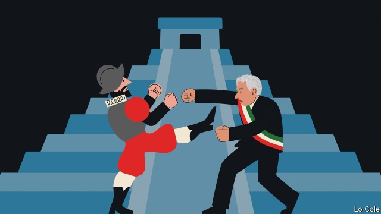

###### Bello

# Blaming the conquistadors 

##### Mexico’s president is wrong to seek an apology for the distant past 

 

> Apr 4th 2019 

SCRATCH MANY a Latin American and you will find, not far below the surface, resentment against Spain and its conquistadors. The resentment is often focused on the tons of gold and silver the Spaniards carried off. More recently it has been directed at their ill treatment of indigenous peoples in the Americas. 

So Andrés Manuel López Obrador, Mexico’s new president, who is also a keen amateur historian, was on solid political ground when last month he demanded that Felipe VI, Spain’s current king, and Pope Francis publicly apologise for the conquest. “The offences that the original peoples suffered should be recognised,” he said. “Thousands of people were killed…one culture, one civilisation imposed itself on another.” 

He was speaking on the 500th anniversary of Hernán Cortés’s first landing in Mexico, in Tabasco, his beloved home state. As always with AMLO (as Mexicans call him), his tone was soothingly moderate. His intention, he insisted, was to seek a historic reconciliation. He, too, would apologise for the abuse of Amerindians by the independent Mexican republic. He did not dispute the official Mexican myth, carved in a monument in the Square of the Three Cultures in the heart of Mexico City, that the conquest was “the meeting of two cultures” that produced a third, mestizo one. But it was also, he rightly said, “an invasion” involving acts of “subjugation”. 

His remarks caused a storm in Spain, partly because a defensive Spanish nationalism has been revived by Catalan separatism and partly because they came in the midst of an election campaign. Josep Borrell, the Socialist foreign minister, said Spain “obviously” was not going to offer an “extemporaneous apology”, just as it would not ask France to say sorry for “what Napoleon’s troops did when they invaded Spain”. Pablo Casado, the leader of the conservative opposition, said that AMLO’s call was “a real affront to Spain”, which should celebrate its historical role in Mexico “with pride”. 

Nevertheless, AMLO’s demand is a fashionable one. Both Tony Blair and Bill Clinton apologised for their countries’ role in the slave trade. Visiting Bolivia in 2015, Pope Francis himself asked for forgiveness “for crimes committed against the native peoples during the so-called conquest”. 

Yet AMLO’s call is a mistaken one, for two reasons. First, it begs the question of who should apologise to whom. The peoples in Mexico in 1519 were not the “original” ones but later arrivals. They, too, committed what nowadays would be called crimes against humanity—systematic human sacrifice in the case of the Mexica (Aztecs). And modern Mexico is above all a mestizo nation, of mixed Amerindian and Spanish descent. Having worked with the Chontal Indians of Tabasco, Mr López Obrador can certainly claim to be closer to his country’s indigenous peoples than were many of his predecessors. But as his name betrays, his forebears were mainly Spanish. Rather than today’s Spaniards, “it is AMLO and Mexicans who are descendants of the conquistadors”, wrote José Álvarez Junco, a Spanish historian, in El País, a Madrid newspaper. “Explain to me, please, why I have to apologise for something that my forefathers didn’t do to someone whose forefathers surely did?” 

Second, it is one thing to apologise for crimes within memory, another for the distant past. In a critique of the cult of “historical memory” David Rieff, an American writer, points out that psychological evidence shows that the trauma suffered by survivors lasts at most for four generations. Beyond that, history should simply be understood on its own terms and in its temporal context rather than be rewritten by governments or recruited for political purposes. 

The record shows that Spain’s colonial empire was not Mr Casado’s spotless creation, but nor was it uniquely bad. Most of the Amerindians who died did so from diseases to which they had no immunity. Shortly after Cortés, Bartolomé de las Casas, a Dominican friar, denounced ill-treatment of Amerindians, prompting an anguished debate at the Spanish court. Compared with Britain’s North American empire, which largely exterminated or excluded natives, the Spanish colonial order was “inclusive”, giving Amerindians “at least a limited space of their own”, as J.H. Elliott, a British historian, has noted. 

AMLO was elected on a promise to offer Mexico a historic “transformation”. So far his policies fall well short of that. Rather than dwell on past wrongs, he should concentrate on improving the lot of today’s Mexicans. 

-- 

 单词注释:

1.bello[]:n. 贝罗（姓氏） 

2.conquistador[kɒn'kwistәdɒ:]:n. 西班牙征服者, 征服者 

3.APR[]:[计] 替换通路再试器 

4.resentment[ri'zentmәnt]:n. 怨恨, 愤恨 

5.Spain[spein]:n. 西班牙 

6.Spaniard['spænjәd]:n. 西班牙人 

7.indigenous[in'didʒinәs]:a. 本土的, 国产的, 固有的 [医] 原产的, 本土的 

8.manuel['mænjuel]:n. 曼纽尔（男子名）；曼努埃尔二世（拜占庭皇帝约翰五世的次子） 

9.López[]:[地名] 洛佩斯 ( 阿根、厄 ) 

10.obrador[]:[网络] 布拉多 

11.historian[hi'stɒ:riәn]:n. 历史学家, 记事者 

12.Felipe[]:n. (Felipe)人名；(西、葡、罗)费莉佩(女名), 费利佩 

13.vi[]:[计] vi文本编辑器 [医] ㄉ(87号元素钫的旧名) 

14.pope[pәup]:n. 罗马教皇, 主教 

15.franci[]:[网络] 弗朗西；法赛纳；法奇 

16.apologise[ә'pɔlәdʒaiz]:vi. 道歉（等于apologize） 

17.civilisation[,sivilai'zeiʃən;-li'z-]:n. 文明, 文明世界, 文化, 开化, 教化 

18.Tabasco[tә'bæskәu]:n. 塔巴斯科辣沙司 

19.alway['ɔ:lwei]:adv. 永远；总是（等于always） 

20.AMLO['æmləʊ]:(=aeromedical liaison office) 航空医疗联络处,(=aeromedical liaison officer) 航空医疗联络官 

21.soothingly[su:ðɪŋlɪ]:adv. 抚慰地, 安慰地; 镇痛地 

22.historic[hi'stɒrik]:a. 历史上著名的, 有历史性的 

23.reconciliation[,rekәnsili'eiʃәn]:n. 和解, 和好, 复交, 调解, 调停, 和谐, 一致, 甘愿, 顺从 [经] (银行往来)调节, 调和, 一致 

24.Amerindian[,æmә'rindjәn]:n. 美国印地安人或爱斯基摩人 

25.myth[miθ]:n. 神话, 虚构的事, 虚构的人 

26.mestizo[me'sti:zәu]:n. 混血儿 

27.rightly['raitli]:adv. 合适地, 正当地, 正确地 

28.subjugation[.sʌbdʒu'geiʃәn]:n. 征服, 镇压, 平息 [法] 征服, 镇压, 克制 

29.defensive[di'fensiv]:a. 防卫的, 防备用的, 自卫的 n. 守势, 防卫姿势, 防卫物 

30.nationalism['næʃәnәlizm]:n. 民族主义, 民族特性 

31.revive[ri'vaiv]:vt. 使苏醒, 使复兴, 使振奋, 回想起, 重播 vi. 苏醒, 复活, 复兴, 恢复精神 

32.Catalan['kætәlәn]:n. 加泰隆人, 加泰隆语 

33.separatism['sepәrәtizm]:n. 分离主义 

34.josep[]:[网络] 何塞普；约瑟；优斯普 

35.borrell[]: [人名] 博雷尔 

36.extemporaneous[ik.stempә'reiniәs]:a. 无准备的, 即席的, 临时的 [医] 临时的, 当时的 

37.Pablo['pæblәu]:n. 巴勃罗（西班牙籍体育明星）；帕布洛（英国水槽产品品牌）；帕布鲁（西班牙著名画家毕加索的姓） 

38.casado[]:[网络] 卡萨德奥；卡沙度；已婚者 

39.opposition[.ɒpә'ziʃәn]:n. 反对, 敌对, 相反, 在野党 [医] 对生, 对向, 反抗, 反对症 

40.affront[ә'frʌnt]:n. 公开侮辱, 轻蔑 vt. 公开侮辱, 冒犯, 面对 

41.tony['tәuni]:a. 高贵的, 时髦的 

42.blair[bleә(r)]:n. 布莱尔（男子名） 

43.clinton['klintәn]:n. 克林顿（男子名） 

44.Bolivia[bә'liviә]:n. 玻利维亚 

45.forgiveness[fә'givnis]:n. 宽恕, 宽仁之心 

46.mexica[]:[网络] 墨西加；墨西卡；墨西加人 

47.Aztec['æztek]:n. 阿兹特克人, 阿兹特克语 a. 阿兹特克人的 

48.Amerindian[,æmә'rindjәn]:n. 美国印地安人或爱斯基摩人 

49.descent[di'sent]:n. 降落, 家系, 侵袭, 血统 [医] 下降, 世代, 血统 

50.Chontal[]:[网络] 琼塔尔；琼塔尔语；琼塔尔人 

51.predecessor[.predi'sesә]:n. 前任, 先辈, 前身 [医] 初牙, 前辈, 祖先 

52.forebear['fɒ:bєә]:n. 祖先, 祖宗 

53.descendant[di'sendәnt]:n. 后裔, 子孙 a. 传下的, 下降的 

54.junco['dʒʌŋkәu]:n. [动] <美> 灯芯草雀 

55.el[el]:abbr. 预期损失（Expected Loss） 

56.Madrid[mә'drid]:n. 马德里 

57.forefather['fɒ:fɑ:ðә]:n. 祖先 

58.critique[kri'ti:k]:n. 评论文章, 评论 

59.cult[kʌlt]:n. 膜拜, 礼拜式, 祭仪, 一群信徒 [医] 迷信, 巫术 

60.david['deivid]:n. 大卫；戴维（男子名） 

61.rieff[]: [人名] 里夫 

62.trauma['trɒ:mә]:n. 外伤, 损伤 [医] 创伤, 外伤 

63.survivor[sә'vaivә]:n. 生还者, 幸存者 [法] 生还者, 生存者, 辛存者 

64.temporal['tempәrәl]:a. 时间的, 暂时的, 现世的, 世俗的, 颞的, 太阳穴的 n. 世间万物, 教会财产 

65.context['kɒntekst]:n. 上下文, 背景, 来龙去脉 n. 上下文 [计] 上下文 

66.colonial[kә'lәunjәl]:a. 殖民的, 殖民地的 [法] 殖民地居民 

67.spotless['spɒtlis]:a. 无脏污的, 无缺点的, 无可挑剔的 

68.creation[kri:'eiʃәn]:n. 创造, 创作物, 发明 [化] 产生 

69.uniquely[]:adv. 独特地；珍奇地 

70.immunity[i'mju:niti]:n. 免疫, 免疫性, 免除 [化] 免疫性 

71.Cortés[]:[地名] 科尔特斯 ( 洪 ) 

72.de[di:]:[化] 非对映体过量 [医] 铥(69号元素铥的别名,1916年Eder离得的假想元素) 

73.La[lɔ:, lɑ:]:[医] 镧(57号元素) 

74.casa['kɑ:sә]:abbr. 天文学高级研究中心（Centre for Advanced Study of Astronomy）；计算机与自动化系统（Computer and Automated System Association）；合作应用卫星A（Cooperative Application Satellite A） 

75.dominican[dә'minikәn]:a. 多明尼加共和国的 

76.friar['fraiә]:n. 修道士 

77.denounce[di'nauns]:vt. 告发, 抨击, 谴责 [法] 谴责, 斥责, 告发 

78.anguish['æŋgwiʃ]:n. 剧痛, 痛苦 vt. 使极痛苦 vi. 感到痛苦 

79.exterminate[ik'stә:mineit]:vt. 扑灭, 消灭, 根绝 

80.inclusive[in'klu:siv]:a. 包含的, 包括的 

81.jh[]:abbr. 保幼激素（juvenile hormone） 

82.Elliott[]:n. 艾略特（姓氏） 

83.dwell[dwel]:vi. 居住, 居住(于), 存在(于) 

