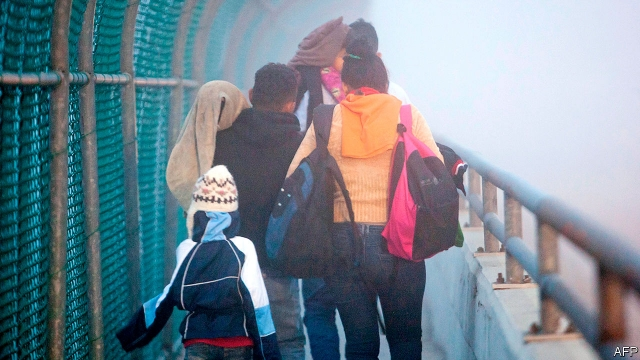
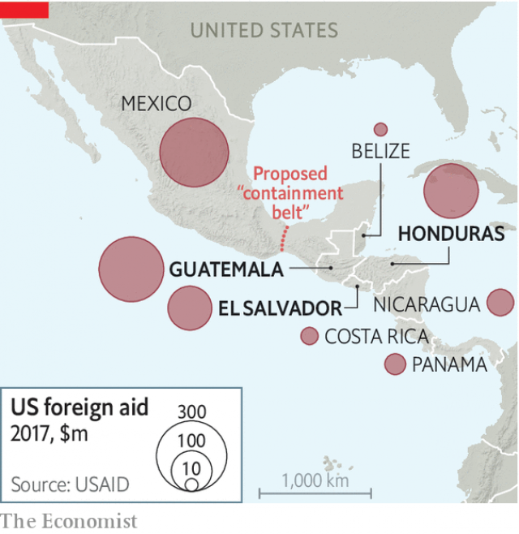

###### Go home, and don’t come back

# Donald Trump cuts off aid to Central America 

##### American assistance did not stop the exodus from the Northern Triangle. Neither will ending it 

 

> Apr 4th 2019 

IN 2014 THOUSANDS of children from Central America’s Northern Triangle—El Salvador, Guatemala and Honduras—turned up at the United States’ southern border. President Barack Obama convinced a Republican-controlled Congress to double American aid to the region to reduce the violence and poverty that help cause mass migration. Now it has surged again, but Mr Obama’s successor, Donald Trump, has favoured a different tack. Despite “taking our money”, Northern Triangle countries are “doing absolutely nothing” to prevent emigration, he complained. On March 31st he cut off $500m a year of aid to the region. Mexico (“all talk and no action”) did not escape his fury. He threatened to close the border between the two countries.  

For a president elected on a promise to curb immigration, the numbers are provoking. In February 76,000 migrants were stopped trying to cross the United States-Mexico border. Among families and unaccompanied children, nearly all were Central Americans. Kirstjen Nielsen, the secretary of homeland security, thinks nearly 100,000 came in March. If that rate is sustained all year the number of attempted border-crossings will approach the historic peak reached in 2000, of 1.6m. 

Mr Trump’s anti-immigration rhetoric kept people away at first. Border apprehensions dropped in the 18 months after he won the presidency in November 2016. People who put off their journeys then are now making them. Tougher American policies on its border, such as separating children from parents and slowing the processing of asylum claims, are not deterring migrants. Many of them see this as a “now or never moment”, analysts say. People-smuggling gangs encourage that belief.  

 

They are now especially active in impoverished rural Guatemala, which has been hurt by drought and low coffee prices. A new smuggling network packs Guatemalans into buses, which take them to the American border in days. Half of the families caught there are Guatemalan. Most are seeking asylum. They are not single men trying to cross illegally. So “coyotes”, as smugglers are called, have no need to sneak them into the United States. 

More visible are “caravans” of hundreds, or even thousands, of migrants, usually starting in Honduras. Travelling initially on foot, they find safety in numbers and in the attention they get from the media. (They also attract Mr Trump’s notice; he calls them an “invasion”.) Mexico’s new left-wing president, Andrés Manuel López Obrador, has more sympathy for them than his predecessor did and has done less to stop them. As migration has soared, deportations by Mexico have fallen. 

Mr Trump’s aid cut-off is a blunt instrument. It hurts El Salvador, home to 37% of families with children apprehended in 2016 but only 9% of them this year, as much as the other two countries. It ends financial support for security forces and police battling drug-trafficking to the United States. Mr Trump has not made clear what governments might do to restart the aid flow. 

The surge in migration does not justify Mr Trump’s claim that the aid has done no good. The Northern Triangle’s high murder rate, one big reason that people flee, has dropped sharply, thanks partly to American aid. Some observers contend that the exodus would have been even bigger without that decline. 

Administrators of aid say its goal was to strengthen things like law enforcement, employment and tax collection, which is a slow process. Aid becomes ever more effective over time as lessons are learnt, says Marcela Escobari, an American aid official under Mr Obama. Continuity matters. Plan Colombia helped bring peace to that country because it was sustained for 15 years without cuts, Ms Escobari says.  

Mr Trump is also wrong to claim that aid recipients are “doing nothing” for the money. Already, it comes with conditions: the United States can withhold 25% if a country does not go after people-trafficking networks or deter migration. Half depends on progress in 12 areas of governance, such as tax collection and tackling corruption. Northern Triangle governments must also spend billions of dollars of their own money on state-building. Such conditional aid “empowers the right people” within governments, says Juan Ricardo Ortega of the Inter-American Development Bank. 

Mexico has had some success in placating Mr Trump. On March 28th its government said it would form a “containment belt” at the country’s narrowest point. After Mexico arrested some people-smugglers on April 1st, Mr Trump tweeted his gratitude. He stopped threatening to close the border, perhaps because advisers pointed out that this would hurt both economies. The Northern Triangle, it seems, has less clout in Washington. 

-- 

 单词注释:

1.exodus['eksәdәs]:n. 大批的离去 [法] 退出, 大批离去, 成一外出 

2.APR[]:[计] 替换通路再试器 

3.Salvador['sælvәdɔ:]:[经] 萨尔瓦多 

4.Guatemala[.gwɑ:tә'mɑ:lә]:n. 危地马拉 

5.barack[bɑ:'ræk]:n. 巴拉克（男子名） 

6.obama[]:n. 奥巴马(姓) 

7.migration[mai'greiʃәn]:n. 移民, 移往, 移动 [计] 迁移 

8.surge[sә:dʒ]:n. 巨涌, 汹涌, 澎湃 vi. 汹涌, 澎湃, 颠簸, 猛冲, 突然放松 vt. 使汹涌奔腾, 急放 [计] 电压尖峰 

9.successor[sәk'sesә]:n. 继承者, 接任者 [计] 后继 

10.tack[tæk]:n. 平头钉, 大头钉, 粗缝针脚, 行动方针, 食物 vt. 以大头针钉住, 附加 

11.emigration[.emi'greiʃәn]:n. 移民, 移居外国(或外地) [医] 血细胞渗出 

12.fury['fjuri]:n. 愤怒, 狂暴, 狂怒的人 [医] 狂乱, 狂暴, 狂怒 

13.curb[kә:b]:n. 抑制, 勒马绳, 边石 vt. 抑制, 束缚, 勒住 

14.provoke[prә'vәuk]:vt. 激怒, 惹起, 诱导 [法] 刺激, 煽动, 激怒 

15.migrant['maigrәnt]:n. 候鸟, 移居者 [法] 移居者 

16.unaccompanied[.ʌnә'kʌmpәnid]:a. 无伴侣的, 无伴随的, 无伴奏的 

17.nielsen[]:n. 尼耳森（人名） 

18.historic[hi'stɒrik]:a. 历史上著名的, 有历史性的 

19.rhetoric['retәrik]:n. 修辞, 修辞学, 雄辩(术) 

20.apprehension[.æpri'henʃәn]:n. 理解, 忧惧, 逮捕 [医] 领会 

21.presidency['prezidәnsi]:n. 总统职权, 总裁职位 

22.asylum[ә'sailәm]:n. 庇护, 收容所 [医] 养育院 

23.deter[di'tә:]:vt. 制止, 吓住, 威慑 

24.analyst['ænәlist]:n. 分析者, 精神分析学家 [化] 分析员; 化验员 

25.impoverish[im'pɒvәriʃ]:vt. 使贫穷, 耗尽...的力气 

26.smuggle['smʌgl]:vt. 偷运, 走私, 私运 vi. 走私 

27.Guatemalan[,ɡwæti'mɑ:lən]:n. 危地马拉人 a. 危地马拉的（中美洲的一个国家） 

28.Guatemalan[,ɡwæti'mɑ:lən]:n. 危地马拉人 a. 危地马拉的（中美洲的一个国家） 

29.illegally[]:[法] 非法地, 不合法地, 违法地 

30.coyote['kɒiәut]:n. 丛林狼, 讨厌的家伙 

31.smuggler['smʌglә]:n. 走私者, 走私船 [经] 走私者, 走私船 

32.sneak[sni:k]:vi. 鬼鬼祟祟做事 vt. 偷偷地做 n. 鬼鬼祟祟的人, 偷偷摸摸的行为, 帆布胶底运动鞋 a. 暗中进行的 

33.caravan['kærәvæn]:n. 旅行队, 有篷顶的大车 [经] 商队, 结队商贩 

34.Honduras[hɒn'djurәs]:n. 洪都拉斯 

35.initially[i'niʃәli]:adv. 最初, 开头 

36.manuel['mænjuel]:n. 曼纽尔（男子名）；曼努埃尔二世（拜占庭皇帝约翰五世的次子） 

37.López[]:[地名] 洛佩斯 ( 阿根、厄 ) 

38.obrador[]:[网络] 布拉多 

39.predecessor[.predi'sesә]:n. 前任, 先辈, 前身 [医] 初牙, 前辈, 祖先 

40.les[lei]:abbr. 发射脱离系统（Launch Escape System） 

41.soar[sɒ:]:n. 高扬, 翱翔 vi. 往上飞舞, 高耸, 翱翔 

42.deportation[.di:pɒ:'teiʃәn]:n. 驱逐出境, 放逐 [法] 递解出境, 放逐, 驱逐 

43.blunt[blʌnt]:a. 钝的, 坦率的, 麻痹的 

44.el[el]:abbr. 预期损失（Expected Loss） 

45.apprehend[.æpri'hend]:vt. 理解, 忧虑, 逮捕 vi. 担心, 理解 

46.restart[.ri:'stɑ:t]:v. 重新开始, 重新启动 [计] 重新启动 

47.contend[kәn'tend]:vi. 奋斗, 斗争, 竞争 vt. 为...斗争 

48.administrator[әd'ministreitә]:n. 管理人, 行政官 [经] 遗产管理人员 

49.enforcement[in'fɒ:smәnt]:n. 执行, 强制 [法] 实施, 加强, 厉行 

50.marcela[]:n. (Marcela)人名；(罗、葡、英)马塞拉, 玛塞拉(女名) 

51.continuity[.kɒnti'nju:iti]:n. 连续性 [化] 连续性 

52.Colombia[kә'læmbiә]:n. 哥伦比亚 

53.recipient[ri'sipiәnt]:a. 领受的, 容易接受的, 感受性强的 n. 领受者, 容纳者, 容器 

54.withhold[wið'hәuld]:vt. 使停止, 扣留, 保留, 拒给 vi. 克制, 忍住 

55.governance['gʌvәnәns]:n. 统治, 统辖, 管理 [法] 统治, 管理, 支配 

56.tackle['tækl]:n. 工具, 复滑车, 滑车, 装备, 扭倒 vt. 固定, 处理, 抓住 vi. 扭倒 

57.corruption[kә'rʌpʃәn]:n. 腐败, 堕落, 贪污 [计] 论误 

58.conditional[kәn'diʃәnl]:a. 有条件的, 有前提的 [电] 有条件的 

59.empower[im'pauә]:vt. 授予权力, 允许, 使能够 [法] 授权, 准许, 转委 

60.juan[hwɑ:n]:n. 胡安（男子名） 

61.Ricardo[ri'kɑ:dәu]:里卡多(姓氏) 

62.Ortega[]:奥尔特加（人名） 奥尔特加（地名, 阿根廷、哥伦比亚） 

63.placate[plә'keit]:vt. 抚慰, 平息, 使和解, 怀柔 

64.containment[kәn'teinmәnt]:n. 抑制, 牵制, 遏制 [法] 抑制, 牵制, 遏制 

65.tweet[twi:t]:vi. 啁啾 n. 小鸟叫声 

66.adviser[әd'vaizә]:n. 顾问, 劝告者, 指导教师 [法] 顾问, 劝告者 

67.clout[klaut]:n. 敲击, 破布 vt. 打补钉 

68.Washington['wɒʃiŋtn]:n. 华盛顿 

