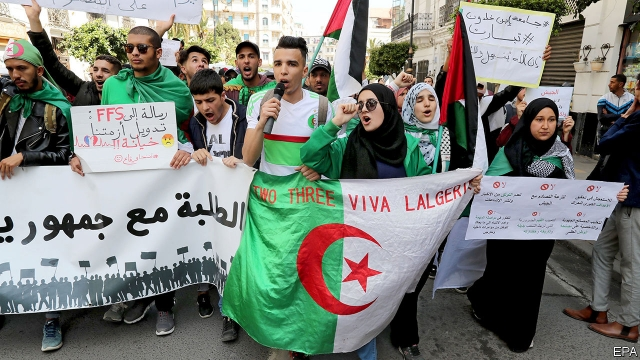
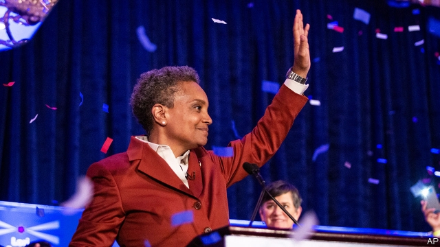

###### The Brexit negotiations

# Politics this week 

 

> Apr 4th 2019 

After 20 years in power and weeks of mass protests, Abdelaziz Bouteflika, Algeria’s ailing president, resigned. The announcement sparked celebrations in the capital, Algiers. Some fear that the old guard will try to hang on to power. Abdelkader Bensalah, the Speaker of the Senate (and a Bouteflika loyalist), is next in line as president, according to the constitution. He has 90 days to organise new elections. See article. 

The Iranian government ordered the evacuation of more than 70 villages in the province of Khuzestan because of flooding. Dozens of people have been killed in the past two weeks, during Iran’s worst rains in years. Iranian officials blamed American sanctions for impeding their aid efforts. American officials said Iran was mismanaging the crisis. 

Thousands of Palestinians marked the first anniversary of an uprising along the Israel-Gaza border. Scores of activists approached the perimeter fence, throwing stones and explosives at the Israeli side. Four Palestinians were killed by Israeli soldiers. A broader ceasefire deal between Israel and Hamas, which rules Gaza, appeared to be holding. 

The number of cholera cases in Mozambique rose sharply in areas affected by Cyclone Idai. Over 1,400 people have been infected, up from the 249 cases reported recently. Many of the affected areas still cannot be reached by road, complicating a mass vaccination campaign. 

Harsh new penalties came into force under Brunei’s Islamic criminal code. Anal sex and sex outside marriage (including gay sex) can earn death by stoning. Thieves risk the amputation of a hand or foot. See article. 

Australia approved a new law imposing severe penalties on social-media firms that fail to remove footage of crimes such as murder and rape. Singapore proposed a new law that would allow similarly harsh punishments for those disseminating fake news. See article. 

Activists in Thailand questioned the opaque conduct of the Election Commission, which has not yet announced the results of last month’s election. In response, the head of the military junta, which is supposedly soon to give way to civilian government, denounced the “incorrect thinking” on social media. 

A bill was introduced to Hong Kong’s legislature that would allow the extradition of criminal suspects to mainland China. Thousands of people marched against it, saying it could be used as a pretext to hand over people who are wanted for political reasons. See article. 

China declared that all types of fentanyl would be treated as controlled drugs. America had appealed to China to adopt tougher controls. 

America’s attorney-general, William Barr, promised to provide a redacted version of the Mueller report to Congress by the middle of April. That was not enough for the Democrats running the House Judiciary Committee, who authorised (though did not issue) a subpoena to attain Mr Mueller’s full, unredacted report into Russian interference in American politics. 

 

Lori Lightfoot won a run-off election to become Chicago’s mayor, and will be the first black woman and gay person to hold the office. Ms Lightfoot trounced Toni Preckwinkle, a mainstay of the city’s establishment. Her victory could herald a change in Chicago’s machine politics. See article. 

Donald Trump suspended $500m in aid to three Central American countries: El Salvador, Guatemala and Honduras. He complained that they were doing “absolutely nothing” to stop migrants from leaving their countries and trying to get into America. Migration from the poor, violent Northern Triangle has recently surged on the Mexican border. See article. 

Venezuela’s constituent assembly stripped the opposition’s leader, Juan Guaidó, of his immunity from prosecution. More than 54 countries acknowledge Mr Guaidó, who leads the opposition-controlled national assembly, as Venezuela’s interim president. See article. 

Brazil’s right-wing president, Jair Bolsonaro, ordered the armed forces to “commemorate” a military coup that took place in 1964. Soldiers marched at their barracks in honour of the occasion, but thousands of people protested. 

Canada’s prime minister, Justin Trudeau, expelled two former cabinet ministers from the parliamentary caucus of his Liberal Party. He said Jody Wilson-Raybould and Jane Philpott could no longer be part of a team in which they had no trust. Ms Wilson-Raybould has alleged that the prime minister’s office had pressed her when she was attorney-general to drop the prosecution for corruption of a big engineering firm. Ms Philpott quit saying the “independence and integrity of our justice system” is at stake. 

Volodymyr Zelensky, a TV comedian, won the first round of Ukraine’s presidential election, beating more than 30 rivals. He will now face the incumbent, Petro Poroshenko, in a second round on April 21st. See article. 

Local elections in Turkey delivered a humiliating blow to the president, Recep Tayyip Erdogan. He lost in five of Turkey’s six biggest cities, including Istanbul and Ankara, the capital. See article. 

A political novice, Zuzana Caputova, handily won in the second round of Slovakia’s presidential election. It has been a bad week for Europe’s incumbents. 

Britain’s Parliament was at an impasse over Brexit. Theresa May’s withdrawal agreement with the EU was rejected again, as were alternatives to her plan. The prime minister held talks with the opposition in an effort to break the deadlock. MPs voted to ask for an extension, by one vote. European politicians looked on aghast, as they pondered whether to give Britain more time. See article. 

Police in Britain reported that two devices planted on rail tracks to cause disruption were related to Brexit, as one had a note attached threatening to bring the country to “its knees if we don’t leave”. The troublemaker’s plans were derailed because of EU safety regulations to detect sabotage. 

-- 

 单词注释:

1.Brexit[]:[网络] 英国退出欧盟 

2.negotiation[ni.gәuʃi'eiʃәn]:n. 谈判, 磋商, 交涉 [经] 谈判, 协商 

3.politic['pɒlitik]:a. 精明的, 明智的, 策略的 

4.APR[]:[计] 替换通路再试器 

5.abdelaziz[]:n. (Abdelaziz)人名；(阿拉伯)阿卜杜勒-阿齐兹 

6.bouteflika[]:[网络] 布特弗利卡；阿尔及利亚总统布特弗利卡；布特佛里卡 

7.ailing['eiliŋ]:a. 生病的 [医] 患病的, 病痛的 

8.Algiers[æl'dʒiәrz]:n. 阿尔及尔 

9.Abdelkader[]:n. (Abdelkader)人名；(阿拉伯)阿朴杜勒-卡德尔；(1808-83)阿卜杜卡迪尔〈阿尔及〉军事家。 

10.loyalist['lɒiәlist]:n. 忠诚的人, 反对独立者, 反佛朗哥派的人 

11.Iranian[i'reiniәn]:a. 伊朗的, 伊朗语系的 n. 伊朗人, 伊朗语 

12.evacuation[i.vækju'eiʃәn]:n. 撤退, 疏散 [化] 抽空; 排空 

13.khuzestan[]:[网络] 胡齐斯坦；胡泽斯坦；伊朗胡泽斯坦 

14.sanction['sæŋkʃәn]:n. 核准, 制裁, 处罚, 约束力 vt. 制定制裁规则, 认可, 核准, 同意 

15.impede[im'pi:d]:vt. 妨碍, 阻碍, 阻止 

16.Iran[i'rɑ:n]:n. 伊朗 

17.mismanage[mis'mænidʒ]:vt. 处置失当, 对...管理不善 

18.Palestinian[,pælis'tiniәn]:[经] 巴勒斯坦的 

19.uprise[ʌp'raiz]:n. 升起, 起立, 上山坡, 出现 vi. 上升, 起义, 出现 

20.activist['æktivist]:n. 激进主义分子 

21.perimeter[pә'rimitә]:n. 周长, 周界, 边缘 [医] 周, 周边, 周界线; 周长; 视野计 

22.Israeli[iz'reili]:a. 以色列的, 以色列人(语)的 n. 以色列人 

23.ceasefire[ˈsi:sfaɪə(r)]:n. （通常指永久性的）停火, 停战; 停火命令 

24.Israel['izreil]:n. 以色列, 以色列后裔, 犹太人 

25.Hama['hæmә]:哈马[叙利亚西部城市] 

26.gaza['^ɑ:zә]:n. 加沙（地中海岸港市） 

27.cholera['kɒlәrә]:n. 霍乱 [医] 霍乱 

28.Mozambique[.mәuzәm'bi:k]:n. 莫桑比克 

29.cyclone['saiklәun]:n. 龙卷风, 暴风 [化] 旋流(分离,除尘)器 

30.cannot['kænɒt]:aux. 无法, 不能 

31.vaccination[.væksi'neiʃәn]:n. 接种疫苗, 种痘 [医] 接种; 种痘 

32.penalty['penәlti]:n. 处罚, 刑罚, 罚款, 罚球, 报应, 不利结果, 妨碍 [经] 罚金(款), 违约金 

33.Islamic[iz'læmik]:a. 伊斯兰教的, 穆斯林的 

34.anal['einәl]:a. 肛门的, 肛门附近的 [计] 分析员 

35.ston[]:n. 上海四通（电器品牌） 

36.amputation[.æmpju'teiʃәn]:n. 切断, 截肢术 [医] 切断术 

37.footage['futidʒ]:n. 英尺长度, 英板尺, (影片的)连续镜头 

38.rape[reip]:n. 抢夺, 掠夺, 强奸, 葡萄渣, 芸苔 vt. 掠夺, 抢夺, 强奸 

39.Singapore[.siŋgә'pɒ:]:n. 新加坡 

40.disseminate[di'semineit]:vt. 散播, 传播, 宣传 vi. 广为传播 

41.fake[feik]:n. 假货, 欺骗, 诡计 a. 假的 vt. 假造, 仿造 vi. 伪装 

42.Thailand['tailәnd]:n. 泰国 

43.opaque[әu'peik]:n. 不透明物 a. 不透明的, 不传热的, 不传导的, 阴暗的 [计] 白底 

44.junta['dʒʌntә]:n. 以武力政变上台的(军)政府, 私党, 阴谋小集团, 政务会 

45.supposedly[sә'pәuzidli]:adv. 想象上, 看上去像, 被认为是, 恐怕, 按照推测 

46.denounce[di'nauns]:vt. 告发, 抨击, 谴责 [法] 谴责, 斥责, 告发 

47.hong[hɔŋ]:n. （中国、日本的）行, 商行 

48.legislature['ledʒisleitʃә]:n. 立法机关, 议会, 立法院 [法] 立法机构, 立法机关 

49.extradition[.ekstrә'diʃәn]:n. 引渡逃犯, 亡命者送还本国 [法] 引渡 

50.pretext['pri:tekst]:n. 借口, 托词 v. 以...为借口 

51.fentanyl[fen'tænil,'fentәnil]:[化] 芬太尼 

52.william['wiljәm]:n. 威廉（男子名）；[常作W-][美俚]钞票, 纸币 

53.barr[]:abbr. 翻转形态（Bump and Run Reversal） 

54.redact[ri'dækt]:vt. 编辑, 编写 [计] 编校 

55.Mueller[]:米勒（人名） 

56.democrat['demәkræt]:n. 民主人士, 民主主义者, 民主党党员 [经] 民主党 

57.judiciary[dʒu:'diʃiәri]:a. 司法的, 法院的, 法官的 n. 司法部, 司法系统, 法官 

58.authorise['ɔ:θәraiz]:vt. 授权；批准；允许；委任（等于authorize） 

59.subpoena[sәb'pi:nә]:n. 传票 vt. 传审, 传唤 

60.unredacted[]:[网络] 执意要求看到原始 

61.lori[]:n. 洛里, 罗莉（人名） 

62.Lightfoot[]:莱特福特（人名） 

63.trounce[trauns]:vt. 痛打, 严惩 

64.toni['tәuni]:n. 托妮（女子名） 

65.mainstay['meinstei]:n. 主桅支索, 支柱, 中流砥柱 

66.herald['herәld]:n. 使者, 传令官, 先驱 vt. 预报, 宣布, 传达, 欢呼 

67.el[el]:abbr. 预期损失（Expected Loss） 

68.Salvador['sælvәdɔ:]:[经] 萨尔瓦多 

69.Guatemala[.gwɑ:tә'mɑ:lә]:n. 危地马拉 

70.Honduras[hɒn'djurәs]:n. 洪都拉斯 

71.migrant['maigrәnt]:n. 候鸟, 移居者 [法] 移居者 

72.migration[mai'greiʃәn]:n. 移民, 移往, 移动 [计] 迁移 

73.surge[sә:dʒ]:n. 巨涌, 汹涌, 澎湃 vi. 汹涌, 澎湃, 颠簸, 猛冲, 突然放松 vt. 使汹涌奔腾, 急放 [计] 电压尖峰 

74.constituent[kәn'stitjuәnt]:n. 成分, 选民, 构成物 a. 构成的, 组织的, 选举的 

75.juan[hwɑ:n]:n. 胡安（男子名） 

76.immunity[i'mju:niti]:n. 免疫, 免疫性, 免除 [化] 免疫性 

77.prosecution[.prɒsi'kju:ʃәn]:n. 执行, 经营, 起诉 

78.interim['intәrim]:a. 暂时的, 临时的, 间歇的 n. 过渡时期 

79.jair[]:[网络] 睚珥；贾伊尔；睢珥 

80.commemorate[kә'memәreit]:vt. 纪念 

81.coup['ku:]:n. 砰然的一击, 妙计, 出乎意料的行动, 政变 [医] 发作, 中, 击 

82.barrack['bærәk]:n. 兵舍, 军营 vt. 使驻兵营内 

83.justin['dʒʌstin]:n. 贾斯廷（男子名） 

84.trudeau[]:n. (Trudeau)人名；(英、法)特鲁多 特鲁多 

85.parliamentary[.pɑ:lә'mentәri]:a. 国会的, 议会的, 议会制度的 

86.caucus['kɒ:kәs]:n. 领导人会议, 核心会议 vi. 开核心会议 

87.jody['dʒәjdi]:n. 乔迪（女子名, 等于Judith, Jodi, Jodie） 

88.jane[dʒein]:n. 简（女子名） 

89.philpott[]: [人名] [英格兰人姓氏] 菲尔波特 Philip的昵称 

90.allege[ә'ledʒ]:vt. 宣称, 主张, 提出, 断言 [法] 断言, 指称, 指证 

91.corruption[kә'rʌpʃәn]:n. 腐败, 堕落, 贪污 [计] 论误 

92.integrity[in'tegriti]:n. 正直, 廉正, 完整 [计] 完整性 

93.volodymyr[]:[网络] 昊宇 

94.zelensky[]:[网络] 泽伦斯基 

95.comedian[kә'mi:djәn]:n. 喜剧演员 

96.presidential[.prezi'denʃәl]:a. 总统制的, 总统的, 首长的, 统辖的 [法] 总统的, 议长的, 总经理的 

97.incumbent[in'kʌmbәnt]:a. 现任的, 依靠的, 负有义务的 n. 领圣俸者, 在职者 

98.petro[]:n. 佩特罗（女子名）；[宗]（希）彼得（男子名, 涵义为石头） 

99.Poroshenko[]:[网络] 波罗申科 

100.humiliate[hju:'milieit]:vt. 使丢脸, 使蒙羞, 屈辱 

101.recep[]:n. (Recep)人名；(土)雷杰普 

102.tayyip[]:[网络] 塔伊普 

103.erdogan[]:[网络] 埃尔多安；土耳其总理埃尔多安；艾尔多安 

104.Istanbul[.istæn'bu:l]:n. 伊斯坦布尔 

105.Ankara['æŋkәrә]:n. 安卡拉(土耳其首都) 

106.novice['nɒvis]:n. 新手, 初学者 

107.zuzana[]:[网络] 健身教练祖札娜；张虹；捷克的正妹祖札娜 

108.handily['hændili]:adv. 巧妙地, 敏捷地, 便利地 

109.impasse['impɑ:s]:n. 难局, 僵局, 死路, 死胡同 

110.theresa[ti'ri:zә]:n. 特丽萨（女子名） 

111.withdrawal[wið'drɒ:l]:n. 提款, 撤退, 退回, 撤消, 退隐, 戒毒过程 [医] 戒除, 脱瘾 

112.EU[]:[化] 富集铀; 浓缩铀 [医] 铕(63号元素) 

113.opposition[.ɒpә'ziʃәn]:n. 反对, 敌对, 相反, 在野党 [医] 对生, 对向, 反抗, 反对症 

114.deadlock['dedlɒk]:n. 僵局, 停顿 v. (使)停顿, (使)相持不下 [计] 死锁 

115.MP[]:国会议员, 下院议员 [计] 宏处理程序, 维护程序, 线性规划, 微程序, 多处理器 

116.aghast[ә'gɑ:st]:a. 惊骇的, 吓呆的 

117.ponder['pɒndә]:v. 沉思, 考虑 

118.disruption[dis'rʌpʃәn]:n. 分裂, 崩溃, 瓦解 

119.derail[di'reil]:vt. 使出轨 n. 脱轨器 [计] 转移指令 

120.sabotage['sæbәtɑ:ʒ]:n. 怠工, 破坏活动, 破坏 vi. 从事破坏活动 vt. 妨害, 破坏 

