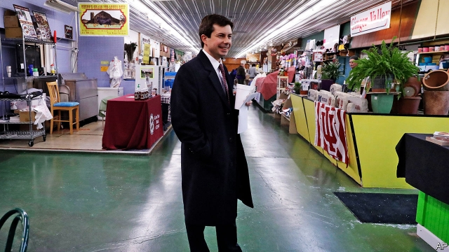

###### A welcome shrug

# Gay mayors? Who cares? 

##### The success of gay politicians completes a rapid change in social attitudes 

 

> Apr 4th 2019 

IT MADE FOR an awkward first-date conversation. Pete Buttigieg, the mayor of South Bend in Indiana, recalls that he and Chasten Glezman talked about how he would be seeking higher political office. How would his boyfriend-to-be—now husband—feel about the public scrutiny? And how might voters respond to a same-sex couple on the campaign trail? 

Mr Buttigieg had an inkling voters would mostly shrug. He had been nervous about coming out as the incumbent mayor in 2015, but he went on to win re-election that year with 80% of the vote. In South Bend even conservatives and Catholics cared more about his efforts to revive a once-struggling industrial city or his spell soldiering in Afghanistan. Almost the only time his sexual orientation now gets mentioned, he says, is when somebody wants to tell him they are at ease with it. Attitudes to once controversial issues can flip from bold to normal with baffling speed, he says. 

The 37-year-old mayor is testing that notion nationally, trying a long-shot run to become the Democrats’ presidential candidate. He raised $7m in the past quarter, a decent sum that should place him among the more serious contenders in a crowded field. He reckons his identity, as “young, out, from the Midwest” helps win initial interest, then voters will judge him on his skill as a speaker and his ideas. 

It is much the same story in Chicago, where Lori Lightfoot, a 56-year-old African-American woman married to another woman, won a landslide victory in a run-off election to become mayor on April 2nd. “I’m an out lesbian, married with a child, running in this city, the first to ever make the ballot from the LGBTQ community,” she says. Recalling her arrival in Chicago in the 1980s, she says such a thing was “not even remotely possible back in those days.” 

Her mayoral campaign saw tense moments. In one debate her opponent, Toni Preckwinkle, praised her openness about her sexuality, a comment that sounded like a dogwhistle intended to deter more conservative African-American voters. Leaflets also appeared outside black churches warning that Ms Lightfoot would oversee a gay cabal in city hall. But voters again mostly shrugged. More appeared interested in her positioning as an outsider, promises to tackle corruption and her pledge to cut police violence. 

As mayor of America’s third-largest city she can help to shift perceptions of gay politicians some more. Annise Parker was mayor of Houston from 2010 to 2016 and now leads the LGBTQ Victory Fund, which helps to advise other out politicians. She praises Ms Lightfoot’s disciplined campaign and expects the success will further move “the national imagination”, deepening acceptance of gay politicians and giving the city something to cheer. She says Houston came to be seen as more diverse, open and appealing after voters repeatedly elected her to various posts. 

Gay politicians are growing unexceptional. Colorado has a gay governor, Jared Polis, and Oregon has a lesbian one, Kate Brown. Ms Parker estimates there are roughly 700 openly gay public officials nationally, including two senators and eight members of Congress (all of them Democrats). The Victory Fund endorsed 274 candidates in November’s elections. Of these, Ms Parker says, only five were Republicans (and all five lost). 

Americans have had 45 years to get used to gay people in public office. Kathy Kozachenko, a student in Ann Arbor, Michigan, was the first successful gay candidate anywhere, winning a city council seat in April 1974. But opinion has shifted quickly more recently, along with popular acceptance of gay marriage. It amounts to a quiet, welcome and probably irreversible turn in social attitudes. 

The Pew Research Centre found nearly half (46%) of Americans were still put off by a candidate known to be gay in 2007, but that fell to just 26% by 2016 and is probably lower now. Younger voters are least bothered. Among Democrats, Republicans and members of every large religious group (other than evangelicals), a majority of respondents said a candidate’s sexual orientation is irrelevant. For some it might be an asset. Mr Buttigieg, for example, might struggle harder to get a sympathetic hearing from some progressive voters if he were merely white, male, highly educated and a former management consultant. 

Why have attitudes changed? The AIDS crisis in the 1980s forced many gay men to come out. Then, as laws ended discrimination, more felt ready to do the same. Once most people realised they personally knew someone who was gay, they grew less likely to object to gay politicians. Jonathan Rauch of the Brookings Institution (and a former Economist writer) says gay activists started by demanding equal rights from the 1970s, and then from the 1990s also sought equal responsibilities, such as the chance to serve in the armed forces, marry and become parents. That process, he says, led to the triumph of an “assimilationist” model, in which gay people are accepted by others as fitting into an existing social order, rather than seen as trying to up-end it. 

Mr Rauch cheers politicians who are open about their orientation, but not defined by it. Renewed hostility is possible. President Donald Trump has hounded transgender people, for example in ordering them out of the armed forces. But even he has not criticised openly gay politicians. The political space open to Mr Buttigieg and others should thus continue to grow. “In the world where I grew up it was inconceivable an openly gay and married person could run for president,” says Mr Rauch of South Bend’s mayor. His odds remain long, but they are better than for any other openly gay politician in American history. And by running, Mr Buttigieg makes it easier for the next out politician to try. 

-- 

 单词注释:

1.APR[]:[计] 替换通路再试器 

2.Pete[pi:t]:n. 皮特（等于Peter, 男子名） 

3.buttigieg[]:布蒂吉格 

4.Indiana[.indi'ænә]:n. 印地安那州 

5.chasten['tʃeisәn]:vt. 惩罚；磨炼；抑制 

6.voter['vәutә]:n. 选民, 投票人 [法] 选民, 选举人, 投票人 

7.inkling['iŋkliŋ]:n. 暗示, 微微觉得 

8.incumbent[in'kʌmbәnt]:a. 现任的, 依靠的, 负有义务的 n. 领圣俸者, 在职者 

9.revive[ri'vaiv]:vt. 使苏醒, 使复兴, 使振奋, 回想起, 重播 vi. 苏醒, 复活, 复兴, 恢复精神 

10.Afghanistan[æf'gænistæn]:n. 阿富汗 

11.orientation[.ɒ:rien'teiʃәn]:n. 定方位, 适应, 向东方 n. 方向 [计] 方向 

12.flip[flip]:vt. 掷, 弹, 轻击, 空翻 vi. 用指轻弹, 抽打, 蹦跳 n. 抛, 弹, 筋斗 a. 无礼的 [计] 翻转 

13.baffle['bæfl]:vt. 困惑, 为难, 使挫折 vi. 徒作挣扎 n. 迷惑, 挡板 

14.nationally['næʃәnәli]:adv. 作为整个民族, 举国一致地, 全国性地 

15.presidential[.prezi'denʃәl]:a. 总统制的, 总统的, 首长的, 统辖的 [法] 总统的, 议长的, 总经理的 

16.contender[kәn'tendә(r)]:n. 参赛者, 争论者, 斗争者, 竞争者 

17.reckon['rekәn]:vt. 计算, 总计, 估计, 认为, 猜想 vi. 数, 计算, 估计, 依赖, 料想 

18.Midwest[]:n. (美国的)中西部 [经] 中西部 

19.Chicago[ʃi'kɑ:gәu]:n. 芝加哥 

20.lori[]:n. 洛里, 罗莉（人名） 

21.Lightfoot[]:莱特福特（人名） 

22.landslide['lændslaid]:n. 山崩 [化] 滑坡 

23.lesbian['lezbiәn]:a. 女同性恋的 n. 女同性恋者 

24.ballot['bælәt]:n. 投票, 投票用纸, 抽签 vi. 投票, 抽签 vt. 投票选出, 拉选票 

25.LGBTQ[]:[网络] 同志；同志组织；少数群体 

26.remotely[]:adv. 极小地, 极细微地 

27.mayoral['mєәrәl]:a. 市长的 

28.toni['tәuni]:n. 托妮（女子名） 

29.openness['әupәnnis]:n. 公开；宽阔；率真 

30.sexuality[.sekʃu'æliti]:n. 性征, 性行为, 性欲 [医] 性别, 性欲 

31.deter[di'tә:]:vt. 制止, 吓住, 威慑 

32.leaflet['li:flit]:n. 小叶, 传单 [医] 小叶 

33.oversee[.әuvә'si:]:vt. 向下看, 了望, 监督, 偷看到 [法] 监察, 监督, 俯瞰 

34.cabal[kә'bæl]:n. 秘密结社, (尤指政治上的)阴谋 vi. 策划阴谋 

35.outsider[' aut'saidә]:n. 外人, 局外人, 非会员, 外行, 门外汉, 比赛中获胜可能性不大的选手 [经] 外船公司 

36.tackle['tækl]:n. 工具, 复滑车, 滑车, 装备, 扭倒 vt. 固定, 处理, 抓住 vi. 扭倒 

37.corruption[kә'rʌpʃәn]:n. 腐败, 堕落, 贪污 [计] 论误 

38.pledge[pledʒ]:n. 诺言, 保证, 誓言, 抵押, 信物, 保人, 祝愿 vt. 许诺, 保证, 使发誓, 抵押, 典当, 举杯祝...健康 

39.perception[pә'sepʃәn]:n. 知觉, 感觉, 领悟力, 获取 [医] 知觉 

40.annise[]: [人名] 安妮斯 

41.parker['pɑ:kә]:n. 停放车辆的人 

42.Houston['hju:stәn]:n. 休斯敦 

43.unexceptional['ʌnik'sepʃәnl]:a. 非例外的, 平常的, 不特别的, 不容许有例外的 

44.Colorado[,kɔlә'rɑ:dәu]:n. 科罗拉多, 科罗拉多河 

45.jare[]:abbr. Japanese Antarctic Research Expedition 日本南极科学考察队 

46.polis['pәulis]:n. 城邦 

47.Oregon['ɒ:rigɒn]:n. 俄勒冈 

48.kate[keit]:n. 凯特（女子名, 等于Catherine） 

49.openly['әjpәnli]:adv. 公开地, 坦率地, 直率地, 公然地 

50.senator['senәtә]:n. 参议员, (某些大学的)理事 [法] 参议员, 上议员 

51.democrat['demәkræt]:n. 民主人士, 民主主义者, 民主党党员 [经] 民主党 

52.endorse[in'dɒ:s]:vt. 支持, 赞同, 背书于, 签署 [经] 赞成, 背书 

53.kathy['kæθi]:n. 凯西（女子名, 等于Katherine） 

54.ann[æn]:n. 安（女子名） 

55.arbor['ɑ:bә]:n. 藤架, 树, 心轴, 凉亭 [医] 树(树状结构) 

56.Michigan['miʃigәn]:n. 密歇根州 

57.quickly['kwikli]:adv. 很快地 

58.irreversible[,iri'vә:sәbl,-sib-]:a. 不可逆的, 不可改变的, 不能倒置的, 不能翻转的, 不能倒转的, 不可撤销的 [计] 不可逆的 

59.pew[pju:]:n. 教堂长椅, 会众, 座位 vt. 为(教堂)安装座位, 把...围在一起 

60.bother['bɒðә]:vt. 烦扰, 迷惑 vi. 烦恼, 操心 n. 麻烦, 纠纷, 讨厌的人 

61.evangelical[,i:væn'dʒelikәl]:a. 福音派教会的 n. 福音派信徒 

62.respondent[ri'spɒndәnt]:a. 回答的, 应答的, 反射的 n. 应答者, 被告 

63.irrelevant[i'relәvәnt]:a. 不恰当的, 无关系的, 不相干的 [法] 无关的, 不相干的, 离题的 

64.asset['æset]:n. 资产, 有益的东西 

65.les[lei]:abbr. 发射脱离系统（Launch Escape System） 

66.jonathan['dʒɔnәθәn]:n. 乔纳森（男子名） 

67.rauch[]: [人名] 劳赫; [地名] [阿根廷] 劳奇 

68.Brooking[]:n. (Brooking)人名；(英、西)布鲁金 忍受（brook的现在分词形式） 容忍 

69.economist[i:'kɒnәmist]:n. 经济学者, 经济家 [经] 经济学家 

70.activist['æktivist]:n. 激进主义分子 

71.assimilationist[-nist]:n. 主张社会同化者 

72.hostility[hɒs'tiliti]:n. 敌意, 敌对, 反对 

73.hound[haund]:n. 猎犬 vt. 带猎犬狩猎, 追捕, 激励, 使追逐 

74.transgender[trænzˈdʒendə(r)]:n. 变性人 

75.criticise['kritisaiz]:v. 批评, 吹毛求疵, 非难 

76.inconceivable[.inkәn'si:vәbl]:a. 不能想象的, 想不到的, 难信的 

77.odds[ɒdz]:n. 可能性, 几率, 机会, 胜算, 不平等 

