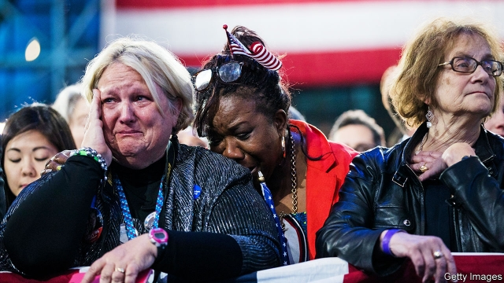

###### Political loss aversion

# Happiness and voting 

##### Why picking a party is like following a sports team 

 

> Apr 4th 2019 

AS ANY SPORTS fan will admit, supporting your team is agony. Not only must all but one side lose in any competition, but humans seem hard-wired to feel the pain of a loss more keenly than the pleasure of a win. This phenomenon is called “loss aversion” and crops up in many areas of life. Most people would rather forgo the chance of winning $1.10 than risk losing $1. Even capuchin monkeys, it is said, show loss aversion. A new study by Sergio Pinto of the University of Maryland and others finds it in American politics, too. 

Political engagement is correlated with happiness. That may seem hard to believe at a time when most political activity seems to increase the sum of human misery, but the recent World Happiness Report, an annual survey backed by the UN, lays out compelling evidence. A sample of 1,300 (American) respondents shows a link between reported levels of “life satisfaction” and turnout at elections, even when controlling for age and income. In Britain, the propensity to vote rises as people become happier. (Perhaps this explains why British turnout went down steadily for decades.) A study from 2005 in the Review of Economic Studies found that people are considerably happier when the party they support is in power. 

It is not clear why these two things should be linked. It could be that people who are unhappy about their lives are more likely to be dissatisfied with the political system and opt out. Or the two factors could be linked to a third which influences voting, such as marriage. Married people report higher levels of happiness and vote more reliably. Or perhaps voting just makes people happier. Charitable giving and altruism certainly make people feel better about themselves (studies have found this is true even for infants). Perhaps engaging in politics has a similar effect. 

Whatever the reason, the impact of happiness on political engagement is substantial. In America it has as big an effect on voting as education does. In both cases, the higher the level the higher the turnout. 

So it was more surprising than it might appear when Mr Pinto and his colleagues found that the two recent presidential elections have produced a net decrease in American happiness. The day after the vote in 2016 saw a big and understandable crash in the reported life satisfaction of Democrats. Two months later Democrats were still more miserable than they had been before the vote. There was an offsetting rise in Republican satisfaction, but it was only a third as large as the Democratic fall and it dissipated quickly. On some measures—such as people’s expectations about the election’s impact on their community—Republicans became more pessimistic. 

As with happiness and voting, the Trump effect was substantial. The reduction in Democrats’ current and expected life satisfaction was as large as that which happens when people lose their jobs or get health problems which prevent normal activities. The results cannot be explained away as based on poor data. They are drawn from a large sample and from unusually detailed data by Gallup Healthways, which surveys 15,000 people a month. 

So what is the explanation? There are three possibilities, not mutually exclusive. It’s “very much a loss-aversion story”, says Carol Graham of the Brookings Institution, a think-tank, who is one of the study’s authors. On the African savannah, early humans benefited only a little from an extra meal but might starve if they missed one. So they evolved to avoid potential losses. In contemporary politics, loss aversion may moderate the happiness effect. 

Next, Donald Trump magnifies the impact. As an iconoclast, surprise winner and self-declared offender against all things liberals hold dear, Mr Trump was always likely to make Democrats more upset than any other Republican victor would have done. On the Republican side, a study in 2018 by Jeph Herrin of the Yale School of Medicine found that counties which voted for Mr Trump had lower levels of reported well-being than average, and saw big falls in that well-being between 2012 and 2016. Perhaps Mr Trump’s victory simply meant that these areas reverted to the mean. 

Third, different dimensions of happiness seem to matter. Psychologists distinguish between evaluative and hedonic well-being. Evaluative means how you assess your life: are you very happy, somewhat happy and so on? Hedonic well-being refers to specific emotions: did you experience stress, enjoyment or anger yesterday? Evaluative well-being is more stable than the hedonic kind. It is possible that the political system and basic democratic procedures, being part of people’s long-term make-up, influence feelings of evaluative happiness, which do not change so much, whereas the results of particular polls trigger more volatile emotions of anger, worry and stress. That suggests that, if picking a party is like following a sports team, political engagement is more akin to liking sports in general. If so, the current president might reduce American happiness without necessarily doing much damage to contentment about the political system. 

-- 

 单词注释:

1.aversion[ә'vә:ʃәn]:n. 厌恶, 讨厌的事, 讨厌的人 [医] 厌恶, 移转, 移位 

2.APR[]:[计] 替换通路再试器 

3.keenly['ki:nli]:adv. 锐利地, 敏捷地, 激烈地 

4.forgo[fɒ:'gәu]:vt. 摒绝, 放弃 

5.capuchin['kæpjuʃin]:[Capuchin ](天主教的)圣方济会托钵僧 

6.Sergio[]:n. 塞尔吉奥（NBA球员） 

7.pinto['pintәu]:a. 黑白花斑的, 杂色的 n. 花马, 菜豆 

8.Maryland['merilәnd]:n. 马里兰州 

9.politic['pɒlitik]:a. 精明的, 明智的, 策略的 

10.engagement[in'geidʒdmәnt]:n. 诺言, 约会, 婚约, 交战 [医] 衔接 

11.correlate['kɒrәleit]:n. 有相互关系的东西, 相关物 vt. 使有相互关系 vi. 相关 

12.misery['mizәri]:n. 痛苦, 悲惨, 不幸, 穷困 

13.UN[ʌn]:pron. 家伙, 东西 [经] 联合国 

14.respondent[ri'spɒndәnt]:a. 回答的, 应答的, 反射的 n. 应答者, 被告 

15.turnout['tә:naut]:n. 聚集的人群, 出席者, 产量 [化] 输出; 产额 

16.propensity[prә'pensәti]:n. 倾向, 爱好, 习性 

17.considerably[kәn'sidәrәbli]:adv. 非常地, 很, 颇 

18.opt[ɒpt]:vi. 选择 

19.reliably[ri'laiәbli]:adv. 可靠地, 可信赖地 

20.charitable['tʃæritәbl]:a. 大慈大悲的, 宽厚的, 慈善的 [法] 慈善的, 慷慨的, 宽恕的 

21.altruism['æltruizm]:n. 利他主义, 利他 

22.presidential[.prezi'denʃәl]:a. 总统制的, 总统的, 首长的, 统辖的 [法] 总统的, 议长的, 总经理的 

23.understandable[.ʌndә'stændәbl]:a. 可以理解的 

24.democrat['demәkræt]:n. 民主人士, 民主主义者, 民主党党员 [经] 民主党 

25.offset['ɒ:fset]:n. 抵消, 把...并列, 旁系, 支管, 用胶印法印 vt. 弥补, 抵消, 胶印 vi. 装支管 n. 偏移量 [计] 偏移量 

26.dissipate['disipeit]:vt. 散失, 驱散, 浪费 vi. 消散, 放荡 

27.quickly['kwikli]:adv. 很快地 

28.cannot['kænɒt]:aux. 无法, 不能 

29.datum['deitәm]:n. 论据, 材料, 资料, 已知数 [医] 材料, 资料, 论据 

30.Gallup['^ælәp]:n. 盖洛普（姓氏）；盖洛普（George Horace, 1901-美国统计学家, 盖洛普民意测验的创始人） 

31.mutually['mju:tʃuәli]:adv. 互相地, 互助 

32.carol['kærәl]:n. 颂歌, 欢乐的歌 v. 歌颂, 欢唱 

33.graham['ɡreiәm]:a. 全麦的；粗面粉的；全麦粉制成的 

34.Brooking[]:n. (Brooking)人名；(英、西)布鲁金 忍受（brook的现在分词形式） 容忍 

35.savannah[sә'vænә]:n. 大草原, 热带草原（等于savanna） 

36.magnify['mægnifai]:vt. 放大, 扩大, 赞美, 夸大 vi. 有放大能力 

37.iconoclast[ai'kɒnәklæst]:n. 反对偶象崇拜者, 提倡打破旧习的人 

38.offender[ә'fendә]:n. 罪犯, 无礼的人, 得罪人的人 

39.alway['ɔ:lwei]:adv. 永远；总是（等于always） 

40.victor['viktә]:n. 胜利者 a. 胜利的 

41.jeph[]:[网络] 音谋笔记；罗悦全；驼兽 

42.herrin[]: [人名] 赫林; [地名] [美国] 赫林 

43.Yale[jeil]:n. 耶鲁 

44.revert[ri'vә:t]:vi. 恢复, 复归, 回复, 还原 vt. 使回复原状, 使回转 n. 恢复原信仰的人 [计] 还原 

45.psychologist[sai'kɒlәdʒist]:n. 心理学家 [医] 心理学家 

46.evaluative[i'væljueitiv]:a. 可估价的 

47.hedonic[hi:'dɒnik]:a. 快乐的, 快乐论的 n. 快乐论 

48.evaluative[i'væljueitiv]:a. 可估价的 

49.hedonic[hi:'dɒnik]:a. 快乐的, 快乐论的 n. 快乐论 

50.enjoyment[in'dʒɒimәnt]:n. 享乐, 快乐, 享受 [经] 使用权 

51.trigger['trigә]:n. 触发器, 扳机 vt. 触发, 发射, 引起 vi. 松开扳柄 [计] 切换开关 

52.volatile['vɒlәtail]:a. 挥发性的, 可变的, 不稳定的, 飞行的, 轻快的, 爆炸性的 n. 有翅动物, 挥发物 [计] 易失的 

53.akin[ә'kin]:a. 同类的, 同族的, 同源的 

54.contentment[kәn'tentmәnt]:n. 满足, 使人满意的事物, 满意 

