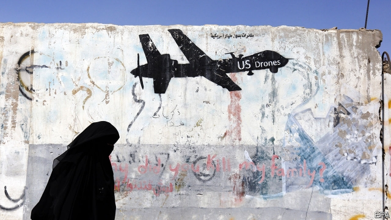

###### Bombs astray

# How many civilians does America kill in air strikes? 

##### The Pentagon does not really know 

 

> Apr 4th 2019 

AMERICA HAS conducted 108 air strikes in Somalia since 2017, killing some 800 people. The Pentagon says they were all jihadists. Amnesty International, a human rights organisation, disagrees. It has gathered detailed evidence suggesting that five recent strikes alone killed 14 civilians. That discrepancy between the civilians that external observers say have been killed in American air strikes and the number the government owns up to is repeated across the world. 

Donald Trump came to office pledging to wind down America’s wars. Instead, he ramped some of them up. The campaign in Somalia against al-Shabab, a brutal jihadist group which is aligned to al-Qaeda and controls a quarter of the country, saw the number of air strikes trebled from 14 in 2016 to 45 last year. There were 28 in the first three months of 2019 alone. 

In part, that may reflect looser rules. Barack Obama had decreed that commanders in places like Somalia and Pakistan—outside of formal war zones like Iraq—required “near certainty” that a target was a high-value terrorist, no civilians would be killed or injured except in “extraordinary circumstances”, and decisions would be informed by inter-agency consultation. 

In 2017 Mr Trump overhauled these rules. He not only diluted Mr Obama’s special restrictions on secret wars, but also allowed specific countries to be declared an “area of active hostilities”. In such places, International Humanitarian Law (IHL)—the more permissive rules that apply in avowed battlefields like Iraq and Afghanistan—would be in force. 

In Somalia this meant commanders now needed only “reasonable certainty” that a target was present, and could make their decision without recourse to officials back home. This increased the risk of civilians being misidentified as combatants. Separately, the shift to IHL also meant that commanders could go after foot-soldiers, not just al-Shabab bigwigs. 

Disputes over the civilian toll from air campaigns go well beyond Somalia. More American bombs and missiles fell on Afghanistan in 2018 than in any year since published records began a decade ago—more than five times as many as in 2015. Civilian deaths from air strikes correspondingly rose by 87% between 2017 and 2018 to 463, according to Action on Armed Violence (AOAV), a monitoring group. 

That includes bombs dropped by the Afghan air force, which has far less experience in using precision weapons. But the United Nations Assistance Mission in Afghanistan (UNAMA), whose estimates are similar to those of AOAV, says that 62% of aerial casualties—deaths and injuries—were inflicted by the NATO-led coalition, whose air power is largely American. NATO accepts just 62 of those deaths, a small proportion of UNAMA’s total, though it agrees that another 68 are disputed. 

A similar story has played out in the Middle East. By March the American-led coalition battling Islamic State across Iraq and Syria had owned up to at least 1,257 civilian deaths since the start of the war. Airwars, a London-based NGO, says the figure is probably six times higher, over 7,500—an average of one civilian death every four strikes. Airwars is particularly scathing of Britain’s claim to have killed just one civilian among 4,000 or so enemies. Britain, it says, is “seemingly incapable of detecting civilian casualties from its urban actions.” 

This uncertainty stems in part from the nature of modern war. On most of its battlefields, small bands of American and allied special forces quietly direct air strikes using laser guidance and other high-tech methods. But America also outsources the job to regional allies, such as Kurdish rebels in Syria and secret paramilitary units made up of Afghans. Many of these local proxies can call in air strikes, but they have neither the inclination nor the expertise to conduct detailed investigations of the aftermath on the ground. 

That leaves America reliant on overhead imagery, coupled with what limited human or electronic intelligence may trickle in, to count bodies. This is particularly limiting when it comes to evaluating casualties inside buildings in built-up areas. In some cases the people on the ground—whether al-Shabab in Somalia or Pakistan’s intelligence agency—deliberately obfuscate matters, keeping the press away from bombed areas. But America’s own rules also appear to be part of the problem. 

American commanders evaluate casualty claims made by external organisations in inconsistent and sometimes restrictive ways. One study of Iraq and Syria by Azmat Khan and Anand Gopal for the New York Times in 2017 found that armed forces would entertain allegations only within 50 metres of an air strike, considerably narrower than the blast radius of some American weapons. In other cases they were more reasonable, considering claims within several miles. 

American commanders may also be primed to underestimate figures. Larry Lewis, a former official who led seven Pentagon studies on how to avoid civilian casualties in Afghanistan, points out that America’s pre-strike process for estimating collateral damage, though rigorous, “has never been calibrated with real world data to test its accuracy.” 

The Pentagon has taken note of all this criticism. In February it partially declassified a study from 2018 of civilian casualties caused over the previous three years. The study insisted that there was a “widespread priority to minimise civilian casualties from the highest to the lowest levels,” but found that the coalition against Islamic State had systematically undercounted. 

The report said that 58% of civilian casualties assessed as “credible” came from external allegations, not internal sources. In fact, America’s armed forces often turn to the very same NGOs that hold their feet to the fire on these matters. In 2018 the vast majority of civilian casualty assessments published by the coalition–over 1,000 alleged events–were sourced to Airwars, the NGO based in London. 

Airwars now liaises closely with American forces, and both sides swap data on a regular basis. “Progressively over time we’ve seen improvements in our relationship and the standard of their assessments and ours,” says Chris Woods, Airwars’ founder and director. 

The Pentagon’s study exhorted officials to build on efforts like these. It urged officials to “systematically seek out additional sources of information on potential civilian casualties,” including social media and NGOs. It proposed that commanders around the world should take on staff to reconcile the Pentagon’s claims with those of others, and standardise their process for making assessments. Its general thrust was to encourage transparency. 

Mr Woods says that the Americans have been “pioneering” on addressing civilian harm, “way ahead of Europeans”. That, he suggests, is the result of pressure from legislation and bipartisan interest from Congress. On May 1st the Pentagon is due to publish a congressionally mandated report on global civilian casualties. 

But not everyone seems on board. On March 6th Mr Trump revoked an executive order by Mr Obama which had required intelligence officials to publish civilian casualties in undeclared war zones like Pakistan and Yemen, mostly from CIA drone strikes. “Superfluous reporting requirements,” said the National Security Council, “distract our intelligence professionals from their primary mission.” In contrast to the Pentagon’s recent efforts to improve transparency, the White House decision is a dismaying step backwards. 

-- 

 单词注释:

1.astray[ә'strei]:adv. 迷途地, 入歧途地 [法] 误入歧途地, 离开正道地 

2.pentagon['pentәgәn]:n. 五角形, 五边形 [经] 五角平台 

3.APR[]:[计] 替换通路再试器 

4.Somalia[sәu'mɑ:liә]:n. 索马里 

5.jihadist[]:n. 伊斯兰圣战士 

6.amnesty['æmnisti]:n. 大赦, 赦免 

7.organisation[,ɔ: ^әnaizeiʃən; - ni'z-]:n. 组织, 团体, 体制, 编制 

8.discrepancy[dis'krepәnsi]:n. 不符合, 差异, 不相符之处 [化] 不符值; 偏差值 

9.pledge[pledʒ]:n. 诺言, 保证, 誓言, 抵押, 信物, 保人, 祝愿 vt. 许诺, 保证, 使发誓, 抵押, 典当, 举杯祝...健康 

10.ramp[ræmp]:n. 斜坡, 坡道, 敲诈 vi. 狂跳乱撞, 乱冲, 敲诈, 蔓延 vt. 使有斜面, 敲诈 

11.brutal['bru:tәl]:a. 残忍的, 野蛮的, 不讲理的 

12.align[ә'lain]:vi. 排列, 排成一行, 结盟 vt. 使结盟, 使成一行, 校正 

13.treble['trebl]:n. 最高声部, 三倍 a. 三倍的, 最高声部的 vt. 使增为三倍 vi. 成为三倍 

14.loos[]:n. 损耗, 洗手间（loo复数形式） 

15.barack[bɑ:'ræk]:n. 巴拉克（男子名） 

16.obama[]:n. 奥巴马(姓) 

17.decree[di'kri:]:n. 法令, 判决, 天意 vt. 颁布, 判决 vi. 发布命令 

18.terrorist['terәrist]:n. 恐怖分子 [法] 恐怖份子, 恐怖主义 

19.consultation[.kɒnsәl'teiʃәn]:n. 请教, 咨询, 磋商会 [医] 会诊 

20.overhaul[.әuvә'hɒ:l]:vt. 分解检查, 翻修, 精细检查, 彻底革新 n. 分解检查, 精细检查, 大检修 

21.dilute[dai'lju:t]:vt. 冲淡, 稀释 a. 淡的, 稀释的 

22.hostility[hɒs'tiliti]:n. 敌意, 敌对, 反对 

23.humanitarian[hju:.mæni'tєәriәn]:n. 人道主义者, 博爱者, 基督凡人论者 a. 人道主义的, 博爱的, 凡人论的 

24.permissive[pә'misiv]:a. 许可的, 获准的, 宽容的, 放任的, 放纵的, 允许选择的, 自由的 [法] 表示许可的, 随意的, 纵容的 

25.avow[ә'vau]:vt. 坦率承认, 断言 [法] 公开宣称, 声明, 供认 

26.battlefield['bætlfi:ld]:n. 战场, 沙场 

27.Iraq[i'rɑ:k]:n. 伊拉克 

28.recourse[ri'kɒ:s]:n. 求援, 求助, 追索权 [经] 追索权 

29.misidentify[,misai'dentifai]:v. 识别错 

30.combatant['kɒmbәtәnt]:n. 争斗者, 格斗者 [法] 战斗者, 参战者 

31.ihl[]: [医][=International Homeopathic League]国际顺势疗法联合会 

32.bigwig['bigwig]:n. 要人, 大亨 

33.toll[tәul]:n. 通行费, 代价, 钟声 vt. 征收, 敲钟, 鸣钟, 勾引, 引诱 vi. 征税, 鸣钟 

34.Afghanistan[æf'gænistæn]:n. 阿富汗 

35.correspondingly[]:adv. 相应地, 相对地 

36.Afghan['æfgæn]:a. 阿富汗的, 阿富汗人的 n. 阿富汗人, 阿富汗语, 阿富汗毛毯 

37.les[lei]:abbr. 发射脱离系统（Launch Escape System） 

38.aerial['єәriәl]:a. 空中的, 航空的, 空气的, 空想的 n. 天线 

39.inflict[in'flikt]:vt. 施以, 加害, 使承受 [法] 处, 加, 予以 

40.coalition[.kәuә'liʃәn]:n. 结合体, 结合, 联合 [经] 联合, 联盟 

41.NATO['neitәj]:北大西洋公约组织, 北约组织 [经] 北大西洋公约组织 

42.Islamic[iz'læmik]:a. 伊斯兰教的, 穆斯林的 

43.Syria['siriә]:n. 叙利亚 [经] 叙利亚 

44.ngo[]:abbr. 民间组织；非政府组织（Non-Governmental Organization） 

45.scathing['skeiðiŋ]:a. 伤害的, 损伤的, 严厉的 

46.seemingly['si:miŋli]:adv. 看来似乎, 表面上看来 

47.incapable[in'keipәbl]:a. 无能力的, 不能的 [机] 不能行的, 耐不住的 

48.casualty['kæʒjuәlti]:n. 意外事故, 伤亡, 受害者 [化] 事故 

49.uncertainty[.ʌn'sә:tnti]:n. 不确定, 不可靠, 不确定的事物 [化] 不确定度 

50.ally['ælai. ә'lai]:n. 同盟者, 同盟国, 助手 vt. 使联盟, 使联合, 使有关系 vi. 结盟 

51.quietly['kwaiәtli]:adv. 安静地, 沉着地, 秘密地 

52.lase[leiz]:vi. 发出激光, 以激光照射 

53.outsource[aut'sɔ:s]:vt. 把…外包 

54.regional['ri:dʒәnәl]:a. 地方的, 地域性的 [医] 区的, 部位的 

55.Kurdish['kә:diʃ]:a. 库尔德人的 n. 库尔德语 

56.paramilitary[.pærә'militәri]:a. 辅助军事的 

57.Afghan['æfgæn]:a. 阿富汗的, 阿富汗人的 n. 阿富汗人, 阿富汗语, 阿富汗毛毯 

58.proxy['prɒksi]:n. 代理, 代理人, 委托书 [经] 代理人, 代表权, 授权书 

59.inclination[.inkli'neiʃәn]:n. 倾向, 趋向, 倾斜度, 点头 [化] 倾角 

60.expertise[.ekspә:'ti:z]:n. 专家意见, 专门技术 [法] 专门知识, 专家意见 

61.aftermath['ɑ:ftәmæθ]:n. 结果, 后果 [法] 后果, 结果 

62.reliant[ri'laiәnt]:a. 依赖的, 信赖的 

63.imagery['imidʒәri]:n. 肖像, 比喻, 雕刻 [化] 成像 

64.trickle['trikl]:n. 滴, 细流 vi. 滴, 细细地流 vt. 使滴, 使小量流动 [计] 信息透露 

65.obfuscate[ɒb'fʌskeit]:vt. 弄暗, 使模糊, 使迷惑 

66.inconsistent[.inkәn'sistәnt]:a. 不一致的, 易变的, 前后矛盾的 [法] 矛盾的, 不一致的, 不协调的 

67.restrictive[ri'striktiv]:a. 限制的, 约束的, 限定的 n. 限制词 

68.khan[kɑ:n]:n. 可汗, 商队宿店 

69.Anand[]:n. 安纳德（印度古吉拉特邦的一个小镇, 印度代孕行为的发源地）；阿南德（男子名, 著名作家） 

70.gopal[]:戈帕尔（人名） 

71.york[jɔ:k]:n. 约克郡；约克王朝 

72.allegation[.æli'geiʃәn]:n. 断言, 主张, 申辩 [法] 声明, 事实陈述, 断言 

73.considerably[kәn'sidәrәbli]:adv. 非常地, 很, 颇 

74.underestimate[.ʌndәr'estimeit]:n. 低估 vt. 低估, 看轻 

75.Larry['læri]:n. 拉里（男子名） 

76.lewis['lu:is]:n. 吊楔 

77.collateral[kә'lætәrәl]:a. 并行的, 附随的, 旁系的 n. 旁系亲属, 担保品 

78.rigorous['rigәrәs]:a. 严厉的, 严酷的, 严格的, 苛刻的, 严密的, 精确的 

79.calibrate['kælibreit]:vt. 测定口径, 校准, 使标准化, 调整 [化] 校准 

80.datum['deitәm]:n. 论据, 材料, 资料, 已知数 [医] 材料, 资料, 论据 

81.declassify[di:'klæsifai]:vt. (文件)解密, 从机密表删除 

82.minimise[]:vt. 使减到最少/最小, 使降到最低限度, 使缩到最小, 极度轻视 

83.systematically[.sisti'mætikli]:adv. 有系统地, 有组织地, 有条理地 

84.undercounted[]:[网络] 不足 

85.credible['kredәbl]:a. 可信的, 可靠的 [法] 可信的, 可靠的 

86.ngos[]:abbr. non-government organization 非政府组织，非政府机构 

87.allege[ә'ledʒ]:vt. 宣称, 主张, 提出, 断言 [法] 断言, 指称, 指证 

88.liaise[li'eiz]:vi. 保持联络, 担任联络官 

89.progressively[]:adv. 进步, 先进, 向前进, 不断前进, 累进, 渐进, 逐渐, 渐次, 主张进步, 进行性 

90.chris[kris]:n. 克里斯（男子名）；克莉丝（女子名） 

91.founder['faundә]:n. 创立者, 建立者 vt. 使沉没, 使摔倒, 弄跛, 浸水, 破坏 vi. 沉没, 摔到, 变跛, 倒塌, 失败 

92.exhort[ig'zɒ:t]:v. 劝诫, 忠告 

93.reconcile['rekәnsail]:vt. 使和解, 调停, 使和谐, 使一致, 使听从 [经] 对帐, 使一致 

94.standardise[]:vt. 使与标准比较, 用标准校验, 使符合标准, 使统一, 使标准化 

95.transparency[træns'pærәnsi]:n. 透明, 透明度, 透过性, 透明物, 清晰 [计] 透明性; 透明 

96.bipartisan[bai,pɑ:ti'zæn]:a. 两党连立的 

97.congressionally[]:adv. congressional的变形 

98.mandate['mændeit]:n. 命令, 指令, 要求 vt. 委任统治 

99.revoke[ri'vәuk]:vt. 撤回, 废除 vi. 藏牌 n. 藏牌 [计] 取消权限程序 

100.undeclared[.ʌndi'klєәd]:a. 未申报的, 未宣布的 

101.Pakistan[.pɑ:ki'stɑ:n]:n. 巴基斯坦 

102.yeman[]:[网络] 也门；叶门；园艺业的普及则始于也门 

103.CIA[]:中央情报局 [计] 中国互联网络协会 

104.drone[drәun]:n. 雄蜂, 懒惰者, 嗡嗡的声音, 无人驾驶飞机(或船) vi. 嗡嗡作声, 混日子 vt. 低沉地说 

105.superfluous[sju'pә:fluәs]:a. 多余的, 过剩的 

106.distract[dis'trækt]:vt. 转移, 分心, 使发狂 

107.dismay[dis'mei]:n. 沮丧 vt. 使惊愕, 使气馁 

108.backwards['bækwәdz]:adv. 向后 

