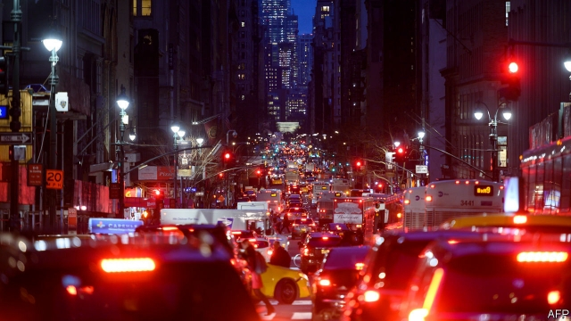

###### It’s not up to you

# Manhattan embraces road pricing 

##### NYC should copy Singapore rather than London 

 

> Apr 4th 2019 

NEW YORK’S congestion is among the worst in the world, according to an advisory panel’s report published in January last year. Crossing midtown by car is soul-destroying. In 2016 the average speed was 4.7 miles per hour, not much quicker than a brisk stroll. But relief is in sight. On April 1st (no, really), state lawmakers agreed to implement congestion-pricing, making New York the first big American city to do so. By 2021 vehicles will have to pay to enter Manhattan south of 60th street. 

Similar proposals go back 50 years but have always stalled. The Regional Plan Association proposed road-pricing in 1996. Michael Bloomberg’s 2007 plan was not even debated on the state legislature floor. This time, with Andrew Cuomo, the state governor, at the wheel and Bill de Blasio, New York’s mayor, riding shotgun, it looks as if this time is different. 

Much of the detail, including how much drivers will have to pay, how they will pay and how often they will pay, have yet to be decided. A “traffic mobility review board” will be set up to work all this out. New Yorkers living in the fee zone who make less than $60,000 a year will be exempt. Other drivers, including motorcyclists, the city’s civil servants, disabled drivers, the trucking industry, New Jersey’s governor and commuters, all want discounts, credits or exemptions, too, which bodes ill. 

If done right, congestion-pricing could be expanded beyond Manhattan. New York can learn from other cities. Singapore, for instance, which has had pricing for decades, adjusts prices regularly. It can also learn from mistakes. London, which rolled out its pricing in 2003, bizarrely is only starting to charge on-demand car hires like Uber. Stockholm exempted too many vehicles, which caused a drop in fee revenue. 

Other car-clogged cities considering tolls, including Los Angeles, Philadelphia, Portland, San Francisco and Seattle, are watching New York. A mayor-appointed task force in Boston recommended a $5 fee, but so far Marty Walsh, the mayor, is pumping the breaks. “We really have to be a good example,” says Nicole Gelinas of the Manhattan Institute, a New York think-tank. Moody’s, a credit-rating agency, said the plan is a “credit positive” for the city, the state and the Metropolitan Transportation Authority. The only possible roadblock to the scheme is New Yorkers themselves—54% oppose fees. 

-- 

 单词注释:

1.Manhattan[mæn'hætәn]:n. 曼哈顿 

2.nyc[]:abbr. 纽约市（New York City） 

3.Singapore[.siŋgә'pɒ:]:n. 新加坡 

4.APR[]:[计] 替换通路再试器 

5.congestion[kәn'dʒestʃәn]:n. 拥挤, 充血 [计] 拥挤, 拥塞 

6.advisory[әd'vaizәri]:a. 顾问的, 咨询的, 劝告的 [法] 劝告的, 忠告的, 咨询的 

7.midtown['midtajn]:n. 商业区与住宅区之间的地区 

8.stroll[strәul]:n. 闲逛, 漫步 v. 闲逛, 漫步 

9.lawmaker[lɒ:'meikә]:n. 立法者 

10.york[jɔ:k]:n. 约克郡；约克王朝 

11.alway['ɔ:lwei]:adv. 永远；总是（等于always） 

12.stall[stɒ:l]:n. 厩, 停车处, 牧师职位, 货摊, 托辞, 拖延 vt. 关入厩, 停顿, 推托, 支吾, 使陷于泥中 vi. 被关在厩内, 陷于泥中, 停止, 支吾 

13.regional['ri:dʒәnәl]:a. 地方的, 地域性的 [医] 区的, 部位的 

14.michael['maikl]:n. 迈克尔（男子名） 

15.legislature['ledʒisleitʃә]:n. 立法机关, 议会, 立法院 [法] 立法机构, 立法机关 

16.andrew['ændru:]:n. 安德鲁（男子名） 

17.cuomo[]: [人名] 科莫 

18.de[di:]:[化] 非对映体过量 [医] 铥(69号元素铥的别名,1916年Eder离得的假想元素) 

19.blasio[]:n. (Blasio)人名；(意、英)布拉西奥 

20.shotgun['ʃɒtgʌn]:n. 散弹猎枪, 媒人 v. 用猎枪射击 

21.mobility[mәu'biliti]:n. 可动性, 流动性, 机动性 [化] 迁移率 

22.yorker['jɒ:kә]:n. 贴板球 

23.les[lei]:abbr. 发射脱离系统（Launch Escape System） 

24.exempt[ig'zempt]:n. 免税者, 被免除义务者 a. 免除的 vt. 使免除, 豁免 

25.motorcyclist['mәutәsaiklist]:n. 骑摩托车 

26.commuter[kә'mju:tә]:n. 乘公共车辆上下班者, 月季票乘客 [经] 非(当地)居民 

27.exemption[ig'zempʃәn]:n. 解除, 免除, 免税 [化] 免检 

28.bode[bәud]:v. 预示 bide的过去式 

29.bizarrely[bɪ'zɑ:lɪ]: 古怪地; 怪诞地 

30.uber['ju:bә]:[医] 乳房 

31.Stockholm['stɒkhәulm]:n. 斯德哥尔摩 

32.toll[tәul]:n. 通行费, 代价, 钟声 vt. 征收, 敲钟, 鸣钟, 勾引, 引诱 vi. 征税, 鸣钟 

33.los[lɔ:s]:abbr. 月球轨道航天器（Lunar Orbiter Spacecraft）；视线（Line of Sight） 

34.angeles[]:n. 安杰利斯（姓氏）；天使城（菲律宾地名） 

35.Philadelphia[.filә'delfjә]:n. 费城 

36.Portland['pɒ:tlәnd]:n. 波特兰(美港口) 

37.san[sɑ:n]:abbr. 存储区域网（Storage Area Networking） 

38.francisco[fræn'siskәu]:n. 弗朗西斯科（男子名, 等于Francis） 

39.Seattle[si'ætl]:n. 西雅图 

40.Boston['bɒstәn]:n. 波士顿 

41.marty['mɑ:ti]:n. 马蒂（男子名, Martin的异体） 

42.walsh[wɔ:lʃ]:n. 沃尔什（姓氏） 

43.nicole[ni'kәjl]:n. 尼科尔（女子名, 等于Nichole） 

44.gelinas[]:n. (Gelinas)人名；(法)热利纳 

45.metropolitan[.metrә'pɒlitn]:n. 大都市居民, 都主教, 宗主国的公民 a. 大都市的, 都主教区的, 宗主国的 

46.roadblock['rәudblɒk]:n. 障碍, 障碍物 

