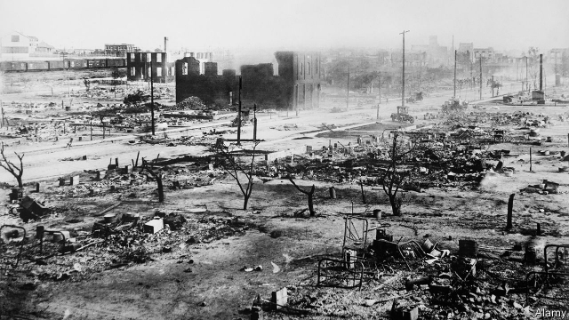
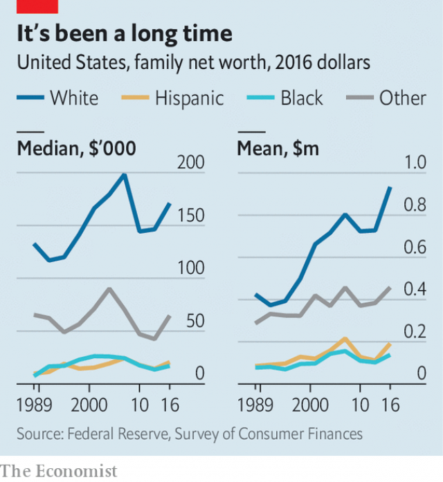

###### Melanin and money

# The black-white wealth gap is unchanged after half a century 

##### How to go about narrowing it 

 

> Apr 6th 2019 

FEW AMERICANS remember Greenwood, a once-prosperous African-American neighbourhood in Tulsa, Oklahoma, that was known as Black Wall Street. In 1921 Dick Rowland, a black shoeshiner, was charged with attempting to rape a white lift-girl in a downtown office building. An incensed white mob gathered at the courthouse to lynch him, then proceeded to Greenwood for two days of rioting, looting and murder. City officials aided and abetted the violence. In the end 35 blocks were destroyed, 10,000 black people were made homeless, and as many as 300 were killed. Residents reported aeroplanes flying overhead, dropping explosives. It was one of the worst incidents of racial violence since the civil war. Tens of millions of dollars in black wealth were destroyed or stolen. No compensation was awarded to either the victims or their descendants. 

American history is replete with horrific episodes that prevented the accumulation of black wealth for centuries: first slavery, then indentured servitude under Jim Crow, segregated housing and schooling, seizure of property and racial discrimination. The result was that in 1962, two years before the passage of landmark civil-rights legislation and the Great Society programme, the average wealth of white households was seven times greater than that of black households. Yet after decades of declining discrimination and the construction of a modern welfare state, that ratio remains the same. The mean of black household wealth is $138,200—for whites, that number is $933,700. 

Median wealth is smaller, but even more lopsided. The typical black family has just $17,100 compared with the typical white one, which has $171,000. The discrepancies are caused by low incomes and by debt. Compared with whites, black Americans have higher debt loads: 19.4% of black households have net wealth at or below $0, compared with 9.2% of whites. There had been slow improvement over the decades, but the Great Recession of 2007-08 wiped this out, since blacks were disproportionately harmed by the subprime mortgage blow-up. Because of that, home-ownership, the conventional wealth-building tool of the middle class, stands at 42% among blacks—only one percentage point higher than it was in 1968—compared with 73% for whites. 

Determining what lies behind the persistent wealth gap is essential to fixing it. The thinking ascendant on the left blames both present-day discrimination and the long history of racist public policies, such as redlining, an official practice that made it harder for blacks to get mortgages, and so permanently disrupted the transmission of wealth between generations. One cure for this state of affairs is reparations, a one-off cash transfer to compensate for the lasting effects of slavery and discrimination. The idea, long popular on the political fringe, has emerged as a faultline among the Democratic presidential primary contenders. Julián Castro, Barack Obama’s former housing secretary, criticised Senator Bernie Sanders for dismissing the idea. Elizabeth Warren, a Massachusetts senator, says she is on board, and suggested that Native Americans should be “part of the conversation” too. 

 

But more ordinary forces could also be at play. Wealth is, at its core, the accumulation of savings over time. Lower salaries (and lower saving rates) thus limit the opportunity for wealth growth. A recent study by Dionissi Aliprantis and Daniel Carroll, research economists at the Federal Reserve Bank of Cleveland, argues that the persistent racial gap in wealth can be entirely accounted for by the racial gap in income. According to the latest figures, from 2017, the median black household takes in $40,258 a year compared with $68,145 for the typical white one. Calculations by Edward Wolff, an economist at New York University, suggest that inheritances can explain about 23% of the racial wealth gap. His research suggests that the gap would close only modestly if blacks inherited wealth to the same extent as whites do. 

If the cause of the persistent wealth gap is really a long-term income disparity, the policies needed to rectify it are different. Even as discrimination has declined and the country has instituted affirmative action programmes in university admissions and some job hiring, the black-white income gap remains high. A portion of this is due to present-day discrimination. There is strong evidence that employers are less likely to call back applicants with black-sounding names, for example. But there have also been other structural changes to black America that have led to this stagnant outcome: deindustrialisation, which hit blacks living in cities especially hard, rising incarceration rates and the decline of stable two-parent families. These are all tied up in a complex tangle of pathology, all of which is to some degree the legacy of historical racism. But a lump-sum reparations payment, even if sizeable, would not lead to wealth convergence if present-day racial income patterns remained fixed. 

And the politics of reparations remains treacherous. Even race-neutral anti-poverty programmes, like cash welfare and food stamps, already attract fierce opposition, in no small part because they are often seen by white voters as handouts to minorities and immigrants. Reparations would surely worsen the racial divide—perhaps to Donald Trump’s electoral benefit. 

A more promising proposal for narrowing the inheritance gap, offered by Darrick Hamilton and William Darity, two economists, is “baby bonds”—essentially trust accounts for every child born in America, which could not be accessed until adulthood. The federal government would top up these accounts each year, depositing more for poorer families. Cory Booker, a New Jersey senator running for president, has proposed legislation to do this. 

The annual cost would be $82bn, according to one analysis from Columbia University (for context, the budget for the federal Department of Housing and Urban Development is $53bn). Universal access to the trust accounts might stave off opposition. “In a lot of ways, it is replicating what happened in the New Deal with the GI bill and the federal housing loans that excluded blacks,” says Mr Hamilton. He also likens the idea to the birth of the Social Security (pensions) programme. “We as a society decided that we didn’t want our elderly to be economically insecure. So the government came up with a programme. We don’t have anything for young people except subsistence programmes to keep them from being destitute,” he says. 

One vulnerability is that the policy has a built-in lag time of 18 years and benefits a constituency that cannot vote or hire lobbyists. Britain introduced a similar scheme, only to cancel it six years later. And although a government-funded inheritance would go some way to making up for historical injustices, it would not erase the black-white income gap. 

-- 

 单词注释:

1.melanin['melәnin]:n. 黑色素 [化] 黑素 

2.unchanged[.ʌn'tʃeindʒd]:a. 无变化的 [经] 持稳的 

3.APR[]:[计] 替换通路再试器 

4.greenwood['gri:nwud]:n. 绿林, 湿材 

5.tulsa['tʌlsә]:n. 塔尔萨（美国俄克拉菏马州东北部城市） 

6.Oklahoma[.әuklә'hәumә]:n. 俄克拉何马 

7.dick[dik]:n. 家伙, 词典, 誓言(书) [医] 二氯乙胂(毒气) 

8.rowland['rәulәnd]:n. 罗兰（男子名） 

9.shoeshiner[]:[网络] 擦鞋工；擦鞋者；擦鞋仔 

10.rape[reip]:n. 抢夺, 掠夺, 强奸, 葡萄渣, 芸苔 vt. 掠夺, 抢夺, 强奸 

11.incense['inseins]:n. 香, 香气, 奉承 vi. 焚香 vt. 用香焚, 使发怒 

12.mob[mɒb]:n. 暴民, 民众, 暴徒 vt. 大举包围, 蜂拥进入, 围攻 vi. 聚众生事 

13.courthouse['kɒ:thaus]:n. 法院, 郡政府所在地 

14.lynch[lintʃ]:n. 私刑, 私罚 vt. 处以私刑处死, 加私刑 

15.riot['raiәt]:n. 暴动, 喧闹, 放纵 vi. 发动, 暴动, 纵情, 放荡 vt. 浪费, 挥霍 

16.loot[lu:t]:n. 赃物, 洗劫, 抢夺 v. 洗劫, 抢夺 

17.abet[ә'bet]:vt. 教唆, 煽动, 怂恿, 帮助, 支持 

18.homeless['hәumlis]:a. 无家的, 无养主的 

19.tens[]:十位 

20.compensation[.kɒmpen'seiʃәn]:n. 补偿, 赔偿金, 工资 [医] 代偿(机能), 补偿 

21.descendant[di'sendәnt]:n. 后裔, 子孙 a. 传下的, 下降的 

22.replete[ri'pli:t]:a. 装满的, 充满的, 充实的, 吃饱的 

23.horrific[hɒ'rifik]:a. 令人毛骨悚然的, 感到恐惧的 

24.accumulation[ә.kju:mju'leiʃәn]:n. 积聚, 累积, 积聚物 [医] 蓄积, 累积 

25.indenture[in'dentʃә]:n. 契约, 契据, 凹痕 vt. 以契约束缚 

26.servitude['sә:vitju:d]:n. 奴隶状态, 惩役, 地役权 [法] 苦役, 劳役, 奴役 

27.jim[dʒim]:n. 吉姆（人名） 

28.segregate['segrigeit]:a. 分离的, 被隔离的 vi. 分离, 隔离, 分凝 vt. 使分离, 使隔离 

29.seizure['si:ʒә]:n. 捕获, 夺取, 占领, 捕获物, 没收, 充公 [医] 发作; 癫痫发作 

30.landmark['lændmɑ:k]:n. 陆标, 划时代的事, 地界标 [医] 界标 

31.median['mi:diәn]:a. 中央的, 中间的, 正中的 n. 正中动脉, 中位数, 中线 

32.lopside[]:n. 倾向一方 

33.discrepancy[dis'krepәnsi]:n. 不符合, 差异, 不相符之处 [化] 不符值; 偏差值 

34.recession[ri'seʃәn]:n. 后退, 凹处, 衰退, 归还 [医] 退缩 

35.disproportionately[]:adv. 不匀称, 不相称 

36.subprime[ˌsʌb'praɪm]:a. 准一流的, 近乎头等的; 准最低贷款利率的 

37.mortgage['mɒ:gidʒ]:n. 抵押, 约束性义务, 抵押借款 vt. 抵押, 以...作担保, 把...许给 

38.persistent[pә'sistәnt]:a. 固执的, 坚持的, 持续的, 作用持久的 [法] 坚持的, 固执的, 持续的 

39.ascendant[ә'sendәnt]:n. 支配地位, 优势, 运星 a. 上升的, 占优势的 

40.racist['reisist]:n. 种族主义者 [法] 种族主义的, 种族歧视 

41.redline['redlain]:vi.对某社团进行经济歧视, 按安全飞行速度驾驶飞机 vt.<美>(用红线)划去, 取消, 排除, 歧视 

42.disrupt[dis'rʌpt]:a. 分裂的, 中断的 vt. 使分裂, 使瓦解 

43.reparation[.repә'reiʃәn]:n. 补偿, 赔偿, 弥补, 修复, 修理 [经] 赔偿, 补偿, 修理 

44.fringe[frindʒ]:n. 边缘, 端, 流苏, 穗, 初步 vt. 加穗于, 加饰边于 a. 边缘的, 附加的 

45.faultline['fɔːlt.laɪn]:un. 断层线；裂纹线 [网络] 断层生死线；误线 

46.presidential[.prezi'denʃәl]:a. 总统制的, 总统的, 首长的, 统辖的 [法] 总统的, 议长的, 总经理的 

47.contender[kәn'tendә(r)]:n. 参赛者, 争论者, 斗争者, 竞争者 

48.Castro['kæstrəu]:n. 卡斯特罗（古巴领导人, 1976-2006年在任） 

49.barack[bɑ:'ræk]:n. 巴拉克（男子名） 

50.criticise['kritisaiz]:v. 批评, 吹毛求疵, 非难 

51.senator['senәtә]:n. 参议员, (某些大学的)理事 [法] 参议员, 上议员 

52.bernie['bә:ni]:n. 伯尼（男子名）；[俚]可卡因（等于cocaine） 

53.sander['sændә]:[电] 散沙 

54.elizabeth[i'lizәbәθ]:n. 伊丽莎白（女子名） 

55.warren['wɒrәn]:n. 养兔场, 拥挤的地区 

56.Massachusetts[.mæsә'tʃu:sits]:n. 麻萨诸塞州 

57.senator['senәtә]:n. 参议员, (某些大学的)理事 [法] 参议员, 上议员 

58.daniel['dænjәl]:n. 丹尼尔（男子名） 

59.Carroll['kærəl]:n. 卡罗尔（罗马人的姓） 

60.economist[i:'kɒnәmist]:n. 经济学者, 经济家 [经] 经济学家 

61.Cleveland['kli:vlәnd]:n. 克利夫兰 

62.entirely[in'taiәli]:adv. 完全, 全然, 一概 

63.median['mi:diәn]:a. 中央的, 中间的, 正中的 n. 正中动脉, 中位数, 中线 

64.edward['edwәd]:n. 爱德华（男子名） 

65.Wolff[]:n. (Wolff)人名；(波、芬、瑞典、德、匈、法、罗、荷、英)沃尔夫 沃尔夫 

66.york[jɔ:k]:n. 约克郡；约克王朝 

67.inheritance[in'heritәns]:n. 遗传, 遗产 [医] 遗传 

68.modestly[]:adv. 适当地；谨慎地 

69.disparity[dis'pæriti]:n. 不一致 [医] 差异, 不等 

70.rectify['rektifai]:vt. 订正, 矫正, 改正, 调正, 校正, 精馏, 整流 [化] 精馏 

71.affirmative[ә'fә:mәtiv]:a. 肯定的, 赞成的, 积极的 n. 肯定语 

72.les[lei]:abbr. 发射脱离系统（Launch Escape System） 

73.stagnant['stægnәnt]:a. 不流动的, 停滞的, 不景气的, 萧条的, 污浊的, 迟钝的 [经] 萧条的 

74.deindustrialisation[]:[网络] 去工业化；后工业化 

75.incarceration[in.kɑ:sә'reiʃәn]:n. 下狱, 监禁, 禁闭 [医] 箝闭 

76.tangle['tæŋgl]:n. 缠结, 纠结的一团, 困惑, 纠纷, 混乱 vt. 使缠结, 缠住 vi. 缠结, 乱作一团 

77.pathology[pæ'θɒlәdʒi]:n. 病理学, 病理, 病状, 病变 [医] 闰理学 

78.legacy['legәsi]:n. 祖先传下来之物, 遗赠物 [经] 遗产, 遗赠物 

79.racism['reisizm]:n. 种族主义, 种族偏见 [法] 种族主义, 种族歧视, 种族歧视主张 

80.sizeable['saizәbl]:a. 相当大的, 可观的 

81.convergence[kәn'vә:dʒәns]:n. 集中, 收敛 [计] 收敛, 会聚 

82.politic['pɒlitik]:a. 精明的, 明智的, 策略的 

83.treacherous['tretʃәrәs]:a. 不可信任的, 危险的, 背叛的, 不可靠的 [法] 奸诈的, 背叛的, 背信弃义的 

84.opposition[.ɒpә'ziʃәn]:n. 反对, 敌对, 相反, 在野党 [医] 对生, 对向, 反抗, 反对症 

85.voter['vәutә]:n. 选民, 投票人 [法] 选民, 选举人, 投票人 

86.handout['hændaut]:n. 施舍物, 救济品, 分发的印刷品资料, 广告物品 

87.worsen['wә:sn]:vt. 使更坏, 使恶化 vi. 变得更坏, 恶化 

88.electoral[i'lektәrәl]:a. 选举人的, 选举的, (有关)选举的 [法] 选举的, 选举人的, 由选举人组成的 

89.darrick[]:n. 【男名】男子名 [网络] 达瑞克；达里克；点点 

90.hamilton['hæmiltәn]:n. 汉密尔顿（男子名）；哈密尔顿（美国城市名） 

91.william['wiljәm]:n. 威廉（男子名）；[常作W-][美俚]钞票, 纸币 

92.darity[]: [人名] 达里蒂 

93.adulthood[ә'dʌlthud]:n. 成年 [医] 成人期 

94.cory[]:n. 克里, 科里（人名） 

95.booker['bukә]:n. （旅馆车票, 戏票等的）登记人；寻选模特儿的人 

96.jersey['dʒә:zi]:n. 运动衫 

97.Columbia[kә'lʌmbiә]:n. 哥伦比亚 

98.context['kɒntekst]:n. 上下文, 背景, 来龙去脉 n. 上下文 [计] 上下文 

99.stave[steiv]:n. 狭板, 梯级, 棍棒, 诗句 vt. 击穿, 弄破, 敲打, 赶走 vi. 穿孔, 破碎 

100.replicate['replikeit]:vt. 折叠, 折转, 复制 n. 复现试验, 复制品, 高八度音 a. 复现的, 复制的, 折转的, 弯回的 

101.gi[dʒi: 'ai]:a. 军用的；美国军人的 

102.liken['laikәn]:vt. 比喻, 比拟 

103.economically[i:kә'nɔmikәli]:adv. 节约地, 不浪费地, 节省地, 节俭地, 在经济上, 在经济学上 

104.insecure[.insi'kjuә]:a. 不安全的, 不牢靠的, 不坚固的, 不稳定的 

105.subsistence[sәb'sistәns]:n. 生存, 生活 [医] 生存 

106.destitute['destitju:t]:a. 穷困的, 缺乏的 

107.vulnerability[.vʌlnәrә'biliti]:n. 易受伤, 易受责难, 易受伤部位 [医] 易损性 

108.constituency[kәn'stitjuәnsi]:n. 选民, 顾客, 读者 [法] 选区, 全体选民, 选区内的选民 

109.cannot['kænɒt]:aux. 无法, 不能 

110.lobbyist['lɔbiist]:n. 说客 [法] 院外活动集团成员 

111.injustice[in'dʒʌstis]:n. 不公平, 非正义的行为 [法] 不公正, 不公平, 权利侵害 

112.erase[i'reis]:vt. 抹去, 擦掉 [计] 清洗; 擦除; 抹除; DOS内部命令:从磁盘上删除一个或多个文件 

