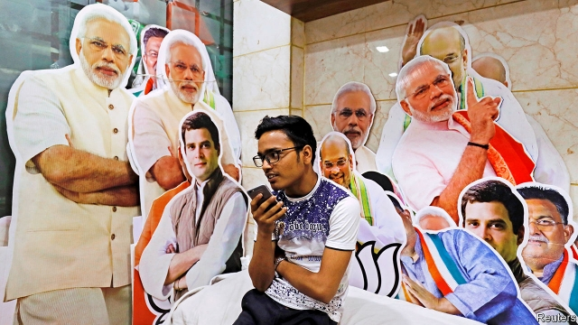

###### Phoney war

# India’s election campaign is being fought in voters’ pockets 

##### Smartphone apps provide a cheap, effective and unpoliceable means to spread propaganda 

 

> Apr 11th 2019 

“ARE YOU there? It’s me, your sweetheart,” a push notification coos at 7am. It comes from one of India’s most popular smartphone apps, Helo, which allows users to chat and share content. But the flirtatious burble soon gives way to political anecdotes and jokes aimed at national leaders. Many question whether Rahul Gandhi, the leader of the opposition Congress party, is really Hindu, or make him look weak. The torrent of political content is only natural, given that voting began in the country’s seven-phase election on April 11th. But who is behind it all, and what effect will it have on voters? 

The campaign still features billboards and little lorries with loudspeakers plying through towns and villages. But this year’s election is being waged most vigorously on voters’ phones. At the previous general election, in 2014, India’s 1.3bn citizens had barely 100m smartphones between them. Now they have more than 400m. Mobile data are cheap, with a gigabyte costing just $0.26. India has become the biggest market for Facebook (more than 300m accounts), WhatsApp (more than 200m active users) and a host of other social-media apps. Many, such as Helo and SHAREit, a similar service, are owned by Chinese firms. Together, they were downloaded 950m times last year. 

Many social circles and extended families form WhatsApp groups, to share gossip, humour and everything else. The messaging app’s encryption makes the source and content of the material circulated all but invisible to everyone but its intended targets. That can have grim consequences. After a rash of rumours about child-snatching led to several lynchings last year, WhatsApp made it harder to forward messages to big groups, to slow the spread of misinformation. 

The app remains political parties’ favoured means of disseminating propaganda, factual and otherwise. The Bharatiya Janata Party (BJP) recruited a “troll army” of volunteers in time for the last election, which it won in a landslide. In the five years since, its social-media soldiers have made life online miserable for its ideological enemies, mainly liberals, leftists, Muslims and feminists. Other parties have established their own IT cells, but with the BJP raking in 93% of all declared campaign donations, its technological superiority is only to be expected. 

The BJP aims to have 150,000 cyber-soldiers in the state of Uttar Pradesh alone. And then there are the bots. Twitter is not especially influential in India, but is relatively easy to study since its content is visible to all. The Atlantic Council, an American think-tank, examined Twitter’s traffic during a two-day spell in February, when Narendra Modi, the prime minister, toured the state of Tamil Nadu. Bots pushed both pro- and anti-Modi hashtags by the thousands per second, with the pro-Modi bots working three times harder. 

At 8.40am, Helo bleeps again, unbidden. It wants to share the good news that “America has dealt a tight slap to India’s pimp-journalists!” The pimps in question are news outlets that had reported that India had not downed a Pakistani F-16 last month, as the government had claimed. The accompanying post states—wrongly—that the American government has denied the reports. It comes from an outfit called Special Coverage News, which seems to specialise in machine-generated copy with a pro-Modi tilt. 

There is no obvious way to prevent such claims from circulating. Indeed, the chief executive of a rival app to Helo acknowledges there is no law to prevent his company going further, and taking fees for surreptitious advertising or selling data about users’ locations. (He would never do that, he hastens to add.) The Election Commission has been meeting social-media firms to try to find ways to ensure that they delete content that violates its code of conduct. But many of the apps concerned, such as WhatsApp, are impossible to police. And even those that can be invigilated can be overwhelmed by the volume of propaganda. When it comes to filtering out falsehoods, it seems, India’s voters will be left to their own devices. 

-- 

 单词注释:

1.phoney['fәuni]:a. 假的, 假冒的, 伪造的 n. 骗子, 假货, 假冒者 

2.smartphone[]:n. 智能手机 

3.APP[]:[计] 应用, 应用程序; 相联并行处理器 

4.unpoliceable[]:[网络] 不公开的 

5.propaganda[.prɒpә'gændә]:n. 宣传, 宣传活动 [医] 宣传 

6.APR[]:[计] 替换通路再试器 

7.sweetheart['swi:thɑ:t]:n. 心上人, 爱人 vi. 爱慕 vt. 向...求爱 

8.notification[.nәutifi'keiʃәn]:n. 通知, 通告, 告示 [经] 通知, 通知书 

9.coo[ku:]:vi. 咕咕地叫 vi.vt. 谈情话, 轻轻地说, 温柔可爱地说, 温柔爱恋地说 n. 鸽子的叫声, 鸽子叫似的轻声 

10.smartphone[]:n. 智能手机 

11.helo['heləʊ]:n. 直升机 

12.flirtatious[flә:'teiʃәs]:a. 爱调戏的, 轻浮的 

13.burble[bә:bl]:vi. 发汩汩声, 嘟囔 n. 空谈, 汩汩声 

14.rahul[]:n. 拉胡尔（人名） 

15.Gandhi['gændi:]:n. 甘地 

16.opposition[.ɒpә'ziʃәn]:n. 反对, 敌对, 相反, 在野党 [医] 对生, 对向, 反抗, 反对症 

17.Hindu['hindu:]:a. 印度教教徒的 n. 印度教教徒 

18.billboard['bilbɒ:d]:n. 广告牌, 布告板 vt. 宣传 

19.ply[plai]:n. 厚度, 板层 vt. 使用, 使劲挥舞, 从事, 折, 弯 vi. 辛勤工作, 定期航行 

20.vigorously[]:adv. 朝气蓬勃, 精力充沛, 壮健, 茁壮, 健壮, 强有力 

21.smartphones[]: 智能手机（smartphone的复数） 

22.datum['deitәm]:n. 论据, 材料, 资料, 已知数 [医] 材料, 资料, 论据 

23.gigabyte[]:n. 吉字节 [计] 千兆字节 

24.facebook[]:n. 脸谱网 

25.WhatsApp[]:[网络] 智能手机；联络电话；每月活跃用 

26.gossip['gɒsip]:n. 闲聊, 随笔, 流言, 爱讲闲话的人 vi. 说闲话, 闲聊 

27.encryption[-'kripʃən]:[计] 加密 

28.grim[grim]:a. 冷酷的, 坚强的, 残忍的, 可怕的, 讨厌的 

29.rash[ræʃ]:a. 轻率的, 匆忙的, 鲁莽的 n. 皮疹 

30.lynching['lintʃiŋ]:n. 处私刑杀害 [法] 私刑, 私刑处死 

31.misinformation['misinfә'meiʃәn]:n. 错误的消息, 误传 [法] 错误的消息, 误传 

32.disseminate[di'semineit]:vt. 散播, 传播, 宣传 vi. 广为传播 

33.factual['fæktʃuәl]:a. 事实的, 实际的 [法] 事实的, 与事实有关的, 实际的 

34.Bharatiya[]:[网络] 巴拉蒂亚 

35.Janata['dʒʌnətɑ:]:n. （印度）人民团体；人民党（印度联合政党） 

36.bjp[]: [医][=Bence Jones protein]本周（氏）蛋白，凝溶蛋白 

37.troll[trɒl]:vi. 滚动, 参加轮唱, 曳绳钓鱼 vt. 使转动, 轮唱, 高唱, 用曳绳钓(鱼) n. 转动, 轮唱, 钓绳 

38.landslide['lændslaid]:n. 山崩 [化] 滑坡 

39.online[]:[计] 联机 

40.ideological[.aidiә'lɒdʒikәl]:a. 意识形态的, 空想的 [法] 思想的, 思想上的, 意识形态的 

41.leftist['leftist]:n. 左翼的人, 左派 a. 左派的 

42.Muslim['mjzlim; (?@) 'mʌzlem]:n. 伊斯兰教, 伊斯兰教教徒 

43.feminist['feminist]:n. 男女平等主义者 

44.donation[dәu'neiʃәn]:n. 捐赠物, 捐款, 捐赠 [经] 赠品, 捐款, 捐赠 

45.technological[.teknә'lɒdʒikl]:a. 技术的 [经] 工艺的, 技术的 

46.superiority[sju:.piәri'ɒriti]:n. 优越, 高傲 [化] 优越性 

47.uttar[]:[网络] 北方；乌塔茹阿；太邦 

48.Pradesh[]:邦 

49.BOT[bɔt]:[计] 磁带开始标志, 计算机角色 [医] 肤蝇[类]幼虫 

50.twitter['twitә]:n. 啁啾, 唧唧喳喳声 vi. 啭, 啁啾, 颤抖 vt. 嘁嘁喳喳地讲, 抖动 

51.narendra[]:[网络] 纳伦德拉；纳兰德；纳然陀 

52.MODI['mәudai]:[计] 模块化光学数字接口 

53.Tamil['tæmil]:n. 泰米尔人, 泰米尔语 

54.Nadu[]:n. (Nadu)人名；(罗)纳杜 abbr. 海军航空研制单位（naval air development unit） 

55.hashtags[]:[网络] 标签；话题标签；标签运用 

56.bleep[bli:p]:n. 哔哔声 vi. 发出哔哔声 

57.unbidden[.ʌn'bidn]:a. 未奉命的, 未受指使的, 自发的, 未受邀请的 

58.slap[slæp]:n. 掴, 掌击, 侮辱, 拍击声 v. 拍击, 惩罚 adv. 正面地, 直接地, 突然地 

59.pimp[pimp]:n. 皮条客, 男妓, 恶棍, 窥探情人者, 告密者 vi. 拉皮条, 告密 

60.Pakistani[.pɑ:ki'stɑ:ni]:a. 巴基斯坦的 n. 巴基斯坦人 

61.outfit['autfit]:n. 用具, 配备, 机构 vt. 配备, 供应 vi. 得到装备 

62.coverage['kʌvәridʒ]:n. 覆盖的范围, 保险总额, 新闻报导 [化] 可达范围; 覆盖度 

63.specialise['speʃә,laiz]:vt. 特加指明, 列举, 使专门化, 限定...的范围 vt.vi. (使)特化, (使)专化 vi. 成为专家, 专务, 专攻, 专门研究, 逐条详述 

64.tilt[tilt]:n. 倾斜, 倾向, 船篷, 车篷 vt. 使倾斜, 使倾侧, 用帆布篷遮盖 vi. 倾斜, 翘起, 冲, 评击 [计] 倾斜 

65.surreptitious[.sʌrәp'tiʃәs]:a. 秘密的, 暗中的, 偷偷摸摸的 [法] 鬼鬼祟祟的, 秘密的, 欺骗的 

66.advertising['ædvәtaiziŋ]:n. 广告业, 广告 a. 广告的 [计] 发广告 

67.invigilate[in'vidʒileit]:vi. 看守, 监考 

68.overwhelm[.әuvә'hwelm]:vt. 淹没, 受打击, 制服, 压倒, 使不知所措 [法] 打翻, 倾覆, 覆盖 

69.falsehood['fɒ:lshud]:n. 谎言, 虚假(性) [法] 虚伪陈述, 谎言, 谬误 

70.voter['vәutә]:n. 选民, 投票人 [法] 选民, 选举人, 投票人 

