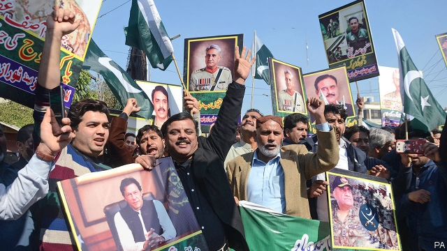

###### Charm offensive

# Pakistan’s leaders claim to be turning over a new leaf 

##### But reforms are easier talked about than implemented 

 

> Apr 11th 2019 

DOZENS OF BOYS sit in rows on the carpet, hunched over open books, reciting a passage over and over. As skullcaps bob rhythmically, childish voices evoke the cacophony of an aviary. Reading and reciting the Koran are all this school teaches, and may be all the education these boys get. 

During last year’s election campaign, Imran Khan, a former cricket star who is now prime minister, promised a naya or “new” Pakistan. The scene at this madrasa, perched on a pine-forested ridge 100km north of Islamabad, the capital, provides a hint of how tenacious the old Pakistan remains. There are more than 30,000 madrasas like this one, with perhaps 2.5m pupils enrolled. Many of the students are boarders whose poor, illiterate parents give them up for long periods to the religious charities that run such schools. They graduate with strong opinions, but few skills. 

That will all change, says Mr Khan’s team. Soon, insists his minister of education, the religious schools will have to teach a broader range of subjects to gain government accreditation. Eventually, a single national curriculum will be imposed. The army, which is widely seen as the power behind the throne and has often appeared indulgent to religious extremism, supports education reform. Its own growing network of fee-paying schools is heavy on sciences and English. 

As for madrasa graduates who turn to jihadist militancy, a senior commander is adamant. The time when Pakistan’s “deep state” winked at favoured jihadist groups is over. “We will not allow these goons to run around and dictate our foreign policy,” he insists. Mr Khan is equally emphatic. What use does Pakistani intelligence have for such groups anymore, he asks. They were created to fight the Soviets in Afghanistan, and then lingered in the 1990s when they were encouraged to make life difficult for India in its part of Kashmir, which Pakistan claims. But from now on there will be no Kashmir exception, says Mr Khan, hinting that it may become harder for Pakistan-based militants to infiltrate Indian territory. “What we found is that Kashmiris are the ones who suffer,” he says, alluding to harsh measures India has often taken to maintain security on its side of the border. 

Pakistani politicians and soldiers have made such pledges before. India tends to dismiss them as insincere attempts to escape international condemnation after terrorist groups based in Pakistan mount attacks in India—as in February, when an outfit called Jaish-e-Muhammad killed 40 policemen in India’s bit of Kashmir. India responded by sending jets to drop bombs deep inside Pakistani territory. Their target was the madrasa, which Indian officials said was a training centre for terrorists. 

Pakistan retaliated largely symbolically, bombing only open spaces, and also defused tensions by quickly releasing a captured Indian pilot. Whether this emollient approach will last is unclear. But Pakistan’s army seems desperate to put its best foot forward, claiming that a new era of civil-military relations has dawned. Mr Khan declares that he enjoys total support, even as top generals straight-facedly refer to the prime minister as “boss” and profess their love of democracy and the rule of law. 

Mr Khan, although undoubtedly not in charge of the generals, has won plaudits for trying to honour his loudest election promise, which was to crack down on corruption. Since he came into office last August the National Accountability Bureau, aptly known as NAB, has mounted a fierce offensive against allegedly crooked officials. No fewer than five former prime ministers are under investigation. The current heads of the two main political parties that challenge Mr Khan’s Pakistan Tehreek-e-Insaf (PTI), as well as close relatives, are also being questioned. 

Yet the offensive has been so vigorous that some fear it has put a chill on investment, at a time Pakistan desperately needs it. It is also clear that, fairly or not, the biggest targets of the campaign happen to be Mr Khan’s political opponents. Similarly, the government has justified sudden, drastic cuts in spending on advertising as a needed economy. But given that such spending represented a big slice of revenue for many media firms, the move, which has cost as many as 3,000 jobs, appears to have disproportionately hurt outlets that have been unkind to Mr Khan. The army, despite its professed commitment to democracy, quells criticism in even more radical ways, ordering irksome channels off the air and abducting nettlesome bloggers. 

Whether the media can air it or not, there will be more resentment when the government takes painful steps needed to mend the economy. The IMF, which looks set to impose tough conditions for a bailout—Pakistan’s 13th in 31 years—recently predicted that, without reforms, the economy will grow by just 2.5% a year over the next five years, barely outpacing the growth of the population. The rupee has lost more than 30% of its value since Mr Khan took office, inflation has soared and both the current-account and budget deficits are unsustainable. The prime minister puts on a brave face, noting that things were worse a few months ago, when foreign-exchange reserves were only enough to pay for two weeks of imports. 

The improvement, alas, is solely owing to charity from China and the Gulf. The unkind may conclude that the kinder, gentler image Pakistan is trying to project is prompted by a sobering look at its finances. Pakistani officials clearly relished inviting diplomats and journalists to the hilltop madrasa that India claimed to have blitzed, to show that it remains intact. But India routinely humiliates Pakistan in a much more profound way: its economy is growing so fast that it expands by the size of Pakistan’s every two years. 

-- 

 单词注释:

1.charm[tʃɑ:m]:n. 吸引力, 魔力, 符咒 vt. 迷住, 使陶醉, 行魔法 vi. 用符咒, 有魅力 

2.offensive[ә'fensiv]:a. 令人不快的, 侮辱的, 攻击性的 [法] 攻击的, 进攻的, 冒犯的 

3.APR[]:[计] 替换通路再试器 

4.hunch[hʌntʃ]:n. 肉峰, 预感, 大块 vt. 弯腰驼背, 预感到, 耸肩 vi. 向前移动, 隆起 

5.skullcap['skʌlkæp]:n. 无边便帽, 黄芩属植物 [医] 美黄芩 

6.bob[bɒb]:vt. 剪短, 敲击 vi. 振动, 上下跳动 n. 短发, 悬挂的饰品, 浮子, 摆动, 轻敲, 5便士 

7.rhythmically[]:adv. 有节奏地 

8.evoke[i'vәuk]:vt. 唤起, 引起, 召(魂) [法] 提审, 移送 

9.cacophony[kæ'kɒfәni]:n. 不愉快的音调, 不协和音, 杂音 

10.aviary['eivjәri]:n. 大型鸟舍, 鸟类饲养场 

11.Koran[kɒ'rɑ:n]:n. <<可兰经>> 

12.IMRAN[]:n. 伊姆兰（男子名） 

13.khan[kɑ:n]:n. 可汗, 商队宿店 

14.naya[]: [地名] [哥伦比亚、印度尼西亚] 纳亚 

15.Pakistan[.pɑ:ki'stɑ:n]:n. 巴基斯坦 

16.madrasa[]: 马德拉沙（穆斯林高等教育机构） 

17.perch[pә:tʃ]:n. 栖木, 高位, 杆, 河鲈 v. (使)栖息, 就位, 位于, (使)暂歇 

18.ISLAMABAD[is'lɑ:mәbɑ:d]:伊斯兰堡(巴基斯坦首都) 

19.tenacious[ti'neiʃәs]:a. 紧握的, 固执的, 不屈不挠的, 黏着力强的 [医] 坚韧的 

20.enrol[in'rәul]:vt. 登记, 使加入 vi. 参军, 注册 

21.boarder['bɒ:dә]:n. 寄膳者, 寄膳宿者 

22.illiterate[i'litәrәt]:n. 文盲 a. 目不识丁的, 没受教育的 

23.accreditation[ә.kredi'teiʃәn]:n. 委派, 信托, 鉴定合格 [法] 立案, 备案, 任命 

24.indulgent[in'dʌldʒәnt]:a. 纵容的, 任性的, 宽容的 

25.extremism[ik'stri:mizm]:n. 极端倾向, 极端论, 过激主义 

26.jihadist[]:n. 伊斯兰圣战士 

27.militancy['militәnsi]:n. 战斗性 

28.adamant['ædәmәnt]:n. 坚硬的东西 a. 非常坚硬的, 坚强的, 固执的 

29.wink[wiŋk]:n. 眨眼, 使眼色, 瞬间 vi. 眨眼, 使眼色, 闪烁 vt. 眨 

30.goon[gu:n]:n. 受雇暴徒, 愚笨者, 呆子 

31.equally['i:kwәli]:adv. 相等地, 同样地, 平等地 

32.emphatic[im'fætik]:a. 语调强的, 着重的, 强调了的 

33.Pakistani[.pɑ:ki'stɑ:ni]:a. 巴基斯坦的 n. 巴基斯坦人 

34.anymore['eni'mɔ:]:adv. 再也不, 不再 

35.Afghanistan[æf'gænistæn]:n. 阿富汗 

36.linger['liŋgә]:vi. 逗留, 消磨, 徘徊 vt. 消磨 

37.Kashmir['kæʃmiә]:n. 克什米尔 

38.militant['militәnt]:a. 好战的 

39.infiltrate[in'filtreit]:vt. 使浸润, 使潜入, 使渗入 vi. 渗入 n. 渗透物 

40.Kashmiri[kæʃ'miәri]:n. 克什米尔语, 克什米尔人 

41.allude[ә'lu:d]:vi. 暗指, 提及 

42.pledge[pledʒ]:n. 诺言, 保证, 誓言, 抵押, 信物, 保人, 祝愿 vt. 许诺, 保证, 使发誓, 抵押, 典当, 举杯祝...健康 

43.insincere[.insin'siә]:a. 不诚实的, 无诚意的, 伪善的 

44.condemnation[kɒndem'neiʃәn]:n. 非难, 宣告有罪, 非难的理由 

45.terrorist['terәrist]:n. 恐怖分子 [法] 恐怖份子, 恐怖主义 

46.outfit['autfit]:n. 用具, 配备, 机构 vt. 配备, 供应 vi. 得到装备 

47.retaliate[ri'tælieit]:vt. 报复, 回敬 vi. 报复, 以牙还牙 

48.symbolically[sɪm'bɒlɪklɪ]:adv. 象征性地 

49.defuse[.di:'fju:z]:vt. 去掉...的引信, 平息 

50.quickly['kwikli]:adv. 很快地 

51.emollient[i'mɒliәnt]:a. 使柔软的 n. 软化剂, 润肤剂 

52.unclear[.ʌn'kliә]:a. 不易了解的, 不清楚的, 含混的 

53.profess[prә'fes]:vt. 声称, 以...为业, 伪称, 讲授 vi. 表白, 承认, 当教授 

54.plaudit['plɒ:dit]:n. 拍手喝彩, 称赞, 赞美 

55.corruption[kә'rʌpʃәn]:n. 腐败, 堕落, 贪污 [计] 论误 

56.accountability[ә.kauntә'biliti]:n. 负有责任, 可说明性 [化] 衡算计量 

57.aptly['æptli]:adv. 适当地, 适宜地 

58.nab[næb]:vt. 捉住, 逮捕, 抢夺 [电] 国际广播协会的简写 

59.allegedly[ә'ledʒidli]:adv. 依其申述 

60.crook[kruk]:n. 钩, 弯曲部分, 坏蛋 vt. 使弯曲, 诈骗 vi. 弯曲 

61.pti[]:abbr. 精密加工工艺公司；Precision Technology, Inc.；体育训练教练员；Physical Training Instructor 

62.desperately['despәrәtli]:adv. 拼命地；绝望地；极度地 

63.drastic['dræstik]:a. 激烈的 [医] 峻泻药, 剧烈的 

64.advertising['ædvәtaiziŋ]:n. 广告业, 广告 a. 广告的 [计] 发广告 

65.disproportionately[]:adv. 不匀称, 不相称 

66.quell[kwel]:vt. 压制, 平息, 减轻 

67.irksome['ә:ksәm]:a. 厌恶的, 讨厌的, 令人厌烦的 

68.abduct[æb'dʌkt]:vt. 诱拐, 绑架, 使外展 [医] 外展, 展 

69.nettlesome['netlsәm]:a. 令人激恼的, 烦人的, 易怒的 

70.blogger[]:n. 写博客的人；博客使用者 

71.resentment[ri'zentmәnt]:n. 怨恨, 愤恨 

72.IMF[]:国际货币基金组织 [经] 国际货币基金 

73.outpace[.aut'peis]:vt. 超过...速度, 赶过 

74.rupee[ru:'pi:]:n. 卢比(印、巴等国货币单位) 

75.inflation[in'fleiʃәn]:n. 胀大, 夸张, 通货膨胀 [化] 充气吹胀; 膨胀 

76.soar[sɒ:]:n. 高扬, 翱翔 vi. 往上飞舞, 高耸, 翱翔 

77.deficit['defisit]:n. 赤字, 不足额 [医] 短缺 

78.unsustainable[,ʌnsәs'teinәbl]:a. 无法支撑的, 不能忍受的, 不可证实的 [法] 未能证实的, 不能成立的 

79.ala['eilә]:n. 翼, 翅 [化] 丙氨酸 

80.gentl[]:[网络] 旧非；情奴；西格 

81.relish['reliʃ]:n. 滋味, 风味, 美味, 爱好, 食欲, 调味品 vt. 调味, 喜欢, 玩味 vi. 有味道 

82.diplomat['diplәmæt]:n. 外交官, 有外交手腕的人 [法] 外交家, 外交官, 有权谋的人 

83.hilltop['hiltɒp]:n. 小山顶 

84.blitze[blits]:n. 闪电战 v. 闪电战 

85.intact[in'tækt]:a. 尚未被人碰过的, 原封不动的, 完整的 [医] 完整的, 无伤的 

86.routinely[]:adv. 日常, 乏味, 常规, 例行 

87.humiliate[hju:'milieit]:vt. 使丢脸, 使蒙羞, 屈辱 

88.profound[prә'faund]:a. 极深的, 深厚的, 深刻的, 渊博的 

