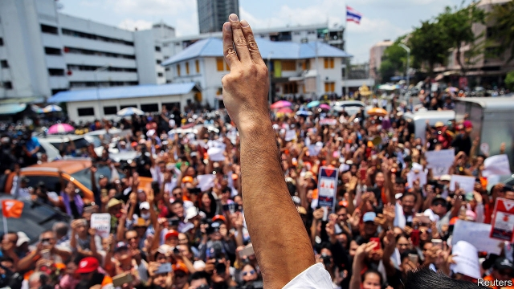

###### Still at it

# Thailand’s junta has another go at rigging elections 

##### Its efforts to steer voters came up short, so now it is trying to overturn the results 

 

> Apr 11th 2019 

HE TURNED TO the crowd outside the police station, lifted his eyes to the heavens and raised three fingers. This salute, a sign of resistance to tyranny in “The Hunger Games”, a dystopian series of novels and films, is the kind of gesture that has made Thanathorn Juangroongruangkit, the leader of Future Forward, a political party he founded last year, wildly popular with young Thai voters. Inside the station, Mr Thanathorn was charged with sedition, assisting criminals and taking part in an illegal assembly. 

The rap sheet relates to a protest in 2015 against the military junta which, in theory, is now on the verge of returning Thailand to civilian rule. The authorities say Mr Thanathorn helped to arrange the protest, which was illegal only under the extremely restrictive rules the junta placed on all political activity. If convicted he could face seven years in prison and a ban from politics. It is his second criminal case. Last year he was charged with computer crimes for critical comments about the junta he made in videos streamed on Facebook. He denies wrongdoing. Future Forward came third in last month’s election; the junta says the charges are “entirely unrelated to current political events”. 

Thus continues the generals’ blundering campaign to keep control of the country. Since seizing power in a coup almost five years ago, they have schemed to keep allies of Thaksin Shinawatra, a former prime minister ousted in a prior coup, out of power. They pushed through a new constitution which skewed the electoral system and gave them the power to appoint a third of the members of parliament. Intimidating and imprisoning critics like Mr Thanathorn was supposed to help smooth their allies’ path to power. 

Since the vote on March 24th, however, things have not been going smoothly for the junta. Although the party set up to back it got more votes than any other, a coalition of seven parties opposed to the generals, including Future Forward, claimed to have won a majority in the lower house of parliament. That is not enough to prevent Prayuth Chan-ocha, the junta leader and prime minister, from keeping his job, since he can rely on the votes of the appointed upper house. But it is an embarrassment, and will make it hard for him to govern. 

Hence a series of measures intended to undermine the democratic coalition. Even before polling day the Election Commission had helped the junta by excluding a party linked to Mr Thaksin. On the day itself inconsistent vote tallies and unexpected delays did little to inspire confidence. The commission’s latest act of meddling concerns the 150 seats in the lower house that are awarded under an obscure system of proportional representation. It seems, in effect, to be setting a lower threshold for tiny parties to win seats than bigger ones, fracturing parliament and imperilling the democratic front’s majority. 

Little is clear, since the commission has not yet announced how it is distributing the seats. It has until May 9th to issue the final results. Those will change further if it disqualifies any winners of the 350 seats awarded to the candidate with the most votes in each constituency. Its rules on campaigning appeared designed to trip up politicians by, among other things, forbidding candidates from mentioning the royal family, severely limiting the use of social media and specifying how big certain placards could be. The commission has announced that it will investigate 66 victorious candidates, without specifying which ones. The junta, meanwhile, is trying to quell criticism of the commission, charging activists who have documented its bias with libel. 

The continuing manipulation of the election could drag Thailand into turmoil. Political deadlock might even give the army an excuse to call off the restoration of democracy. Apirat Kongsompong, the army chief (Mr Prayuth surrendered the post a few months after the coup) is non-committal. Earlier this month he told journalists, “Staging a coup isn’t easy. It depends on the situation. Right now, it looks like things are going well.” 

-- 

 单词注释:

1.junta['dʒʌntә]:n. 以武力政变上台的(军)政府, 私党, 阴谋小集团, 政务会 

2.rig[rig]:n. 装备, 帆装 vt. 装配, 装扮, 给船装帆, 垄断, 操纵 

3.voter['vәutә]:n. 选民, 投票人 [法] 选民, 选举人, 投票人 

4.overturn[.әuvә'tә:n]:n. 倾覆, 破灭, 革命 vt. 推翻, 颠倒 vi. 翻倒 

5.APR[]:[计] 替换通路再试器 

6.tyranny['tirәni]:n. 专制, 暴政 [法] 苛政, 暴政, 专横 

7.dystopian[dis'tәjpiәn]:a. 反面乌托邦的,反面假想国的  n. 反面乌托邦的鼓吹者(或描写者) 

8.sery[]:n. (Sery)人名；(俄)谢雷；(科特)塞里 

9.wildly[]:adv. 狂暴地, 激动地, 狂热地, 鲁莽地, 轻率地 

10.Thai[tai]:n. 泰国人, 泰语 

11.sedition[si'diʃәn]:n. 煽动骚乱, 暴动, 妨害治安, 骚动 [法] 煽动, 煽动叛逆罪, 暴动 

12.rap[ræp]:n. 轻敲, 拍击, 责骂, 无价值的东西 vt. 轻敲, 厉声说出, 叱责, 抢走, 使着迷 vi. 敲击, 发敲击声, 交谈, 同情 [计] 随机存取程序, 资源分配处理器, 常驻汇编程序 

13.verge[vә:dʒ]:n. 边缘, 边界, 起始点 vi. 处在边缘, 接近, 下沉, 趋向 

14.Thailand['tailәnd]:n. 泰国 

15.restrictive[ri'striktiv]:a. 限制的, 约束的, 限定的 n. 限制词 

16.convict[kәn'vikt]:n. 囚犯, 罪犯 vt. 宣告有罪, 使知罪 

17.politic['pɒlitik]:a. 精明的, 明智的, 策略的 

18.facebook[]:n. 脸谱网 

19.wrongdoing['rɒŋ'du:iŋ]:n. 干坏事, 坏事 

20.entirely[in'taiәli]:adv. 完全, 全然, 一概 

21.unrelated[]:[法] 无关的 

22.blunder['blʌndә]:n. 大错, 大失策 vi. 失策, 跌跌撞撞地走, 犯错 vt. 做错 

23.coup['ku:]:n. 砰然的一击, 妙计, 出乎意料的行动, 政变 [医] 发作, 中, 击 

24.ally['ælai. ә'lai]:n. 同盟者, 同盟国, 助手 vt. 使联盟, 使联合, 使有关系 vi. 结盟 

25.thaksin[]: 塔克辛; 塔辛（人名） 

26.shinawatra[]:[网络] 西那瓦；那越；钦那瓦 

27.oust[aust]:vt. 逐出, 罢黜, 剥夺, 驱逐 [法] 驱逐, 剥夺, 免职 

28.skew[skju:]:a. 斜的, 歪的 n. 歪斜, 偏态家庭关系 vi. 歪斜, 侧转 vt. 使歪斜, 曲解 [计] 扭斜; 歪斜; 偏斜 

29.electoral[i'lektәrәl]:a. 选举人的, 选举的, (有关)选举的 [法] 选举的, 选举人的, 由选举人组成的 

30.coalition[.kәuә'liʃәn]:n. 结合体, 结合, 联合 [经] 联合, 联盟 

31.Prayuth[]:[网络] 巴狱 

32.embarrassment[im'bærәsmәnt]:n. 困难, 阻碍, 困窘 [医] 窘迫 

33.undermine[.ʌndә'main]:vt. 在...下面挖, 渐渐破坏, 暗地里破坏 [法] 暗中破坏, 以阴谋中伤伤害 

34.inconsistent[.inkәn'sistәnt]:a. 不一致的, 易变的, 前后矛盾的 [法] 矛盾的, 不一致的, 不协调的 

35.tally['tæli]:n. 符木, 记账, 得分, 比分, 计数器, 标签, 符合, 对应物 vt. 记录, 点数, 计算, 加标签于, 使符合 vi. 记帐, 符合, 吻合, 记分 [计] 计数 

36.unexpect[]:[网络] 意想不到；使意外 

37.meddle['medl]:vi. 干涉, 干预, 擅自摸弄 [法] 干预, 插手, 弄乱 

38.representation[.reprizen'teiʃәn]:n. 表示法, 表现, 陈述, 代表 [计] 表示法指定 

39.threshold['θreʃәuld]:n. 门槛, 入口, 开端, 阈 [计] 阈; 阈值 

40.fracture['fræktʃә]:n. 破碎, 骨折 v. (使)破碎, (使)破裂 

41.imperil[im'peril]:vt. 使处于危险, 危害 

42.disqualify[dis'kwɒlifai]:vt. 使不适合, 取消...资格 

43.constituency[kәn'stitjuәnsi]:n. 选民, 顾客, 读者 [法] 选区, 全体选民, 选区内的选民 

44.placard['plækɑ:d]:n. 公告, 布告, 小牌, 海报 vt. 公布, 布告, 张帖, 贴海报于 

45.quell[kwel]:vt. 压制, 平息, 减轻 

46.activist['æktivist]:n. 激进主义分子 

47.bias['baiәs]:n. 偏见, 斜纹 a. 偏斜的 adv. 偏斜 vt. 使有偏见 [计] 偏流; 偏压; 偏磁; 偏离 

48.libel['laibәl]:n. 以文字损害名誉, 诽谤罪, 侮辱 v. 诽谤, 中伤, 损害名誉 

49.manipulation[mә.nipju'leiʃәn]:n. 操作, 处理 [化] (用手)操作; 使用 

50.turmoil['tә:mɒil]:n. 骚动, 混乱 

51.deadlock['dedlɒk]:n. 僵局, 停顿 v. (使)停顿, (使)相持不下 [计] 死锁 

52.restoration[.restә'reiʃәn]:n. 恢复, 归还, 复位 [医] 恢复, 康复, 复位, 回复, 修复 

