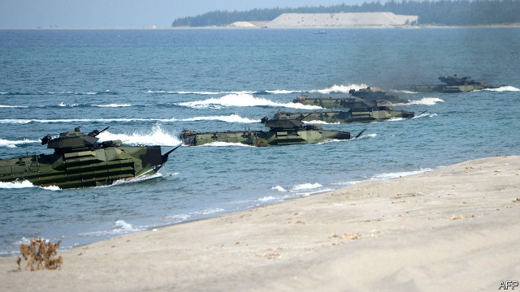
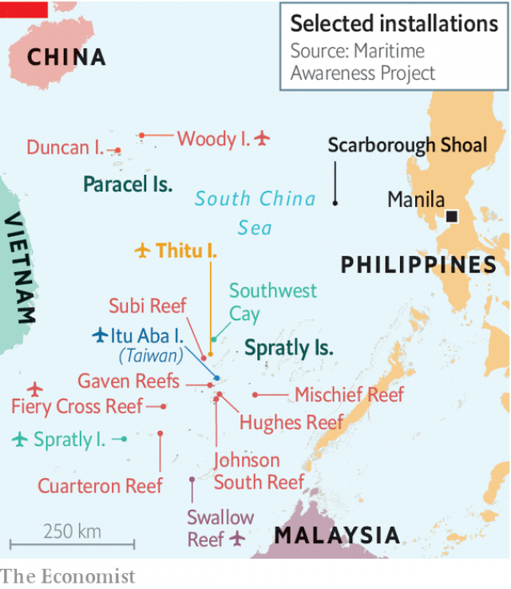

###### When love breaks down

# The Philippines changes tack on China—again 

##### A fresh spat in the South China Sea prompts a change of heart 

 

> Apr 13th 2019 

THE EXPRESSIVE president of the Philippines, Rodrigo Duterte, once gushed about his Chinese counterpart, “I just simply love Xi Jinping”. But the infatuation has faded. Upset that Chinese vessels have been mobbing the main Philippine-occupied island in the South China Sea, Mr Duterte rasped at China to “lay off”, and threatened an aggressive response. The same day, April 4th, American and Philippine forces practised storming a beach facing the South China Sea, in their biggest joint exercises since 2016, the year Mr Duterte announced a “separation” from America, his country’s only formal military ally. The Philippine pivot from America to China, dreamt up by his government to ease confrontation with China over overlapping claims in the South China Sea, has become a pirouette. 

For more than three months a flotilla of fishing vessels from China’s maritime militia has been swarming around Philippine-occupied Thitu, an island in the Spratly archipelago which is home both to a small military base and 200-odd civilians (see map). The manoeuvres appear to be a response to Philippine construction work on the island, to repair the airstrip and build a beaching ramp for small craft. 

Mr Duterte has responded with characteristic bluster. “I have soldiers there,” he warned the Chinese. “If you make a move there, that’s another story. I will tell my soldiers: ‘Prepare for suicide missions.’” The Chinese foreign ministry responded, slightly more stodgily, by noting that the Philippines and China had only recently “reiterated our commitments to further cooperation and talked about measures to enhance mutual trust”. 

 

Since the 1990s China has been occupying reefs and rocks in the South China Sea claimed by the Philippines and other littoral countries, and building on them. In 2012, after the Philippine navy tried to arrest some Chinese fishermen near Scarborough Shoal, which both China and the Philippines claim, Chinese vessels have patrolled the surrounding waters and at times turned away Philippine fishermen. The Philippines asked an international tribunal to adjudicate. In 2016, just after Mr Duterte became president, the tribunal ruled in the Philippines’ favour, saying China’s claim to the shoal was baseless. 

Jingoism sells well in the Philippines (as it does in China), and in the run-up to his election Mr Duterte threatened to jump on a jet ski and defend the Philippines’ claim to Scarborough Shoal single-handedly. But once in office, he opted instead to cosy up to China. He has kept quiet about the tribunal’s ruling, which Chinese leaders had rejected. China, in turn, has pledged big investments in roads, ports and railways around the Philippines. And although it still turns away some Philippine vessels, it has not built any military installations on Scarborough Shoal. 

But mid-term elections are nearing. The opposition has been cudgelling Mr Duterte for selling out to China. Not much of the promised investment has materialised. And now the Chinese are testing boundaries around Thitu. Small wonder, then, that Mr Duterte, who is as mercurial as he is expressive, appears to have had a change of heart. But as even he acknowledges, the Philippines would lose a war with China, so it would be foolish to start one. 

-- 

 单词注释:

1.Philippine['filipi:n]:a. 菲律宾(群岛)的, 菲律宾人的 

2.tack[tæk]:n. 平头钉, 大头钉, 粗缝针脚, 行动方针, 食物 vt. 以大头针钉住, 附加 

3.APR[]:[计] 替换通路再试器 

4.expressive[ik'spresiv]:a. 表达的, 富于表情的 

5.Rodrigo[]:n. 罗德里戈（歌曲名称） 

6.duterte[]:[网络] 迪泰特 

7.gush[gʌʃ]:n. 涌出, 滔滔不绝地讲话 v. 涌出, 迸出, 滔滔不绝的讲话 

8.counterpart['kauntәpɑ:t]:n. 副本, 复本, 配对物, 相应物 [经] 副本, 正副二份中之一 

9.infatuation[in.fætju'eiʃәn]:n. 迷惑, 迷恋, 醉心 

10.mob[mɒb]:n. 暴民, 民众, 暴徒 vt. 大举包围, 蜂拥进入, 围攻 vi. 聚众生事 

11.rasp[ræsp]:n. 粗锉刀, 刺耳声 vt. 用粗锉刀锉, 粗声粗气地说 vi. 粗锉, 锉磨, 发刺耳声 

12.Philippine['filipi:n]:a. 菲律宾(群岛)的, 菲律宾人的 

13.ally['ælai. ә'lai]:n. 同盟者, 同盟国, 助手 vt. 使联盟, 使联合, 使有关系 vi. 结盟 

14.pivot['pivәt]:n. 枢轴, 支点, 旋转运动, 中枢, 关键人物 a. 枢轴的, (如)在枢轴上转动的 vi. 在枢轴上转动, 随着转移 vt. 装枢轴于, 以...为中心旋转 [计] 程序员交互验证和编制工具, 数据透视表 

15.confrontation[.kɔnfrʌn'teiʃәn]:n. 对抗；对质；面对 

16.overlap[.әuvә'læp]:n. 重叠, 重复, 部分的同时发生 vt. 重叠, 重复, 与...同时发生 vi. 迭盖, 部分的同时发生 [计] 重叠 

17.pirouette[.piru'et]:n. 脚尖旋转, 快速旋转 vi. 以脚尖旋转, 作快速旋转 

18.flotilla[flәu'tilә]:n. 小舰队, 小型船队 

19.maritime['mæritaim]:a. 海的, 海上的, 海事的, 沿海的, 海员的 [经] 海事的, 海上的, 海员的 

20.militia[mi'liʃә]:n. 义勇军, 民兵组织, 国民军 

21.spratly[]:[网络] 南沙群岛；普拉特利；南沙南威岛 

22.archipelago[.ɑ:ki'pelәgәu]:n. 群岛, 多岛屿的海 

23.manoeuvre[mә'nu:vә]:n. 调遣, 演习, 策略 vi. 调动, 演习, 用策略 vt. 调动, 操纵 

24.airstrip['єәstrip]:n. 飞机跑道 

25.ramp[ræmp]:n. 斜坡, 坡道, 敲诈 vi. 狂跳乱撞, 乱冲, 敲诈, 蔓延 vt. 使有斜面, 敲诈 

26.bluster['blʌstә]:vt. 风狂吹, 咆哮, 汹涌 vi. 咆哮着说出, 恐吓 n. 狂风声, 巨浪声, 夸口, 大话 

27.suicide['sjuisaid]:n. 自杀, 自杀者 v. 自杀 a. 自杀的 

28.stodgily[]:adv. stodgy的变形 

29.reiterate[ri:'itәreit]:vt. 反复地说, 重申, 反复地做 [法] 重述, 重申, 反覆地做 

30.cooperation[kәu.ɒpә'reiʃәn]:n. 合作, 协力, 配合 [化] 合作 

31.reef[ri:f]:n. 暗礁, 礁, 缩帆 v. 缩(帆) 

32.littoral['litәrәl]:a. 海滨的, 湖岸的, 沿海的 n. 沿海地, 沿海地区 

33.Scarborough[]:n. 士嘉堡（多伦多一区名）；斯卡伯勒（英格兰一自治市） 

34.shoal[ʃәul]:n. 浅水, 浅滩, 沙洲, 鱼群, 暗礁, 潜在危险 a. 浅的 vi. 鱼成群而游, 变浅 vt. 使变浅 

35.patrol[pә'trәul]:n. 巡逻, 巡逻员, 侦察队 v. 巡逻, 巡视 

36.tribunal[trai'bju:nl]:n. 法庭, 法官席, 裁决 [法] 法庭, 裁判所, 裁判 

37.adjudicate[ә'dʒu:dikeit]:v. 判决, 宣告, 裁定 

38.shoal[ʃәul]:n. 浅水, 浅滩, 沙洲, 鱼群, 暗礁, 潜在危险 a. 浅的 vi. 鱼成群而游, 变浅 vt. 使变浅 

39.baseless['beislis]:a. 无根据的 

40.jingoism['dʒiŋ^әjiz(ә)m]:n. 侵略主义, 大国沙文主义 

41.opt[ɒpt]:vi. 选择 

42.pledge[pledʒ]:n. 诺言, 保证, 誓言, 抵押, 信物, 保人, 祝愿 vt. 许诺, 保证, 使发誓, 抵押, 典当, 举杯祝...健康 

43.opposition[.ɒpә'ziʃәn]:n. 反对, 敌对, 相反, 在野党 [医] 对生, 对向, 反抗, 反对症 

44.cudgel['kʌdʒәl]:n. 棍棒 vt. 用棍棒打 

45.materialise[mә'tiәriәlaiz]:vi.vt. (使)物质化, (使)具体化, (使)追求物质利益, (使)显形, 成为事实, 实现 vi. 突然出现 

46.mercurial[mә:'kjuәriәl]:a. 水星的, 敏捷的, 活泼的, 水银的 n. 汞剂 

47.expressive[ik'spresiv]:a. 表达的, 富于表情的 

