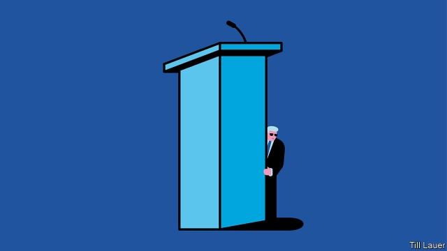

###### Banyan

# The people of Kazakhstan wonder who their next president will be 

##### It’s the former president who matters most, anyway 

 

> Apr 11th 2019 

IN A COUNTRY which had all but abolished politics, how much excitement can the people of Kazakhstan take? A month ago the only ruler most of them had ever known, Nursultan Nazarbayev, who had run Kazakhstan since it was still part of something called the Soviet Union, suddenly announced he was stepping down. Declaring it was time to hand power to a younger generation, the 78-year-old abruptly resigned, putting in charge the 65-year-old head of the Senate, Kassym-Zhomart Tokayev, for the remainder of his term, which was due to last until next year. For a while, that seemed to be that. Yet on April 9th Mr Tokayev declared he was calling a snap presidential election, because “it is necessary to remove uncertainty.” 

What uncertainty? Not only is Mr Nazarbayev clearly in charge of his own succession, he is also not going away. The loyal Mr Tokayev’s message, starting with his inaugural speech, has been all about buffing Mr Nazarbayev’s image as Kazakhstan’s founding father. There is little question of launching new political and economic initiatives. Stability, as under Mr Nazarbayev, is all. 

Meanwhile, control has not entirely or even largely shifted to Mr Tokayev. The “First President” and “Leader of the Nation” has in effect created a parallel power structure. Above all he remains, as head of the Security Council, in charge the army and the secret services. As Banyan discovered in the capital this week, ministers must still upend their schedules when the summons comes. With this retained power, Mr Nazarbayev controls the future. As for the past, the former steelworker has safeguarded himself and his immensely wealthy family through a constitution that shields them—and only them—from asset seizures. 

And whether in office or not, Mr Nazarbayev is not the sort to give voters a choice. All organised opposition has long been crushed, and repression of dissent has recently been redoubled. Mr Nazarbayev used to win presidential polls with over 95% of all votes (even a notional opponent once meekly voted for him). Everything seems set for a predictable result at the vote in June—bar one important detail. 

In calling the election, Mr Tokayev neglected to say whether he was running. That has set off a parlour game of speculation. Some predict that the strongman’s daughter, Dariga Nazarbayeva, who followed Mr Tokayev as chairman of the Senate, is the real political heir. 

With power in Kazakhstan so personalised, it is only natural to wonder whether a relative would succeed Mr Nazarbayev. Yet the speculation is probably overwrought. If Ms Nazarbayeva was being groomed for power, why has her careful father given her so little executive experience to date? Moreover, her marriage to Rakhat Aliyev, a murderous, grasping former tax chief who died in an Austrian prison cell, surely counts against her in her father’s eyes. It certainly does among ordinary citizens. 

So Mr Tokayev it probably is. Pasty-faced and with tinted glasses, he is the apparatchik’s apparatchik. It is a plus to those around Mr Nazarbayev that the soft-edged Mr Tokayev is tied to none of the oligarchs, among whom Mr Nazarbayev has carefully spread fortunes in return for support. And, as a skillful diplomat, Mr Tokayev will seek to nurture good relations with Russia and China, the crucial neighbours. 

Yet his affirmation would resolve everything—and nothing. Among the elites, his authority flows entirely from Mr Nazarbayev’s backing. All bets are off once the Leader of the Nation is gone. Knowing that, what is to stop Mr Tokayev charting his own course, so imperilling the delicate, perhaps unstable, balance among the powerful? 

Bear in mind, too, a changing, less deferential, mood from below. Early every evening in Almaty, the commercial capital, the internet suddenly crawls at a snail’s pace as an exiled (and deeply flawed) opponent of the regime, Mukhtar Ablyazov, takes to Facebook. In Almaty, too, police complain to dissidents that they are ordered to do the dirty work, such as arresting protesters, while their bosses are busy pocketing bribes. And in a society that knows how to hold its tongue, Mr Tokayev’s order to rename Astana has been widely lambasted. The capital, a queasy brew of bombast and bling built by Mr Nazarbayev as a monument to himself, is now to be called Nur-Sultan. Not even North Korea’s Kim dynasty, the carpers point out, ever went that far. Once deference has gone, fear will not last long. 

-- 

 单词注释:

1.banyan['bænjәn]:n. 印度榕树 [医] 榕树, 孟加拉榕 

2.Kazakhstan[ˌkæzək'stæn]:n. 哈萨克斯坦（原苏联加盟共和国之一, 已于1991年宣布独立） 

3.APR[]:[计] 替换通路再试器 

4.politic['pɒlitik]:a. 精明的, 明智的, 策略的 

5.nursultan[]:[网络] 努苏坦 

6.nazarbayev[]:[网络] 纳扎尔巴耶夫；总统纳扎尔巴耶夫；哈萨克的纳扎尔巴耶夫 

7.abruptly[ә'brʌptli]:adv. 突然地, 唐突地 

8.remainder[ri'meindә]:n. 剩余物, 其他人, 残余, 余数 v. 削价出售(图书) a. 剩余的, 出售削价剩书的 [计] 余数 

9.presidential[.prezi'denʃәl]:a. 总统制的, 总统的, 首长的, 统辖的 [法] 总统的, 议长的, 总经理的 

10.uncertainty[.ʌn'sә:tnti]:n. 不确定, 不可靠, 不确定的事物 [化] 不确定度 

11.inaugural[i'nɒ:gjurәl]:a. 就任的, 开幕的 n. 就职演讲 

12.buff[bʌf]:n. 暗黄色, 暗黄色皮革, 人的皮肤 vt. 擦亮, 使柔软 a. 暗黄色的 

13.entirely[in'taiәli]:adv. 完全, 全然, 一概 

14.upend[ʌp'end]:v. 颠倒, 倒放 

15.summon['sʌmәn]:vt. 召唤, 召集, 号召, 振奋, 唤起, 鼓起 [经] 传唤, 传讯 

16.steelworker['sti:lwә:kә]:n. 炼钢工人 

17.safeguard['seifgɑ:d]:n. 保卫, 保护措施, 防护设施 vt. 保卫, 保护 

18.immensely[i'mensli]:adv. 无限地, 广大地, 庞大地 

19.asset['æset]:n. 资产, 有益的东西 

20.seizure['si:ʒә]:n. 捕获, 夺取, 占领, 捕获物, 没收, 充公 [医] 发作; 癫痫发作 

21.voter['vәutә]:n. 选民, 投票人 [法] 选民, 选举人, 投票人 

22.opposition[.ɒpә'ziʃәn]:n. 反对, 敌对, 相反, 在野党 [医] 对生, 对向, 反抗, 反对症 

23.repression[ri'preʃәn]:n. 抑制, 压抑, 制止 [医] 压抑, 抑制 

24.dissent[di'sent]:n. 异议 vi. 持异议, 不同意 

25.redouble[ri'dʌbl]:vi.vt. (使)加倍, (使)增强, 倍增, 加强, (使)大量增加 vt. 重复, 再做, 再说 vi. 重折, 重迭 [计] 重复, 再作, 加强 

26.notional['nәuʃәnәl]:a. 概念的, 想像的 [经] 名义上的 

27.meekly['mi:kli]:adv. 温顺地, 柔和地, 忠厚地 

28.predictable[pri'diktәbl]:a. 可预言的 

29.parlour['pɑ:lә]:n. 客厅, 会客室, 雅座 a. 客厅的 

30.speculation[.spekju'leiʃәn]:n. 沉思, 推测, 投机 [经] 投机交易, 买空卖空 

31.Dariga[]:[地名] 达里加 ( 巴基 ) 

32.Nazarbayeva[]:纳扎尔巴耶娃 

33.personalise['p\\:sәnәlaiz]:vt. (贬)使个人化, 体现, 使人格化, 在(物品)上标明姓名/标出地址/标出记号 

34.overwrought['әuvә'rɔ:t]:a. 过分劳累的, 过度紧张的, 神经质的, 过度兴奋的, 过分推敲的, 不自然的 

35.groom[gru:m]:n. 马夫, 新郎, 男仆 vt. 喂马, 使...整洁, 推荐 vi. 打扮, 穿戴 

36.Rakhat[]:[网络] 克哈 

37.aliyev[]:n. (Aliyev)人名；(塔吉)阿利耶夫 

38.murderous['mә:dәrәs]:a. 凶狠的, 杀人的, 致命的 [法] 谋杀的, 杀人的, 残酷的 

39.Austrian['ɒstriәn]:n. 奥地利人 a. 奥地利的, 奥地利人的 

40.tint[tint]:n. 色彩, 浅色 vt. 染色于 

41.apparatchik[,æpə'rætʃɪk]:n. 共产党官员；职业政党工作人员 

42.oligarch['ɒligɑ:k]:n. 寡头政治执政者 

43.carefully['kєәfuli]:adv. 小心地, 谨慎地 

44.diplomat['diplәmæt]:n. 外交官, 有外交手腕的人 [法] 外交家, 外交官, 有权谋的人 

45.nurture['nә:tʃә]:n. 养育, 营养物, 培育 vt. 养育, 供给营养物, 教养 

46.affirmation[.æfә'meiʃәn]:n. 肯定, 断言, 证实 [医] 肯定, 确认 

47.elite[ei'li:t]:n. 精华, 精锐, 中坚分子 

48.imperil[im'peril]:vt. 使处于危险, 危害 

49.les[lei]:abbr. 发射脱离系统（Launch Escape System） 

50.deferential[.defә'renʃәl]:a. 恭敬的 [医] 输精管的 

51.almaty[ˌɑ:lməˈti:]:n. 阿拉木图（位于哈萨克斯坦东南部，该国前首都和经济、文化中心及最大的工业中心） 

52.exile['eksail]:n. 放逐, 流放, 被放逐者 vt. 放逐, 流放, 使背井离乡 

53.flaw[flɒ:]:n. 缺点, 裂纹, 瑕疵, 一阵狂风 [化] 划痕; 裂缝; 裂纹 

54.regime[rei'ʒi:m]:n. 政权, 当权期间, 政体, 社会制度, 体制, 情态 [医] 制度, 生活制度 

55.mukhtar['mjktɑ:(r)]:n. (阿拉伯或土耳其经选举产生的) 镇长, 乡长 

56.facebook[]:n. 脸谱网 

57.dissident['disidәnt]:a. 意见不同的, 持不同政见的 n. 意见不同的人, 持不同政见者 

58.protester[]:n. 抗议者, 持异议者, 拒付者 [经] 反对者 

59.bribe[braib]:n. 贿赂 vt. 贿赂, 收买 vi. 行贿 

60.rename[.ri:'neim]:vt. 重新命名, 再命名, 给...改名 [计] 重命名; DOS内部命令:更改文件名 

61.Astana['ɑ:stənə]:n. 阿斯塔纳（哈萨克斯坦共和国首都） 

62.lambast[]:vt. 鞭打, 狠打, 严厉责骂 [机] 害草净 

63.queasy['kwi:zi]:a. 呕吐的, 使人呕吐的 [经] 不稳定的 

64.brew[bru:]:n. 酿造酒, 酝酿 v. 酿造, 酝酿 

65.bombast['bɒmbæst]:n. 夸大的言辞 

66.bling[]:n. 锦衣珠宝 

67.kim[]:n. 金姆（人名） 

68.carper['kɑ:pә]:n. 吹毛求疵者, 苛评者 

69.deference['defәrәns]:n. 顺从, 尊重 

