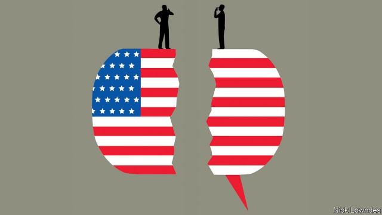

###### Johnson

# How to think about African-American English 

##### Both its nature and its speakers are often misunderstood 

 

> Apr 13th 2019 

AMERICA HAS always been full of languages, a fact that has been both a source of pride and a cause for consternation. But there has long been a fundamental misconception about one of its distinctive tongues: the speech of some of the country’s black population, especially in highly segregated areas. Not only is the nature of this dialect widely misapprehended; often its speakers are literally misunderstood by some of their fellow citizens. 

African-American English (AAE), is not a broken version of standard English, the mistake-filled attempts of someone trying and failing to talk correctly. Instead, it is like a cousin. It developed from the same roots, but in a different direction, born of unique circumstances. Enslaved people from various African backgrounds took what they learned of English and made it their own.  

Centuries later, AAE is a rule-bound, internally consistent dialect. In some ways it is simpler than standard English. For example, it omits the -s on third-person singular verbs: I speak, you speak, she speak. But in some ways it is more complicated. She comin’ by my house means something different from She be comin’ by my house: the first is a one-off event, the second is habitual. I been did that means that I did something a long time ago. Standard English can achieve these effects with adverbs, but AAE integrates them into the verb system itself. 

Misplaced snobbery about the nature of AAE is not the only problem. The dialect’s differences from the standard also lead to dangerous confusion. Taylor Jones, a graduate student in linguistics at the University of Pennsylvania, carried out a worrying study that found a group of professional court reporters were able to transcribe only 60% of AAE sentences accurately, and 83% of the words. Asked to paraphrase what they had heard, they did even worse: about 33% of utterances were conveyed accurately. They are supposed to achieve a 95% accuracy. 

Experienced court reporters did no better than newer ones, and black reporters little better than the white ones. Black participants explained their trouble with AAE by saying that they (like many other African-Americans) didn’t “speak like that”. Worse, both black and white court reporters tended to assume the recordings were from criminal court (they weren’t). That people associate AAE with ignorance and criminality is bad enough. Misunderstanding aggravates the risk. No one can get justice from a court that doesn’t know what they are saying. 

The miscommunication runs both ways. Adult black Americans who use AAE can easily understand standard English, from exposure in school, work and the media. But youngsters from homes and neighbourhoods where AAE predominates are a different matter. In another study, Mike Terry of the University of North Carolina tested AAE speakers in second grade (roughly 7 years old) on their maths. He found that questions including the third-person-singular ending –s (he talks, which in AAE is he talk) made the students 10% less likely to answer correctly. Language is not just language; it is the interface with other kinds of knowledge. Such pupils are being judged as less capable than they really are. 

A close linguistic analogy to AAE is Scots, which differs from standard English to a similar extent. In its full form, it is at least as hard for outsiders to understand. But in policymaking terms, it is not a useful comparator. Scots have a homeland and a nationalist movement; they are not generally the subject of disparaging prejudice.  

It may be better to think of AAE as posing the same challenges as a foreign language, albeit in diluted form. Seeing the problems some of its speakers face as essentially ones of translation might let policymakers appreciate and solve them. This does not mean providing courtroom interpreters for black speakers, or classes taught in AAE. It means training court staff or teachers in the issues involved. 

America is a diverse place, and standard English is part of the glue that holds it together. All the more reason to take a linguistically informed approach to teaching it. For example, classroom exercises similar to “translation” from AAE to standard English can help children master the standard, in a way that shaming them for “mistakes” (in fact, correct AAE) does not. The standard is not the only kind of English there is. Paradoxical as it may seem, recognising this linguistic diversity will help a divided country approach the ideal of its motto: e pluribus unum. 

-- 

 单词注释:

1.johnson['dʒɔnsn]:n. 约翰逊（姓氏） 

2.APR[]:[计] 替换通路再试器 

3.alway['ɔ:lwei]:adv. 永远；总是（等于always） 

4.consternation[.kɒnstә'neiʃәn]:n. 惊愕, 恐怖, 惊惶失措 

5.misconception[.miskәn'sepʃәn]:n. 误解 

6.distinctive[di'stiŋktiv]:a. 有特色的, 出众的 

7.segregate['segrigeit]:a. 分离的, 被隔离的 vi. 分离, 隔离, 分凝 vt. 使分离, 使隔离 

8.misapprehend['mis.æpri'hend]:vt. 误会, 误解 

9.literally['litәrәli]:adv. 逐字地, 按照字面上地, 不夸张地 

10.AAE[]:[计] 自动应答设备 

11.correctly[kә'rektli]:adv. 对, 正确, 恰当, 符合一般性准则, 符合行为准则, 端正, 符合 

12.enslave[in'sleiv]:vt. 奴役, 束缚, 使受控制, 征服 

13.internally[in'tәnәli]:[计] 内部的 

14.misplace[mis'pleis]:vt. 放错地方 

15.snobbery['snɒbәri]:n. 谄上欺下, 势利 

16.taylor['teilә]:n. 泰勒 

17.jones[dʒәunz]:n. 琼斯（姓氏） 

18.linguistic[liŋ'^wistik]:a. 语言的, 语言学的 [计] 语言的, 语言学的 

19.Pennsylvania[.pensil'veinjә]:n. 宾夕法尼亚 

20.transcribe[træn'skraib]:vt. 抄写, 译, 意译, 录制, 改编 [计] 转录 

21.accurately['ækjurәtli]:adv. 正确地, 精确地 

22.paraphrase['pærәfreiz]:n. 释义, 解述, 改写 vt. 改写, 解述 vi. 释义, 意译 

23.utterance['ʌtәrәns]:n. 发声, 言辞, 表达, 说话的方式, 死 [医] 发言, 言语, 语调 

24.participant[pɑ:'tisipәnt]:n. 参加者, 参与者 a. 有份的, 参加的, 参与的 

25.recording[ri'kɒ:diŋ]:a. 记录的, 记录用的 n. 录音 

26.ignorance['ignәrәns]:n. 无知, 愚味 [法] 无知, 不知情, 愚昧 

27.criminality[.krimi'næliti]:n. 犯罪, 有罪, 犯罪行为 [法] 有罪, 犯罪行为, 犯罪性 

28.misunderstanding[.misʌndә'stændiŋ]:n. 误会, 误解 [法] 误解, 误会, 不和 

29.aggravate['ægrәveit]:vt. 使恶化, 使更严重, 加重 

30.miscommunication[,miskә,mju:ni'keiʃәn]:n. 错误传达 

31.predominate[pri'dɒmineit]:vt. 掌握, 控制, 支配 vi. 占主导地位, 占优势 

32.mike[maik]:vi. 偷懒, 游手好闲 n. 休息, 游手好闲, 扩音器, 话筒 

33.terry['teri]:n. 毛圈, 毛圈织物 

34.Carolina[.kærә'lainә]:n. 北(或南)卡罗来纳州 

35.les[lei]:abbr. 发射脱离系统（Launch Escape System） 

36.interface['intәfeis]:n. 分界面, 接触面, 界面 [计] 接口, 界面 

37.analogy[ә'nælәdʒi]:n. 相似, 类似 [计] 模拟 

38.scot[skɒt]:n. 摊派的款项, 税赋 [化] 涂载体空心柱 

39.outsider[' aut'saidә]:n. 外人, 局外人, 非会员, 外行, 门外汉, 比赛中获胜可能性不大的选手 [经] 外船公司 

40.policymaking['pɔlәsi,meikiŋ]:[法] 政策制定者, 决策人 

41.comparator['kɒmpәreitә]:n. 比较仪 [计] 比较分类器; 比较器 

42.nationalist['næʃәnәlist]:n. 国家主义者, 民族主义者 

43.disparage[dis'pæridʒ]:vt. 蔑视, 贬损 [法] 轻视, 贬低, 诽谤 

44.albeit[ɔ:l'bi:it]:conj. 尽管, 虽然 

45.dilute[dai'lju:t]:vt. 冲淡, 稀释 a. 淡的, 稀释的 

46.essentially[i'senʃәli]:adv. 本质上, 本来 

47.policymaker['pɔlisi.meikә]:n. 政策制定者；决策人 

48.courtroom['kɒ:trum]:n. 法庭, 审判室 [法] 法庭, 审判室 

49.linguistically[liŋ'gwistikəli]:adv. 语言学方面 

50.paradoxical[.pærә'dɒksikl]:a. 似非而是的, 矛盾的, 诡论的 [医] 奇异的, 矛盾的, 逆理的, 反常的 

51.diversity[dai'vә:siti]:n. 差异, 多样性 [化] 多样性 

52.E[i:]:[计] 元件, 部件, 元素, 误差, 执行, 表达式, 指数 

53.pluribus[]:汇集。美利坚硬币上铸造着E PLURIBUS UNUM.合众为一, 万众合一。 

54.unum[]:[网络] 一；我们原是一事物 

