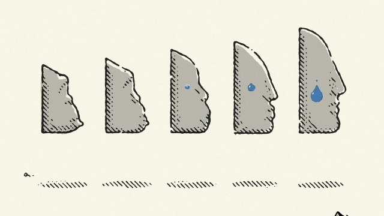

###### The wisdom of sorrow

# Is evolution the key to understanding mental illness? 

##### Doctors have done a pretty lousy job of it up till now 

 

> Apr 13th 2019 

Good Reasons for Bad Feelings. By Randolph Nesse.Dutton; 384 pages; $28. Allen Lane; £20. 

Mind Fixers: Psychiatry’s Troubled Search for the Biology of Mental Illness. By Anne Harrington.Norton; 384 pages; $27.95. 

“YOUR WHOLE field is confused. You know that, right?” The patient who delivered this parting shot had a perpetual knot in the pit of her stomach. She had lost interest in everything, was anxious, irritable and nauseous, and struggled to sleep. Her family doctor had told her it was “nerves”. A psychotherapist asked about sexual feelings in childhood for her father. A psychiatrist offered drugs to fix what he said was a chemical imbalance in her brain. 

Confused and desperate, she had found her way to yet another doctor, an assistant professor of psychiatry. Anxiety can be useful, he told her, but most people experience more than they need—because whereas too much merely makes you miserable, too little can make you dead. She was stuck in a cycle of worry, heightened vigilance and more worry. Cognitive behavioural therapy, which teaches people to break corrosive thinking patterns, would help. She brightened up—and offered a few home truths about the psychiatrist’s profession. 

Randolph Nesse, now of Arizona State University, cites that encounter in his fascinating book to illustrate why he has spent his career studying the evolutionary roots of mental illness. Though doctors who treat physical ailments do not routinely refer to evolution, their theories about bodies are based on the fact that humans, and the pathogens that afflict them, are the product of aeons of natural selection. Disorders are defined by comparison with normal functioning. Symptoms such as rashes, fevers and pain are understood to be consequences of, or defences against, illness, not the illness itself. Treating an ailment like diabetes, in which a complex system malfunctions, means knowing how that system is supposed to work—and what it evolved to do. 

Mental-health specialists lack such solid foundations. In general, they neither study the feelings of the well, nor consider what feelings are for. Of the 4,500 pages in America’s most popular psychiatry textbook, normal emotions get half a page. Moreover, when it comes to diagnosis, they fail to consider underlying causes. The current version of the American “Diagnostic and Statistical Manual for Mental Disorders” (DSM-5) defines hundreds of disorders solely by their symptoms. Depression, for example, means at least two weeks experiencing five or more of eight symptoms, such as loss of pleasure in life, loss of appetite and feelings of worthlessness. The diagnosis is the same if you have just been bereaved or divorced or lost your job. 

In Dr Nesse’s definition, “specialised states that…increase the ability to meet adaptive challenges” constitute normal emotions. They are experienced as positive or negative because only situations containing opportunities or threats affect evolutionary fitness. A negative emotion may be just as evolutionarily useful as physical pain. A depressed patient’s low mood, for example, may result from his realisation that a major life project is sure to fail. It feels terrible, but makes sense in evolutionary terms. People who do not suffer when pursuing unachievable goals may waste their energies on pointless effort, thereby harming their chances of reproduction. That insight taught Dr Nesse to ask the depressed: is there something very important that you are trying and failing to do, but can’t bring yourself to give up? 

Evolution has equipped people for a world very different from the one they now inhabit. They are obese because their appetites are adapted to scarcity, not superabundance. Similarly, some mental illnesses may be the result of having to negotiate situations they are not fit for. Others may be side-effects of selection for desirable traits. Dr Nesse draws an analogy with racehorses, bred for speed with the unfortunate result that their cannon bones are brittle. For every 1,000 that start a race, he says, one breaks a leg and has to be put down. It may have slightly weaker bones than the rest. Or it may simply be unlucky and stumble. Humans may have “minds like the legs of racehorses, fast but vulnerable to catastrophic failures”. 

When it comes to doctoring the body, you have to go back to the 19th century to find a time when the theories were baseless (infections were caused by miasmas, for instance) and the treatments often harmful (bloodletting, purging and the like). For doctoring the mind, as Anne Harrington’s fine history of psychiatry shows, that point is much more recent. In 1949 a Nobel prize went to the Portuguese inventor of the lobotomy, an operation intended to sever the “worry nerves” of the brain. In 1952 the technique was sufficiently honed for an American acolyte to launch “Operation Ice-pick”—a 12-day road trip during which 228 patients were strapped down and anaesthetised, before he or an assistant slipped an ice-pick-shaped knife under each eyelid and into their brains, and gave a twist. 

What ended that practice was not an outbreak of compassion, but the arrival of thorazine, a drug that caused such mental deadening that it was nicknamed the “chemical lobotomy”. It was the start of the age of blockbuster drugs for mental illness. By the end of the 1950s one in three prescriptions in America was for meprobamate, which dampened anxiety. By 1990, 1m Americans received Prozac prescriptions each month. Pharmaceutical companies popularised the notion that anxiety, depression and so on were caused by chemical imbalances. Right them and you could become not just well, but better than well. 

Under the influence of Freud, psychiatrists had sifted their patients’ life histories for repressed emotions and memories. But in the 1980s psychiatrists declared a post-Freudian world, with mental illnesses ascribed to brain biochemistry and neuroanatomy. They expected to discover the genes that caused mental illnesses, and bespoke drugs that could heal them. 

That revolution never happened. Instead pharmaceutical firms are pulling back, as stricter testing rules reveal how little good many of their products do. The evidence linking mental illnesses to defects of brain architecture or chemistry, or to specific genes, is scanty. With its checklist approach to diagnosis, DSM-5 is under attack. Ms Harrington’s history ends with today’s crisis in the psychiatric profession. If Dr Nesse is right, evolutionary thinking could provide a fruitful new direction. 

-- 

 单词注释:

1.lousy['lauzi]:a. 污秽的, 恶心的, 生虱的 

2.APR[]:[计] 替换通路再试器 

3.randolph['rændɔlf]:n. 伦道夫（男子名） 

4.allen['ælin, 'ælәn]:n. 艾伦（男子名） 

5.anne[æn]:n. 安妮（女子名） 

6.perpetual[pә'petʃuәl]:a. 永久的, 不断的, 无期限的, 没完没了的, 四季开花的 [经] 永远的, 终身的, 持续的 

7.irritable['iritәbl]:a. 易怒的, 急躁的 [医] 应激性的, 过敏的 

8.nauseous['nɒ:ʃiәs]:a. 令人作呕的, 厌恶的 [医] 恶心的, 致恶心的 

9.psychotherapist[.saikәu'θerәpist]:n. 精神治疗医生 

10.psychiatrist[sai'kaiәtrist]:n. 精神病医生, 精神病学家 [医] 精神病学家 

11.imbalance[im'bælәns]:n. 不平衡, 不均衡 [医] 不平衡, 失调 

12.psychiatry[sai'kaiәtri]:n. 精神病学, 精神病治疗 [医] 精神病学 

13.heighten['haitn]:vt. 增高, 提高, 加强 vi. 升高, 变大 

14.vigilance['vidʒilәns]:n. 警戒, 警觉, 失眠症 [医] 不眠症, 警醒症 

15.cognitive['kɒgnitiv]:a. 认知的, 认识的 

16.behavioural[bi'heivjәrәl]:a. 行为的 

17.therapy['θerәpi]:n. 治疗 [医] 疗法, 治疗 

18.corrosive[kә'rәusiv]:a. 腐蚀的, 腐蚀性的, 有害的 n. 腐蚀物, 腐蚀剂 

19.nesse[]: [地名] [德国] 内瑟; [地名] [德国] 内瑟河 

20.Arizona[æri'zәunә]:n. 亚利桑那州 

21.cite[sait]:vt. 引用, 引证, 表彰 [建] 引证, 指引 

22.fascinate['fæsineit]:vt. 令人入神, 使着迷 vi. 入迷 

23.evolutionary[,i:vә'lu:ʃәnәri]:a. 展开的, 进化论的, 进化的, 发展的 [计] 进化的, 改良的, 发展的 

24.ailment['eilmәnt]:n. 病痛, 疾病 [医] 疾病 

25.routinely[]:adv. 日常, 乏味, 常规, 例行 

26.pathogen['pæθәdʒ(ә)n]:n. 病原体 [医] 病原体 

27.afflict[ә'flikt]:vt. 使苦恼, 折磨 

28.aeon['i:әn]:n. 永世, 万古, 极长的时期 

29.rash[ræʃ]:a. 轻率的, 匆忙的, 鲁莽的 n. 皮疹 

30.diabetes[daiә'bi:ti:z]:n. 糖尿病, 多尿症 [医] 糖尿病; 多尿症 

31.malfunction[.mæl'fʌŋʃәn]:n. 故障, 失灵, 疾病 vi. 发生故障, 不起作用 [计] 故障 

32.diagnosis[.daiәg'nәusis]:n. 诊断 [计] 诊断 

33.underlie[.ʌndә'lai]:vt. 位于...之下, 成为...的基础 

34.diagnostic[daiәg'nɒstik]:a. 诊断的, 有助于诊断的, 特征的 n. 诊断, 病的征候, 诊断法 [计] 诊断的 

35.worthlessness[]:毫无价值 没用 

36.bereaved[bi'ri:vd]:a. 丧失亲人的 bereave的过去式和过去分词 

37.specialise['speʃә,laiz]:vt. 特加指明, 列举, 使专门化, 限定...的范围 vt.vi. (使)特化, (使)专化 vi. 成为专家, 专务, 专攻, 专门研究, 逐条详述 

38.adaptive[ә'dæptiv]:a. 适应的, 能适应的 

39.constitute[kәn'stitjut]:vt. 构成, 组成, 任命 [建] 构造, 组成 

40.fitness['fitnis]:n. 适合, 合宜, 合理, 恰当, 健康 [医] 适合性, 适应性 

41.evolutionarily[,i:və,lu:ʃən'ærili]:adv. 演化地, 演进地(evolutionary的变形) 

42.realisation[.riәlai'zeiʃәn. ri:-. -li'z-]:n. 实现, 完成（等于realization） 

43.unachievable[ˌʌnəˈtʃi:vəbl]:a. 不可实现的 

44.pointless['pɒintlis]:a. 不尖的, 钝的, 不得要领的 

45.reproduction[.ri:prә'dʌkʃәn]:n. 再现, 复制, 生殖, 繁殖, 复制品 [医] 生殖, 复现(心理) 

46.obese[әu'bi:s]:a. 肥胖的 [医] 肥胖的 

47.scarcity['skɑ:siti]:n. 缺乏, 不足, 缺少 [经] 缺乏, 不足 

48.superabundance[.sju:pәrә'bʌndәns]:n. 多余, 过多, 剩余 

49.trait[treit]:n. 特征, 特性, 一笔, 少许 

50.analogy[ә'nælәdʒi]:n. 相似, 类似 [计] 模拟 

51.racehorse['reishɒ:s]:n. (赛马用的)马 

52.vulnerable['vʌlnәrәbl]:a. 易受伤害的, 有弱点的, 易受影响的, 脆弱的, 成局的 [医] 易损的 

53.catastrophic[.kætә'strɒfik]:a. 悲惨的, 灾难的 

54.doctore[]:[网络] 多科特；多克托 

55.baseless['beislis]:a. 无根据的 

56.infection[in'fekʃәn]:n. 传染, 影响, 传染病 [医] 传染, 感染 

57.miasma[mi'æzmә]:n. 毒气, 沼气 [医] 瘴毒, 瘴气 

58.bloodletting['blʌd.letiŋ]:n. 放血 [医] 放血 

59.purge[pә:dʒ]:n. 净化, 清除, 泻药 v. (使)净化, 清除, (使)通便 [计] 服务器文件删除实用程序 

60.Nobel['nәubel]:n. 诺贝尔 

61.lobotomy[lәu'bɒtәmi]:n. 前脑叶白质切除术 [医] 叶切断术 

62.sever['sevә]:vt. 切断, 脱离, 分开, 使分离, 断绝, 中断 vi. 断, 裂开 

63.hone[hәun]:n. 磨刀石, 抱怨, 想念 vt. 用磨刀石磨, 磨练 

64.acolyte['ækәulait]:n. 侍僧, 助手 

65.anaesthetise[æ'ni:sθәtaiz,ә'nes-]:v. 使麻醉 

66.eyelid['ailid]:n. 眼皮, 眼睑 [医] 睑 

67.outbreak['autbreik]:n. 爆发, 暴动 [医] 暴发 

68.compassion[kәm'pæʃәn]:n. 同情, 怜悯 

69.thorazine['θɔ:rә,zi:n]:[医] 盐酸氯普马嗪, 盐酸氯丙嗪 

70.deaden['dedn]:vt. 使减弱, 使麻木 vi. 减弱 

71.nickname['nikneim]:n. 绰号, 昵称 vt. 给...取绰号, 叫错名字 [计] 绰号 

72.blockbuster['blɒkbʌstә]:n. 巨型炸弹 

73.meprobamate[mә'prәubәmeit]:n. [药]安宁,眠尔通, 氨甲丙二酯(安定药) 

74.dampen['dæmpәn]:vt. 弄湿, 使沮丧 vi. 变湿, 丧气 

75.prozac['prәuzæk]:n. 百忧解（一种治疗精神抑郁的药物） 

76.pharmaceutical[,fɑ:mә'sju:tikәl]:a. 药学的, 制药的, 药用的, 药物的, 药剂师的, 药师的 n. 药品, 成药, 药剂 

77.popularise['pɔpjjlәraiz]:vt.vi. 使通俗化, 使受欢迎, 使大众化, 使普及, 宣传, 推广 

78.freud[frɔid]:n. 佛洛伊德（856-1939, 奥地利心理分析学家及精神病学家） 

79.sift[sift]:vt. 筛, 过滤, 撒, 详查 vi. 筛, 被筛下, 精选 

80.repress[ri'pres]:vt. 镇压, 抑制, 压制 vi. 压制 

81.neuroanatomy[,njuәrәuә'nætәmi]:[医] 神经解剖学 

82.bespeak[bi'spi:k]:vt. 预约, 订, 表示 n. 预约 

83.pharmaceutical[,fɑ:mә'sju:tikәl]:a. 药学的, 制药的, 药用的, 药物的, 药剂师的, 药师的 n. 药品, 成药, 药剂 

84.scanty['skænti]:a. 缺乏的, 仅有的, 不够的, 狭小的, 吝啬的 

85.checklist[]:n. 清单, (美)选举人名单, 名册, 目录册 

86.psychiatric[saiki'ætrik; (?@) si-]:a. 精神病学的, 医精神病的 [医] 精神病学的 

