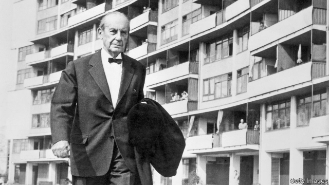

###### Haus style

# The life of Walter Gropius, founder of the Bauhaus 

##### Fiona MacCarthy’s book is a riveting study of an extraordinary architect 

 

> Apr 11th 2019 

Gropius: The Man Who Built the Bauhaus. By Fiona MacCarthy. Belknap Press; 560 pages; $35. Published in Britain as “Walter Gropius: Visionary Founder of the Bauhaus”; Faber & Faber; £30. 

“IF I HAVE a talent it is for seeing the relationship of things,” reflected Walter Gropius in 1967, not long before he died. The world remembers him as an innovative architect of pared-down modernist buildings and the founder of the Bauhaus, a revolutionary school of art and design. His aim was to bring architects, designers and artists together in a working community to create what he called the Gesamtkunstwerk, or total work of art. 

Charismatic, gifted, idealistic and well-connected, he wanted to do something new and life-affirming after fighting in the first world war. His invitation to join the Bauhaus was taken up by the most vibrant artists and designers of his day, including Vasily Kandinsky, Paul Klee and Laszlo Moholy-Nagy. The teachers and students led quasi-communal lives; their parties were legendary. In its various incarnations—starting in Weimar in 1919, then moving to Dessau and finally to Berlin—the fabled school lasted a mere 14 years, after which the Bauhäusler dispersed across the globe, many, including Gropius, to America. 

Gropius was born in 1883 in Berlin into a cultured upper-middle-class family. His first job was in the office of Peter Behrens, a successful architect and designer who had already taken on a young Mies van der Rohe and a little later recruited Le Corbusier. In 1910 Gropius left to set up his own practice and was soon working on the Faguswerk in Alfeld, a futuristic factory built from glass, steel and yellow brick that became his first important building. 

As Fiona MacCarthy’s new book recounts, his private life was chaotic. In 1910 he had an affair with Alma Mahler, an accomplished society beauty who at the time was married to the composer Gustav Mahler. After Gustav died she took various lovers, including the painter Oskar Kokoschka, but she and Gropius were married in 1915. Their daughter, Manon, was born the following year. Then Alma started an affair with the writer Franz Werfel; after she and Gropius divorced, she made it hard for him to see his child. In 1923 Gropius found his life’s companion in Ilse Frank, an independent-minded woman who was 14 years his junior. (He persuaded her to change her name to Ise, perhaps because it sounded less bourgeois.) 

By then the Bauhaus was in full swing, but in 1928 Gropius left the school to devote more time to his neglected architectural practice. He and Ise settled in Berlin, where their home became a hub for the avant-garde. After the Nazis came to power, his commissions dried up (Ise, meanwhile, began a relationship with a former Bauhäusler, the graphic designer Herbert Bayer). The school suffered, too. Gropius had tried hard to keep politics out of art, but the Nazis were increasingly hostile to the Bauhaus, branding its output degenerate. Starved of funds, it closed in 1933. 

Germany’s loss proved the world’s gain. In 1934 Gropius moved to London, but he found the artistic climate uncongenial. Soon he was offered the chairmanship of a new graduate architecture programme at Harvard, where he made a deep impression on a generation of students. After the second world war, with a group of colleagues half his age, he started an architectural practice which was to become America’s largest and gave him the chance to design many striking buildings. He spent the last few years of his life burnishing the story of the Bauhaus and managing its legacy. 

Ms MacCarthy, who has previously published books on William Morris and Edward Burne-Jones, among others, met Gropius (and Ise) decades ago and determined that one day she would write his biography. She eventually got round to it in time for the Bauhaus’s 100th birthday this year. The result is a riveting book about a man who nurtured a vastly ambitious project through extraordinary times. 

-- 

 单词注释:

1.hau[]:abbr. 自动暖气控制系统 n. (Hau)人名；(越)厚；(罗)哈乌；(法)奥；(中)郝(普通话·威妥玛)；(柬)华；(日)匐(姓)；(德、捷、缅)豪 

2.Walter['wɔ:ltә(r)]:n. 沃尔特（男子名） 

3.Gropius[]:n. (Gropius)人名；(英)格罗皮厄斯；(德)格罗皮乌斯 

4.founder['faundә]:n. 创立者, 建立者 vt. 使沉没, 使摔倒, 弄跛, 浸水, 破坏 vi. 沉没, 摔到, 变跛, 倒塌, 失败 

5.Fiona[]:n. 菲奥纳（女子名） 

6.rivet['rivit]:n. 铆钉 vt. 用铆钉固定, 敲进去, 注目, 吸引住 

7.APR[]:[计] 替换通路再试器 

8.maccarthy[]: [人名] 麦卡锡 

9.belknap[]: [人名] 贝尔纳普; [地名] [美国] 贝尔纳普 

10.visionary['viʒәnәri]:a. 幻像的, 幻想的, 梦想的 n. 有眼力的人, 空想家, 梦想者 

11.founder['faundә]:n. 创立者, 建立者 vt. 使沉没, 使摔倒, 弄跛, 浸水, 破坏 vi. 沉没, 摔到, 变跛, 倒塌, 失败 

12.Faber[]:n. 法伯尔 

13.innovative['inәjveitiv]:a. 革新的, 创新的, 富有革新精神的 

14.modernist['mɒdәnist]:n. 现代主义者, 现代人, 现代主义作家 

15.designer[di'zainә]:n. 设计者, 谋划者, 制图者 [计] 设计员 

16.Gesamtkunstwerk[^ә'zɑ:mt,kjnstv\\:k]:<德>n.总体艺术作品,合成艺术作品 

17.charismatic[,kæriz'mætik]:a. 魅力, 能吸引大众的非凡能力, 神授的能力, 领袖人物感人的超凡魅力 

18.idealistic[ai'diәlistik]:a. 理想主义的, 唯心论的, 唯心主义的, 唯心主义者的 

19.vibrant['vaibrәnt]:a. 振动的, 战栗的, 响亮的, 活跃的 

20.VASILY[]:n. (Vasily)人名；(俄)瓦西里 

21.Kandinsky[]:康定斯基（人名） 

22.paul[pɔ:l]:n. 保罗（男子名） 

23.Klee[]:n. (Klee)人名；(德、西)克莱 

24.Laszlo[]:拉斯洛（人名） 

25.legendary['ledʒәndәri]:a. 传说的, 传奇中说的, 传奇般的, 传说中的, 著名的 

26.Weimar['vaimɑ:]:魏玛 

27.Dessau['desau]:n. 德绍（德国东部城市） 

28.fabled['feibld]:a. 寓言(或传说、神话)中的, 虚构的 

29.disperse[dis'pә:s]:vt. 分散, 传播, 散开 vi. 分散 a. 分散的 [计] 分散 

30.Berlin[bә:'lin]:n. 柏林, (软质)柏林毛线 

31.peter['pi:tә]:vi. 逐渐消失, 逐渐减少 

32.behren[]:[网络] 行为 

33.mie[]:abbr. 工业工程硕士（Master of Industrial Engineering）；制造业信息化工程；心肌梗塞延展（Myocardial Infarct Extension）；最小点火能（Minimum Ignition Energy） 

34.der[]:abbr. 区分编码规则（Distinguished Encoding Rules） 

35.rohe[]: [人名] 罗厄 

36.LE[]:[计] 小于或等于 

37.Corbusier[]:n. (Corbusier)人名；(法)科尔比西耶 

38.Alfeld[]:[地名] 阿尔费尔德 ( 德 ) 

39.futuristic[.fju:tʃә'ristik]:a. 未来派的 

40.recount[ri'kaunt]:vt. 详述, 叙述, 重新计算 n. 重新计算 

41.chaotic[kei'ɒtik]:a. 混乱的, 无秩序的 [法] 混乱的, 混沌的 

42.alma['ælmә]:n. 阿尔玛（女子名）；舞女；歌女 

43.Mahler['malər]:n. 马勒（奥地利音乐家） 

44.composer[kәm'pәuzә]:n. 作曲家, 作家, 调停者 

45.gustav['^jstɑ:v,'^ʌs-]:n. 冠军 

46.Oskar[]:n. 蛇形丘 

47.kokoschka[]: [人名] 科科施卡 

48.manon[]:玛农（人名） 

49.franz[frɑ:nts]:n. 弗朗茨（Francis Ferdinand的德文名） 

50.Werfel[]:n. (Werfel)人名；(波、德)韦费尔 

51.ilse['ilsə]:n. 伊尔丝（女子名） 

52.ISE['i:sәi]:[化] 离子选择电极; 离子选择性电极 

53.les[lei]:abbr. 发射脱离系统（Launch Escape System） 

54.bourgeois[buә'ʒwɑ:]:n. 中产阶级分子, 商人, 资产阶级 a. 中产阶级的, 平庸的 n. 九点活字 

55.architectural[.ɑ:ki'tektʃәrәl]:a. 有关建筑的, 建筑学的 

56.hub[hʌb]:n. 毂, 木片, 中心 [计] 插座; 插孔; 集线器, 集中器, 连接器, 中继站 

57.Nazi['nɑ:tsi]:n. 纳粹党人 a. 纳粹党的 

58.graphic['græfik]:a. 生动的, 轮廓分明的, 绘画似的, 图解的 [计] 图形的 

59.herbert['hә:bәt]:n. 赫伯特（男人名） 

60.baye[]: [地名] [毛里塔尼亚] 巴伊 

61.politic['pɒlitik]:a. 精明的, 明智的, 策略的 

62.degenerate[di'dʒenәreit]:a. 堕落的 vi. 退化, 堕落 vt. 使变质, 使退化 

63.uncongenial[ˌʌnkənˈdʒi:niəl]:a. 志趣不相投的; 忤 

64.chairmanship['tʃєәmәnʃip]:n. 主席的身份或资格 

65.Harvard['hɑ:vәd]:n. 哈佛大学 

66.burnish['bә:niʃ]:vt. 擦亮, 打磨, 磨光 vi. 磨光发亮 n. 光辉, 光泽 

67.legacy['legәsi]:n. 祖先传下来之物, 遗赠物 [经] 遗产, 遗赠物 

68.william['wiljәm]:n. 威廉（男子名）；[常作W-][美俚]钞票, 纸币 

69.morris['mɒ:ris]:n. 莫里斯舞 

70.edward['edwәd]:n. 爱德华（男子名） 

71.nurture['nә:tʃә]:n. 养育, 营养物, 培育 vt. 养育, 供给营养物, 教养 

72.vastly['vɑ:stli]:adv. 广大地, 许多, 巨大 

73.ambitious[æm'biʃәs]:a. 有野心的, 抱负不凡的, 雄心勃勃的 

