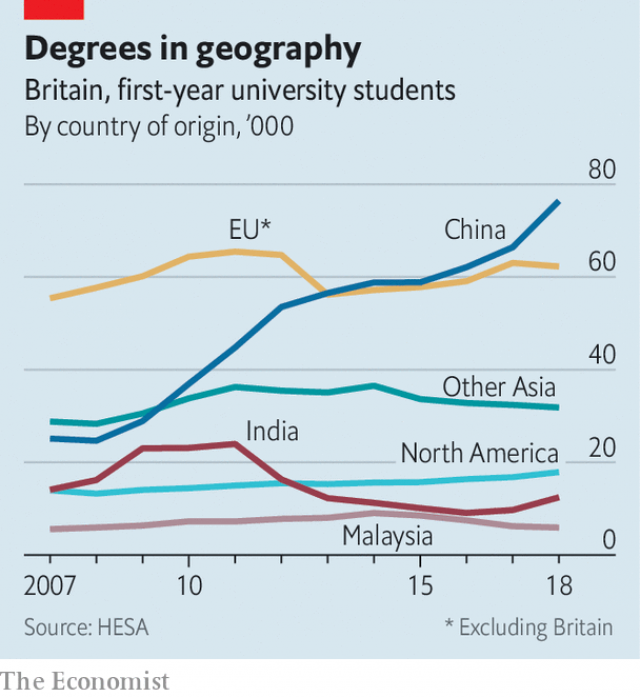

###### Art attack

# A cartographic clash between the LSE and its Chinese students 

##### Beijing is aware that British universities increasingly rely on its students 

 

> Apr 11th 2019 

THE SCULPTURE, a large, upside-down globe, brightly coloured like a child’s toy, looks innocuous enough. The intention behind it, according to the London School of Economics (LSE), is to recognise the university’s “international community”. That is not the spirit in which it has been received. Chinese students protested that Taiwan, which China claims, was shown as an independent country, and that Lhasa, in Tibet, was marked as a national capital. Following a meeting with students, press reports suggested that the LSE would change the map. Cue fury from Taiwan, whose foreign ministry fired off a letter expressing its disappointment and noting that Tsai Ing-wen, the country’s president, is herself a graduate of the LSE. 

The university now says the sculpture does not reflect the geographical boundaries that it expected, but that “no final decisions have been reached.” It has stumbled into an important test of how willing universities are to stand up to China, says Kerry Brown, director of the Lau China Institute at King’s College London. The LSE depends on foreign students, who count for 68% of those at the university (some 11% of the total number are Chinese). And the university already has an awkward history of foreign entanglements. In 2008 it awarded a PhD to Saif Qaddafi, son of Muammar, the late Libyan tyrant, after accepting a £1.5m ($2.9m) donation from his foundation. 

China is likely to be a source of angst for many more British universities in years to come. Along with Australia, Canada and America, Britain has benefited from the country’s growing appetite for foreign education. The depreciation of the pound since the Brexit referendum in 2016 has provided an additional boost; British universities are now “quite a good bargain for Chinese students”, says Yinbo Yu, the international officer at Britain’s National Union of Students. In the past decade the number of Chinese students has more than tripled, with 76,425 starting a degree last year (see chart). 

 

Like their classmates, most Chinese students just want to study and have fun. A minority, though, see themselves as “an extension of the party state”, says Steve Tsang, director of the China Institute at SOAS. In 2017 students and the Chinese embassy protested against a debate at Durham University entitled, “This house sees China as a threat to the West”, as well as the participation of a supporter of Falun Gong, a sect outlawed in China. Chinese students’ associations at some universities are believed to keep an eye on those who head overseas. “There is a fear on the part of Chinese students that anything they do or say could be reported and influence their future,” says Charles Parton of the Royal United Services Institute, a think-tank. 

The presence of students also grants the Chinese government leverage over universities. When Louise Richardson, vice-chancellor of Oxford University, was asked by the Chinese embassy to prevent Lord Patten, the university’s chancellor (a largely ceremonial role), from visiting Hong Kong, she refused. Not all administrators are so steadfast. Mr Tsang says officials at another leading university attempted to get a speaker disinvited from an event after pressure from the embassy. Last summer an academic was removed from the management board of Nottingham University’s campus in Ningbo, a city on China’s eastern seaboard, after writing an essay critical of the 19th Communist Party Congress, a meeting of government bigwigs. 

British universities have worked hard to court the Chinese, and the rush of students paying hefty international fees demonstrates the benefits of this approach. But as the LSE is now finding out, it is not without drawbacks. When threatened with receiving fewer Chinese students by the Chinese embassy, Ms Richardson of Oxford replied that there were many Indians who would be happy to take their place. The same is surely true at the LSE, one of the world’s leading academic institutions. It might just want to think carefully about what colour it shades Kashmir. 

-- 

 单词注释:

1.cartographic[]:[计] 制图的 

2.clash[klæʃ]:n. 冲突, 撞击声, 抵触 vi. 冲突, 抵触 vt. 使发出撞击声 [计] 对撞 

3.lse[]:abbr. 伦敦证券交易所（London Stock Exchange）；伦敦大学经济政治学系（ 	London School of Economics and Political Science）；伦敦政经学院（London School of Economics） 

4.APR[]:[计] 替换通路再试器 

5.brightly['braitli]:adv. 生辉地, 明亮地, 鲜明地 

6.innocuous[i'nɒkjuәs]:a. 无害的, 无伤大雅的 [医] 无害的, 良性的 

7.taiwan['tai'wɑ:n]:n. 台湾 

8.lhasa['lɑ:sә]:n. 拉萨（中国西藏藏族自治区首府） 

9.fury['fjuri]:n. 愤怒, 狂暴, 狂怒的人 [医] 狂乱, 狂暴, 狂怒 

10.tsai[]:n. 蔡（姓氏） 

11.geographical[dʒiә'græfikl]:a. 地理学的, 地理的 

12.kerry['keri]:n. 黑色的小乳牛（英国产） 

13.lau[]:abbr. 局域网接入单元（LAN Access Unit）；线路适配器单元（Line Adapter Unit） 

14.entanglement[in'tæŋglmәnt]:n. 纠缠, 卷入, 缠绕物 [化] 缠结 

15.phd[]:abbr. 哲学博士学位（Doctor of Philosophy） 

16.saif[]: 赛夫沙丘 

17.Qaddafi[]:n. (Qaddafi)人名；(阿拉伯)卡扎菲 卡扎菲 

18.Muammar[]:穆阿迈尔（人名） 

19.Libyan['libiәn]:a. 利比亚的 n. 利比亚人, 古代利比亚语 

20.tyrant['taiәrәnt]:n. 暴君 [法] 专制君主, 暴君, 压制他人者 

21.donation[dәu'neiʃәn]:n. 捐赠物, 捐款, 捐赠 [经] 赠品, 捐款, 捐赠 

22.angst[æŋst]:n. 焦虑, 疑惧 [医] 恐怖 

23.depreciation[di.pri:ʃi'eiʃәn]:n. 价值减低, 减价, 跌落, 贬低, 折旧 [化] 折旧; 减值 

24.Brexit[]:[网络] 英国退出欧盟 

25.referendum[.refә'rendәm]:n. （就重大政治或社会问题进行的）全民公决，全民投票 

26.yu[ju]:n. 禹（传说的中国古代圣君） 

27.triple['tripl]:n. 三倍数, 三个一组 a. 三倍的 vt. 使增至三倍 vi. 增至三倍 

28.steve[]:n. 史蒂夫（男子名） 

29.tsang[]:n. 曾（姓氏）；后藏 

30.soa[]:abbr. 前进速度（speed of advance ）；工艺技术水准（state of the art）；进场著陆速度（speed of approach）；工艺现状（State of the Art） 

31.Durham['dә:rәm]:n. 达勒姆郡(英格兰郡名), 短角肉牛 

32.participation[.pɑ:tisi'peiʃәn]:n. 参与, 分享 [经] 参与, 参股 

33.supporter[sә'pɒ:tә]:n. 支持者, 后盾, 迫随者, 护身织物 [法] 支持者, 赡养者, 抚养者 

34.falun[]: [地名] [瑞典] 法伦 

35.gong[gɒŋ]:n. 铜锣, 皿形钟 vt. 鸣锣召唤 

36.sect[sekt]:n. 宗派, 教派 

37.outlaw['autlɒ:]:n. 被剥夺法律保护的人, 罪犯 vt. 使...失去法律保护, 将...逐出社会, 宣告非法, 取缔 

38.oversea['әuvә'si:]:adv. 海外, 向国外, 向海外, 国外 a. 外国的, 在国外的, 在海外的, 舶来的 

39.charle[]:n. 查理（男子名）；查理（姓氏） 

40.Parton['pɑ:tɔn]:n. [核]部分子(一种带电小粒子) 

41.louise[lu(:)'i:z]:n. 路易丝（女子名） 

42.richardson['ritʃәdsn]:n. 理查森（姓氏） 

43.Oxford['ɒksfәd]:n. 牛津, 牛津大学 

44.patten['pætn]:n. 木套鞋, 木底鞋 [医] 屐(髋关节病患者用) 

45.chancellor['tʃɑ:nsәlә]:n. 大臣, 总理, 首相, 大使馆/领事馆的一等秘书, 司法官, 大学校长 

46.ceremonial[.seri'mәunjәl]:n. 仪式 a. 正式的 

47.hong[hɔŋ]:n. （中国、日本的）行, 商行 

48.kong[kɔŋ]:n. 含锡砾石下的无矿基岩；钢 

49.administrator[әd'ministreitә]:n. 管理人, 行政官 [经] 遗产管理人员 

50.steadfast['stedfәst]:a. 坚定的, 踏实的, 固定的, 不变的 

51.Nottingham['nɒtiŋәm]:n. 诺丁汉郡(英格兰郡名), 诺丁汉市 

52.Ningbo['niŋ'bәj]:宁波[浙江省](旧译Ningpo) 

53.seaboard['si:bɒ:d]:n. 海岸, 沿海地带 a. 海边的 

54.bigwig['bigwig]:n. 要人, 大亨 

55.hefty['hefti]:a. 重的, 肌肉发达的 

56.carefully['kєәfuli]:adv. 小心地, 谨慎地 

57.Kashmir['kæʃmiә]:n. 克什米尔 

