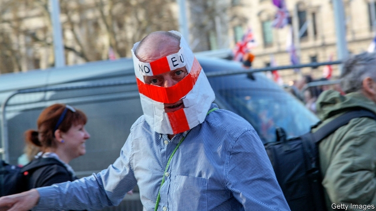

###### Fear and loathing

# Britain is dangerously fertile ground for the far right 

##### The failure of far-right parties has made the country complacent about the threat it faces 

 

> Apr 11th 2019 

IN THE UPSTAIRS room of the Friar Penketh pub in Warrington on July 1st 2017, Jack Renshaw outlined his plan to murder an MP with a 19-inch machete. The then 22-year-old told the gathered members of National Action, a banned far-right group, that he had slaughtered a pig in preparation for killing Rosie Cooper, the MP for West Lancashire. After that he would murder a policewoman, DC Victoria Henderson, as part of a campaign of “white jihad”, he explained. 

The far right is on the march. One way it manifests itself is through violence. Mr Renshaw’s foiled plot, which can be reported in full following the end of a trial earlier this month, would have meant the second murder of an MP in barely a year. Jo Cox, another Labour MP, was killed in 2016 by Thomas Mair, a far-right terrorist who gave his name as “death to traitors, freedom for Britain” when he appeared in the dock. Darren Osborne, who drove a van into worshippers outside a mosque in 2017, killing one person, had hoped to kill Labour’s leader, Jeremy Corbyn, too. Death threats are now common for MPs. 

Extremist positions have also come to the fore in a more insidious manner, which is proving harder to combat. The distinction between far-right and mainstream discourse has been blurred, according to Nick Lowles, who runs Hope Not Hate, an anti-racism campaign group. Narratives embraced by extremists have been normalised over the past decade. MPs are casually labelled “traitors” over how they vote on Brexit. Taboos have shifted. “We used to be more sensitive,” says William Baldét, a co-ordinator of Prevent, the government’s counter-radicalisation unit. 

British attitudes towards the far right have historically been complacent. Although National Action had been banned by the government, it was Hope Not Hate that saved Ms Cooper’s life, not the British state. A whistleblower from National Action warned the group that the MP’s life was in danger. Since then the authorities have woken up. On April 9th Sajid Javid, the home secretary, widened the remit of the Joint Terrorism Analysis Centre, which is led by the spies of MI5, to include “extreme right-wing terrorism”. Referrals to Prevent regarding the far right rose by 36%, to 1,312, in 2018—a fifth of its case load. 

The political class, meanwhile, seems unperturbed. Unlike in many other European countries, no far-right party has achieved mainstream success in Britain. The British National Party (BNP) has fizzled out. Support for the UK Independence Party (UKIP) plummeted after the Brexit referendum in 2016. But far-right activists do not disappear when their parties shatter. Indeed, their shards can be more dangerous. Mr Renshaw is a former member of the BNP’s youth wing. UKIP has returned in a nastier guise, with a baldly anti-Islam message. It still polls at 7% or so. 

Under Britain’s first-past-the-post system this is not enough to gain representation. But elections to the European Parliament, due to be held on May 23rd, use proportional representation. Fringe parties scent an opportunity. 

Even mainstream parties, meanwhile, have struggled to stay clean of extremism. Labour has failed to root out anti-Semitism among its members, some of whom harass Jewish MPs as agents of Israel. The Conservatives are struggling to confront Islamophobia in their ranks. Half of Tory voters think Islam is incompatible with the British way of life—a view shared by a third of the population at large. 

Other tenets of far-right thought have wide support. After months of chaos in Westminster, just over half of voters would like a strong leader who is “willing to break the rules”, according to a survey this week by the Hansard Society, a research organisation. A narrative of the people versus the elites has taken over. Although Theresa May was sensitive enough to write to MPs who have faced death threats, she recently gave an ill-judged speech blaming Parliament for thwarting the people’s will on Brexit. Despite one murder of an MP and a near-miss involving another, the ideas that fuelled those crimes march on. 

-- 

 单词注释:

1.loathing['lәuðiŋ]:n. 非常讨厌, 嫌恶, 极不情愿 

2.dangerously[]:adv. 危险, 不安全 

3.complacent[kәm'pleisnt]:a. 满足的, 自满的, 得意的 

4.APR[]:[计] 替换通路再试器 

5.friar['fraiә]:n. 修道士 

6.penketh[]: [地名] [英国] 彭克斯 

7.Warrington['wɔ:riŋtn]:n. 沃灵顿（英国一城市） 

8.jack[dʒæk]:n. 插座, 千斤顶, 男人 vt. 抬起, 提醒, 扛举, 增加, 提高, 放弃 a. 雄的 [计] 插座 

9.Renshaw[]:n. (Renshaw)人名；(英、西)伦肖 

10.MP[]:国会议员, 下院议员 [计] 宏处理程序, 维护程序, 线性规划, 微程序, 多处理器 

11.machete[mә'tʃeiti]:n. 大砍刀 [化] 马歇特; 丁草胺 

12.slaughter['slɒ:tә]:n. 残杀, 屠杀, 杀戮 vt. 残杀, 屠杀, 亏本出售 

13.ROSIE['rəuzi:]:n. 罗西（女名） 

14.cooper['ku:pә]:n. 制桶工人 v. 制桶 

15.Lancashire['læŋkәʃiә]:n. 兰开夏郡(英格兰郡名) 

16.policewoman[pә'li:swumәn]:n. 女警察 [法] 女警察 

17.DC[]:直流电 [计] 数据单元, 数据中心, 数据代码, 数据通信, 数据控制, 数字控制, 直流 

18.victoria[vik'tɔ:riә]:n. 维多利亚（女子名） 

19.henderson['hendәsn]:n. 亨德森（姓氏） 

20.jihad[dʒi'hɑ:d]:n. 讨伐异教徒, 拥护运动 

21.manifest['mænifest]:n. 载货单, 运货单, 旅客名单 a. 显然的, 明白的 vi. 显示, 出现 vt. 表明, 表现, 证明 

22.foil[fɒil]:n. 箔, 烘托, 衬托 vt. 贴箔于, 衬托, 阻止, 挡开, 挫败 

23.jo[dʒәu]:abbr. 乔（女子名, 等于Joseph, Josephine） 

24.cox[kɒks]:n. 舵手 v. 做舵手 

25.thoma[]:n. (Thoma)人名；(阿尔巴、阿拉伯)索玛；(英、德、罗、匈、捷、塞、瑞典)托马 

26.Mair[meә]:[苏]更多的, 更大的, 更好的, (=more)另外的, 其余的 

27.terrorist['terәrist]:n. 恐怖分子 [法] 恐怖份子, 恐怖主义 

28.Darren['dærən]:n. 达伦（男子名） 

29.Osborne[]:n. 奥斯本（男子名） 

30.worshipper[]:n. 礼拜者, 崇拜者, 爱慕者 

31.mosque[mɒsk]:n. 清真寺 

32.jeremy['dʒerimi]:n. 杰里米（男子名） 

33.Corbyn[]:科尔宾（人名） 

34.MP[]:国会议员, 下院议员 [计] 宏处理程序, 维护程序, 线性规划, 微程序, 多处理器 

35.extremist[iks'tri:mist]:[经] 偏激份子 

36.fore[fɒ:]:a. 在前的, 以前的 adv. 在前面, 在船头 prep. 在...前 

37.insidious[in'sidiәs]:a. 隐伏的, 阴险的, 狡猾的 [医] 隐袭的 

38.combat['kɒmbæt]:n. 争斗, 战斗 vi. 战斗, 争斗 vt. 与...战斗, 与...斗争 

39.mainstream['meinstri:m]:n. 主流 

40.discourse['diskɒ:s]:n. 谈话, 演讲 vi. 谈话, 讲述 

41.blur[blә:]:vt. 使模糊, 弄脏 vi. 弄脏, 模糊 

42.nick[nik]:n. 刻痕, 缺口, 划痕 vt. 刻痕于, 弄缺, 擦伤 vi. 狙击 

43.narrative['nærәtiv]:n. 叙述, 故事 a. 叙述的, 叙事的, 故事体的 

44.extremist[iks'tri:mist]:[经] 偏激份子 

45.normalise['nɔ:mәlaiz]:vt.vi. 使正常化, 恢复友好状态, 使标准化 

46.casually['kæʒjuәli]:adv. 偶然地, 临时地, 随便地 

47.Brexit[]:[网络] 英国退出欧盟 

48.taboo[tә'bu:]:n. 禁忌, 禁止接近, 禁止使用 a. 禁忌的, 忌讳的 vt. 禁忌, 忌讳, 禁止 

49.william['wiljәm]:n. 威廉（男子名）；[常作W-][美俚]钞票, 纸币 

50.historically[his'tɔrikәli]:adv. 历史上地；从历史观点上说 

51.whistleblower['wɪsəlˌbləʊə]: <美俚>告密者, 揭发者 

52.sajid[]:n. (Sajid)人名；(印尼)赛义德 

53.javid[]:[网络] 加威；贾维德 

54.remit[ri'mit]:vt. 宽恕, 赦免, 免除, 汇出, 缓解, 减轻, 把...提交, 使恢复原状, 推迟 vi. 缓解, 汇款 n. 移交的事物 

55.terrorism['terәrizm]:n. 恐怖主义, 恐怖统治, 恐怖状态 [法] 胁迫, 暴政, 恐怖政治 

56.terrorism['terәrizm]:n. 恐怖主义, 恐怖统治, 恐怖状态 [法] 胁迫, 暴政, 恐怖政治 

57.referral[ri'fә:rәl]:n. 参照, 介绍, 被介绍人, 转诊病人 

58.unperturbed[.ʌnpә'tә:bd]:a. 未受扰乱的, 平静的, 镇定的 

59.BNP[]:abbr. 英国国家党（British National Party）；巴黎国民银行（Banque Nationale de Paris）；脑利钠肽 

60.fizzle['fizl]:n. 嘶嘶声, 失败 vi. 发嘶嘶声, 失败 

61.UK[ju: 'kei]:n. 联合王国 

62.UKIP[]:n. 英国独立党 

63.plummete[]:[网络] 直线下降 

64.referendum[.refә'rendәm]:n. （就重大政治或社会问题进行的）全民公决，全民投票 

65.activist['æktivist]:n. 激进主义分子 

66.shatter['ʃætә]:n. 碎片, 粉碎, 落叶, 喷洒 vt. 打碎, 使散开, 粉碎, 破坏 vi. 粉碎, 损坏, 脱落 

67.shard[ʃɑ:d]:n. 陶瓷碎片, 鞘翅, 薄硬壳 

68.guise[gaiz]:n. 相似, 外观, 伪装 v. 穿戴, 伪装 

69.baldly['bɒ:ldli]:adv. 率直地, 露骨地, 无掩饰地 

70.representation[.reprizen'teiʃәn]:n. 表示法, 表现, 陈述, 代表 [计] 表示法指定 

71.fringe[frindʒ]:n. 边缘, 端, 流苏, 穗, 初步 vt. 加穗于, 加饰边于 a. 边缘的, 附加的 

72.extremism[ik'stri:mizm]:n. 极端倾向, 极端论, 过激主义 

73.harass['hærәs]:vt. 使困扰, 使烦恼, 折磨 

74.Israel['izreil]:n. 以色列, 以色列后裔, 犹太人 

75.confront[kәn'frʌnt]:vt. 使面对, 对抗, 遭遇, 使对质, 比较 [法] 对证, 使对质, 比较 

76.islamophobia[]: 伊斯兰恐惧症 

77.Tory['tɒ:ri]:n. 托利党党员, 保守党员, 亲英分子 a. 保守分子的 

78.voter['vәutә]:n. 选民, 投票人 [法] 选民, 选举人, 投票人 

79.Islam['izlɑ:m]:n. 伊斯兰教 

80.incompatible[.inkәm'pætәbl]:a. 不相容的, 不能并存的, 矛盾的 [化] 不协调 

81.tenet['tenit]:n. 信条, 教义, 宗旨, 原则 

82.chao[]:n. 钞（货币） 

83.Westminster['westminstә]:n. 威斯敏斯特 

84.Hansard['hænsәd]:n. 英国议会议事录 [法] 英国议会议事录 

85.organisation[,ɔ: ^әnaizeiʃən; - ni'z-]:n. 组织, 团体, 体制, 编制 

86.versus['vә:sәs]:prep. 对... [法] 诉, 对, 相形 

87.elite[ei'li:t]:n. 精华, 精锐, 中坚分子 

88.theresa[ti'ri:zә]:n. 特丽萨（女子名） 

89.thwart[θwɒ:t]:a. 横放的 vt. 反对, 阻挠, 横过 prep. 横过 adv. 横过 

