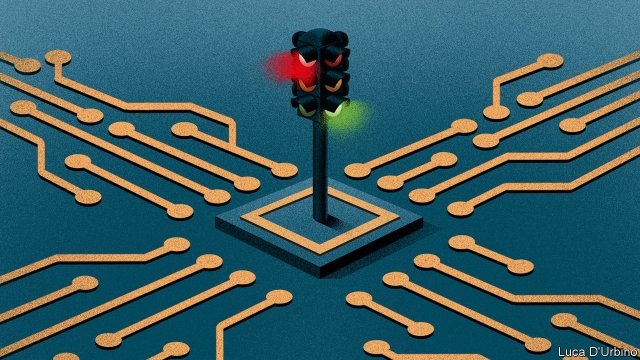

###### First, do no harms

# Britain unveils a plan to regulate online content 

##### The government makes the novel suggestion that companies should care for their users 

 

> Apr 11th 2019 

IN THE SPRING a government’s fancy turns to thoughts of internet regulation. This month alone, Singapore announced a bill to clamp down on fake news, Taiwan said it would ban Chinese-owned video-streaming services and Australia rushed through its parliament a Sharing of Abhorrent Violent Material bill, which among other things seeks to hold tech-company executives personally liable for failing swiftly to take down offensive content. 

On April 8th the British government published a 102-page policy paper outlining how it thinks internet regulation should work to reduce what it awkwardly calls “online harms”. It is enormous in scope and hugely ambitious, encompassing any company that allows people “to share or discover user-generated content or interact with each other online”. That would include not just big social networks but also community forums, review sites, dating apps and much else. The harms covered are similarly extensive, from terrorist material and child abuse to more subjective things such as trolling and disinformation. Some fear it opens the door to censorship of the internet. 

To be sure, there is a lot to iron out. The government appears keen to avoid stifling speech, imposing cumbersome regulation on small companies, snooping on private conversations or setting up large-scale monitoring of online traffic. But the paper is vague on how it will achieve its aims of proportionate regulation and monitoring without infringing on liberties. 

Moderating content on the internet has so far been a losing game of whack-a-mole. This was brought home by the Christchurch massacre in New Zealand in March, when a video of the shooting and a manifesto written by the alleged culprit spread rapidly on some of the world’s best-resourced social-media platforms despite efforts to prevent their dissemination. In the case of both copyright and terrorist- or abuse-related material, tech platforms are legally responsible for quickly removing content they find or are made aware of. Yet merely taking down objectionable content ignores the question of how it got there. 

Britain’s approach—which it hopes will be adopted elsewhere—is to require companies to design their services in ways that make it harder for bad content to spread in the first place. The big idea is to impose a statutory “duty of care”. Companies must “take reasonable steps to keep their users safe and tackle illegal and harmful activity on their services”. The government will set up a new regulator or hand new responsibilities to an existing one, such as Ofcom, which oversees broadcast media and telecoms, or the Information Commissioner’s Office, the data-protection watchdog. The regulator’s mandate will be broad: publishing guidelines for companies, overseeing complaints, encouraging co-operation between firms and issuing fines, as well as other, harsher penalties, including blocking websites in Britain or holding senior managers personally responsible. 

The eventual legislation will have to walk a tightrope between several conflicting imperatives. Maintaining national security and protecting the vulnerable must be balanced against individual liberties. Imposing substantial requirements on big tech companies must not stifle innovation or prevent smaller firms from thriving. And the new law must not conflict with existing British and European rules that protect online platforms from liability for content they simply host. On the last, the government’s plans seem to suggest that, so long as companies live up to their duty of care by designing products in a way that discourages the dissemination of proscribed material, they will be protected. 

Tech firms said they would work with ministers to fine-tune the regulations. They are already resigned to being kept on a tighter leash. Last month Mark Zuckerberg, Facebook’s boss, called for more internet regulation in an article in the Washington Post. Draft legislation will appear at the earliest in the autumn, and is unlikely to become law for a couple of years. A change of prime minister, a general election or continued parliamentary gridlock around Brexit could see it slip down the agenda. As the policy paper puts it, the government will “bring forward legislation when parliamentary time allows”. In the meanwhile, the harms continue to multiply. 

-- 

 单词注释:

1.unveil[.ʌn'veil]:vt. 揭开, 揭幕, 除去...的面纱 vi. 显露, 除去面纱 

2.online[]:[计] 联机 

3.APR[]:[计] 替换通路再试器 

4.Singapore[.siŋgә'pɒ:]:n. 新加坡 

5.clamp[klæmp]:n. 夹钳 vt. 夹紧, 强加 

6.fake[feik]:n. 假货, 欺骗, 诡计 a. 假的 vt. 假造, 仿造 vi. 伪装 

7.taiwan['tai'wɑ:n]:n. 台湾 

8.abhorrent[әb'hɒrәnt]:a. 令人憎恨的, 可恶的, 厌恶的, 相抵触的, 不一致的 

9.swiftly['swiftli]:adv. 很快地, 即刻 

10.offensive[ә'fensiv]:a. 令人不快的, 侮辱的, 攻击性的 [法] 攻击的, 进攻的, 冒犯的 

11.awkwardly[]:adv. 笨拙地；无技巧地 

12.hugely['hju:dʒli]:adv. 巨大地, 非常地 

13.ambitious[æm'biʃәs]:a. 有野心的, 抱负不凡的, 雄心勃勃的 

14.encompass[in'kʌmpәs]:vt. 围绕, 完成, 包括, 包含, 环绕, 包围 

15.interact[.intәr'ækt]:vi. 互相影响, 交互作用 n. 幕间剧, 幕间休息 

16.forum['fɒ:rәm]:n. 论坛, 公开讨论的广场, 法庭, 讨论会 [法] 讨论会, 专题讨论, 公共论坛 

17.APP[]:[计] 应用, 应用程序; 相联并行处理器 

18.terrorist['terәrist]:n. 恐怖分子 [法] 恐怖份子, 恐怖主义 

19.troll[trɒl]:vi. 滚动, 参加轮唱, 曳绳钓鱼 vt. 使转动, 轮唱, 高唱, 用曳绳钓(鱼) n. 转动, 轮唱, 钓绳 

20.disinformation[.disinfә'meiʃәn]:n. 假情报 

21.censorship['sensәʃip]:n. 检查制度 [医] 督察, 监察 

22.stifle['staifl]:vt. 使窒息, 抑止, 扼杀 vi. 窒息, 被扼杀 

23.cumbersome['kʌmbәsәm]:a. 笨重的, 麻烦的, 累赘的 

24.snoop[snu:p]:vi. 调查, 窥探 n. 窥视行为, 爱管闲事的人, 私家侦探 

25.proportionate[prә'pɒ:ʃәnit]:a. 相称的, 成比例的, 适当的 vt. 使相称, 使成比例 

26.infringe[in'frindʒ]:v. 破坏, 侵犯, 违反 

27.Christchurch['kraist-tʃә:tʃ]:n. 克赖斯特彻奇 

28.massacre['mæsәkә]:n. 大屠杀 vt. 大屠杀, 残杀 

29.zealand['zi:lәnd]:n. 西兰岛（丹麦最大的岛） 

30.manifesto[.mæni'festәu]:n. 宣言, 声明 

31.allege[ә'ledʒ]:vt. 宣称, 主张, 提出, 断言 [法] 断言, 指称, 指证 

32.culprit['kʌlprit]:n. 犯人, 罪犯, 刑事被告 [法] 犯罪者, 犯人, 罪犯 

33.dissemination[di.semi'neiʃә]:n. 散播, 传播, 普及 [医] 散布, 播散 

34.copyright['kɒpirait]:n. 版权, 著作权 [法] 著作权 

35.tech[tek]:n. 技术学院或学校 

36.legally['li:gәli]:adv. 法律上, 合法地 [法] 法律上, 合法地, 法定地 

37.quickly['kwikli]:adv. 很快地 

38.objectionable[әb'dʒekʃәnәbl]:a. 会引起反对的, 令人讨厌的 

39.statutory['stætjutәri]:a. 法令的, 法定的, 可依法惩处的 [经] 法定的 

40.tackle['tækl]:n. 工具, 复滑车, 滑车, 装备, 扭倒 vt. 固定, 处理, 抓住 vi. 扭倒 

41.regulator['regjuleitә]:n. 调整者, 校准者, 校准器, 调整器, 标准钟 [化] 调节剂; 调节器 

42.Ofcom['ɒfkɒm]:[网络] 英国通信管理局；英国通讯管理局；英国通讯办公室 

43.oversee[.әuvә'si:]:vt. 向下看, 了望, 监督, 偷看到 [法] 监察, 监督, 俯瞰 

44.telecom['telәkɔm]:telecommunication 电信 

45.watchdog['wɒtʃdɒg]:n. 看门狗, 监察人 [化] 监控设备; 监视器 

46.mandate['mændeit]:n. 命令, 指令, 要求 vt. 委任统治 

47.guideline['gaidlain]:n. 指导路线, 方针, 指标 [经] 指导路线, 方针, 准则 

48.penalty['penәlti]:n. 处罚, 刑罚, 罚款, 罚球, 报应, 不利结果, 妨碍 [经] 罚金(款), 违约金 

49.eventual[i'ventʃuәl]:a. 最后的, 终于的 

50.tightrope['taitrәup]:n. 拉紧的绳索 

51.imperative[im'perәtiv]:n. 命令, 必要的事, 规则, 祈使语气 a. 命令式的, 急需的, 势在必行的, 强制的 

52.vulnerable['vʌlnәrәbl]:a. 易受伤害的, 有弱点的, 易受影响的, 脆弱的, 成局的 [医] 易损的 

53.innovation[.inәu'veiʃәn]:n. 改革, 创新 [法] 创新, 改革, 刷新 

54.liability[laiә'biliti]:n. 责任, 债务, 倾向 [经] 责任, 义务, 负债 

55.proscribe[prәu'skraib]:vt. 剥夺...的公民权, 使失去法律保护, 把...充军, 把...放逐, 排斥, 禁止 

56.tech[tek]:n. 技术学院或学校 

57.leash[li:ʃ]:n. (拴狗颈的)皮带 vt. 以皮带束缚, 束缚 

58.zuckerberg[]:扎克伯格 

59.Washington['wɒʃiŋtn]:n. 华盛顿 

60.parliamentary[.pɑ:lә'mentәri]:a. 国会的, 议会的, 议会制度的 

61.gridlock[ˈgrɪdlɒk]:n. 交通全面大堵塞; 僵局 v. （交通等）堵塞 

62.Brexit[]:[网络] 英国退出欧盟 

