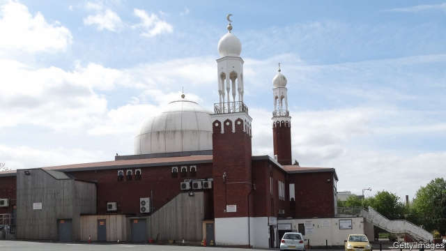

###### Waxing crescent

# Islam is a growing social force in Britain’s second city 

##### Birmingham Central Mosque has influence everywhere from the classroom to the bedroom 

 

> Apr 11th 2019 

HOURS AFTER the massacre of Muslims in New Zealand last month, representatives of five other faiths stood in front of Birmingham Central Mosque and proclaimed their solidarity, as worshippers streamed out of midday prayers. “O Lord, keep us and preserve us in life and in security,” intoned Yossi Jacobs, an Orthodox rabbi. Soon after, the routine business of this bustling hub resumed. In the largest of the 200 or so mosques in and around Britain’s second city, Muslims come not only to pray but to buy books, receive instruction, marry, divorce and send off their dead. 

As guardians of a faith followed by a quarter of Brummies, including a plurality of the city’s children, the mosque’s leaders play a growing role in civic life. They and other Muslim elders emphasise that they can help to make the city stable and prosperous. But they are equally clear that others must accept them for who they are: products of a conservative Muslim culture. 

Birmingham is not a city “where non-Muslims just simply don’t go in”, as a Fox News pundit wildly claimed in 2015. But it has a reputation as an incubator of jihad, because several terrorists spent time there. As the leaders of the central mosque see things, the city’s social peace is fragile—for reasons to do with austerity as much as inter-cultural tensions. “One of our big fears is that because of cuts in the police budget, ordinary crimes will spin out of control and be blamed on us Muslims,” says Nassar Mahmood, a mosque trustee. Crime with a sectarian edge is already a problem. On March 21st five local mosques suffered sledgehammer attacks. 

Guardians of the city’s Muslim community say they themselves can help tackle the problems of crime and extremism. As Muhammad Afzal, the central mosque’s chairman, is keen to recall, his establishment has led efforts to dissuade people from joining the war in Syria. It has also steered an inter-faith campaign against knife crime in the city. 

The mosque plays an intimate role in other aspects of city life. Every year hundreds of people approach its sharia council, which administers Islamic family law. Most are women who want a dissolution of their Islamic marriage. For critics, sharia councils flourish because of the tendency among young Muslims to opt for an Islamic-only marriage, or nikah. Because the nikah has no standing in law, a break-up can leave the less well-off partner destitute. More often than not, that is the woman. 

Amra Bone, one of the central mosque’s leaders (and perhaps the only British woman to serve on a sharia council), retorts that a rich woman may fare better under Islamic rules than British law. She adds that, like it or not, young Muslims use the nikah to legitimise relationships that might not be permanent, which they call “halal dating”. Aina Khan, a Muslim lawyer who leads a campaign to make all marriages state-registered, is unconvinced. For her, halal dating is a cynical practice: “God is not fooled.” 

The latest cultural battleground is the classroom. Muslim parents have been protesting against classes in a Birmingham primary school which encourage tolerance of same-sex relationships. Despite the insistence this week of the education secretary, Damian Hinds, that there must be no “parental veto on curriculum content”, the lessons’ future seems uncertain. 

The parents are warmly praised by Tahir Alam, a Muslim educationalist who was barred from Birmingham’s teaching system in 2015 after an inquiry into attempts to Islamise state schools. “Education should be done with the community, not to the community,” he argues. “And in Islam, it’s not okay to be in a gay relationship.” Mr Alam also defends the effort he led to introduce more Islam into city schools: it helped improve dismal standards, he says. 

Birmingham’s culture wars have laid bare some weird fissures in local politics. The city’s Labour councillors, who dominate local politics, range from Muslims with sympathy for the parents protesting against the gay-friendly classes, to secular left-wingers who strongly support the school. The Conservative opposition tends to be on the progressive side; one worry among local Tories is that a new commercial development may destroy a “gay village” near the city centre. 

Birmingham, a disorganised sprawl, has always been a jumble of distinct villages. In some places ethnic and cultural differences have reinforced that disconnection. As people at the central mosque acknowledge, there is a vicious circle in which Muslims stick to areas where they predominate because they fear abuse or assaults elsewhere; and as those districts become more overwhelmingly Muslim, others move out. 

Andrew Smith, the Anglican point-man on inter-faith dialogue, insists that promising work is under way to bring communities together. The Birmingham Central Mosque is a crucial link in that, along with the Anglican and Catholic cathedrals. All that builds resilience which helps when a shock occurs, be it in New Zealand or closer to home. But this does not diminish the sense that the city’s villages, cultural and geographical, are moving farther apart. 

-- 

 单词注释:

1.Crescent['kresәnt]:n. 新月, 新月形(物) a. 新月形的, 逐渐增加的 

2.Islam['izlɑ:m]:n. 伊斯兰教 

3.Birmingham['bә:miŋәm]:n. 伯明翰 

4.mosque[mɒsk]:n. 清真寺 

5.APR[]:[计] 替换通路再试器 

6.massacre['mæsәkә]:n. 大屠杀 vt. 大屠杀, 残杀 

7.Muslim['mjzlim; (?@) 'mʌzlem]:n. 伊斯兰教, 伊斯兰教教徒 

8.zealand['zi:lәnd]:n. 西兰岛（丹麦最大的岛） 

9.solidarity[.sɒli'dæriti]:n. 团结, 团结一致, 共同一致 [法] 团结, 共同责任 

10.worshipper[]:n. 礼拜者, 崇拜者, 爱慕者 

11.O[әu]:interj. 啊, 唉, 哎呀, 哦 n. 零 [计] 操作, 运算, 输出 

12.intone[in'tәun]:v. 吟咏 

13.yossi[]:n. (Yossi)人名；(以)约西 

14.jacob['dʒeikәb]:n. [圣经]雅各（以色列人的祖先）；雅各布（男子名） 

15.orthodox['ɒ:θәdɒks]:a. 正统的, 传统的, 惯常的 

16.rabbi['ræbai]:n. 拉比(犹太教圣职人员), 大师(对犹太学者的尊称) [法] 犹太教的法学博士, 老师, 犹太教教士 

17.bustle['bʌsl]:n. 喧闹, 裙撑 vi. 奔忙, 喧闹 vt. 使忙碌, 催促 

18.hub[hʌb]:n. 毂, 木片, 中心 [计] 插座; 插孔; 集线器, 集中器, 连接器, 中继站 

19.mosque[mɒsk]:n. 清真寺 

20.guardian['gɑ:diәn]:n. 看守者, 监护人, 保护人 a. 保护的 

21.brummy['brʌmi]:[英国口语] n. 伯明翰人 a. 伯明翰的；伯明翰来的；廉价的；三流(产品)的 

22.plurality[.pluә'rælәti]:n. 复数, 较大的数, 多数状态, 兼职 [法] 大多数, 较多数, 复数 

23.civic['sivik]:a. 市的, 市民的, 公民的 [法] 公民的, 市民的, 公民资格的 

24.Muslim['mjzlim; (?@) 'mʌzlem]:n. 伊斯兰教, 伊斯兰教教徒 

25.emphasise[]:vt. 强调, 重读, 加强...的语气, 着重 

26.equally['i:kwәli]:adv. 相等地, 同样地, 平等地 

27.pundit['pʌndit]:n. 学者, 梵文学者, 博学的印度人, 权威 

28.wildly[]:adv. 狂暴地, 激动地, 狂热地, 鲁莽地, 轻率地 

29.incubator['inkjubeitә]:n. 孵卵器, 细菌培养器, 早产儿保育器 [化] 恒温箱; 孵化箱 

30.jihad[dʒi'hɑ:d]:n. 讨伐异教徒, 拥护运动 

31.terrorist['terәrist]:n. 恐怖分子 [法] 恐怖份子, 恐怖主义 

32.austerity[ɒ'sterәti]:n. 朴素, 苦行, 严格, 严峻 

33.nassar[]:[网络] 纳赛尔湖 

34.Mahmood[]:n. (Mahmood)人名；(阿拉伯、伊朗)马哈茂德 

35.trustee[.trʌs'ti:]:n. 受托人, 理事 [计] 委托者 

36.sectarian[sek'tєәriәn]:a. 宗派的, 党派的, 偏狭的 n. 宗派成员, 闹宗派的人 

37.sledgehammer['sledʒ.hæmә]:n. 大锤, 极有分量的事物 a. 强力的, 手下不留情的 v. 用大锤打, 沉重打击 

38.tackle['tækl]:n. 工具, 复滑车, 滑车, 装备, 扭倒 vt. 固定, 处理, 抓住 vi. 扭倒 

39.extremism[ik'stri:mizm]:n. 极端倾向, 极端论, 过激主义 

40.muhammad[]:n. 穆罕默德 

41.afzal[]:n. (Afzal)人名；(巴基)阿夫扎尔；(阿富)阿夫扎勒 

42.dissuade[di'sweid]:vt. 劝阻 [法] 劝阻, 劝止 

43.Syria['siriә]:n. 叙利亚 [经] 叙利亚 

44.sharia[ʃә'ri:ә]:n. 伊斯兰教教法 

45.administer[әd'ministә]:vt. 管理, 料理, 执行 vi. 执行遗产管理人的职责, 给予帮助 

46.Islamic[iz'læmik]:a. 伊斯兰教的, 穆斯林的 

47.dissolution[.disә'lu:ʃәn]:n. 分解, 溶解, 解散, 结束 [化] 溶解; 溶解作用 

48.opt[ɒpt]:vi. 选择 

49.nikah[]:[网络] 婚姻习俗中尼卡；伊斯兰婚礼；婚姻契约 

50.les[lei]:abbr. 发射脱离系统（Launch Escape System） 

51.destitute['destitju:t]:a. 穷困的, 缺乏的 

52.amra[]:abbr. 美国医学档案协会（american medical record association） 

53.retort[ri'tɒ:t]:n. 反驳, 顶嘴, 蒸馏器, 曲颈甑 vi. 反驳, 回嘴, 反击 vt. 反击, 反驳, 蒸馏 

54.legitimise[li'dʒitimaiz]:vt.<主英> = legitimize 

55.halal[hә'lɑ:l]:n. 伊斯兰教律法的合法食物 v. 按伊斯兰教律法屠宰牲畜 

56.aina[]:n. (Aina)人名；(西、瑞典、尼日利)艾纳；(俄)艾娜 

57.khan[kɑ:n]:n. 可汗, 商队宿店 

58.unconvinced[]:[法] 不相信, 怀疑的 

59.cynical['sinikәl]:a. 愤世嫉俗的, 讽刺的, 冷嘲的 

60.cultural['kʌltʃәrәl]:a. 文化的, 教养的, 修养的 [医] 培养的 

61.insistence[in'sistәns]:n. 坚持, 坚决主张 

62.Damian[]:n. 达米安（男子名） 

63.hind[haind]:n. 雌鹿 a. 后部的, 在后的 

64.parental[pә'rentәl]:a. 父母亲的, 做双亲的, 作为渊源的 [医] 父母的, 双亲的 

65.veto['vi:tәu]:n. 否决权 vt. 否决, 禁止 

66.warmly['wɒ:mli]:adv. 亲切地, 温暖地, 热心地 

67.tahir[]:塔希尔（阿尔古万的旧称） 

68.alam[]:n. 阿拉姆（姓氏） 

69.educationalist[,edju(:)'keiʃәnәlist]:n. 教育家 

70.Islamise['izlәmaiz]:v. <主英> = Islamize 

71.dismal['dizmәl]:a. 阴沉的, 凄凉的, 令人忧郁的 n. 低落的情绪, 沼泽 

72.weird[wiәd]:a. 怪异的, 超自然的, 不可思议的 n. 命运, 预言, 符咒 

73.fissure['fiʃә]:n. 裂缝, 裂沟 v. (使)裂开, (使)分裂 

74.politic['pɒlitik]:a. 精明的, 明智的, 策略的 

75.councillor['kaunsilә]:n. 地方议会成员, 议会委员, 顾问, 评议员, 参赞 [法] 议员, 评议员, 顾问 

76.secular['sekjulә]:n. 修道院外的教士 a. 世俗的, 现世的, 长期的 

77.opposition[.ɒpә'ziʃәn]:n. 反对, 敌对, 相反, 在野党 [医] 对生, 对向, 反抗, 反对症 

78.Tory['tɒ:ri]:n. 托利党党员, 保守党员, 亲英分子 a. 保守分子的 

79.disorganise[]:vt. 瓦解, 打乱 

80.sprawl[sprɒ:l]:vi. 伸开手足躺, 爬行, 蔓生, 蔓延 vt. 懒散地伸开, 使蔓生, 使不规则地伸展 n. 伸开手足躺卧姿势 

81.alway['ɔ:lwei]:adv. 永远；总是（等于always） 

82.jumble[dʒʌmbl]:vi. 搀杂, 混杂 vt. 搞乱, 使混乱 n. 混乱, 薄饼 

83.ethnic['eθnik]:a. 人种的, 种族的 [医] 人种的 

84.disconnection[,diskә'nekʃәn]:n. 分离, 断开, 分开 [计] 断开, 拆接, 不连接 

85.vicious['viʃәs]:a. 邪恶的, 堕落的, 品性不端的, 恶毒的, 恶性的, 有错误的 [医] 缺点的, 恶的 

86.predominate[pri'dɒmineit]:vt. 掌握, 控制, 支配 vi. 占主导地位, 占优势 

87.assault[ә'sɒ:t]:n. 攻击, 袭击 vt. 袭击, 攻击 vi. 发动攻击 

88.overwhelmingly[.әuvә'hwelmiŋli]:adv. 压倒性地, 不可抵抗地 

89.andrew['ændru:]:n. 安德鲁（男子名） 

90.smith[smiθ]:n. 铁匠, 金属品工匠 [机] 锻造工, 上手 

91.Anglican['æŋglikәn]:n. 盎格鲁人 a. 英语的, 英国的, 盎格鲁人方言的 

92.resilience[ri'ziliәns]:n. 弹回, 有弹力, 恢复力 [化] 回弹; 弹性; 弹回性; 回能; 弹能 

93.diminish[di'miniʃ]:v. (使)减少, (使)变小 

94.geographical[dʒiә'græfikl]:a. 地理学的, 地理的 

