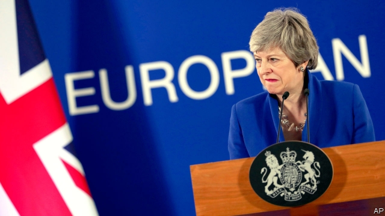

###### Trick or treat?

# The EU gives Theresa May another six months 

##### Brexit is delayed until October 31st. Mrs May might not even be prime minister by then 

 

> Apr 11th 2019 

IT HAS LONG been obvious that Theresa May is not in charge of much. The prime minister has limited control of Parliament, her Conservative Party or even her own cabinet. And she has even less sway over the European Union, as became clear in another EU Brexit summit on April 10th. 

Mrs May had asked European leaders to put back the Article 50 Brexit deadline—originally March 29th, later extended to April 12th—until the end of June. As when she made a similar request three weeks ago, her wishes were largely ignored. Over a long dinner without her, the leaders of the EU’s 27 other countries decided instead to extend the deadline to October 31st, with a review of progress in June. 

Another delay to Brexit was a foregone conclusion. Nobody beyond the Tory party fringes seriously backed the alternative of Britain crashing out now with no-deal. Especially important to the EU 27 were the views of Leo Varadkar, the Irish taoiseach, whose country would suffer most from a no-deal Brexit and who wanted a long Article 50 extension. Even if EU leaders were fed up with Mrs May, nobody wanted to override Mr Varadkar. 

Yet getting agreement was not easy. Several leaders favoured a longer extension of up to a year, if only to avoid being asked repeatedly to agree to a series of short ones. But Emmanuel Macron, the French president, argued for a short deadline to increase the pressure on Britain to make up its mind. A longer delay might only give MPs in Westminster more time to quarrel, rather than agree on a form of Brexit they could support. The eventual compromise was to offer another six months, meaning Britain is due to leave on Halloween. 

What might be achieved during this period? MPs have already rejected the draft Brexit deal three times. EU leaders are categorical that the withdrawal agreement, which includes the unpopular Irish backstop to avert a hard border in Ireland, cannot be changed. Indeed, they have made clear that, even after a no-deal Brexit, this would be a precondition for a future trade deal. But they would happily change the political declaration about future relations in order to soften Brexit, perhaps adding a permanent customs union or even membership of the single market. 

Like many in Westminster, European leaders are sceptical that the recently begun talks between Mrs May and the Labour opposition leader, Jeremy Corbyn, will yield an agreement. And, after watching two rounds of indicative votes in Parliament, they also doubt there is a clear majority among MPs for any alternative version of Brexit. Yet despite these doubts, they felt it was better to kick the can down the road for another six months than have a full-blown crisis now. 

A bigger concern was what to do with a Britain that will now be a member for longer than planned. One difficulty is the European Parliament elections that are due at the end of May. Yet although Mrs May had previously resisted the notion that Britain might participate (“What kind of message would that send?” she asked in a televised address only three weeks ago), this time she quickly conceded that it would. Jean-Claude Juncker, the European Commission’s president, called such an election “curious”, which indeed it will be. But fears that British voters might elect maverick MEPs are partly assuaged by the knowledge that so will those of many other countries. 

More worrying is the notion that Britain could disrupt the EU’s everyday business by using its veto, as some Brexiteers have proposed. The EU summit sought assurances from Mrs May that she would act responsibly. But the real fear is over her own durability. After all, last month she told Parliament that she could not as prime minister accept any delay in Brexit beyond June 30th. In Brussels Mrs May defended herself over this by repeatedly saying that, if Parliament would only agree, Britain could still be out by then. 

Yet her vulnerability and her lost authority are obvious to all—as is the plotting among Conservative MPs over the succession. Her own ministers have begun to talk openly about who might make the best candidate. The Tories are likely to do badly in local elections on May 2nd and worse still in the European ones on May 23rd, which will only increase the pressure on the prime minister to quit. 

The concern in the EU is that any plausible successor as Tory leader will be a hard Brexiteer such as the former foreign secretary, Boris Johnson. Any new prime minister would doubtless be constrained by the same forces that have boxed in Mrs May. But a more hardline prime minister might be readier to contemplate a no-deal Brexit, perhaps after holding and winning another general election. The EU may have found Mrs May tiresome, but it is aware that her successor could be worse. 

The deeper point is that Britain is still split down the middle. There is little sign of agreement between or even within the main political parties. Some revealing evidence emerged at two separate events in London on April 9th. A rally to promote a second referendum on the deal, which included several Tory MPs, loudly demonised both Mr Johnson and his fellow Tory Brexiteer, Jacob Rees-Mogg. Meanwhile a meeting of the hardline Eurosceptic Bruges Group was not only denouncing Mrs May as a traitor, but also expressing hostility to Mr Johnson and Mr Rees-Mogg for belatedly backing her deal. The atmosphere was more of a revolution consuming its own than of emerging consensus. 

The biggest fear of all in Brussels this week may not have been about Mrs May’s weakness or even about her successor. It is that even in October Britain will still be unable to make its mind up. And as Donald Tusk, the European Council president, conceded after the meeting, that could mean more late-night summits to discuss further Article 50 extensions. 

-- 

 单词注释:

1.EU[]:[化] 富集铀; 浓缩铀 [医] 铕(63号元素) 

2.theresa[ti'ri:zә]:n. 特丽萨（女子名） 

3.Brexit[]:[网络] 英国退出欧盟 

4.Mr['mistә(r)]:先生 [计] 存储器回收程序, 多重请求 

5.APR[]:[计] 替换通路再试器 

6.les[lei]:abbr. 发射脱离系统（Launch Escape System） 

7.forego[fɒ:'gәu]:vt. 放弃, 在...之前, 居先 

8.Tory['tɒ:ri]:n. 托利党党员, 保守党员, 亲英分子 a. 保守分子的 

9.fringe[frindʒ]:n. 边缘, 端, 流苏, 穗, 初步 vt. 加穗于, 加饰边于 a. 边缘的, 附加的 

10.Leo['li:ou]:n. 狮子, 狮子座 

11.taoiseach[ˈti:ʃəx]:n. （爱尔兰共和国）总理 

12.override[.әuvә'raid]:vt. 推翻, 无视, 对...有最后发言权, 制服, 践踏, 奔越过 [经] 代理佣金, 代销佣金 

13.sery[]:n. (Sery)人名；(俄)谢雷；(科特)塞里 

14.emmanuel[i'mænjuәl]:n. 以马内利（耶稣基督的别称）；伊曼纽尔（男子名, 等于Immanuel） 

15.macron['mækrәn]:n. 长音符号 

16.MP[]:国会议员, 下院议员 [计] 宏处理程序, 维护程序, 线性规划, 微程序, 多处理器 

17.Westminster['westminstә]:n. 威斯敏斯特 

18.eventual[i'ventʃuәl]:a. 最后的, 终于的 

19.Halloween[.hælәu'i:n]:n. (基督教)万圣节前夕 

20.categorical[.kæti'gɒrikl]:a. 范畴的, 绝对的, 明确的 

21.withdrawal[wið'drɒ:l]:n. 提款, 撤退, 退回, 撤消, 退隐, 戒毒过程 [医] 戒除, 脱瘾 

22.unpopular['ʌn'pɔpjulә]:a. 不得人心的, 不受欢迎的, 不流行的 

23.backstop['bækstɒp]:n. 挡球网, 接球手 [电] 背向停止 

24.avert[ә'vә:t]:vt. 转开, 避免, 防止 

25.cannot['kænɒt]:aux. 无法, 不能 

26.precondition[.pri:kәn'diʃәn]:vt. 事先准备, 事先处理 n. 先决条件, 前提 [计] 前置条件 

27.declaration[.deklә'reiʃәn]:n. 宣告, 说明, 宣布 [计] 说明 

28.soften['sɒftn]:v. (使)变柔软, (使)变柔和 

29.membership['membәʃip]:n. 会员的资格, 全体会员, 会员数目 [法] 会员资格, 成员资格, 会籍 

30.opposition[.ɒpә'ziʃәn]:n. 反对, 敌对, 相反, 在野党 [医] 对生, 对向, 反抗, 反对症 

31.jeremy['dʒerimi]:n. 杰里米（男子名） 

32.Corbyn[]:科尔宾（人名） 

33.indicative[in'dikәtiv]:a. 指示的, 象征的, 表示...的 [经] 指标的 

34.televise['telivaiz]:v. 用电视播放, 播映 

35.quickly['kwikli]:adv. 很快地 

36.concede[kәn'si:d]:vt. 承认, 退让 vi. 让步 

37.juncker[]:[网络] 容克；欧元集团现任主席容克；欧元区主席容克 

38.voter['vәutә]:n. 选民, 投票人 [法] 选民, 选举人, 投票人 

39.maverick['mævәrik]:n. 未烙饲主印记的小牛, 持不同意见的人 vi. 迷路 

40.MEP[]:[化] 最低能量途径 

41.assuage[ә'sweidʒ]:vt. 平息, 缓和, 减轻 

42.disrupt[dis'rʌpt]:a. 分裂的, 中断的 vt. 使分裂, 使瓦解 

43.veto['vi:tәu]:n. 否决权 vt. 否决, 禁止 

44.Brexiteers[]:支持英国退欧的人（Brexiteer的复数） 

45.assurance[ә'ʃuәrәns]:n. 保证, 把握, 信心, 保险 [经] 保证, 担保, 保险 

46.responsibly[]:adv. 认真负责地, 可信赖地, 可靠地 

47.durability[,djuәrә'biliti]:[计] 耐久性, 耐用性, 持久性 

48.Brussel[]:n. 布鲁塞尔（比利时首都） 

49.vulnerability[.vʌlnәrә'biliti]:n. 易受伤, 易受责难, 易受伤部位 [医] 易损性 

50.openly['әjpәnli]:adv. 公开地, 坦率地, 直率地, 公然地 

51.Tory['tɒ:ri]:n. 托利党党员, 保守党员, 亲英分子 a. 保守分子的 

52.plausible['plɒ:zibl]:a. 貌似真实的, 貌似合理的, 说得煞有其事的 [法] 花言巧语的, 似乎有理的 

53.successor[sәk'sesә]:n. 继承者, 接任者 [计] 后继 

54.Brexiteer[]: 

55.boris['bɔris]:n. 鲍里斯（男子名） 

56.johnson['dʒɔnsn]:n. 约翰逊（姓氏） 

57.constrain[kәn'strein]:vt. 强迫, 限制, 关押 

58.hardline[]:n. 强硬路线 [电] 硬线 

59.contemplate['kɒntempleit]:vt. 注视, 沉思, 盘算 vi. 冥思苦想 

60.tiresome['taiәsәm]:a. 累人的, 烦人的 

61.rally['ræli]:n. 重振旗鼓, 集合, 群众集会, 跌停回升 v. 重整旗鼓, 集合, 恢复精神, 团结, 挖苦, 嘲笑 

62.referendum[.refә'rendәm]:n. （就重大政治或社会问题进行的）全民公决，全民投票 

63.demonise['di:mәnaiz]:vt.<主英>=demonize 

64.jacob['dʒeikәb]:n. [圣经]雅各（以色列人的祖先）；雅各布（男子名） 

65.eurosceptic[ˌjʊərəʊ'skeptɪk]:n. 欧洲统一怀疑论者；反对英国亲近欧盟的人 

66.Bruges[bru:ʒ]:布鲁日[比利时西北部城市] 

67.denounce[di'nauns]:vt. 告发, 抨击, 谴责 [法] 谴责, 斥责, 告发 

68.hostility[hɒs'tiliti]:n. 敌意, 敌对, 反对 

69.belatedly[bi'leitidli]:adv. 延迟地；延续地 

70.tusk[tʌsk]:n. 长牙, 獠牙, 尖物 vt. 以长牙刺戳, 以长牙掘 

